# NASA GRC-ATF FDAS D.3.1 - System Design

## Contents

- [1 - Preface](#1---preface)
  - [1.1 - Document Purpose](#11---document-purpose)
  - [1.2 - Document Scope](#12---document-scope)
- [2 - Design Drivers and Key Design Choices](#2---design-drivers-and-key-design-choices)
  - [2.1 - Review of the System Requirements](#21---review-of-the-system-requirements)
  - [2.2 - Application Layer Software Requirement High-level Design Drivers](#22---application-layer-software-requirement-high-level-design-drivers)
  - [2.3 - Selection of EPICS as the Application Layer Client/Server Software Framework](#23---selection-of-epics-as-the-application-layer-clientserver-software-framework)
  - [2.4 - I/O Device Layer Hardware and Software Requirement Design Drivers](#24---io-device-layer-hardware-and-software-requirement-design-drivers)
  - [2.5 - System Functional Requirements - Digitizer Hardware and Software Requirement Design Drivers](#25---system-functional-requirements---digitizer-hardware-and-software-requirement-design-drivers)
  - [2.6 - Selection of the Osprey 32 Channel 250 kHz Digitizer Chassis (DAQ-32-250-24)](#26---selection-of-the-osprey-32-channel-250-khz-digitizer-chassis-daq-32-250-24)
- [3 - Hardware Design](#3---hardware-design)
  - [3.1 - Hardware Elements by Type](#31---hardware-elements-by-type)
  - [3.2 - Hardware Installation Design](#32---hardware-installation-design)
    - [3.2.1 - Location #1 - Instrument Room](#321---location-1---instrument-room)
    - [3.2.2 - Location #2 - Control Room](#322---location-2---control-room)
    - [3.2.3 - Connectivity between Locations](#323---connectivity-between-locations)
  - [3.3 - High-Level System Diagram](#33---high-level-system-diagram)
  - [3.4 - Application Layer Hardware Design](#34---application-layer-hardware-design)
    - [3.4.1 - Workstation Hardware Design](#341---workstation-hardware-design)
    - [3.4.2 - Support Services (Misc) Server Hardware Design](#342---support-services-misc-server-hardware-design)
    - [3.4.3 - DAQ Server Hardware Design](#343---daq-server-hardware-design)
    - [3.4.4 - Network Hardware Design](#344---network-hardware-design)
  - [3.5 - The I/O Device Layer Hardware Design](#35---the-io-device-layer-hardware-design)
  - [3.6 - The Instrument Layer Design](#36---the-instrument-layer-design)
  - [3.7 - Timing Layer Hardware Design](#37---timing-layer-hardware-design)
- [4 - FDAS Software Design](#4---fdas-software-design)
  - [4.1 - FDAS Software Architecture](#41---fdas-software-architecture)
  - [4.2 - High Speed Synchronous Data Acquisition Software Components](#42---high-speed-synchronous-data-acquisition-software-components)
    - [4.2.1 - Quartz Chassis Software](#421---quartz-chassis-software)
    - [4.2.2 - EPICS Drivers](#422---epics-drivers)
    - [4.2.3 - Osprey Developed EPICS Modules](#423---osprey-developed-epics-modules)
    - [4.2.4 - Osprey Developed EPICS IOCs](#424---osprey-developed-epics-iocs)
- [5 - System Design Hazards Analysis](5---system-design-hazards-analysis)
- [6 - Safety Critical Usage](#6---safety-critical-usage)
- [7 - System Security](#7---system-security)
- [8 - Functional Checkout](#8---functional-checkout)
- [9 - Software Assurance](#9---software-assurance)
- [10 - Instrument Calibration](#10---instrument-calibration)
- [11 - Troubleshooting](#11---troubleshooting)
- [12 - Recommended Maintenance](#12---recommended-maintenance)
- [13 - Known Issues and Limitations](#13---known-issues-and-limitations)
- [14 - Help and Support](#14---help-and-support)

## List of Tables
- [Table 1 - Hardware Elements by Type](#table-1---hardware-elements-by-type)
- [Table 2 - Workstation Hardware](#table-2---workstation-hardware)
- [Table 3 - Support Services Hardware](#table-3---support-services-hardware)
- [Table 4 - DAQ Server Hardware](#table-4---daq-server-hardware)
- [Table 5 - Time Server Hardware](#table-5---time-server-hardware)

## List of Figures
- [Figure 1 - NASA GRC-ATF Common DAC Architecture - Hardware Layers](#figure-1---nasa-grc-atf-common-dac-architecture---hardware-layers)
- [Figure 2 - NASA GRC-ATF Common DAC Architecture - I/O Device Layer](#figure-2---nasa-grc-atf-common-dac-architecture---io-device-layer)
- [Figure 3 - High-Level System Diagram](#figure-3---high-level-system-diagram)
- [Figure 4 - Network Design Diagram](#figure-4---network-design-diagram)
- [Figure 5 - Timing Design](#figure-5---timing-design)
- [Figure 6 - SEC-FDAS Software Design](#figure-6---sec-fdas-software-design)
- [Figure 7 - DAQ IOC Server Internals](#figure-7---daq-ioc-server-internals)

## 1 - Preface

### 1.1 - Document Purpose

The purpose of this document is to provide the top-level engineering design of the Facility Data Acquisition System (FDAS) delivered to the Space Environment Complex (SEC) at the Neil A. Armstrong Test Facility (ATF) in 2024, hereafter referred to as the SEC-FDAS. This system design document provides high-level introductory descriptions of all of the major hardware and major software components used, the essential functions they perform, and how they interoperate within the system for the purpose of meeting SEC's FDAS Functional Requirements \[1\] as well as fulfilling the NASA ATF Common DAC (Data Acquisition and Control) \[system\] Architecture (CDA) Requirements \[2\].

### 1.2 - Document Scope

The scope of this system design document is to fulfill the documentation requirements of "D.3.1 - System Design" as defined in the ATF Common DAC System Documentation (CDD) Requirements \[3\]. Per the NASA GRC-ATF CDD, this document is intended to be used within the larger set of overall SEC-FDAS system documentation. As such, it has a limited scope by design as it is not intended to describe all aspects of each element at every level of design. Rather, the scope of this document is to limit itself to communicating the high-level design and design concepts and will avoid re-documenting the technical details of components and sub-components whose technical documentation is more appropriately contained in other system documentation or is provided by their respective developers/ manufacturers. The list of documents that comprise the full set of documentation for this system are provided as document "D.1.1 -  Bill of Materials - List of Documents" \[4\].

_\[1\] NASA GRC-ATF SEC-FDAS Functional Specification v1.1, Oct. 2023 - [Link](doc/NASA%20GRC-ATF%20SEC-FDAS%20Functional%20Specification%20(v.1.1).pdf)_

_\[2\] NASA GRC-ATF Common DAC System Architecture (CDA) Specification v1.1, Oct. 2023 - [Link](doc/NASA%20GRC-ATF%20Common%20DAC%20System%20Architecture%20(CDA)%20Specification%20(v1.1).pdf)_

_\[3\] NASA GRC-ATF Common DAC System Documentation (CDD) Specification v1.1, Oct. 2023 - [Link](doc/NASA%20GRC-ATF%20Common%20DAC%20System%20Documentation%20(CDD)%20Specification%20(v1.1).pdf)_

_\[4\] SEC-FDAS-D.1.1 Bill of Materials - List of Documents, v1.0 Jan. 2025 - [Link](D-1-01_BOM_-_List_of_Documents.csv)_

## 2 - Design Drivers and Key Design Choices

### 2.1 - Review of the System Requirements

An inspection of the SEC-FDAS functional requirements shows that the SEC-FDAS is a facility data acquisition system that records 1,024 channels of voltages at 24-bit ADC resolution and for input signals ranging from -10 volts to +10 volts. The system is capable of recording at user-selectable sample rates ranging from 1 kHz to 50 kHz for all 1,024 channels and at 250 kHz for no more than 256 channels. The system provides a range of other user-selectable features such as per-channel AC/DC input coupling and selectable warning and alarm thresholds for each channel that can be monitored by the operator. Other significant system features include the overall system recording capacity and a variety of real-time monitoring and data post-processing capabilities. Refer to the system's functional requirements for the complete listing of system capabilities.

In addition to the system's functional requirements, the design of the SEC-FDAS system architecture is also required to conform to all of the system architecture requirements as defined in the NASA GRC-ATF CDA specification, which describes a system with four distinct hardware layers with specific requirements for the hardware and software function that occur in each layer. For convenience, the four layers of the NASA GRC-ATF CDA are shown below in Figure 1. Refer to the NASA GRC-ATF CDA document for the complete description of system architecture layers and their descriptions and requirements.

<figure style="text-align: center;">
    

        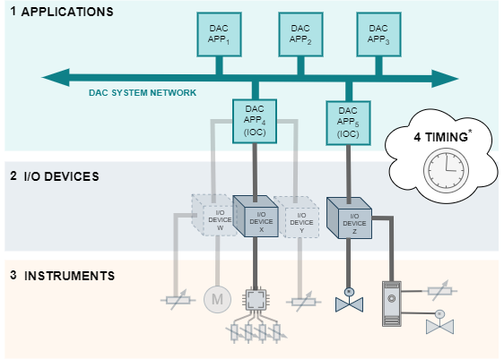
    

    <figcaption>Figure 1 - NASA GRC-ATF Common DAC Architecture - Hardware Layers</figcaption>
</figure>

While all of the requirements in the NASA GRC-ATF CDA are essential to this system design and are conformed to in the completed system, to understand the design it is important to identify up-front some of the specific requirements that drove the initial design approach; specifically, the choice of application layer software. A few of these design drivers are listed below for reference:

### 2.2 - Application Layer Software Requirement High-level Design Drivers

*   Be based on a true N-tier Client-Server architecture
*   Be based entirely on Open-Standards when possible
*   Be 100% Vendor Independent
*   Be interoperable with a variety of manufacturer specific I/O device hardware via a common internationally used open-standards-based TCP/IP API Protocol
*   Use only GPL (or better, e.g. BSD) licensed fully open-source (or open-sourceable) software (including OSs)
*   Be in active use by a variety of highly reputable international end-users
*   Have a large, active, open, and international developer community
*   Utilize a common DAC API protocol that:
    *   Supports scalar and N-dimensional data
    *   Transports data with all metadata which includes (at a minimum) EUs, timestamp, and alarm status
    *   Enables correlation of data across the entire application within ± 10 ns wrt UTC
    *   Is an internationally used open-standard

### 2.3 - Selection of EPICS as the Application Layer Client/Server Software Framework

The above list of software design drivers for the application layer is not exhaustive, however it is sufficient to understand why the design of the system has been based on the internationally developed and internationally supported, highly-reputable open-source software project for distributed control systems called EPICS (Experimental Physics and Industrial Control System) and the unifying protocol(s) have been selected as Channel Access (CA) and/or pvAccess (pvA) open-standards based protocols.

* * *

Reference links:

*   EPICS Software Project - https://epics-controls.org/
*   Channel Access (CA) Protocol - https://docs.epics-controls.org/en/latest/internal/ca_protocol.html
*   pvAccess (pvA) protocol - https://docs.epics-controls.org/en/latest/pv-access/protocol.html

* * *

For a system that is required to perform synchronous high-speed (~250 kHz) recordings on the scale of 1,024 channels such as the SEC-FDAS, special attention must be given to the requirements of the I/O Device Layer as well as the interface between the I/O Device Layer and the Application Layer. For reference, the I/O Device Layer diagram from the NASA GRC-ATF CDA is provided below for reference in Figure 2.

<figure style="text-align: center;">
    

        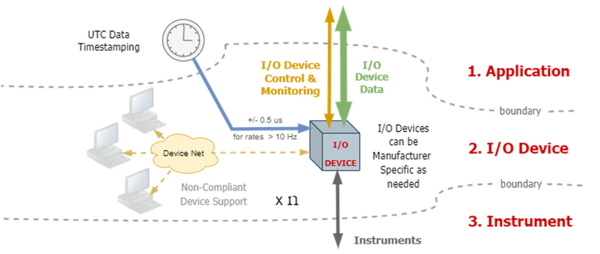
    

    <figcaption>Figure 2 - NASA GRC-ATF Common DAC Architecture - I/O Device Layer</figcaption>
</figure>

It is equally important to identify up-front some of the specific requirements in the I/O Device Layer that drove the design approach for the I/O Devices; specifically the choice of ADC/digitizer hardware and software. A few of these design drivers are listed below for reference:

### 2.4 I/O Device Layer Hardware and Software Requirement Design Drivers

*   Meet or exceed the technical and performance requirements of the specific ATF DAC system's data collection goals (namely the SEC-FDAS)
*   Provide all I/O control, configuration, monitoring, data collection, and data transfer functions via well-documented and clearly defined interfaces for integration into the ATF DAC system Application Layer
*   Provide source code for all application layer interfaces required to integrate the manufacture's device into the ATF system Application Layer and allow the interface code to be freely published as open source by NASA.
*   On-board Timestamping (for timeseries scalar data channels with sample rates > 10 Hz)
*   On-board Calculated Channels for timeseries scalar data channels

### 2.5 - System Functional Requirements - Digitizer Hardware and Software Requirement Design Drivers

*   Digitizer On-board FMC - Yes, User Programmable
*   Digitizer On-board FMC Firmware Source Code Availability - Provided
*   Digitizer On-board FMC Firmware Source Code Licensing - Open-Sourceable, BSD or similar
*   Digitizer Timing System Interface - Event-based, 100% mRF* protocol compatible
*   Digitizer DAS Application Interface - 100% Open-Standards-based

_* Note - The mRF event-based timing system specification is available at:_ http://mrf.fi/fw/DCManual-191127.pdf

* * *

It is noted that there are numerous COTS solutions available that could meet the SEC-FDAS technical and performance requirements for the SEC-FDAS system's data collection goals. However, with all the other requirements added to it, it is sufficient to understand why a digitizer solution was chosen that is based on the combined success of two digital electronics projects designed by the Lawrence Berkeley National Laboratory (LBNL, Berkeley Lab) Control System Team. They are:

*   **The Berkeley Lab Marble PCB** - A dual FMC FPGA carrier board developed for general purpose use in particle accelerator electronics instrumentation, which meets or exceeds the NASA GRC-ATF CDA I/O Device Layer hardware and software requirements, and
*   **The Osprey Quartz ADC PCB** - A double FMC mezzanine board performing 32 channels of analog to digital conversions that meets and exceeds the SEC-FDAS technical and performance requirements as well as the NASA GRC-ATF CDA Instrument Layer hardware and software requirements.

### 2.6 - Selection of the Osprey 32 Channel 250 kHz Digitizer Chassis (DAQ-32-250-24)

Each of these two PCBs (Marble and Quartz) are designed to be integrated into a finished package that is beyond the scope of the individual designs. This drove the need to design and develop a dedicated 2U standard 19" wide chassis containing a single Quartz PCB paired with a single Marble PCB that delivers 32 channels of high-speed synchronous data acquisition as a single high-level design component. This 32 channel ADC unit has been named, DAQ-32-250-24.

* * *

Reference links:

*   The Berkeley Lab Marble PCB - https://github.com/BerkeleyLab/Marble
*   The Osprey Quartz ADC PCB - https://github.com/osprey-dcs/Quartz
*   The Osprey DAQ-32-250-24 - https://github.com/osprey-dcs/quartz-daq-250-24

* * *

With the Osprey DAQ-32-250-24 units selected as the digitizing hardware and EPICS selected as the application software, the remaining system design becomes straight-forward.

## 3 - Hardware Design

### 3.1 - Hardware Elements by Type

Table 1 below lists the six major hardware functions used in the design of the system along with their quantity, general function, design rationale, and any notable or special considerations regarding the suitability of specific products selected to fulfil their functions.

<table style="width: 100%; border-collapse: collapse;" border="1">
    <caption style="caption-side: bottom; text-align: center;">
        Table 1 - Hardware Elements by Type
    </caption>
    <thead>
        <tr>
            <th>#</th>
            <th>Layer</th>
            <th>Function</th>
            <th>Qty</th>
            <th>Form Factor</th>
            <th>Rationale</th>
            <th>
                Notable Design Considerations
                 <i>
                    (See related sections for full details)
                </i> 
            </th>
        </tr>
    </thead>
    <tbody>
        <tr>
            <td>1</td>
            <td>Application</td>
            <td>Operator workstations</td>
            <td>x2</td>
            <td>1U</td>
            <td>All user operations should be conducted on dedicated HMI clients</td>
            <td>PCs just need to be able to run the Phoebus HMI Software and have basic networking and desired display capabilities</td>
        </tr>
        <tr>
            <td>2</td>
            <td>Application</td>
            <td>Software Support Services for the system</td>
            <td>x1</td>
            <td>1U</td>
            <td>All common EPICS software services should be consolidated on a dedicated system</td>
            <td>All services work with a base level server</td>
        </tr>
        <tr>
            <td>3</td>
            <td>Application</td>
            <td>24- and 48-Port Managed Ethernet Switches</td>
            <td>x2</td>
            <td>1U</td>
            <td>One switch in each location (Control Room and FDAS Instrument Room)</td>
            <td>Switches require special design capabilities like custom VPNs and 10 GB Ethernet between the 2 switches and for the https export port</td>
        </tr>
        <tr>
            <td>4</td>
            <td>Application</td>
            <td>DAQ IOC PC</td>
            <td>x1</td>
            <td>1U</td>
            <td>One system to facilitate control and monitoring of all 32 digitizers</td>
            <td>Disk Capacity, High-speed networking, etc.</td>
        </tr>
        <tr>
            <td rowspan="3">5</td>
            <td rowspan="3">I/O Device & Instrument</td>
            <td rowspan="3">32 Channels of Voltage Digitization to an EPICS IOC</td>
            <td rowspan="3">x32</td>
            <td rowspan="3">2U</td>
            <td>One Marble PCB provides all IOC and ADC Interface functions for one Quartz PCB in an EPICS system</td>
            <td>Distributes data input processing across many nodes</td>
        </tr>
        <tr>
            <td>One Quartz PCB provides ADC functions for 32 channels of voltage digitization</td>
            <td>Distributes data input across many nodes</td>
        </tr>
        <tr>
            <td>Quartz Chassis to facilitate integration of the Marble and Quartz PCB set as a single product in the system</td>
            <td>Contains one iteration of data input and processing</td>
        </tr>
        <tr>
            <td>6</td>
            <td>Timing</td>
            <td>IRIG/GPS Timeserver</td>
            <td>x1</td>
            <td>1U</td>
            <td>Needs to generate 1 Hz timing pulses based on IRIG and communicate mRF timing messages to Quartz Chassis</td>
            <td>Keeps all nodes time synchronized</td>
        </tr>
        <tr>
            <td>7</td>
            <td>Instrument Support</td>
            <td>Function Generator</td>
            <td>x1</td>
            <td>2U</td>
            <td>Need to be able to generate calibration signals</td>
            <td>Used to periodically zero the measurement channels</td>
        </tr>
        <tr>
            <td>8</td>
            <td>Instrument Support</td>
            <td>Digital Multimeter</td>
            <td>x1</td>
            <td>2U</td>
            <td>Need to be able to measure calibration signals</td>
            <td>Used to periodically zero the measurement channels</td>
        </tr>
    </tbody>
</table>

### 3.2 - Hardware Installation Design

The FDAS system has been designed to meet the installation/environment requirements provided by the end-user. It has also been designed with the understanding that it will be installed across two separate locations each defined by the functional and logistical needs of the components. These two locations are provided by and maintained by the end-user. The two locations are: an Instrument Room and a Control Room.

#### 3.2.1 - Location #1 - Instrument Room

The Instrument Room provides all the rack space and electrical power required for the 32 Quartz Chassis, the IRIG timeserver, the DAQ IOC PC, and one of the network switches all in a single temperature and humidity controlled room where the analog signal inputs to the system are accessible.

#### 3.2.2 - Location #2 - Control Room

The Control Room provides the rack space, electrical power, furniture, keyboards, monitors and input devices required to install and operate the two operator workstation PCs, the Common Support Services Server, and the second network switch.

#### 3.2.3 - Connectivity between Locations

The design assumes that the end-user provides a single multimode fiber pair to facilitate the network connection between the two locations (Control Room and Instrument Room).

### 3.3 - High-Level System Diagram

The 32 Quartz Chassis (each containing a single Marble/Quartz PCB set) are mounted in racks in the Instrument Room. External signals are connected to the Quartz Chassis via pairs of DB-37 connectors into the chassis. Each DB-37 connector provides 16 channels of analog signals to be connected to the system. As a system, the 32 Quartz Chassis can acquire data at different sample rates and are synced together by the timing system to allow for synchronous data acquisition. The ethernet switch allows the data to flow from the Instrument Room into the Control Room via a single mode fiber pair that passes through a fiber patch panels located in each room. Operators can use EPICS on the console workstations to monitor and read the acquired data acquired.

The high-level diagram of the system is shown in Figure 3 below.

<figure style="text-align: center;">
    

        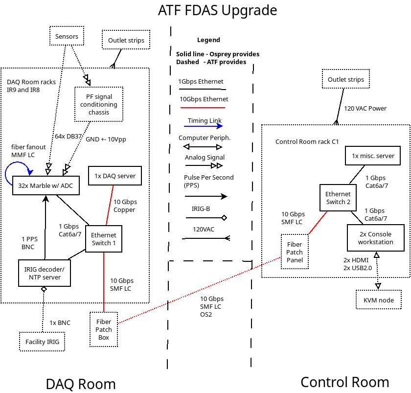
    

    <figcaption>Figure 3 - High-Level System Diagram</figcaption>
</figure>

### 3.4 - Application Layer Hardware Design

#### 3.4.1 - Workstation Hardware Design

The system utilizes two (2) PCs as "Operator Workstations" designed hereafter as DISWS1, and DISWS2.

The Operator Workstations are designed and selected to effectively host the following software:

* Operating System --> Linux
* Web Browser --> Chrome
* Operator HMI Software --> Control System Studio, Phoebus Edition

In order to fulfil the system's Operator Workstation designed functions, PC's with the following minimum capabilities were selected:
<table style="width: 100%; border-collapse: collapse;" border="1">
    <caption style="caption-side: bottom; text-align: center;">
        Table 2 - Workstation Hardware
    </caption>
    <thead>
        <tr>
            <th>Feature</th>
            <th>Minimum Value</th>
            <th>Current Chosen Value</th>
            <th>Rationale</th>
        </tr>
    </thead>
    <tbody>
        <tr>
            <td>CPU</td>
            <td>x86_64. 4 cores. 2 GHz</td>
            <td>x86_64. 8 cores. 3.8GHz</td>
            <td>Rack mount workstation for graphics display.  Low core count mid clock freq.</td>
        </tr>
        <tr>
            <td>Memory</td>
            <td>16 GB</td>
            <td>32 GB</td>
            <td>32 GB of non-ECC memory was the minimum offered by ACE Computers for this platform.</td>
        </tr>
        <tr>
            <td>Disk Size</td>
            <td>500 GB</td>
            <td>1 TB</td>
            <td>1 TB SSD was the minimum offered by the manufacturer.</td>
        </tr>
        <tr>
            <td>Disk Speed</td>
            <td>125 MB/s</td>
            <td>500 MB/s</td>
            <td>SSD to reduce delay and to support all tasks as the only drive in the system.</td>
        </tr>
        <tr>
            <td>Boot Drive</td>
            <td>No</td>
            <td>No</td>
            <td>Not required. SSD would be fast enough to run the OS and save any data to the same drive, if ever required.</td>
        </tr>
        <tr>
            <td>Network</td>
            <td>(1) 1 Gbps</td>
            <td>(1) Dual Port 1 Gbps</td>
            <td>1 Gbps interfaces as part of the standard mainboard configuration.  Minimum offered in dual port configuration.</td>
        </tr>
        <tr>
            <td>Form Factor</td>
            <td>1 Rack Unit</td>
            <td>1 Rack Unit</td>
            <td>1U Short Depth Rack Mount Chassis was a primary requirement for this design.</td>
        </tr>
        <tr>
            <td>OS</td>
            <td>Linux</td>
            <td>Debian</td>
            <td>Debian for stability, security, and hardware support.</td>
        </tr>
        <tr>
            <td>Other Features</td>
            <td>1x USB Gen 2  1x HDMI 2.0b </td>
            <td>4x USB Gen 2 1x HDMI 2.0b </td>
            <td>Native HDMI and USB connections to the KVM system was a primary requirement for this design.</td>
        </tr>
        <tr>
            <td>QTY</td>
            <td>2</td>
            <td>2</td>
            <td>2 identical workstations are required for this design</td>
        </tr>
    </tbody>
</table>

The exact make and model of these units are documented in the System Inventory and Bill of Material Documents, however, replacement units required in the future should meet the minimum requirements listed above for this hardware type.

#### 3.4.2 - Support Services (Misc) Server Hardware Design

The system utilizes one (1) PC as the "Support Services Server" designed hereafter as MISCS.

The Support Services Server is designed and selected to effectively host the following software as support services to the system:

*   Operating System --> Linux
*   System Historian Functionality --> EPICS Archive Appliance Module
*   Alarm Management Functionality --> EPICS Alarm Service
*   Channel Management --> EPICS Channel Finder Service and Tools
*   System Save and Restore Functionality --> EPICS Save and Restore Service
*   Electronic Logbook --> EPICS OLog Service and Interface

In order to fulfil the system's Support Services Server designed functions, a single 1U rack mount PC with the following minimum capabilities was selected:

<table  style="width: 100%; border-collapse: collapse;" border="1">
    <caption style="caption-side: bottom; text-align: center;">
        Table 3 - Support Services Hardware
    </caption>
    <tbody>
        <tr>
            <th>Feature</th>
            <th>Minimum Value</th>
            <th>Current Chosen Value</th>
            <th>Rationale</th>
        </tr>
        <tr>
            <td>CPU</td>
            <td>x86_64. 8 cores. 2 GHz</td>
            <td>x86_64. 16 cores. 3.7GHz</td>
            <td>Standard design for basic storage devices, mid core count mid clock freq. The qty of NVMe disks, 10 Gbps networking, and separate M.2 Boot drives required additional PCIe lanes, which increased the number of CPUs required in this design. The lower core count CPUs also typically have a higher freq.</td>
        </tr>
        <tr>
            <td>Memory</td>
            <td>ECC memory. 2 GB per core</td>
            <td>ECC memory. 4 GB per core</td>
            <td>16 GB DIMMs of ECC memory was the smallest offered by Dell for this platform. Populating 2 channels per core came out to 64 GB total and 4 GB per core.</td>
        </tr>
        <tr>
            <td>Disk Size</td>
            <td>13.82 TB</td>
            <td>16 TB</td>
            <td>32 chassis with 32 channels at 4 bytes per channel for 15 minutes. Storage required for 15 tests. Dell offered 3.2 TB NVMe drives in a qty of 6. N-1 for the hardware RAID 5 configuration for 16 TB total.</td>
        </tr>
        <tr>
            <td>Disk Speed</td>
            <td>1.1 GB/s Mixed Use</td>
            <td>3.6 GB/s Mixed Use</td>
            <td>NVMe provided the speed within a RAID 5 configuration and Mixed Use rating provided the endurance to support 3 Disk Writes Per Day during the 5 year warranty period to ensure the disks have an extended service life.</td>
        </tr>
        <tr>
            <td>Boot Drive</td>
            <td>Yes</td>
            <td>Yes. RAID 1</td>
            <td>Separate Boot Drive with mirroring to support the OS installation, logs, and other data not required to be written to the critical data RAID 5 array.</td>
        </tr>
        <tr>
            <td>Network</td>
            <td>(1) 10 Gbps</td>
            <td>(2) Dual Port 10 Gbps</td>
            <td>10 Gbps interfaces on separate NICs for redundancy. Minimum offered in dual port configuration. Network stream from 32 chassis at 3 bytes per channel over the network was ~ 6.5 Gbps.</td>
        </tr>
        <tr>
            <td>Form Factor</td>
            <td>1 Rack Unit</td>
            <td>1 Rack Unit</td>
            <td>1U to reduce space required if possible.</td>
        </tr>
        <tr>
            <td>OS</td>
            <td>Linux</td>
            <td>Debian</td>
            <td>Debian for stability, security, and hardware support.</td>
        </tr>
        <tr>
            <td>Other Features</td>
            <td>RAID controller, Redundant Power Supply</td>
            <td>PERC 12, Redundant Power Supply</td>
            <td>PERC 12 controller designed to support RAID configurations at speeds required for NVMe drives. Redundant Power Supply </td>
        </tr>
    </tbody>
</table>

The exact make and model of these units are documented in the System Inventory and Bill Of Material Documents, however, replacement units required in the future should meet the minimum requirements listed above for this hardware type.

#### 3.4.3 - DAQ Server Hardware Design

The system utilizes one (1) PC designed hereafter as the "DAQ Server".

The DAQ Server is designed and selected to effectively host the following software needed to facilitate data acquisition from 32 Quartz Chassis.

*   Operating System --> Linux
*   Client/Server Framework Core --> EPICS 7

In order to fulfil the system's Support Services Server designed functions, a PC with the following minimum capabilities was selected:

<table  style="width: 100%; border-collapse: collapse;" border="1">
    <caption style="caption-side: bottom; text-align: center;">
        Table 4 - DAQ Server Hardware
    </caption>
    <tbody>
        <tr>
            <th>Feature</th>
            <th>Minimum Value</th>
            <th>Current Chosen Value</th>
            <th>Rationale</th>
        </tr>
        <tr>
            <td>CPU</td>
            <td>x86_64. 8 cores. 2 GHz</td>
            <td>x86_64. 16 cores. 3.7GHz</td>
            <td>Standard design for basic storage devices, mid core count mid clock freq. The qty of NVMe disks, 10 Gbps networking, and separate M.2 Boot drives required additional PCIe lanes, which increased the number of CPUs required in this design. The lower core count CPUs also typically have a higher frequency.</td>
        </tr>
        <tr>
            <td>Memory</td>
            <td>ECC memory. 2 GB per core</td>
            <td>ECC memory. 4 GB per core</td>
            <td>16 GB DIMMs of ECC memory was the smallest offered by Dell for this platform. Populating 2 channels per core came out to 64 GB total and 4 GB per core.</td>
        </tr>
        <tr>
            <td>Disk Size</td>
            <td>13.82 TB</td>
            <td>16 TB</td>
            <td>32 chassis with 32 channels at 4 bytes per channel for 15 minutes. Storage required for 15 tests. Dell offered 3.2 TB NVMe drives in a qty of 6. N-1 for the hardware RAID 5 configuration for 16 TB total.</td>
        </tr>
        <tr>
            <td>Disk Speed</td>
            <td>1.1 GB/s Mixed Use</td>
            <td>3.6 GB/s Mixed Use</td>
            <td>NVMe provided the speed within a RAID 5 configuration and Mixed Use rating provided the endurance to support 3 Disk Writes Per Day during the 5 year warranty period to ensure the disks have an extended service life.</td>
        </tr>
        <tr>
            <td>Boot Drive</td>
            <td>Yes</td>
            <td>Yes. RAID 1</td>
            <td>Separate Boot Drive with mirroring to support the OS installation, logs, and other data not required to be written to the critical data RAID 5 array.</td>
        </tr>
        <tr>
            <td>Network</td>
            <td>(1) 10 Gbps</td>
            <td>(2) Dual Port 10 Gbps</td>
            <td>10 Gbps interfaces on separate NICs for redundancy. Minimum offered in dual port configuration. Network stream from 32 chassis at 3 bytes per channel over the network was ~6.5 Gbps.</td>
        </tr>
        <tr>
            <td>Form Factor</td>
            <td>1 Rack Unit</td>
            <td>1 Rack Unit</td>
            <td>1U to reduce space required if possible.</td>
        </tr>
        <tr>
            <td>OS</td>
            <td>Linux</td>
            <td>Debian</td>
            <td>Debian for stability, security, and hardware support.</td>
        </tr>
        <tr>
            <td>Other Features</td>
            <td>RAID controller, Redundant Power Supply</td>
            <td>PERC 12, Redundant Power Supply</td>
            <td>
                PERC 12 controller designed to support RAID configurations at speeds required for NVMe drives. 
                 Redundant Power Supply 
            </td>
        </tr>
    </tbody>
</table>

The exact make and model of these units are documented in the System Inventory and Bill Of Material Documents, however, replacement units required in the future should meet the minimum requirements listed above for this hardware type.

#### 3.4.4 - Network Hardware Design

The network is implemented over fiber between the rack groups. The network is entirely based on TCP/IP and UDP/IP protocols. UDP/IP is used to stream large buffers of data for real-time waveform acquisition. TCP/IP is used to communicate control and monitoring traffic for the EPICS protocols: pvAccess and Channel Access. They pass timestamped data to the rest of the system for display, archive and alarm notifications. The network is implemented over copper within the rack groups. The switches are designed to use multiple VLANs to isolate priority data acquisition traffic separate from the general EPICS traffic.

##### 3.4.4.1 - Network Design Diagram
<figure style="text-align: center;">
    

        
    

    <figcaption>Figure 4 - Network Design Diagram</figcaption>
</figure>

##### 3.4.4.2 - Logical Network Topology

Two VLANs are configured (as two IP subnets).
One VLAN (79) for traffic between the DAQS and the 32x Quartz digitizer chassis.
And a second (83) for all other traffic.
Only the DAQ server is logically present on both VLANs.
There is no IP routing between VLANs.

Details of network switch configuration may be found in [D.3.7 Chapter 2](D-3-07_DESIGN_-_Detailed_System_Configuration.md#chapter-2---initial-setup-and-network-config) sections CRMSW and DAQSW.

### 3.5 - The I/O Device Layer Hardware Design

#### 3.5.1 - The I/O Device Layer Design

The Hardware Design was built up by the requirements of a single channel then scaled to meet the system requirements. An input channel starts with an AC/DC selection block, allowing DC signals to be blocked or passed through the use of an electro-mechanical relay. 

An instrumentation amplifier section follows. The instrumentation amplifier provides a high input impedance and scales the analog input signal to the needed voltage levels needed for Digitization. The instrumentation amplifier used (INA851) is a bit unique in that it is relatively high speed (when compared to other instrumentation amplifiers) and very low noise. 

Next is a 24-bit sigma-delta ADC digitizing the signal. The ADC chosen (AD7768) has built-in filtering which prevents signal aliasing. Each ADC can handle 8 input signals. 

This ADC is then grouped with others on a Quartz PCB, providing 32 channels of input processing per PCB. The Quartz interfaces with an FPGA Marble Board capable of processing, packaging, and streaming the ADC data to the computing system.

For greater detail, full hardware schematics can be found in section [2.6](#26---selection-of-the-osprey-32-channel-250-khz-digitizer-chassis-daq-32-250-24).

#### 3.5.2 - The Quartz Chassis

A Quartz and a Marble are bundled together in a chassis making up a single deployable hardware unit in the system. The Chassis provides needed power, cooling and external I/O for the internal PCBs to operate within the overall system.

### 3.6 - The Instrument Layer Design

*   Quartz PCB (Already discussed in section [3.5.2](#352---the-quartz-chassis))
*   SigGen
*   DMM

### 3.7 - Timing Layer Hardware Design

The timing system is used to provide timestamped message data and synchronization to the system. It also provides precision and synchronization to each digitizer chassis. There are two types of data in the timing. The first type is produced by a hardware event and time of day distribution system. The second is Network Time Protocol for providing a 100 µsec time stamp to all other instrumentation.

The hardware timing system distributes timing events at a precision of 8 nsecs with jitter that is under 10 nsecs. As part of the Marble PCB, the digitizers all have embedded timing receivers. Events can be used to synchronize data collection, distribute data acquisition events and system state. The distribution of events such as violation of abort limits allows synchronized control of mitigation strategies.

#### 3.7.1 - Timing Layer Design Diagram

<figure style="text-align: center;">
    

        
    

    <figcaption>Figure 5 - Timing Design</figcaption>
</figure>

#### 3.7.2 - IRIG Timeserver

The system utilizes one (1) Timeserver designed hereafter as the "GPS Receiver." These features are needed to provide time stamps for data correlation and triggers for synchronized control to the distributed instruments.

In order to fulfil the system's Timeserver designed functions, a Timeserver with the following minimum capabilities was selected:

<table  style="width: 100%; border-collapse: collapse;" border="1">
    <caption style="caption-side: bottom; text-align: center;">
        Table 5 - Time Server Hardware
    </caption>
    <tbody>
        <tr>
            <th>Feature</th>
            <th>Minimum Value</th>
            <th>Current Chosen Value</th>
            <th>Rationale</th>
        </tr>
        <tr>
            <td>Network Connectivity</td>
            <td>Must support IPv4</td>
            <td>IPv6 compatible</td>
            <td></td>
        </tr>
        <tr>
            <td>Network Time Protocol Support</td>
            <td>Must act as NTPv3 server</td>
            <td>NTP server port</td>
            <td></td>
        </tr>
        <tr>
            <td>Pulse Per Second (PPS) Output</td>
            <td>Must provide PPS with the following:<li>5V TTL, active high (rising edge is start of second)</li><li>Minimum pulse duration 16ns</li><li>Pulse-to-pulse jitter ≤ 20ns RMS</li></td>
            <td>BNC Output, BNC TTL Time Code Outputs</td>
            <td></td>
        </tr>
        <tr>
            <td>IRIG Time Signal Support</td>
            <td>Must act as IRIG receiver/ decoder<li>IRIG-B with AM modulation protocol variant</li><li>BNC connector</li></td>
            <td></td>
            <td></td>
        </tr>
        <tr>
            <td>GPS Time Synchronization</td>
            <td>Must act as GPS receiver with type-N connector</td>
            <td></td>
            <td></td>
        </tr>
    </tbody>
</table>

The exact make and model of these units are documented in the System Inventory and Bill of Material Documents, however, replacement units required in the future should meet the minimum requirements listed above for this hardware type.

## 4 - FDAS Software Design

This Software Design Document outlines the architecture, components, interfaces, and data for the FDAS software application. Designed to meet the requirements specified in the FDAS Systems Functional Requirements and ATF Common DAC Architecture Specification. This document serves as a comprehensive guide for developers, stakeholders, and project managers involved in the software development lifecycle. By detailing the design choices and technology stack utilized, this Software Design Document aims to facilitate clear communication and ensure that all project participants have a shared understanding of the system's structure and functionality.

### 4.1 - FDAS Software Architecture

This Software Architecture Description (SAD) provides a detailed framework for the FDAS system, outlining the core architectural components, their interactions, and the principles guiding the design. It aims to present a clear and unified view of the system’s structure, including the chosen architectural style, key patterns, and technologies applied in the development process. By establishing a solid architectural foundation, this document ensures that the design aligns with both functional and non-functional requirements, facilitating scalability, maintainability, and performance while serving as a reference for current and future development efforts.

The general flow of the Software Architecture is arranged in accordance with the hardware such that data acquisition begins at the bottom left of the diagram below, proceeds up through the Quartz Chassis and from the top left is transmitted to the right to the DAQ server in the middle. The DAQ Server contains all of the essential software elements to not only receive the data coming from the Quartz Chassis, but also to control and monitor their states and behaviors. From the Workstations (shown in the lower right), Operators can control and monitor the entire data acquisition process. The System Services (Misc) Server shown in the top right contains all of the supporting software services and tools required to manage not only the data recorded from the DAQ Chassis, but also all of the system state and history of operations.

<table style="width: 100%; border-collapse: collapse;" border="1">
    <tr>
        <th><strong>Left</strong></th>
        <th></td>
        <th><strong>Middle</strong></th>
        <th></td>
        <th><strong>Right</strong></th>
    </tr>
    <tr>
        <td><strong>Quartz Chassis (x32)</strong></td>
        <td>\--></td>
        <td><strong>DAQ Server</strong></td>
        <td><----></td>
        <td><strong>Work Stations & System Services (Misc) Server</strong></td>
    </tr>
    <tr>
        <td>
            Comprised of (Each):
            <ul>
                <li>x1 Marble FMC PCB</li>
                <li>x1 Quartz ADC PCB</li>
            </ul>
        </td>
        <td></td>
        <td>
            Comprised of:
            <ul>
                <li>x1 COTS PC</li>
            </ul>        
        </td>        
        <td></td>
        <td>
            Comprised of (Each):
            <ul>
                <li>x1 COTS PC (Misc Server)</li>
                <li>x2 COTS PC (Workstation Server)</li>
            </ul>            
        </td>
</table>

<figure style="text-align: center;">
    

        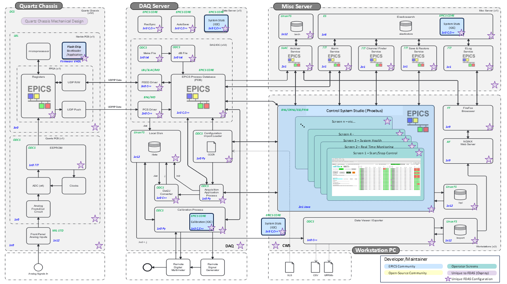
    

    <figcaption>Figure 6 - SEC-FDAS Software Design</figcaption>
</figure>

### 4.2 - High Speed Synchronous Data Acquisition Software Components

The following section identifies the software components that have been used in the FDAS Design and provides clarifying remarks on why the software element was selected and how it functions. The software components are grouped into the following sections:

1. Software and Firmware used in the Osprey-DCS Quartz Chassis
2. EPICS Device Drivers used to handle communications between the Osprey-DCS Quartz Chassis and the System PCs
3. EPICS Modules used to handle key application functions of the system
4. EPICS IOCs developed specifically for this system

#### 4.2.1 - Quartz Chassis Software

This section describes the Software and Firmware used in the Osprey-DCS Quartz Chassis.

##### 4.2.1.1 - Osprey DCS Quartz Chassis Firmware

<table border="1">
    <tbody>
        <tr>
            <td>Functional Description</td>
            <td>Interfaces with Quartz Board ADCs to acquire and package datastream.</td>
        </tr>
        <tr>
            <td>Language Written in</td>
            <td>C, Verliog, VHDL</td>
        </tr>
        <tr>
            <td>Compiled in</td>
            <td>AMD Vivado Design Suite 2024.2</td>
        </tr>
        <tr>
            <td>Repo Link</td>
            <td>See SW BOM</td>
        </tr>
        <tr>
            <td>Version Used</td>
            <td>See Software BOM</td>
        </tr>
        <tr>
            <td>Configuration Details</td>
            <td>See Software Configuration Management Document</td>
        </tr>
    </tbody>
</table>

##### 4.2.1.2 - Marble Board Bootloader Firmware

<table border="1">
    <tbody>
        <tr>
            <td>Functional Description</td>
            <td>Sequences power-up of the marble board and loads stored FPGA firmware</td>
        </tr>
        <tr>
            <td>Language Written in</td>
            <td>C, Verliog, VHDL</td>
        </tr>
        <tr>
            <td>Compiled in</td>
            <td>AMD Vivado Design Suite 2024.2</td>
        </tr>
        <tr>
            <td>Repo Link</td>
            <td>See SW BOM</td>
        </tr>
        <tr>
            <td>Version Used</td>
            <td>See Software BOM</td>
        </tr>
        <tr>
            <td>Configuration Details</td>
            <td>See Software Configuration Management Document</td>
        </tr>
    </tbody>
</table>

##### 4.2.1.3 - Marble Board Application/FPGA Firmware

<table border="1">
    <tbody>
        <tr>
            <td>Functional Description</td>
            <td>Creates and streams data packets. Handles Monitoring and Diagnostic of hardware</td>
        </tr>
        <tr>
            <td>Language Written in</td>
            <td>C, Verliog, VHDL</td>
        </tr>
        <tr>
            <td>Compiled in</td>
            <td>AMD Vivado Design Suite 2024.2</td>
        </tr>
        <tr>
            <td>Repo Link</td>
            <td>See SW BOM</td>
        </tr>
        <tr>
            <td>Version Used</td>
            <td>See Software BOM</td>
        </tr>
        <tr>
            <td>Configuration Details</td>
            <td>See Software Configuration Management Document</td>
        </tr>
    </tbody>
</table>

##### 4.2.1.4 - Quartz IPMI EEPROM Firmware

<table border="1">
    <tbody>
        <tr>
            <td>Functional Description</td>
            <td>Creates standard FRU data to store in EEPROM</td>
        </tr>
        <tr>
            <td>Language Written in</td>
            <td>Shell, Python</td>
        </tr>
        <tr>
            <td>Compiled in</td>
            <td>Python 3.11</td>
        </tr>
        <tr>
            <td>Repo Link</td>
            <td>See SW BOM</td>
        </tr>
        <tr>
            <td>Version Used:</td>
            <td>See Software BOM</td>
        </tr>
        <tr>
            <td>Configuration Details</td>
            <td>See Software Configuration Management Document</td>
        </tr>
    </tbody>
</table>

#### 4.2.2 - EPICS Drivers

This section describes the EPICS Device Drivers used to handle communications between the Osprey-DCS Quartz Chassis and the System PCs.

##### 4.2.2.1 - FEED Driver

<table border="1">
    <tbody>
        <tr>
            <td>Functional Description</td>
            <td>UDP Driver to Read Status and Write Configuration Parameters in the FPGA</td>
        </tr>
        <tr>
            <td>Language Written in</td>
            <td>C++</td>
        </tr>
        <tr>
            <td>Compiled in</td>
            <td>gcc</td>
        </tr>
        <tr>
            <td>Repo Link</td>
            <td>See SW BOM</td>
        </tr>
        <tr>
            <td>Version Used</td>
            <td>See Software BOM</td>
        </tr>
        <tr>
            <td>Installation Details</td>
            <td>See the Software Inventory Document</td>
        </tr>
        <tr>
            <td>Configuration Details</td>
            <td>See Software Configuration Management Document</td>
        </tr>
    </tbody>
</table>

##### 4.2.2.2 - PCS Driver

<table border="1">
    <tbody>
        <tr>
            <td>Functional Description</td>
            <td>UDP driver that reads DAQ data from the Quartz FPGA, writes it to disk and provides samples to the EPICS DB</td>
        </tr>
        <tr>
            <td>Language Written in</td>
            <td>C++</td>
        </tr>
        <tr>
            <td>Compiled in</td>
            <td>gcc</td>
        </tr>
        <tr>
            <td>Repo Link</td>
            <td>See SW BOM</td>
        </tr>
        <tr>
            <td>Version Used</td>
            <td>See Software BOM</td>
        </tr>
        <tr>
            <td>Installation Details</td>
            <td>See the Software Inventory Document</td>
        </tr>
        <tr>
            <td>Configuration Details</td>
            <td>See Software Configuration Management Document</td>
        </tr>
    </tbody>
</table>

#### 4.2.3 - Osprey Developed EPICS Modules

This section describes the EPICS Modules used to handle key application functions of the system.

##### 4.2.3.1 - Quartz Application Module

<table border="1">
    <tbody>
        <tr>
            <td>Functional Description</td>
            <td>EPICS Process Database and Displays for monitor and control of the Quartz DAQ system</td>
        </tr>
        <tr>
            <td>Language Written in</td>
            <td>Text configuration for EPICS process database and Phoebus displays builder</td>
        </tr>
        <tr>
            <td>Compiled in</td>
            <td>loaded into IOC and CSStudio at run time</td>
        </tr>
        <tr>
            <td>Repo Link</td>
            <td>See SW BOM</td>
        </tr>
        <tr>
            <td>Version Used</td>
            <td>See Software BOM</td>
        </tr>
        <tr>
            <td>Installation Details</td>
            <td>See the Software Inventory Document</td>
        </tr>
        <tr>
            <td>Configuration Details</td>
            <td>See Software Configuration Management Document</td>
        </tr>
    </tbody>
</table>

##### 4.2.3.2 - Quartz Calibration Module

<table border="1">
    <tbody>
        <tr>
            <td>Functional Description</td>
            <td>Python Script, EPICS Process Database and Displays for monitor and control of the Quartz DAQ system</td>
        </tr>
        <tr>
            <td>Language Written in</td>
            <td>Text configuration for EPICS process database and Python Script and Phoebus displays builder</td>
        </tr>
        <tr>
            <td>Compiled in</td>
            <td>Loaded into IOC and CSStudio at run time</td>
        </tr>
        <tr>
            <td>Repo Link</td>
            <td>See Software BOM</td>
        </tr>
        <tr>
            <td>Version Used</td>
            <td>See Software BOM</td>
        </tr>
        <tr>
            <td>Installation Details</td>
            <td>See the Software Inventory Document</td>
        </tr>
        <tr>
            <td>Configuration Details</td>
            <td>See Software Configuration Management Document</td>
        </tr>
    </tbody>
</table>

##### 4.2.3.3 - Configuration Loader Module

<table border="1">
    <tbody>
        <tr>
            <td>Functional Description</td>
            <td>Converts NASA CSV configuration file and loads metadata into the EPICS Process Database</td>
        </tr>
        <tr>
            <td>Language Written in</td>
            <td>Python</td>
        </tr>
        <tr>
            <td>Compiled in</td>
            <td>NA: the script is run to move metadata from NASA CSV configuration into EPICS PV using PVAccess</td>
        </tr>
        <tr>
            <td>Repo Link</td>
            <td>See SW BOM</td>
        </tr>
        <tr>
            <td>Version Used</td>
            <td>See Software BOM</td>
        </tr>
        <tr>
            <td>Installation Details</td>
            <td>See the Software Inventory Document</td>
        </tr>
        <tr>
            <td>Configuration Details</td>
            <td>See Software Configuration Management Document</td>
        </tr>
    </tbody>
</table>

##### 4.2.3.4 - Dat2j file converter Module

<table border="1">
    <tbody>
        <tr>
            <td>Functional Description</td>
            <td>Converts a Quartz DAQ file to a NTType File</td>
        </tr>
        <tr>
            <td>Language Written in</td>
            <td>C++</td>
        </tr>
        <tr>
            <td>Compiled in</td>
            <td>gcc</td>
        </tr>
        <tr>
            <td>Repo Link</td>
            <td>See SW BOM</td>
        </tr>
        <tr>
            <td>Version Used</td>
            <td>See Software BOM</td>
        </tr>
        <tr>
            <td>Installation Details</td>
            <td>See the Software Inventory Document</td>
        </tr>
        <tr>
            <td>Configuration Details</td>
            <td>See Software Configuration Management Document</td>
        </tr>
    </tbody>
</table>

##### 4.2.3.5 - Data Viewer and Data Exporting Utility

<table border="1">
    <tbody>
        <tr>
            <td>Functional Description</td>
            <td>View NTType Data Files, Select Windows and export files in UFF58 files for Acoustic Analysis</td>
        </tr>
        <tr>
            <td>Language Written in</td>
            <td>C++</td>
        </tr>
        <tr>
            <td>Compiled in</td>
            <td>gcc</td>
        </tr>
        <tr>
            <td>Repo Link</td>
            <td>See SW BOM</td>
        </tr>
        <tr>
            <td>Version Used</td>
            <td>See Software BOM</td>
        </tr>
        <tr>
            <td>Installation Details</td>
            <td>See the Software Inventory Document</td>
        </tr>
        <tr>
            <td>Configuration Details</td>
            <td>See Software Configuration Management Document</td>
        </tr>
    </tbody>
</table>

#### 4.2.4 - Osprey Developed EPICS IOCs

This section describes the EPICS IOCs developed specifically for this system. Two IOC Classes have been designed. Each class is used multiple times in the system.

##### 4.2.4.1 - DAQ IOC Design (x32)

The first IOC class is the DAQ IOC. The purpose of the DAQ IOC is to provide the EPICS interface and device support for the Osprey-DCS Quartz Digitizer Chassis.

##### 4.2.4.1.1 - Functional Description of the DAQ IOC
[link]()
An EPICS IOC is required for EPICS to communicate with an Osprey-DCS Quartz Digitizer Chassis. The DAQ IOC provides EPICS device support to:

*   Define the PVs that command and control a single Osprey-DCS Quartz Digitizer
*   Define the PVs that monitor the health and status of a single Osprey-DCS Quartz Digitizer
*   Define the PVs that enable real-time monitoring of data acquisition from a single Osprey-DCS Quartz Digitizer in EPICS
*   Enables the system to receive and record quality data from a single Osprey-DCS Quartz Digitizer

Each Osprey-DCS Quartz Digitizer provides 32 channels of analog voltage data acquisition. In order to provide 1,024 channels of synchronous data acquisition, the DAQ IOC has been replicated 32 times on the DAQ PC/Server. Once for each of 32 Osprey-DCS Quartz Digitizers.

<table border="1">
    <tbody>
        <tr>
            <td>Language Written in</td>
            <td>EPICS 7 Core (i.e. Make File)</td>
        </tr>
        <tr>
            <td>Repo Link</td>
            <td>See Software BOM</td>
        </tr>
        <tr>
            <td>Version Used</td>
            <td>See Software BOM</td>
        </tr>
        <tr>
            <td>Installation Details</td>
            <td>See the Software Inventory Document</td>
        </tr>
        <tr>
            <td>Configuration Details</td>
            <td>See Software Configuration Management Document</td>
        </tr>
    </tbody>
</table>

<figure style="text-align: center;">
    

        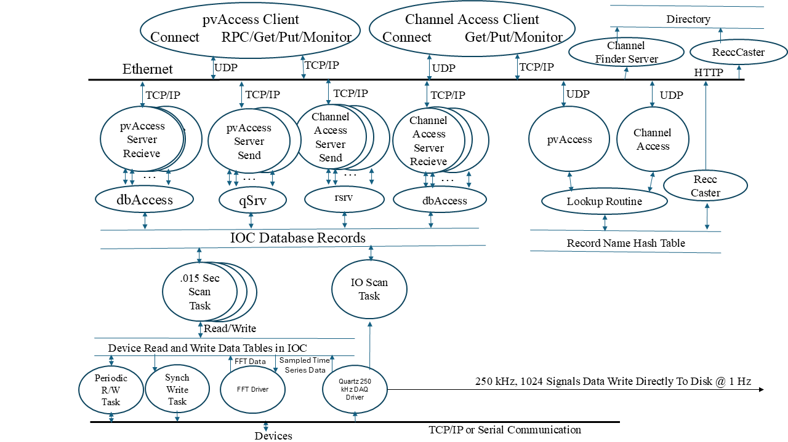
    

    <figcaption>Figure 7 - DAQ IOC Server Internals</figcaption>
</figure>

The PCS driver receives UDP packets from the Quartz Chassis. It provides a time series array to the EPICS process database of N samples at a configured frequency. These arrays are available for display through CS-Studio. An array of times series data is also provided to an FFT driver, which collects the data, produces an FFT and makes that array available for display through the EPICS database to the Phoebus display viewer.

The FEED driver reads and writes status and configuration parameters to the Quartz digitizers also using UDP but on a different port than the PCS driver. They use different ports to avoid collisions that would likely impact the data throughput from the Quartz Chassis to the DAQ IOC Server. These values are interfaced through the EPICS database for all EPICS clients to use for display, archiving, save/restore of configuration parameters, alarms and other client functions.

##### 4.2.4.1.2 - Specific EPICS Process Variable Records used in the DAQ IOC Design

An EPICS-based control system contains one or more Input Output Controllers (IOCs). Each IOC loads one or more databases. A database is a collection of records of various types.

A Record is an object with:

*   A unique name
*   A behavior defined by its type
*   Controllable properties (fields)
*   Optional associated hardware I/O (device support)
*   Links to other records

There are several different types of records available in EPICS Core.

Ref: https://epics.anl.gov/base/R7-0/4-docs/RecordReference.html

In addition to the record types that are included in the EPICS base software package, it is possible (although not recommended unless you absolutely need) to create your own record type to perform some specific tasks.

Each record comprises a number of fields. Fields can have different functions, typically they are used to configure how the record operates, or to store data items.

Ref: https://docs.epics-controls.org/en/latest/process-database/EPICS_Process_Database_Concepts.html#the-epics-process-database

Note that records are used to define when records are processed, where they input/output values, and the record types define the functions performed on the values being read or written in soft record (no hardware connection) and hardware records. Many records exist to control the flow of record processing. Records are also used to compute intermediate values. The records that are not meant for external viewing are marked "internal". There are records that read values that are not intended for operators. These are for engineers with a deep understanding of the hardware and software being used. These are marked for expert use. All other records are for users to set or read to allow them to control and monitor their DAQ system.

For the FDAS Software Design, all required functions were implemented using the following 20 standard record types:

###### 4.2.4.1.2.1 - EPICS Record Type - Array Analog Input (aai)

The array analog input record type is used to read array data. The array data can contain any of the supported data types. The record is in many ways similar to the waveform record. It allows, however, the device support to allocate the array storage.

Ref: https://epics.anl.gov/base/R7-0/4-docs/aaiRecord.html

<table style="border-collapse: collapse;" border="1">
    <thead>
        <tr>
            <th>List #</th>
            <th>Type</th>
            <th>FDAS Record (PV) Name</th>
            <th>Per IOC</th>
            <th>Per Sys</th>
            <th>Group</th>
            <th>Purpose / Description of Use</th>
        </tr>
    </thead>
    <tbody>
        <tr>
            <td>1</td>
            <td>aai</td>
            <td>FDAS:(01..32):APP:FW_CODEHASH</td>
            <td>1</td>
            <td>32</td>
            <td>Chassis</td>
            <td>Information. Firmware VCS revision about application image (not bootloader). Currently GIT hash</td>
        </tr>
        <tr>
            <td>2</td>
            <td>aai</td>
            <td>FDAS:(01..32):APP:FW_DESC</td>
            <td>1</td>
            <td>32</td>
            <td>Chassis</td>
            <td>Information. Text description of application firmware. Currently Xilinx project name</td>
        </tr>
        <tr>
            <td>3</td>
            <td>aai</td>
            <td>FDAS:(01..32):APP:FW_ROM</td>
            <td>1</td>
            <td>32</td>
            <td>Chassis</td>
            <td>Expert Information</td>
        </tr>
        <tr>
            <td>4</td>
            <td>aai</td>
            <td>FDAS:(01..32):APP:JINFO</td>
            <td>1</td>
            <td>32</td>
            <td>Chassis</td>
            <td>Expert information</td>
        </tr>
        <tr>
            <td>5</td>
            <td>aai</td>
            <td>FDAS:(01..32):APP:JSON</td>
            <td>1</td>
            <td>32</td>
            <td>Chassis</td>
            <td>Expert information</td>
        </tr>
        <tr>
            <td>6</td>
            <td>aai</td>
            <td>FDAS:(01..32):APP:LAST_ERROR</td>
            <td>1</td>
            <td>32</td>
            <td>Chassis</td>
            <td>Most recent EPICS Driver error message about application  firmware</td>
        </tr>
        <tr>
            <td>7</td>
            <td>aai</td>
            <td>FDAS:(01..32):GLD:FW_CODEHASH</td>
            <td>1</td>
            <td>32</td>
            <td>Chassis </td>
            <td>Information.&#160; Firmware VCS  revision about bootloader image (not application).&#160; Currently GIT hash</td>
        </tr>
        <tr>
            <td>8</td>
            <td>aai</td>
            <td>FDAS:(01..32):GLD:FW_DESC</td>
            <td>1</td>
            <td>32</td>
            <td>Chassis</td>
            <td>Information.&#160; Text  description of bootloader firmware. Currently Xilinx project name</td>
        </tr>
        <tr>
            <td>9</td>
            <td>aai</td>
            <td>FDAS:(01..32):GLD:FW_ROM</td>
            <td>1</td>
            <td>32</td>
            <td>Chassis</td>
            <td>Expert Information</td>
        </tr>
        <tr>
            <td>10</td>
            <td>aai</td>
            <td>FDAS:(01..32):GLD:JINFO</td>
            <td>1</td>
            <td>32</td>
            <td>Chassis</td>
            <td>Expert Information</td>
        </tr>
        <tr>
            <td>11</td>
            <td>aai</td>
            <td>FDAS:(01..32):GLD:JSON</td>
            <td>1</td>
            <td>32</td>
            <td>Chassis</td>
            <td>Expert Information
            </td>
        </tr>
        <tr>
            <td>12</td>
            <td>aai</td>
            <td>FDAS:(01..32):GLD:LAST_ERROR</td>
            <td>1</td>
            <td>32</td>
            <td>Chassis</td>
            <td>Most recent EPICS Driver error message about bootloader firmware</td>
        </tr>
        <tr>
            <td>13</td>
            <td>aai</td>
            <td>FDAS:(01..32):Quartz:ADC:headers</td>
            <td>1</td>
            <td>32</td>
            <td>Chassis</td>
            <td>Expert information</td>
        </tr>
        <tr>
            <td>14</td>
            <td>aai</td>
            <td>FDAS:(01..32):SA:Ch(01..32)</td>
            <td>32</td>
            <td>1024</td>
            <td>Channel</td>
            <td>Channel waveform/array in engineering units</td>
        </tr>
        <tr>
            <td>15</td>
            <td>aai</td>
            <td>FDAS:(01..32):SA:Ch(01..32)_</td>
            <td>32</td>
            <td>1024</td>
            <td>Channel</td>
            <td>Channel waveform/array in ADC counts</td>
        </tr>
        <tr>
            <td>16</td>
            <td>aai</td>
            <td>FDAS:(01..32):SA:T</td>
            <td>1</td>
            <td>32</td>
            <td>Chassis</td>
            <td>Timebase of channel waveform. First element is zero.&#160; Second  elements is sample period. …</td>
        </tr>
        <tr>
            <td colspan="3"><b>Totals</b></td>
            <td><b>78</b></td>
            <td><b>2496</b></td>
            <td></td>
            <td></td>
        </tr>
    </tbody>
</table>

###### 4.2.4.1.2.2 - EPICS Record Type - Analog Input Record (ai)

This record type is normally used to obtain an analog value from a hardware input and convert it to engineering units. The record supports linear and break-point conversion to engineering units, smoothing, alarm limits, alarm filtering, and graphics and control limits.

Ref: https://epics.anl.gov/base/R7-0/4-docs/aaiRecord.html

The FDAS DAQ IOC design consists of the following records of this type:

<table style="border-collapse: collapse;" border="1">
    <thead>
        <tr>
            <th>List #</th>
            <th>Type</th>
            <th>FDAS Record (PV) Name</th>
            <th>Per IOC</th>
            <th>Per Sys</th>
            <th>Group</th>
            <th>Purpose / Description of Use</th>
        </tr>
    </thead>
    <tbody>
        <tr>
            <td>1</td>
            <td>ai</td>
            <td>FDAS:01:ACQ:HIHIlim:01:RBV</td>
            <td>32</td>
            <td>1024</td>
            <td>Per CH</td>
            <td>HIHI bound violation level readback of current setting</td>
        </tr>
        <tr>
            <td>2</td>
            <td>ai</td>
            <td>FDAS:01:ACQ:HIlim:01:RBV</td>
            <td>32</td>
            <td>1024</td>
            <td>Per CH</td>
            <td>HI bound violation level readback of current setting</td>
        </tr>
        <tr>
            <td>3</td>
            <td>ai</td>
            <td>FDAS:01:ACQ:LOlim:01:RBV</td>
            <td>32</td>
            <td>1024</td>
            <td>Per CH</td>
            <td>LO ...</td>
        </tr>
        <tr>
            <td>4</td>
            <td>ai</td>
            <td>FDAS:01:ACQ:LOLOlim:01:RBV</td>
            <td>32</td>
            <td>1024</td>
            <td>Per CH</td>
            <td>LOLO ...</td>
        </tr>
        <tr>
            <td>5</td>
            <td>ai</td>
            <td>FDAS:01:APP:RTT</td>
            <td>1</td>
            <td>32</td>
            <td>Per Chassis</td>
            <td>Expert information. Network round-trip time</td>
        </tr>
        <tr>
            <td>6</td>
            <td>ai</td>
            <td>FDAS:01:CALIB:gain:01</td>
            <td>32</td>
            <td>1024</td>
            <td>Per CH</td>
            <td>Expert configuration. Currently unused.</td>
        </tr>
        <tr>
            <td>7</td>
            <td>ai</td>
            <td>FDAS:01:firmwareBuildDate:T_</td>
            <td>1</td>
            <td>32</td>
            <td>Per Chassis</td>
            <td>Internal</td>
        </tr>
        <tr>
            <td>8</td>
            <td>ai</td>
            <td>FDAS:01:FItvl-I_</td>
            <td>1</td>
            <td>32</td>
            <td>Per Chassis</td>
            <td>Internal</td>
        </tr>
        <tr>
            <td>9</td>
            <td>ai</td>
            <td>FDAS:01:FPGA:Temperature</td>
            <td>1</td>
            <td>32</td>
            <td>Per Chassis</td>
            <td>FPGA die temperature, when application image is running</td>
        </tr>
        <tr>
            <td>10</td>
            <td>ai</td>
            <td>FDAS:01:FPGA:VBRAM</td>
            <td>1</td>
            <td>32</td>
            <td>Per Chassis</td>
            <td>PCB Power supply voltage monitor</td>
        </tr>
        <tr>
            <td>11</td>
            <td>ai</td>
            <td>FDAS:01:FPGA:VccAUX</td>
            <td>1</td>
            <td>32</td>
            <td>Per Chassis</td>
            <td>PCB Power supply voltage monitor</td>
        </tr>
        <tr>
            <td>12</td>
            <td>ai</td>
            <td>FDAS:01:FPGA:VccINT</td>
            <td>1</td>
            <td>32</td>
            <td>Per Chassis</td>
            <td>PCB Power supply voltage monitor</td>
        </tr>
        <tr>
            <td>13</td>
            <td>ai</td>
            <td>FDAS:01:GLD:RTT</td>
            <td>1</td>
            <td>32</td>
            <td>Per Chassis</td>
            <td>Expert information</td>
        </tr>
        <tr>
            <td>14</td>
            <td>ai</td>
            <td>FDAS:01:GLD:Temperature</td>
            <td>1</td>
            <td>32</td>
            <td>Per Chassis</td>
            <td>FPGA die temperature, when bootloader image is running
            </td>
        </tr>
        <tr>
            <td>15</td>
            <td>ai</td>
            <td>FDAS:01:MARBLE:FMC1:P12I</td>
            <td>1</td>
            <td>32</td>
            <td>Per Chassis</td>
            <td>PCB Power supply current monitor
            </td>
        </tr>
        <tr>
            <td>16</td>
            <td>ai</td>
            <td>FDAS:01:MARBLE:FMC1:P12V</td>
            <td>1</td>
            <td>32</td>
            <td>Per Chassis</td>
            <td>PCB Power supply voltage monitor
            </td>
        </tr>
        <tr><td>17</td><td>ai</td><td>FDAS:01:MARBLE:FMC2:P12I</td><td>1</td><td>32</td><td>Per Chassis</td><td>PCB Power supply current monitor</td></tr>
        <tr><td>18</td><td>ai</td><td>FDAS:01:MARBLE:FMC2:P12V</td><td>1</td><td>32</td><td>Per Chassis</td><td>PCB Power supply voltage monitor</td></tr>
        <tr><td>19</td><td>ai</td><td>FDAS:01:MARBLE:P12I</td><td>1</td><td>32</td><td>Per Chassis</td><td>PCB Power supply current monitor</td></tr>
        <tr><td>20</td><td>ai</td><td>FDAS:01:MARBLE:P12V</td><td>1</td><td>32</td><td>Per Chassis</td><td>PCB Power supply voltage monitor</td></tr>
        <tr><td>21</td><td>ai</td><td>FDAS:01:PFree-I</td><td>1</td><td>32</td><td>Per Chassis</td><td>Expert information</td></tr>
        <tr><td>22</td><td>ai</td><td>FDAS:01:PRXe-I</td><td>1</td><td>32</td><td>Per Chassis</td><td>Expert information</td></tr>
        <tr><td>23</td><td>ai</td><td>FDAS:01:PWrt-I</td><td>1</td><td>32</td><td>Per Chassis</td><td>Expert information</td></tr>
        <tr><td>24</td><td>ai</td><td>FDAS:01:QSFP1:RxPower1</td><td>4</td><td>128</td><td>Per PS</td><td>QSFP1 port 1 received optical power</td></tr>
        <tr><td>25</td><td>ai</td><td>FDAS:01:QSFP1:Temperature</td><td>1</td><td>32</td><td>Per Chassis</td><td>QSFP1 module temperature</td></tr>
        <tr><td>26</td><td>ai</td><td>FDAS:01:QSFP1:Vcc</td><td>1</td><td>32</td><td>Per Chassis</td><td>QSFP internal voltage monitor</td></tr>
        <tr><td>27</td><td>ai</td><td>FDAS:01:QSFP2:RxPower1</td><td>4</td><td>128</td><td>Per PS</td><td></td></tr>
        <tr><td>28</td><td>ai</td><td>FDAS:01:QSFP2:Temperature</td><td>1</td><td>32</td><td>Per Chassis</td><td></td></tr>
        <tr><td>29</td><td>ai</td><td>FDAS:01:QSFP2:Vcc</td><td>1</td><td>32</td><td>Per Chassis</td><td></td></tr>
        <tr><td>30</td><td>ai</td><td>FDAS:01:Quartz:2P5V1</td><td>1</td><td>32</td><td>Per Chassis</td><td>PCB Power supply voltage monitor</td></tr>
        <tr><td>31</td><td>ai</td><td>FDAS:01:Quartz:2P5V2</td><td>1</td><td>32</td><td>Per Chassis</td><td>PCB Power supply voltage monitor</td></tr>
        <tr><td>32</td><td>ai</td><td>FDAS:01:Quartz:3P3V</td><td>1</td><td>32</td><td>Per Chassis</td><td>PCB Power supply voltage monitor</td></tr>
        <tr><td>33</td><td>ai</td><td>FDAS:01:Quartz:N15V</td><td>1</td><td>32</td><td>Per Chassis</td><td>PCB Power supply voltage monitor</td></tr>
        <tr><td>34</td><td>ai</td><td>FDAS:01:Quartz:P12I</td><td>1</td><td>32</td><td>Per Chassis</td><td></td></tr>
        <tr><td>35</td><td>ai</td><td>FDAS:01:Quartz:P12V</td><td>1</td><td>32</td><td>Per Chassis</td><td>PCB Power supply voltage monitor</td></tr>
        <tr><td>36</td><td>ai</td><td>FDAS:01:Quartz:P15V</td><td>1</td><td>32</td><td>Per Chassis</td><td>PCB Power supply voltage monitor</td></tr>
        <tr>
            <td>37</td>
            <td>ai</td>
            <td>FDAS:01:Quartz:P5V</td>
            <td>1</td>
            <td>32</td>
            <td>Per Chassis</td>
            <td>PCB Power supply voltage monitor</td>
        </tr>
        <tr>
            <td>38</td>
            <td>ai</td>
            <td>FDAS:01:Quartz:Temp</td>
            <td>1</td>
            <td>32</td>
            <td>Per Chassis</td>
            <td>Quartz PCB temperature monitor</td>
        </tr>
        <tr>
            <td>39</td>
            <td>ai</td>
            <td>FDAS:01:SA:Ch01:FFT:Pwr:TotF-I</td>
            <td>32</td>
            <td>1024</td>
            <td>Per CH</td>
            <td>Channel frequency domain integrated power</td>
        </tr>
        <tr>
            <td>40</td>
            <td>ai</td>
            <td>FDAS:01:SA:Ch01:FFT:Pwr:TotT-I</td>
            <td>32</td>
            <td>1024</td>
            <td>Per CH</td>
            <td>Channel time domain integrated power</td>
        </tr>
        <tr>
            <td>41</td>
            <td>ai</td>
            <td>FDAS:01:SA:Ch01:FFT:Time-I</td>
            <td>32</td>
            <td>1024</td>
            <td>Per CH</td>
            <td>Frequency scale for FFT</td>
        </tr>
        <tr>
            <td>42</td>
            <td>ai</td>
            <td>FDAS:01:SA:Ch01:LASTCAL_</td>
            <td>32</td>
            <td>1024</td>
            <td>Per CH</td>
            <td>Last calibration date in numeric form (POSIX seconds)</td>
        </tr>
        <tr>
            <td>43</td>
            <td>ai</td>
            <td>FDAS:01:SA:Ch01:Max-I</td>
            <td>32</td>
            <td>1024</td>
            <td>Per CH</td>
            <td>Max. time domain sample for last waveform</td>
        </tr>
        <tr>
            <td>44</td>
            <td>ai</td>
            <td>FDAS:01:SA:Ch01:Mean-I</td>
            <td>32</td>
            <td>1024</td>
            <td>Per CH</td>
            <td>Mean …</td>
        </tr>
        <tr>
            <td>45</td>
            <td>ai</td>
            <td>FDAS:01:SA:Ch01:Min-I</td>
            <td>32</td>
            <td>1024</td>
            <td>Per CH</td>
            <td>Min …</td>
        </tr>
        <tr>
            <td>46</td>
            <td>ai</td>
            <td>FDAS:01:SA:Ch01:Std-I</td>
            <td>32</td>
            <td>1024</td>
            <td>Per CH</td>
            <td>Standard Deviation …</td>
        </tr>
        <tr>
            <td>47</td>
            <td>ai</td>
            <td>FDAS:01:SItvl-I_</td>
            <td>1</td>
            <td>32</td>
            <td>Per Chassis</td>
            <td>Internal</td>
        </tr>
        <tr>
            <td>48</td>
            <td>ai</td>
            <td>FDAS:01:softwareBuildDate:T_</td>
            <td>1</td>
            <td>32</td>
            <td>Per Chassis</td>
            <td>Internal</td>
        </tr>
        <tr>
            <td>49</td>
            <td>ai</td>
            <td>FDAS:PPS:latency</td>
            <td>1</td>
            <td>32</td>
            <td>Per System</td>
            <td>Expert diagnostic.&#160; See  atf-acq-ioc documentation/EPICS_NOTES.html</td>
        </tr>
        <tr>
            <td colspan="3"><b>Totals</b></td>
            <td><b>458</b></td>
            <td><b>14656</b></td>
            <td></td>
            <td></td>
        </tr>
    </tbody>
</table>

###### 4.2.4.1.2.3 - EPICS Record Type - Analog Output Record (ao)

This record type is normally used to send an analog value to an output device, converting it from engineering units into an integer value if necessary. The record supports alarm and drive limits, rate-of-change limiting, output value integration, linear and break-point conversion from engineering units, and graphics and control limits.

Ref: https://epics.anl.gov/base/R7-0/4-docs/aoRecord.html

The FDAS DAQ IOC design consists of the following records of this type:

<table style="border-collapse: collapse;" border="1">
    <thead>
        <tr>
            <th>List #</th>
            <th>Type</th>
            <th>FDAS Record (PV) Name</th>
            <th>Per IOC</th>
            <th>Per Sys</th>
            <th>Group</th>
            <th>Purpose / Description of Use</th>
        </tr>
    </thead>
    <tbody>
        <tr>
            <td>1</td>
            <td>ao</td>
            <td>FDAS:(01..32):ACQ:HIHIlim:(01..32)</td>
            <td>32</td>
            <td>1024</td>
            <td>Per CH</td>
            <td>HIHI bounds violation level</td>
        </tr>
        <tr>
            <td>2</td>
            <td>ao</td>
            <td>FDAS:(01..32):ACQ:HIlim:(01..32)</td>
            <td>32</td>
            <td>1024</td>
            <td>Per CH</td>
            <td>HI ...</td>
        </tr>
        <tr>
            <td>3</td>
            <td>ao</td>
            <td>FDAS:(01..32):ACQ:LOlim:(01..32)</td>
            <td>32</td>
            <td>1024</td>
            <td>Per CH</td>
            <td>LO ...</td>
        </tr>
        <tr>
            <td>4</td>
            <td>ao</td>
            <td>FDAS:(01..32):ACQ:LOLOlim:(01..32)</td>
            <td>32</td>
            <td>1024</td>
            <td>Per CH</td>
            <td>LOLO ...</td>
        </tr>
        <tr>
            <td>5</td>
            <td>ao</td>
            <td>FDAS:(01..32):SA:Ch(01..32):AOFF</td>
            <td>32</td>
            <td>1024</td>
            <td>Per CH</td>
            <td>Channel calibration offset</td>
        </tr>
        <tr>
            <td>6</td>
            <td>ao</td>
            <td>FDAS:(01..32):SA:Ch(01..32):ASLO</td>
            <td>32</td>
            <td>1024</td>
            <td>Per CH</td>
            <td>Channel calibration slope (ADC counts → volts)</td>
        </tr>
        <tr>
            <td>7</td>
            <td>ao</td>
            <td>FDAS:(01..32):SA:Ch(01..32):EOFF</td>
            <td>32</td>
            <td>1024</td>
            <td>Per CH</td>
            <td>Channel engineering offset</td>
        </tr>
        <tr>
            <td>8</td>
            <td>ao</td>
            <td>FDAS:(01..32):SA:Ch(01..32):ESLO</td>
            <td>32</td>
            <td>1024</td>
            <td>Per CH</td>
            <td>Channel engineering slope (volts → EGU)</td>
        </tr>
        <tr>
            <td>9</td>
            <td>ao</td>
            <td>FDAS:(01..32):SA:Ch(01..32):FFT:F:Samp-SP</td>
            <td>32</td>
            <td>1024</td>
            <td>Per CH</td>
            <td>FFT Expert configuration. Currently unused</td>
        </tr>
        <tr>
            <td>10</td>
            <td>ao</td>
            <td>FDAS:(01..32):SA:Ch(01..32):FFT:Scale-SP</td>
            <td>32</td>
            <td>1024</td>
            <td>Per CH</td>
            <td>FFT Expert configuration. Currently unused</td>
        </tr>
        <tr>
            <td>11</td>
            <td>ao</td>
            <td>FDAS:(01..32):SA:Ch(01..32):TCAL</td>
            <td>32</td>
            <td>1024</td>
            <td>Per CH</td>
            <td>Last calibration date in human-readable form</td>
        </tr>
        <tr>
            <td>12</td>
            <td>ao</td>
            <td>FDAS:(01..32):SA:WinSt</td>
            <td>1</td>
            <td>32</td>
            <td>Per Chassis</td>
            <td>FFT Expert configuration. Currently unused</td>
        </tr>
        <tr>
            <td>13</td>
            <td>ao</td>
            <td>FDAS:(01..32):SA:WinSz</td>
            <td>1</td>
            <td>32</td>
            <td>Per Chassis</td>
            <td>FFT Expert configuration. Currently unused</td>
        </tr>
        <tr>
            <td colspan="3"><b>Totals</b></td>
            <td><b>354</b></td>
            <td><b>11328</b></td>
            <td></td>
            <td></td>
        </tr>
    </tbody>
</table>

###### 4.2.4.1.2.4 - EPICS Record Type - Array Subroutine Record (aSub)

The _aSub_ record is an advanced variant of the 'sub' (subroutine) record which has a number of additional features:

*   It provides 20 different input and output fields which can hold array or scalar values. The types and array capacities of these are user configurable, and they all have an associated input or output link.
*   The name of the C or C++ subroutine to be called when the record processes can be changed dynamically while the IOC is running. The name can either be fetched from another record using an input link, or written directly into the SNAM field.
*   The user can choose whether monitor events should be posted for the output fields.
*   The VAL field is set to the return value from the user subroutine, which is treated as a status value and controls whether the output links will be used or not. The record can also raise an alarm with a chosen severity if the status value is non-zero.

Ref: https://epics.anl.gov/base/R7-0/4-docs/aSubRecord.html

<table style="border-collapse: collapse;" border="1">
    <thead>
        <tr>
            <th>List #</th>
            <th>Type</th>
            <th>FDAS Record (PV) Name</th>
            <th>Per IOC</th>
            <th>Per Sys</th>
            <th>Group</th>
            <th>Purpose / Description of Use</th>
        </tr>
    </thead>
    <tbody>
        <tr>
            <td>1</td>
            <td>aSub</td>
            <td>FDAS:(01..32):SA:Ch(01..32):S_</td>
            <td>32</td>
            <td>1024</td>
            <td>Per CH</td>
            <td>Internal</td>
        </tr>
        <tr>
            <td>2</td>
            <td>aSub</td>
            <td>FDAS:(01..32):SA:Ch(01..32):Stats-Calc_</td>
            <td>32</td>
            <td>1024</td>
            <td>Per CH</td>
            <td>Internal</td>
        </tr>
        <tr>
            <td>3</td>
            <td>aSub</td>
            <td>FDAS:(01..32):SA:T_</td>
            <td>1</td>
            <td>32</td>
            <td>Per Chassis</td>
            <td>Internal</td>
        </tr>
        <tr>
            <td colspan="3"><b>Totals</b></td>
            <td><b>65</b></td>
            <td><b>2080</b></td>
            <td></td>
            <td></td>
        </tr>
    </tbody>
</table>

###### 4.2.4.1.2.5 - EPICS Record Type - Binary Input Record (bi)

This record type is normally used to obtain a binary value of 0 or 1. Most device support modules obtain values from hardware and place the value in RVAL. For these devices, record processing sets VAL = (0,1) if RVAL is (0, not 0). Device support modules may optionally read a value directly from VAL.

Soft device modules are provided to obtain input via database or channel access links via dbPutField or dbPutLink requests. Two soft device support modules are provided: `Soft Channel` and `Raw Soft Channel`. The first allows VAL to be an arbitrary unsigned short integer. The second reads the value into RVAL just like normal hardware modules.

Ref: https://epics.anl.gov/base/R7-0/4-docs/biRecord.html

The FDAS DAQ IOC design consists of the following records of this type:

<table style="border-collapse: collapse;" border="1">
    <thead>
        <tr>
            <th>List #</th>
            <th>Type</th>
            <th>FDAS Record (PV) Name</th>
            <th>Per IOC</th>
            <th>Per Sys</th>
            <th>Group</th>
            <th>Purpose / Description of Use</th>
        </tr>
    </thead>
    <tbody>
        <tr>
            <td>1</td>
            <td>bi</td>
            <td>FDAS:(01..32):ACQ:adcoflw</td>
            <td>1</td>
            <td>32</td>
            <td>Per Chassis</td>
            <td>Expert  diagnostic.&#160; See atf-acq-ioc  documentation/EPICS_NOTES.html</td>
        </tr>
        <tr>
            <td>2</td>
            <td>bi</td>
            <td>FDAS:(01..32):ACQ:clk</td>
            <td>1</td>
            <td>32</td>
            <td>Per Chassis</td>
            <td>Expert diagnostic.&#160; See  atf-acq-ioc documentation/EPICS_NOTES.html</td>
        </tr>
        <tr>
            <td>3</td>
            <td>bi</td>
            <td>FDAS:(01..32):ACQ:HIHIstatus:01</td>
            <td>32</td>
            <td>1024</td>
            <td>Per CH</td>
            <td></td>
        </tr>
        <tr>
            <td>4</td>
            <td>bi</td>
            <td>FDAS:(01..32):ACQ:HIstatus:01</td>
            <td>32</td>
            <td>1024</td>
            <td>Per CH</td>
            <td>HI bounds violation status</td>
        </tr>
        <tr>
            <td>5</td>
            <td>bi</td>
            <td>FDAS:(01..32):ACQ:loadcal</td>
            <td>1</td>
            <td>32</td>
            <td>Per Chassis</td>
            <td>Expert control.&#160; Current  unused.</td>
        </tr>
        <tr>
            <td>6</td>
            <td>bi</td>
            <td>FDAS:(01..32):ACQ:LOLOstatus:01</td>
            <td>32</td>
            <td>1024</td>
            <td>Per CH</td>
            <td></td>
        </tr>
        <tr>
            <td>7</td>
            <td>bi</td>
            <td>FDAS:(01..32):ACQ:loop</td>
            <td>1</td>
            <td>32</td>
            <td>Per Chassis</td>
            <td>Expert diagnostic.&#160; See  atf-acq-ioc documentation/EPICS_NOTES.html</td>
        </tr>
        <tr>
            <td>8</td>
            <td>bi</td>
            <td>FDAS:(01..32):ACQ:LOstatus:01</td>
            <td>32</td>
            <td>1024</td>
            <td>Per CH</td>
            <td></td>
        </tr>
        <tr>
            <td>9</td>
            <td>bi</td>
            <td>FDAS:(01..32):ACQ:pktoflw</td>
            <td>1</td>
            <td>32</td>
            <td>Per Chassis</td>
            <td>Expert diagnostic.&#160; See  atf-acq-ioc documentation/EPICS_NOTES.html</td>
        </tr>
        <tr>
            <td>10</td>
            <td>bi</td>
            <td>FDAS:(01..32):ACQ:ppslck</td>
            <td>1</td>
            <td>32</td>
            <td>Per Chassis</td>
            <td>Expert diagnostic.&#160; See  atf-acq-ioc documentation/EPICS_NOTES.html</td>
        </tr>
        <tr>
            <td>11</td>
            <td>bi</td>
            <td>FDAS:(01..32):ACQ:ppsTog</td>
            <td>1</td>
            <td>32</td>
            <td>Per Chassis</td>
            <td>Expert diagnostic.&#160; See  atf-acq-ioc documentation/EPICS_NOTES.html</td>
        </tr>
        <tr>
            <td>12</td>
            <td>bi</td>
            <td>FDAS:(01..32):ACQ:request</td>
            <td>1</td>
            <td>32</td>
            <td>Per Chassis</td>
            <td>Expert diagnostic.&#160; See  atf-acq-ioc documentation/EPICS_NOTES.html</td>
        </tr>
        <tr>
            <td>13</td>
            <td>bi</td>
            <td>FDAS:(01..32):ACQ:running</td>
            <td>1</td>
            <td>32</td>
            <td>Per Chassis</td>
            <td>Expert diagnostic.&#160; See  atf-acq-ioc documentation/EPICS_NOTES.html</td>
        </tr>
        <tr>
            <td>14</td>
            <td>bi</td>
            <td>FDAS:(01..32):ACQ:sub</td>
            <td>1</td>
            <td>32</td>
            <td>Per Chassis</td>
            <td></td>
        </tr>
        <tr>
            <td>15</td>
            <td>bi</td>
            <td>FDAS:(01..32):ACQ:tod</td>
            <td>1</td>
            <td>32</td>
            <td>Per Chassis</td>
            <td>Expert diagnostic.&#160; See  atf-acq-ioc documentation/EPICS_NOTES.html</td>
        </tr>
        <tr>
            <td>16</td>
            <td>bi</td>
            <td>FDAS:(01..32):ADC:WFR:status</td>
            <td>1</td>
            <td>32</td>
            <td>Per Chassis</td>
            <td>Expert diagnostic.&#160; See  atf-acq-ioc documentation/EPICS_NOTES.html</td>
        </tr>
        <tr>
            <td>17</td>
            <td>bi</td>
            <td>FDAS:(01..32):DRDY:align</td>
            <td>1</td>
            <td>32</td>
            <td>Per Chassis</td>
            <td>Expert diagnostic.&#160; See  atf-acq-ioc documentation/EPICS_NOTES.html. &#160;  Local alignment status of 4x ADCS</td>
        </tr>
        <tr>
            <td>18</td>
            <td>bi</td>
            <td>FDAS:(01..32):DRDY:ok</td>
            <td>1</td>
            <td>32</td>
            <td>Per Chassis</td>
            <td>Expert diagnostic.&#160; See  atf-acq-ioc documentation/EPICS_NOTES.html. Global alignment status of 4x ADCs relative to EVG node</td>
        </tr>
        <tr>
            <td>19</td>
            <td>bi</td>
            <td>FDAS:(01..32):HIHIstatus</td>
            <td>1</td>
            <td>32</td>
            <td>Per Chassis</td>
            <td>HIHI bounds violation status</td>
        </tr>
        <tr>
            <td>20</td>
            <td>bi</td>
            <td>FDAS:(01..32):HIstatus</td>
            <td>1</td>
            <td>32</td>
            <td>Per Chassis</td>
            <td></td>
        </tr>
        <tr>
            <td>21</td>
            <td>bi</td>
            <td>FDAS:(01..32):LOLOstatus</td>
            <td>1</td>
            <td>32</td>
            <td>Per Chassis</td>
            <td></td>
        </tr>
        <tr>
            <td>22</td>
            <td>bi</td>
            <td>FDAS:(01..32):LOstatus</td>
            <td>1</td>
            <td>32</td>
            <td>Per Chassis</td>
            <td></td>
        </tr>
        <tr>
            <td>23</td>
            <td>bi</td>
            <td>FDAS:(01..32):PPS:fmc</td>
            <td>1</td>
            <td>32</td>
            <td>Per Chassis</td>
            <td>PPS status, from FMC connector. (normal for production use)</td>
        </tr>
        <tr>
            <td>24</td>
            <td>bi</td>
            <td>FDAS:(01..32):PPS:gps</td>
            <td>1</td>
            <td>32</td>
            <td>Per Chassis</td>
            <td>PPS status from PMOD connector. (Development Only)</td>
        </tr>
        <tr>
            <td>25</td>
            <td>bi</td>
            <td>FDAS:(01..32):RDY</td>
            <td>1</td>
            <td>32</td>
            <td>Per Chassis</td>
            <td>Chassis ready to acquire summary status.&#160; Masked if no channels INUSE.</td>
        </tr>
        <tr>
            <td>26</td>
            <td>bi</td>
            <td>FDAS:(01..32):Record-I</td>
            <td>1</td>
            <td>32</td>
            <td>Per Chassis</td>
            <td>Chassis recording status</td>
        </tr>
        <tr>
            <td>27</td>
            <td>bi</td>
            <td>FDAS:(01..32):SA:BufFul</td>
            <td>1</td>
            <td>32</td>
            <td>Per Chassis</td>
            <td>Expert.&#160; Short Acquisition  (aka. Scope view) monitoring buffer ready for readout</td>
        </tr>
        <tr>
            <td>28</td>
            <td>bi</td>
            <td>FDAS:(01..32):STS</td>
            <td>1</td>
            <td>32</td>
            <td>Per Chassis</td>
            <td>Chassis summary status regardless of INUSE</td>
        </tr>
        <tr>
            <td>29</td>
            <td>bi</td>
            <td>FDAS:(01..32):USE</td>
            <td>1</td>
            <td>32</td>
            <td>Per Chassis</td>
            <td>Chassis has at least one channel INUSE</td>
        </tr>
        <tr>
            <td>30</td>
            <td>bi</td>
            <td>FDAS:HIHIstatus</td>
            <td>1</td>
            <td>1</td>
            <td>Per System</td>
            <td>System level summary of HIHI bounds violation status</td>
        </tr>
        <tr>
            <td>31</td>
            <td>bi</td>
            <td>FDAS:HIstatus</td>
            <td>1</td>
            <td>1</td>
            <td>Per System</td>
            <td>HI …</td>
        </tr>
        <tr>
            <td>32</td>
            <td>bi</td>
            <td>FDAS:LOLOstatus</td>
            <td>1</td>
            <td>1</td>
            <td>Per System</td>
            <td>LOLO …</td>
        </tr>
        <tr>
            <td>33</td>
            <td>bi</td>
            <td>FDAS:LOstatus</td>
            <td>1</td>
            <td>1</td>
            <td>Per System</td>
            <td>LO …</td>
        </tr>
        <tr>
            <td>34</td>
            <td>bi</td>
            <td>FDAS:SA:READY</td>
            <td>1</td>
            <td>1</td>
            <td>Per System</td>
            <td>System level summary of per-chassis RDY status</td>
        </tr>
        <tr>
            <td colspan="3"><b>Totals</b></td>
            <td><b>158</b></td>
            <td><b>4901</b></td>
            <td></td>
            <td></td>
        </tr>
    </tbody>
</table>

###### 4.2.4.1.2.6 - EPICS Record Type - Binary Output Record (bo)

The normal use for this record type is to store a simple bit (0 or 1) value to be sent to a Digital Output module. It can also be used to write binary values into other records via database or channel access links. This record can implement both latched and momentary binary outputs depending on how the HIGH field is configured.

Ref: https://epics.anl.gov/base/R7-0/4-docs/boRecord.html

The FDAS DAQ IOC design consists of the following records of this type:

<table style="border-collapse: collapse;" border="1">
    <thead>
        <tr>
            <th>List #</th>
            <th>Type</th>
            <th>FDAS Record (PV) Name</th>
            <th>Per IOC</th>
            <th>Per Sys</th>
            <th>Group</th>
            <th>Purpose / Description of Use</th>
        </tr>
    </thead>
    <tbody>
        <tr>
            <td>1</td>
            <td>bo</td>
            <td>FDAS:(01..32):ACQ:coupling:01</td>
            <td>32</td>
            <td>1024</td>
            <td>Per  CH</td>
            <td>Channel  AC/DC coupling relay control</td>
        </tr>
        <tr>
            <td>2</td>
            <td>bo</td>
            <td>FDAS:(01..32):ACQ:coupling:XX_</td>
            <td>1</td>
            <td>32</td>
            <td>Per Chassis</td>
            <td>Internal</td>
        </tr>
        <tr>
            <td>3</td>
            <td>bo</td>
            <td>FDAS:(01..32):ACQ:enable:01</td>
            <td>32</td>
            <td>1024</td>
            <td>Per CH</td>
            <td>Channel enable mask. Currently always set</td>
        </tr>
        <tr>
            <td>4</td>
            <td>bo</td>
            <td>FDAS:(01..32):ACQ:enable:XX_</td>
            <td>1</td>
            <td>32</td>
            <td>Per Chassis</td>
            <td>Internal</td>
        </tr>
        <tr>
            <td>5</td>
            <td>bo</td>
            <td>FDAS:(01..32):ACQ:HIHIlimXX_</td>
            <td>1</td>
            <td>32</td>
            <td>Per Chassis</td>
            <td>Internal</td>
        </tr>
        <tr>
            <td>6</td>
            <td>bo</td>
            <td>FDAS:(01..32):ACQ:HIlimXX_</td>
            <td>1</td>
            <td>32</td>
            <td>Per Chassis</td>
            <td>Internal</td>
        </tr>
        <tr>
            <td>7</td>
            <td>bo</td>
            <td>FDAS:(01..32):ACQ:LOlimXX_</td>
            <td>1</td>
            <td>32</td>
            <td>Per Chassis</td>
            <td>Internal</td>
        </tr>
        <tr>
            <td>8</td>
            <td>bo</td>
            <td>FDAS:(01..32):ACQ:LOLOlimXX_</td>
            <td>1</td>
            <td>32</td>
            <td>Per Chassis</td>
            <td>Internal</td>
        </tr>
        <tr>
            <td>9</td>
            <td>bo</td>
            <td>FDAS:(01..32):ADC:reset</td>
            <td>1</td>
            <td>32</td>
            <td>Per Chassis</td>
            <td>Expert control.&#160; Manual  ADC chip reset.</td>
        </tr>
        <tr>
            <td>10</td>
            <td>bo</td>
            <td>FDAS:(01..32):ADC:WFR:start</td>
            <td>1</td>
            <td>32</td>
            <td>Per Chassis</td>
            <td>Expert control. &#160;</td>
        </tr>
        <tr>
            <td>11</td>
            <td>bo</td>
            <td>FDAS:(01..32):APP:HALT</td>
            <td>1</td>
            <td>32</td>
            <td>Per Chassis</td>
            <td>Expert control.&#160; Stop  communication with application image.</td>
        </tr>
        <tr>
            <td>12</td>
            <td>bo</td>
            <td>FDAS:(01..32):APP:RESET</td>
            <td>1</td>
            <td>32</td>
            <td>Per Chassis</td>
            <td>Reset and resume communication with application image after  comm. Error or HALT</td>
        </tr>
        <tr>
            <td>13</td>
            <td>bo</td>
            <td>FDAS:(01..32):FPGA:reboot</td>
            <td>1</td>
            <td>32</td>
            <td>Per Chassis</td>
            <td>Request application image reboot</td>
        </tr>
        <tr>
            <td>14</td>
            <td>bo</td>
            <td>FDAS:(01..32):GLD:autoboot</td>
            <td>1</td>
            <td>32</td>
            <td>Per Chassis</td>
            <td>Request bootloader image automatically boot into application  image.</td>
        </tr>
        <tr>
            <td>15</td>
            <td>bo</td>
            <td>FDAS:(01..32):GLD:boot</td>
            <td>1</td>
            <td>32</td>
            <td>Per Chassis</td>
            <td>Request bootloader image reboot</td>
        </tr>
        <tr>
            <td>16</td>
            <td>bo</td>
            <td>FDAS:(01..32):GLD:HALT</td>
            <td>1</td>
            <td>32</td>
            <td>Per Chassis</td>
            <td>Expert control.&#160; Stop  communication with bootloader image.</td>
        </tr>
        <tr>
            <td>17</td>
            <td>bo</td>
            <td>FDAS:(01..32):GLD:RESET</td>
            <td>1</td>
            <td>32</td>
            <td>Per Chassis</td>
            <td>Reset and resume communication with bootloader image after comm. Error or HALT</td>
        </tr>
        <tr>
            <td>18</td>
            <td>bo</td>
            <td>FDAS:(01..32):Record-Sel</td>
            <td>1</td>
            <td>32</td>
            <td>Per Chassis</td>
            <td>Channel recording arm control</td>
        </tr>
        <tr>
            <td>19</td>
            <td>bo</td>
            <td>FDAS:(01..32):Reopen-Cmd</td>
            <td>1</td>
            <td>32</td>
            <td>Per Chassis</td>
            <td>Channel switch to new .dat file</td>
        </tr>
        <tr>
            <td>20</td>
            <td>bo</td>
            <td>FDAS:(01..32):SA:AutClr</td>
            <td>1</td>
            <td>32</td>
            <td>Per Chassis</td>
            <td>Expert.&#160; Clear Short  Acquisition monitoring buffer</td>
        </tr>
        <tr>
            <td>21</td>
            <td>bo</td>
            <td>FDAS:(01..32):SA:AutClr_</td>
            <td>1</td>
            <td>32</td>
            <td>Per Chassis</td>
            <td>Internal</td>
        </tr>
        <tr>
            <td>22</td>
            <td>bo</td>
            <td>FDAS:(01..32):SA:Ch(01..32):FFT:Run-Sel</td>
            <td>32</td>
            <td>1024</td>
            <td>Per CH</td>
            <td>Channel FFT calculation enable</td>
        </tr>
        <tr>
            <td>23</td>
            <td>bo</td>
            <td>FDAS:(01..32):SA:Ch(01..32):USE</td>
            <td>32</td>
            <td>1024</td>
            <td>Per CH</td>
            <td>Channel INUSE flag</td>
        </tr>
        <tr>
            <td>24</td>
            <td>bo</td>
            <td>FDAS:ACQ:enable</td>
            <td>1</td>
            <td>32</td>
            <td>Per System</td>
            <td>System start stop data streaming</td>
        </tr>
        <tr>
            <td colspan="3"><b>Totals</b></td>
            <td><b>148</b></td>
            <td><b>4736</b></td>
            <td></td>
            <td></td>
        </tr>
    </tbody>
</table>

###### 4.2.4.1.2.7 - EPICS Record Type - Calculation Output Record (calcout)

The calculation output or "calcout" record is similar to the calc record with the added feature of having outputs (an "output link" and an "output event") which are conditionally executed based on the result of the calculation. This feature allows conditional branching to be implemented within an EPICS database (e.g. process Record\_A only if Record\_B has a value of 0). The Calcout record is also similar to the Wait record (with additional features) but uses EPICS standard INLINK and OUTLINK fields rather than the DBF\_STRING fields used in the Wait record. For new databases, it is recommended that the Calcout record be used instead of the Wait record.

Ref: https://epics.anl.gov/base/R7-0/4-docs/calcoutRecord.html

The FDAS DAQ IOC design consists of the following records of this type:

<table style="border-collapse: collapse;" border="1">
	<tbody>
		<tr>
            <th>List #</th>
            <th>Type</th>
            <th>FDAS Record (PV) Name</th>
            <th>Per IOC</th>
            <th>Per Sys</th>
            <th>Group</th>
            <th>Purpose / Description of Use</th>
		</tr>
		<tr>
			<td>1</td>
			<td>calcout</td>
			<td>FDAS:(01..32):DRDY:ok_</td>
			<td>1</td>
			<td>32</td>
			<td>Per  Chassis</td>
			<td>Internal</td>
		</tr>
		<tr>
			<td>2</td>
			<td>calcout</td>
			<td>FDAS:(01..32):GLD:image_</td>
			<td>1</td>
			<td>32</td>
			<td>Per Chassis</td>
			<td>Internal</td>
		</tr>
		<tr>
			<td>3</td>
			<td>calcout</td>
			<td>FDAS:(01..32):GLD:onapp</td>
			<td>1</td>
			<td>32</td>
			<td>Per Chassis</td>
			<td>Internal</td>
		</tr>
		<tr>
			<td>4</td>
			<td>calcout</td>
			<td>FDAS:(01..32):GLD:ongold</td>
			<td>1</td>
			<td>32</td>
			<td>Per Chassis</td>
			<td>Internal</td>
		</tr>
		<tr>
			<td>5</td>
			<td>calcout</td>
			<td>FDAS:(01..32):GLD:ontmo</td>
			<td>1</td>
			<td>32</td>
			<td>Per Chassis</td>
			<td>Internal</td>
		</tr>
		<tr>
			<td>6</td>
			<td>calcout</td>
			<td>FDAS:(01..32):HIHIstatus:3_</td>
			<td>1</td>
			<td>32</td>
			<td>Per Chassis</td>
			<td>Internal</td>
		</tr>
		<tr>
			<td>7</td>
			<td>calcout</td>
			<td>FDAS:(01..32):HIstatus:3_</td>
			<td>1</td>
			<td>32</td>
			<td>Per Chassis</td>
			<td>Internal</td>
		</tr>
		<tr>
			<td>8</td>
			<td>calcout</td>
			<td>FDAS:(01..32):LOLOstatus:3_</td>
			<td>1</td>
			<td>32</td>
			<td>Per Chassis</td>
			<td>Internal</td>
		</tr>
		<tr>
			<td>9</td>
			<td>calcout</td>
			<td>FDAS:(01..32):LOstatus:3_</td>
			<td>1</td>
			<td>32</td>
			<td>Per Chassis</td>
			<td>Internal</td>
		</tr>
		<tr>
			<td>10</td>
			<td>calcout</td>
			<td>FDAS:(01..32):RDY_</td>
			<td>1</td>
			<td>32</td>
			<td>Per Chassis</td>
			<td>Internal</td>
		</tr>
		<tr>
			<td>11</td>
			<td>calcout</td>
			<td>FDAS:(01..32):SA:BufFul_</td>
			<td>1</td>
			<td>32</td>
			<td>Per Chassis</td>
			<td>Internal</td>
		</tr>
		<tr>
			<td>12</td>
			<td>calcout</td>
			<td>FDAS:(01..32):SA:Ch(01..32):OFF</td>
			<td>32</td>
			<td>1024</td>
			<td>Per CH</td>
			<td>Channel combined scaling offset</td>
		</tr>
		<tr>
			<td>13</td>
			<td>calcout</td>
			<td>FDAS:(01..32):SA:Ch(01..32):SLO</td>
			<td>32</td>
			<td>1024</td>
			<td>Per CH</td>
			<td>Channel combined scaling factor (ADC → EGU)</td>
		</tr>
		<tr>
			<td>14</td>
			<td>calcout</td>
			<td>FDAS:(01..32):STS_</td>
			<td>1</td>
			<td>32</td>
			<td>Per Chassis</td>
			<td>Internal</td>
		</tr>
		<tr>
			<td>15</td>
			<td>calcout</td>
			<td>FDAS:(01..32):USE:3_</td>
			<td>1</td>
			<td>32</td>
			<td>Per Chassis</td>
			<td>Internal</td>
		</tr>
		<tr>
			<td>16</td>
			<td>calcout</td>
			<td>FDAS:HIHIstatus:3_</td>
			<td>1</td>
			<td>1</td>
			<td>Per System</td>
			<td>Internal</td>
		</tr>
		<tr>
			<td>17</td>
			<td>calcout</td>
			<td>FDAS:HIstatus:3_</td>
			<td>1</td>
			<td>1</td>
			<td>Per System</td>
			<td>Internal</td>
		</tr>
		<tr>
			<td>18</td>
			<td>calcout</td>
			<td>FDAS:LOLOstatus:3_</td>
			<td>1</td>
			<td>1</td>
			<td>Per System</td>
			<td>Internal</td>
		</tr>
		<tr>
			<td>19</td>
			<td>calcout</td>
			<td>FDAS:LOstatus:3_</td>
			<td>1</td>
			<td>1</td>
			<td>Per System</td>
			<td>Internal</td>
		</tr>
		<tr>
			<td>20</td>
			<td>calcout</td>
			<td>FDAS:SA:READY:3_</td>
			<td>1</td>
			<td>1</td>
			<td>Per System</td>
			<td>Internal</td>
		</tr>
		<tr>
			<td colspan="3"><b>Totals</b></td>
			<td><b>82</b></td>
			<td><b>2469</b></td>
			<td></td>
			<td></td>
		</tr>
	</tbody>
</table>

###### 4.2.4.1.2.8 - EPICS Record Type - Calculation Record (calc)

The calculation or "Calc" record is used to perform algebraic, relational, and logical operations on values retrieved from other records. The result of its operations can then be accessed by another record so that it can then be used.

Ref: https://epics.anl.gov/base/R7-0/4-docs/calcRecord.html

The FDAS DAQ IOC design consists of the following records of this type:

<table style="border-collapse: collapse;" border="1">
    <thead>
        <tr>
            <th>List #</th>
            <th>Type</th>
            <th>FDAS Record (PV) Name</th>
            <th>Per IOC</th>
            <th>Per Sys</th>
            <th>Group</th>
            <th>Purpose / Description of Use</th>
        </tr>
    </thead>
    <tbody>
		<tr>
			<td>1</td>
			<td>calc</td>
			<td>FDAS:(01..32):ACQ:HIHIstatus:01_</td>
			<td>32</td>
			<td>1024</td>
			<td>Per  CH</td>
			<td>Internal</td>
		</tr>
		<tr>
			<td>2</td>
			<td>calc</td>
			<td>FDAS:(01..32):ACQ:HIstatus:01_</td>
			<td>32</td>
			<td>1024</td>
			<td>Per CH</td>
			<td>Internal</td>
		</tr>
		<tr>
			<td>3</td>
			<td>calc</td>
			<td>FDAS:(01..32):ACQ:LOLOstatus:01_</td>
			<td>32</td>
			<td>1024</td>
			<td>Per CH</td>
			<td>Internal</td>
		</tr>
		<tr>
			<td>4</td>
			<td>calc</td>
			<td>FDAS:(01..32):ACQ:LOstatus:01_</td>
			<td>32</td>
			<td>1024</td>
			<td>Per CH</td>
			<td>Internal</td>
		</tr>
		<tr>
			<td>5</td>
			<td>calc</td>
			<td>FDAS:(01..32):ACQ:ppsdiff</td>
			<td>1</td>
			<td>32</td>
			<td>Per Chassis</td>
			<td>Expert diagnostic.&#160; See  atf-acq-ioc documentation/EPICS_NOTES.html</td>
		</tr>
		<tr>
			<td>6</td>
			<td>calc</td>
			<td>FDAS:(01..32):APP:BASESTATUS_</td>
			<td>1</td>
			<td>32</td>
			<td>Per Chassis</td>
			<td>Internal</td>
		</tr>
		<tr>
			<td>7</td>
			<td>calc</td>
			<td>FDAS:(01..32):APP:ERR_RATE</td>
			<td>1</td>
			<td>32</td>
			<td>Per Chassis</td>
			<td>Driver communication error event rate (for application image)</td>
		</tr>
		<tr>
			<td>8</td>
			<td>calc</td>
			<td>FDAS:(01..32):APP:IGNORE_RATE</td>
			<td>1</td>
			<td>32</td>
			<td>Per Chassis</td>
			<td>Driver communication ignore rate for unexpected but valid  message code.&#160; (forward compatibility)</td>
		</tr>
		<tr>
			<td>9</td>
			<td>calc</td>
			<td>FDAS:(01..32):APP:RX_RATE</td>
			<td>1</td>
			<td>32</td>
			<td>Per Chassis</td>
			<td>Driver communication received packet rate</td>
		</tr>
		<tr>
			<td>10</td>
			<td>calc</td>
			<td>FDAS:(01..32):APP:RXB_RATE</td>
			<td>1</td>
			<td>32</td>
			<td>Per Chassis</td>
			<td>Driver communication received byte rate</td>
		</tr>
		<tr>
			<td>11</td>
			<td>calc</td>
			<td>FDAS:(01..32):APP:TMO_RATE</td>
			<td>1</td>
			<td>32</td>
			<td>Per Chassis</td>
			<td>Driver communication timeout event rate</td>
		</tr>
		<tr>
			<td>12</td>
			<td>calc</td>
			<td>FDAS:(01..32):APP:TX_RATE</td>
			<td>1</td>
			<td>32</td>
			<td>Per Chassis</td>
			<td>Driver communication transmitted packet rate</td>
		</tr>
		<tr>
			<td>13</td>
			<td>calc</td>
			<td>FDAS:(01..32):DRDY:err</td>
			<td>1</td>
			<td>32</td>
			<td>Per Chassis</td>
			<td>Expert diagnostic.&#160; See  atf-acq-ioc documentation/EPICS_NOTES.html</td>
		</tr>
		<tr>
			<td>14</td>
			<td>calc</td>
			<td>FDAS:(01..32):DRDY:pps</td>
			<td>1</td>
			<td>32</td>
			<td>Per Chassis</td>
			<td>Expert diagnostic.&#160; See  atf-acq-ioc documentation/EPICS_NOTES.html</td>
		</tr>
		<tr>
			<td>15</td>
			<td>calc</td>
			<td>FDAS:(01..32):DrpRate-I</td>
			<td>1</td>
			<td>32</td>
			<td>Per Chassis</td>
			<td>Driver communication dropped packet counter</td>
		</tr>
		<tr>
			<td>16</td>
			<td>calc</td>
			<td>FDAS:(01..32):GLD:BASESTATUS_</td>
			<td>1</td>
			<td>32</td>
			<td>Per Chassis</td>
			<td>Internal</td>
		</tr>
		<tr>
			<td>17</td>
			<td>calc</td>
			<td>FDAS:(01..32):GLD:ERR_RATE</td>
			<td>1</td>
			<td>32</td>
			<td>Per Chassis</td>
			<td>… for bootloader image</td>
		</tr>
		<tr>
			<td>18</td>
			<td>calc</td>
			<td>FDAS:(01..32):GLD:IGNORE_RATE</td>
			<td>1</td>
			<td>32</td>
			<td>Per Chassis</td>
			<td>… for bootloader image</td>
		</tr>
		<tr>
			<td>19</td>
			<td>calc</td>
			<td>FDAS:(01..32):GLD:RX_RATE</td>
			<td>1</td>
			<td>32</td>
			<td>Per Chassis</td>
			<td>… for bootloader image</td>
		</tr>
		<tr>
			<td>20</td>
			<td>calc</td>
			<td>FDAS:(01..32):GLD:RXB_RATE</td>
			<td>1</td>
			<td>32</td>
			<td>Per Chassis</td>
			<td>… for bootloader image</td>
		</tr>
		<tr>
			<td>21</td>
			<td>calc</td>
			<td>FDAS:(01..32):GLD:TMO_RATE</td>
			<td>1</td>
			<td>32</td>
			<td>Per Chassis</td>
			<td>… for bootloader image</td>
		</tr>
		<tr>
			<td>22</td>
			<td>calc</td>
			<td>FDAS:(01..32):GLD:TX_RATE</td>
			<td>1</td>
			<td>32</td>
			<td>Per Chassis</td>
			<td>… for bootloader image</td>
		</tr>
		<tr>
			<td>23</td>
			<td>calc</td>
			<td>FDAS:(01..32):HIHIstatus:1_</td>
			<td>1</td>
			<td>32</td>
			<td>Per Chassis</td>
			<td>Internal</td>
		</tr>
		<tr>
			<td>24</td>
			<td>calc</td>
			<td>FDAS:(01..32):HIHIstatus:2_</td>
			<td>1</td>
			<td>32</td>
			<td>Per Chassis</td>
			<td>Internal</td>
		</tr>
		<tr>
			<td>25</td>
			<td>calc</td>
			<td>FDAS:(01..32):HIstatus:1_</td>
			<td>1</td>
			<td>32</td>
			<td>Per Chassis</td>
			<td>Internal</td>
		</tr>
		<tr>
			<td>26</td>
			<td>calc</td>
			<td>FDAS:(01..32):HIstatus:2_</td>
			<td>1</td>
			<td>32</td>
			<td>Per Chassis</td>
			<td>Internal</td>
		</tr>
		<tr>
			<td>27</td>
			<td>calc</td>
			<td>FDAS:(01..32):IgnRate-I</td>
			<td>1</td>
			<td>32</td>
			<td>Per Chassis</td>
			<td>ADC Data packet ignore rate for unknown but valid message codes  (forward compatibility)</td>
		</tr>
		<tr>
			<td>28</td>
			<td>calc</td>
			<td>FDAS:(01..32):LOLOstatus:1_</td>
			<td>1</td>
			<td>32</td>
			<td>Per Chassis</td>
			<td>Internal</td>
		</tr>
		<tr>
			<td>29</td>
			<td>calc</td>
			<td>FDAS:(01..32):LOLOstatus:2_</td>
			<td>1</td>
			<td>32</td>
			<td>Per Chassis</td>
			<td>Internal</td>
		</tr>
		<tr>
			<td>30</td>
			<td>calc</td>
			<td>FDAS:(01..32):LOstatus:1_</td>
			<td>1</td>
			<td>32</td>
			<td>Per Chassis</td>
			<td>Internal</td>
		</tr>
		<tr>
			<td>31</td>
			<td>calc</td>
			<td>FDAS:(01..32):LOstatus:2_</td>
			<td>1</td>
			<td>32</td>
			<td>Per Chassis</td>
			<td>Internal</td>
		</tr>
		<tr>
			<td>32</td>
			<td>calc</td>
			<td>FDAS:(01..32):PPS:jtr</td>
			<td>1</td>
			<td>32</td>
			<td>Per Chassis</td>
			<td>Expert diagnostic.&#160; See  atf-acq-ioc documentation/EPICS_NOTES.html</td>
		</tr>
		<tr>
			<td>33</td>
			<td>calc</td>
			<td>FDAS:(01..32):RXBRate-I</td>
			<td>1</td>
			<td>32</td>
			<td>Per Chassis</td>
			<td>ADC Data received byte rate</td>
		</tr>
		<tr>
			<td>34</td>
			<td>calc</td>
			<td>FDAS:(01..32):RXRate-I</td>
			<td>1</td>
			<td>32</td>
			<td>Per Chassis</td>
			<td>ADC Data received packet rate</td>
		</tr>
		<tr>
			<td>35</td>
			<td>calc</td>
			<td>FDAS:(01..32):SA:Ch(01..32):MAX</td>
			<td>32</td>
			<td>1024</td>
			<td>Per CH</td>
			<td></td>
		</tr>
		<tr>
			<td>36</td>
			<td>calc</td>
			<td>FDAS:(01..32):SA:Ch(01..32):MIN</td>
			<td>32</td>
			<td>1024</td>
			<td>Per CH</td>
			<td></td>
		</tr>
		<tr>
			<td>37</td>
			<td>calc</td>
			<td>FDAS:(01..32):SA:GP_</td>
			<td>1</td>
			<td>32</td>
			<td>Per Chassis</td>
			<td>Internal</td>
		</tr>
		<tr>
			<td>38</td>
			<td>calc</td>
			<td>FDAS:(01..32):SA:Pr</td>
			<td>1</td>
			<td>32</td>
			<td>Per Chassis</td>
			<td>Sample period (reciprocal of sample rate).&#160; Per chassis sync’d from EVG node.</td>
		</tr>
		<tr>
			<td>39</td>
			<td>calc</td>
			<td>FDAS:(01..32):TmoRate-I</td>
			<td>1</td>
			<td>32</td>
			<td>Per Chassis</td>
			<td>ADC Data communication timeout rate</td>
		</tr>
		<tr>
			<td>40</td>
			<td>calc</td>
			<td>FDAS:(01..32):USE:1_</td>
			<td>1</td>
			<td>32</td>
			<td>Per Chassis</td>
			<td>Internal</td>
		</tr>
		<tr>
			<td>41</td>
			<td>calc</td>
			<td>FDAS:(01..32):USE:2_</td>
			<td>1</td>
			<td>32</td>
			<td>Per Chassis</td>
			<td>Internal</td>
		</tr>
		<tr>
			<td>42</td>
			<td>calc</td>
			<td>FDAS:(01..32):WrtRate-I</td>
			<td>1</td>
			<td>32</td>
			<td>Per Chassis</td>
			<td>ADC Data disk byte rate</td>
		</tr>
		<tr>
			<td>43</td>
			<td>calc</td>
			<td>FDAS:HIHIstatus:1_</td>
			<td>1</td>
			<td>1</td>
			<td>Per System</td>
			<td>Internal</td>
		</tr>
		<tr>
			<td>44</td>
			<td>calc</td>
			<td>FDAS:HIHIstatus:2_</td>
			<td>1</td>
			<td>1</td>
			<td>Per System</td>
			<td>Internal</td>
		</tr>
		<tr>
			<td>45</td>
			<td>calc</td>
			<td>FDAS:HIstatus:1_</td>
			<td>1</td>
			<td>1</td>
			<td>Per System</td>
			<td>Internal</td>
		</tr>
		<tr>
			<td>46</td>
			<td>calc</td>
			<td>FDAS:HIstatus:2_</td>
			<td>1</td>
			<td>1</td>
			<td>Per System</td>
			<td>Internal</td>
		</tr>
		<tr>
			<td>47</td>
			<td>calc</td>
			<td>FDAS:LOLOstatus:1_</td>
			<td>1</td>
			<td>1</td>
			<td>Per System</td>
			<td>Internal</td>
		</tr>
		<tr>
			<td>48</td>
			<td>calc</td>
			<td>FDAS:LOLOstatus:2_</td>
			<td>1</td>
			<td>1</td>
			<td>Per System</td>
			<td>Internal</td>
		</tr>
		<tr>
			<td>49</td>
			<td>calc</td>
			<td>FDAS:LOstatus:1_</td>
			<td>1</td>
			<td>1</td>
			<td>Per System</td>
			<td>Internal</td>
		</tr>
		<tr>
			<td>50</td>
			<td>calc</td>
			<td>FDAS:LOstatus:2_</td>
			<td>1</td>
			<td>1</td>
			<td>Per System</td>
			<td>Internal</td>
		</tr>
		<tr>
			<td>51</td>
			<td>calc</td>
			<td>FDAS:SA:READY:1_</td>
			<td>1</td>
			<td>1</td>
			<td>Per System</td>
			<td>Internal</td>
		</tr>
		<tr>
			<td>52</td>
			<td>calc</td>
			<td>FDAS:SA:READY:2_</td>
			<td>1</td>
			<td>1</td>
			<td>Per System</td>
			<td>Internal</td>
		</tr>
		<tr>
			<td colspan="3"><b>Totals</b></td>
			<td><b>238</b></td>
			<td><b>7306</b></td>
			<td></td>
			<td></td>
		</tr>
	</tbody>
</table>

###### 4.2.4.1.2.9 - EPICS Record Type - Data Fanout Record (dfanout)

The data fanout or "dfanout" record is used to forward data to up to eight other records. It's similar to the fanout record except that the capability to forward data has been added to it. If has no associated device support.

Ref: https://epics.anl.gov/base/R7-0/4-docs/dfanoutRecord.html

The FDAS DAQ IOC design consists of the following records of this type:

<table style="border-collapse: collapse;" border="1">
    <thead>
        <tr>
            <th>List #</th>
            <th>Type</th>
            <th>FDAS Record (PV) Name</th>
            <th>Per IOC</th>
            <th>Per Sys</th>
            <th>Group</th>
            <th>Purpose / Description of Use</th>
        </tr>
    </thead>
    <tbody>
        <tr>
            <td>1</td>
            <td>dfanout</td>
            <td>FDAS:(01..32):ACQ:limMAX:(01..32)_</td>
            <td>32</td>
            <td>1024</td>
            <td>Per CH</td>
            <td>Internal</td>
        </tr>
        <tr>
            <td>2</td>
            <td>dfanout</td>
            <td>FDAS:(01..32):ACQ:limMIN:(01..32)_</td>
            <td>32</td>
            <td>1024</td>
            <td>Per CH</td>
            <td>Internal</td>
        </tr>
        <tr>
            <td>3</td>
            <td>dfanout</td>
            <td>FDAS:(01..32):ACQ:limOFF:(01..32)_</td>
            <td>32</td>
            <td>1024</td>
            <td>Per CH</td>
            <td>Internal</td>
        </tr>
        <tr>
            <td>4</td>
            <td>dfanout</td>
            <td>FDAS:(01..32):ACQ:limSLO:(01..32)_</td>
            <td>32</td>
            <td>1024</td>
            <td>Per CH</td>
            <td>Internal</td>
        </tr>
        <tr>
            <td colspan="3"><b>Totals</b></td>
            <td><b>128</b></td>
            <td><b>4096</b></td>
            <td></td>
            <td></td>
        </tr>
    </tbody>
</table>

###### 4.2.4.1.2.10 - EPICS Record Type - Fanout Record (fanout)

The fanout record uses several forward processing links to force multiple passive records to scan. When more than one record needs to be scanned as the result of a record being processed, the forward link of that record can specify a fanout record. The fanout record can specify up to sixteen other records to process. If more than sixteen are needed, one of the forward links in the fanout record (or its FLNK field) can point to another fanout record.

Ref: https://epics.anl.gov/base/R7-0/4-docs/fanoutRecord.html

The FDAS DAQ IOC design consists of the following records of this type:

<table style="border-collapse: collapse;" border="1">
    <thead>
        <tr>
            <th>List #</th>
            <th>Type</th>
            <th>FDAS Record (PV) Name</th>
            <th>Per IOC</th>
            <th>Per Sys</th>
            <th>Group</th>
            <th>Purpose / Description of Use</th>
        </tr>
    </thead>
    <tbody>
        <tr>
            <td>1</td>
            <td>fanout</td>
            <td>FDAS:(01..32):C:F_</td>
            <td>1</td>
            <td>32</td>
            <td>Per System</td>
            <td>Internal</td>
        </tr>
        <tr>
            <td>2</td>
            <td>fanout</td>
            <td>FDAS:(01..32):M:(01..08)F_</td>
            <td>8</td>
            <td>256</td>
            <td>Per System</td>
            <td>Internal</td>
        </tr>
        <tr>
            <td>3</td>
            <td>fanout</td>
            <td>FDAS:(01..32):SA:Ch(01..32):FEn_</td>
            <td>32</td>
            <td>1024</td>
            <td>Per CH</td>
            <td>Internal</td>
        </tr>
        <tr>
            <td colspan="3"><b>Totals</b></td>
            <td><b>41</b></td>
            <td><b>1312</b></td>
            <td></td>
            <td></td>
        </tr>
    </tbody>
</table>

###### 4.2.4.1.2.11 - EPICS Record Type - 64bit Integer Input Record (int64in)

This record type is normally used to obtain an integer value of up to 64 bits from a hardware input. The record supports alarm limits, alarm filtering, graphics and control limits.

Ref: https://epics.anl.gov/base/R7-0/4-docs/int64inRecord.html

The FDAS DAQ IOC design consists of the following records of this type:

<table style="border-collapse: collapse;" border="1">
    <thead>
        <tr>
            <th>List #</th>
            <th>Type</th>
            <th>FDAS Record (PV) Name</th>
            <th>Per IOC</th>
            <th>Per Sys</th>
            <th>Group</th>
            <th>Purpose / Description of Use</th>
        </tr>
    </thead>
    <tbody>
        <tr>
            <td>1</td>
            <td>int64in</td>
            <td>FDAS:(01..32):LstSz-I</td>
            <td>1</td>
            <td>32</td>
            <td>Per Chassis</td>
            <td>ADC Data file last reported size</td>
        </tr>
        <tr>
            <td>2</td>
            <td>int64in</td>
            <td>FDAS:(01..32):NBRX-I</td>
            <td>1</td>
            <td>32</td>
            <td>Per Chassis</td>
            <td>ADC Data received byte count</td>
        </tr>
        <tr>
            <td>3</td>
            <td>int64in</td>
            <td>FDAS:(01..32):NDrp-I</td>
            <td>1</td>
            <td>32</td>
            <td>Per Chassis</td>
            <td>ADC Data received dropped packet count</td>
        </tr>
        <tr>
            <td>4</td>
            <td>int64in</td>
            <td>FDAS:(01..32):NIgn-I</td>
            <td>1</td>
            <td>32</td>
            <td>Per Chassis</td>
            <td>ADC Data ignored packet count (forward compatibility)</td>
        </tr>
        <tr>
            <td>5</td>
            <td>int64in</td>
            <td>FDAS:(01..32):NooM-I</td>
            <td>1</td>
            <td>32</td>
            <td>Per Chassis</td>
            <td></td>
        </tr>
        <tr>
            <td>6</td>
            <td>int64in</td>
            <td>FDAS:(01..32):NRX-I</td>
            <td>1</td>
            <td>32</td>
            <td>Per Chassis</td>
            <td>ADC Data received packet count</td>
        </tr>
        <tr>
            <td>7</td>
            <td>int64in</td>
            <td>FDAS:(01..32):NTmo-I</td>
            <td>1</td>
            <td>32</td>
            <td>Per Chassis</td>
            <td>ADC Data timeout count</td>
        </tr>
        <tr>
            <td>8</td>
            <td>int64in</td>
            <td>FDAS:(01..32):NWrt-I</td>
            <td>1</td>
            <td>32</td>
            <td>Per Chassis</td>
            <td>ADC Data disk write byte count</td>
        </tr>
        <tr>
            <td colspan="3"><b>Totals</b></td>
            <td><b>8</b></td>
            <td><b>256</b></td>
            <td></td>
            <td></td>
        </tr>
    </tbody>
</table>

###### 4.2.4.1.2.12 - EPICS Record Type - Long Input Record (longin)

The normal use for the long input record or "longin" record is to retrieve a long integer value of up to 32 bits. Device support routines are provided to support direct interfaces to hardware. In addition, the `Soft Channel` device module is provided to obtain input via database or channel access links or via dbPutField or dbPutLink requests.

Ref: https://epics.anl.gov/base/R7-0/4-docs/longinRecord.html

The FDAS DAQ IOC design consists of the following records of this type:

<table style="border-collapse: collapse;" border="1">
    <thead>
        <tr>
            <th>List #</th>
            <th>Type</th>
            <th>FDAS Record (PV) Name</th>
            <th>Per IOC</th>
            <th>Per Sys</th>
            <th>Group</th>
            <th>Purpose / Description of Use</th>
        </tr>
    </thead>
    <tbody>
		<tr>
			<td>1</td>
			<td>longin</td>
			<td>FDAS:(01..32):ACQ:active</td>
			<td>1</td>
			<td>32</td>
			<td>Per Chassis</td>
			<td>Chassis  streaming data</td>
		</tr>
		<tr>
			<td>2</td>
			<td>longin</td>
			<td>FDAS:(01..32):ACQ:clkPLL</td>
			<td>1</td>
			<td>32</td>
			<td>Per Chassis</td>
			<td>Expert diagnostic.&#160; See  atf-acq-ioc documentation/EPICS_NOTES.html</td>
		</tr>
		<tr>
			<td>3</td>
			<td>longin</td>
			<td>FDAS:(01..32):ACQ:DCcoupled</td>
			<td>1</td>
			<td>32</td>
			<td>Per Chassis</td>
			<td>AD/DC relay readback of last setting</td>
		</tr>
		<tr>
			<td>4</td>
			<td>longin</td>
			<td>FDAS:(01..32):ACQ:HIHIlim:(01..32):RBV_</td>
			<td>32</td>
			<td>1024</td>
			<td>Per CH</td>
			<td>Internal</td>
		</tr>
		<tr>
			<td>5</td>
			<td>longin</td>
			<td>FDAS:(01..32):ACQ:HIlim:(01..32):RBV_</td>
			<td>32</td>
			<td>1024</td>
			<td>Per CH</td>
			<td>Internal</td>
		</tr>
		<tr>
			<td>6</td>
			<td>longin</td>
			<td>FDAS:(01..32):ACQ:LOlim:(01..32):RBV_</td>
			<td>32</td>
			<td>1024</td>
			<td>Per CH</td>
			<td>Internal</td>
		</tr>
		<tr>
			<td>7</td>
			<td>longin</td>
			<td>FDAS:(01..32):ACQ:LOLOlim:(01..32):RBV_</td>
			<td>32</td>
			<td>1024</td>
			<td>Per CH</td>
			<td>Internal</td>
		</tr>
		<tr>
			<td>8</td>
			<td>longin</td>
			<td>FDAS:(01..32):ACQ:status</td>
			<td>1</td>
			<td>32</td>
			<td>Per Chassis</td>
			<td>Chassis request streaming data</td>
		</tr>
		<tr>
			<td>9</td>
			<td>longin</td>
			<td>FDAS:(01..32):ADC:aligns</td>
			<td>1</td>
			<td>32</td>
			<td>Per Chassis</td>
			<td>Expert diagnostic.&#160; See  atf-acq-ioc documentation/EPICS_NOTES.html</td>
		</tr>
		<tr>
			<td>10</td>
			<td>longin</td>
			<td>FDAS:(01..32):APP:ERR_CNT</td>
			<td>1</td>
			<td>32</td>
			<td>Per Chassis</td>
			<td>Application image communication error count</td>
		</tr>
		<tr>
			<td>11</td>
			<td>longin</td>
			<td>FDAS:(01..32):APP:HELLO-I</td>
			<td>1</td>
			<td>32</td>
			<td>Per Chassis</td>
			<td>Internal.&#160; Thank you for  reading carefully!.</td>
		</tr>
		<tr>
			<td>12</td>
			<td>longin</td>
			<td>FDAS:(01..32):APP:IGNORE_CNT</td>
			<td>1</td>
			<td>32</td>
			<td>Per Chassis</td>
			<td>Application image communication error count</td>
		</tr>
		<tr>
			<td>13</td>
			<td>longin</td>
			<td>FDAS:(01..32):APP:RX_CNT</td>
			<td>1</td>
			<td>32</td>
			<td>Per Chassis</td>
			<td>Application image communication received packet count</td>
		</tr>
		<tr>
			<td>14</td>
			<td>longin</td>
			<td>FDAS:(01..32):APP:RXB_CNT</td>
			<td>1</td>
			<td>32</td>
			<td>Per Chassis</td>
			<td>Application image communication received byte count</td>
		</tr>
		<tr>
			<td>15</td>
			<td>longin</td>
			<td>FDAS:(01..32):APP:TMO_CNT</td>
			<td>1</td>
			<td>32</td>
			<td>Per Chassis</td>
			<td>Application image communication timeout event count</td>
		</tr>
		<tr>
			<td>16</td>
			<td>longin</td>
			<td>FDAS:(01..32):APP:TX_CNT</td>
			<td>1</td>
			<td>32</td>
			<td>Per Chassis</td>
			<td>Application image communication transmitted packet count</td>
		</tr>
		<tr>
			<td>17</td>
			<td>longin</td>
			<td>FDAS:(01..32):C_</td>
			<td>1</td>
			<td>32</td>
			<td>Per Chassis</td>
			<td>Internal</td>
		</tr>
		<tr>
			<td>18</td>
			<td>longin</td>
			<td>FDAS:(01..32):CALIB:offset:(01..32)</td>
			<td>32</td>
			<td>1024</td>
			<td>Per CH</td>
			<td>Expert diagnostic.&#160; See  atf-acq-ioc documentation/EPICS_NOTES.html</td>
		</tr>
		<tr>
			<td>19</td>
			<td>longin</td>
			<td>FDAS:(01..32):DRDY:history</td>
			<td>1</td>
			<td>32</td>
			<td>Per Chassis</td>
			<td>Expert diagnostic.&#160; See  atf-acq-ioc documentation/EPICS_NOTES.html</td>
		</tr>
		<tr>
			<td>20</td>
			<td>longin</td>
			<td>FDAS:(01..32):DRDY:status</td>
			<td>1</td>
			<td>32</td>
			<td>Per Chassis</td>
			<td>Expert diagnostic.&#160; See  atf-acq-ioc documentation/EPICS_NOTES.html</td>
		</tr>
		<tr>
			<td>21</td>
			<td>longin</td>
			<td>FDAS:(01..32):firmwareBuildDate:C_</td>
			<td>1</td>
			<td>32</td>
			<td>Per Chassis</td>
			<td>Internal</td>
		</tr>
		<tr>
			<td>22</td>
			<td>longin</td>
			<td>FDAS:(01..32):firmwareBuildDate_</td>
			<td>1</td>
			<td>32</td>
			<td>Per Chassis</td>
			<td>Internal</td>
		</tr>
		<tr>
			<td>23</td>
			<td>longin</td>
			<td>FDAS:(01..32):FPGA:powerUp_</td>
			<td>1</td>
			<td>32</td>
			<td>Per Chassis</td>
			<td>Expert diagnostic.&#160; See  atf-acq-ioc documentation/EPICS_NOTES.html</td>
		</tr>
		<tr>
			<td>24</td>
			<td>longin</td>
			<td>FDAS:(01..32):FPGA:uptime</td>
			<td>1</td>
			<td>32</td>
			<td>Per Chassis</td>
			<td>Firmware runtime counter</td>
		</tr>
		<tr>
			<td>25</td>
			<td>longin</td>
			<td>FDAS:(01..32):GLD:ERR_CNT</td>
			<td>1</td>
			<td>32</td>
			<td>Per Chassis</td>
			<td>… bootloader</td>
		</tr>
		<tr>
			<td>26</td>
			<td>longin</td>
			<td>FDAS:(01..32):GLD:HELLO-I</td>
			<td>1</td>
			<td>32</td>
			<td>Per Chassis</td>
			<td>… bootloader</td>
		</tr>
		<tr>
			<td>27</td>
			<td>longin</td>
			<td>FDAS:(01..32):GLD:IGNORE_CNT</td>
			<td>1</td>
			<td>32</td>
			<td>Per Chassis</td>
			<td>… bootloader</td>
		</tr>
		<tr>
			<td>28</td>
			<td>longin</td>
			<td>FDAS:(01..32):GLD:RX_CNT</td>
			<td>1</td>
			<td>32</td>
			<td>Per Chassis</td>
			<td>… bootloader</td>
		</tr>
		<tr>
			<td>29</td>
			<td>longin</td>
			<td>FDAS:(01..32):GLD:RXB_CNT</td>
			<td>1</td>
			<td>32</td>
			<td>Per Chassis</td>
			<td>… bootloader</td>
		</tr>
		<tr>
			<td>30</td>
			<td>longin</td>
			<td>FDAS:(01..32):GLD:TMO_CNT</td>
			<td>1</td>
			<td>32</td>
			<td>Per Chassis</td>
			<td>… bootloader</td>
		</tr>
		<tr>
			<td>31</td>
			<td>longin</td>
			<td>FDAS:(01..32):GLD:TX_CNT</td>
			<td>1</td>
			<td>32</td>
			<td>Per Chassis</td>
			<td>… bootloader</td>
		</tr>
		<tr>
			<td>32</td>
			<td>longin</td>
			<td>FDAS:(01..32):M:01_</td>
			<td>1</td>
			<td>32</td>
			<td>Per Chassis</td>
			<td>Internal</td>
		</tr>
		<tr>
			<td>33</td>
			<td>longin</td>
			<td>FDAS:(01..32):M:02_</td>
			<td>1</td>
			<td>32</td>
			<td>Per Chassis</td>
			<td>Internal</td>
		</tr>
		<tr>
			<td>34</td>
			<td>longin</td>
			<td>FDAS:(01..32):M:03_</td>
			<td>1</td>
			<td>32</td>
			<td>Per Chassis</td>
			<td>Internal</td>
		</tr>
		<tr>
			<td>35</td>
			<td>longin</td>
			<td>FDAS:(01..32):M:04_</td>
			<td>1</td>
			<td>32</td>
			<td>Per Chassis</td>
			<td>Internal</td>
		</tr>
		<tr>
			<td>36</td>
			<td>longin</td>
			<td>FDAS:(01..32):M:05_</td>
			<td>1</td>
			<td>32</td>
			<td>Per Chassis</td>
			<td>Internal</td>
		</tr>
		<tr>
			<td>37</td>
			<td>longin</td>
			<td>FDAS:(01..32):M:06_</td>
			<td>1</td>
			<td>32</td>
			<td>Per Chassis</td>
			<td>Internal</td>
		</tr>
		<tr>
			<td>38</td>
			<td>longin</td>
			<td>FDAS:(01..32):M:07_</td>
			<td>1</td>
			<td>32</td>
			<td>Per Chassis</td>
			<td>Internal</td>
		</tr>
		<tr>
			<td>39</td>
			<td>longin</td>
			<td>FDAS:(01..32):M:08_</td>
			<td>1</td>
			<td>32</td>
			<td>Per Chassis</td>
			<td>Internal</td>
		</tr>
		<tr>
			<td>40</td>
			<td>longin</td>
			<td>FDAS:(01..32):MGT:status</td>
			<td>1</td>
			<td>32</td>
			<td>Per Chassis</td>
			<td>Expert diagnostic.&#160; See  atf-acq-ioc documentation/EPICS_NOTES.html</td>
		</tr>
		<tr>
			<td>41</td>
			<td>longin</td>
			<td>FDAS:(01..32):PPS:status</td>
			<td>1</td>
			<td>32</td>
			<td>Per Chassis</td>
			<td>Expert diagnostic.&#160; See  atf-acq-ioc documentation/EPICS_NOTES.html</td>
		</tr>
		<tr>
			<td>42</td>
			<td>longin</td>
			<td>FDAS:(01..32):Quartz:ADC:statuses</td>
			<td>1</td>
			<td>32</td>
			<td>Per Chassis</td>
			<td>Expert diagnostic.&#160; See  atf-acq-ioc documentation/EPICS_NOTES.html</td>
		</tr>
		<tr>
			<td>43</td>
			<td>longin</td>
			<td>FDAS:(01..32):Quartz:serno</td>
			<td>1</td>
			<td>32</td>
			<td>Per Chassis</td>
			<td>Quartz PCB serial number. (read from on-board eeprom)</td>
		</tr>
		<tr>
			<td>44</td>
			<td>longin</td>
			<td>FDAS:(01..32):SA:BufClr</td>
			<td>1</td>
			<td>32</td>
			<td>Per Chassis</td>
			<td>Channel Short Acquisition monitoring buffer clear</td>
		</tr>
		<tr>
			<td>45</td>
			<td>longin</td>
			<td>FDAS:(01..32):SA:Ch(01..32):Cnt-I</td>
			<td>32</td>
			<td>1024</td>
			<td>Per CH</td>
			<td>Channel statistics window sample count</td>
		</tr>
		<tr>
			<td>46</td>
			<td>longin</td>
			<td>FDAS:(01..32):SA:Ch(01..32):FFT:N:FFT-I</td>
			<td>32</td>
			<td>1024</td>
			<td>Per CH</td>
			<td>FFT Expert configuration. Currently unused</td>
		</tr>
		<tr>
			<td>47</td>
			<td>longin</td>
			<td>FDAS:(01..32):SA:Ch(01..32):FFT:N:Time-I</td>
			<td>32</td>
			<td>1024</td>
			<td>Per CH</td>
			<td>FFT Expert configuration. Currently unused</td>
		</tr>
		<tr>
			<td>48</td>
			<td>longin</td>
			<td>FDAS:(01..32):softwareBuildDate:C_</td>
			<td>1</td>
			<td>32</td>
			<td>Per Chassis</td>
			<td>Internal</td>
		</tr>
		<tr>
			<td>49</td>
			<td>longin</td>
			<td>FDAS:(01..32):softwareBuildDate_</td>
			<td>1</td>
			<td>32</td>
			<td>Per Chassis</td>
			<td>Internal</td>
		</tr>
		<tr>
			<td colspan="3"><b>Totals</b></td>
			<td><b>297</b></td>
			<td><b>9504</b></td>
			<td></td>
			<td></td>
		</tr>
	</tbody>
</table>

###### 4.2.4.1.2.13 - EPICS Record Type - Long Output Record (longout)

The normal use for the long output or "longout" record type is to store long integer values of up to 32 bits and write them to hardware devices. The `Soft Channel` device support layer can also be used to write values to other records via database or channel access links. The OUT field determines how the record is used. The record supports alarm limits and graphics and control limits.

Ref: https://epics.anl.gov/base/R7-0/4-docs/longoutRecord.html

The FDAS DAQ IOC design consists of the following records of this type:

<table style="border-collapse: collapse;" border="1">
    <thead>
        <tr>
            <th>List #</th>
            <th>Type</th>
            <th>FDAS Record (PV) Name</th>
            <th>Per IOC</th>
            <th>Per Sys</th>
            <th>Group</th>
            <th>Purpose / Description of Use</th>
        </tr>
    </thead>
	<tbody>
		<tr>
			<td>1</td>
			<td>longout</td>
			<td>FDAS:(01..32):ACQ:HIHIlim:(01..32)_</td>
			<td>32</td>
			<td>1024</td>
			<td>Per  CH</td>
			<td>Internal</td>
		</tr>
		<tr>
			<td>2</td>
			<td>longout</td>
			<td>FDAS:(01..32):ACQ:HIlim:(01..32)_</td>
			<td>32</td>
			<td>1024</td>
			<td>Per CH</td>
			<td>Internal</td>
		</tr>
		<tr>
			<td>3</td>
			<td>longout</td>
			<td>FDAS:(01..32):ACQ:LOlim:(01..32)_</td>
			<td>32</td>
			<td>1024</td>
			<td>Per CH</td>
			<td>Internal</td>
		</tr>
		<tr>
			<td>4</td>
			<td>longout</td>
			<td>FDAS:(01..32):ACQ:LOLOlim:(01..32)_</td>
			<td>32</td>
			<td>1024</td>
			<td>Per CH</td>
			<td>Internal</td>
		</tr>
		<tr>
			<td>5</td>
			<td>longout</td>
			<td>FDAS:(01..32):ACQ:rate_</td>
			<td>1</td>
			<td>32</td>
			<td>Per Chassis</td>
			<td>Internal</td>
		</tr>
		<tr>
			<td>6</td>
			<td>longout</td>
			<td>FDAS:(01..32):ADC:reset_</td>
			<td>1</td>
			<td>32</td>
			<td>Per Chassis</td>
			<td>Internal</td>
		</tr>
		<tr>
			<td>7</td>
			<td>longout</td>
			<td>FDAS:(01..32):APP:DEBUG</td>
			<td>1</td>
			<td>32</td>
			<td>Per Chassis</td>
			<td>Expert epics driver debug print control for application image</td>
		</tr>
		<tr>
			<td>8</td>
			<td>longout</td>
			<td>FDAS:(01..32):FPGA:reboot_</td>
			<td>1</td>
			<td>32</td>
			<td>Per Chassis</td>
			<td>Internal</td>
		</tr>
		<tr>
			<td>9</td>
			<td>longout</td>
			<td>FDAS:(01..32):GLD:boot_</td>
			<td>1</td>
			<td>32</td>
			<td>Per Chassis</td>
			<td>Internal</td>
		</tr>
		<tr>
			<td>10</td>
			<td>longout</td>
			<td>FDAS:(01..32):GLD:DEBUG</td>
			<td>1</td>
			<td>32</td>
			<td>Per Chassis</td>
			<td>Expert epics driver debug print control for bootloader image</td>
		</tr>
		<tr>
			<td>11</td>
			<td>longout</td>
			<td>FDAS:(01..32):MPS:chkHI:(01..08)</td>
			<td>8</td>
			<td>256</td>
			<td>Per ADC Chip</td>
			<td></td>
		</tr>
		<tr>
			<td>12</td>
			<td>longout</td>
			<td>FDAS:(01..32):MPS:chkHIHI:(01..08)</td>
			<td>8</td>
			<td>256</td>
			<td>Per ADC Chip</td>
			<td></td>
		</tr>
		<tr>
			<td>13</td>
			<td>longout</td>
			<td>FDAS:(01..32):MPS:chkInputs:(01..08)</td>
			<td>8</td>
			<td>256</td>
			<td>Per ADC Chip</td>
			<td></td>
		</tr>
		<tr>
			<td>14</td>
			<td>longout</td>
			<td>FDAS:(01..32):MPS:chkLO:(01..08)</td>
			<td>8</td>
			<td>256</td>
			<td>Per ADC Chip</td>
			<td></td>
		</tr>
		<tr>
			<td>15</td>
			<td>longout</td>
			<td>FDAS:(01..32):MPS:chkLOLO:(01..08)</td>
			<td>8</td>
			<td>256</td>
			<td>Per ADC Chip</td>
			<td></td>
		</tr>
		<tr>
			<td>16</td>
			<td>longout</td>
			<td>FDAS:(01..32):MPS:goodState:(01..08)</td>
			<td>8</td>
			<td>256</td>
			<td>Per ADC Chip</td>
			<td></td>
		</tr>
		<tr>
			<td>17</td>
			<td>longout</td>
			<td>FDAS:(01..32):PLL:VCXO_DAC</td>
			<td>1</td>
			<td>32</td>
			<td>Per Chassis</td>
			<td>Expert diagnostic.&#160; See  atf-acq-ioc documentation/EPICS_NOTES.html</td>
		</tr>
		<tr>
			<td>18</td>
			<td>longout</td>
			<td>FDAS:(01..32):SA:BufLim</td>
			<td>1</td>
			<td>32</td>
			<td>Per Chassis</td>
			<td>Short Acquisition monitoring buffer size</td>
		</tr>
		<tr>
			<td>19</td>
			<td>longout</td>
			<td>FDAS:(01..32):SA:Ch(01..32):FFT:N:FFT-SP</td>
			<td>32</td>
			<td>1024</td>
			<td>Per CH</td>
			<td>FFT Expert configuration. Currently unused</td>
		</tr>
		<tr>
			<td>20</td>
			<td>longout</td>
			<td>FDAS:(01..32):SA:Ch(01..32):FFT:N:Start-SP</td>
			<td>32</td>
			<td>1024</td>
			<td>Per CH</td>
			<td>FFT Expert configuration. Currently unused</td>
		</tr>
		<tr>
			<td>21</td>
			<td>longout</td>
			<td>FDAS:(01..32):SA:Ch(01..32):FFT:N:Width-SP</td>
			<td>32</td>
			<td>1024</td>
			<td>Per CH</td>
			<td>FFT Expert configuration. Currently unused</td>
		</tr>
		<tr>
			<td>22</td>
			<td>longout</td>
			<td>FDAS:(01..32):SA:Ch(01..32):RESPNODE</td>
			<td>32</td>
			<td>1024</td>
			<td>Per CH</td>
			<td>Channel uff58b meta-data</td>
		</tr>
		<tr>
			<td>23</td>
			<td>longout</td>
			<td>FDAS:ACQ:rateLO_</td>
			<td>1</td>
			<td>32</td>
			<td>Per Chassis</td>
			<td>Internal</td>
		</tr>
		<tr>
			<td colspan="3"><b>Totals</b></td>
			<td><b>313</b></td>
			<td><b>10016</b></td>
			<td></td>
			<td></td>
		</tr>
	</tbody>
</table>

###### 4.2.4.1.2.14 - EPICS Record Type - Long String Input Record (lsi)

The long string input record is used to retrieve an arbitrary ASCII string with a maximum length of 65535 characters.

Ref: https://epics.anl.gov/base/R7-0/4-docs/lsiRecord.html

The FDAS DAQ IOC design consists of the following records of this type:

<table style="border-collapse: collapse;" border="1">
    <thead>
        <tr>
            <th>List #</th>
            <th>Type</th>
            <th>FDAS Record (PV) Name</th>
            <th>Per IOC</th>
            <th>Per Sys</th>
            <th>Group</th>
            <th>Purpose / Description of Use</th>
        </tr>
    </thead>
    <tbody>
        <tr>
            <td>1</td>
            <td>lsi</td>
            <td>FDAS:(01..32):LastErr-I</td>
            <td>1</td>
            <td>32</td>
            <td>Per Chassis</td>
            <td>Chassis file writer, last error message</td>
        </tr>
        <tr>
            <td>2</td>
            <td>lsi</td>
            <td>FDAS:(01..32):LastFile-I</td>
            <td>1</td>
            <td>32</td>
            <td>Per Chassis</td>
            <td>Chassis file writer, last file written to</td>
        </tr>
        <tr>
            <td colspan="3"><b>Totals</b></td>
            <td><b>2</b></td>
            <td><b>64</b></td>
            <td></td>
            <td></td>
        </tr>
    </tbody>
</table>

###### 4.2.4.1.2.15 - EPICS Record Type - Long String Output Record (lso)

The long string output record is used to write an arbitrary ASCII string with a maximum length of 65535 characters.

Ref: https://epics.anl.gov/base/R7-0/4-docs/lsoRecord.html

The FDAS DAQ IOC design consists of the following records of this type:

<table style="border-collapse: collapse;" border="1">
    <thead>
        <tr>
            <th>List #</th>
            <th>Type</th>
            <th>FDAS Record (PV) Name</th>
            <th>Per IOC</th>
            <th>Per Sys</th>
            <th>Group</th>
            <th>Purpose / Description of Use</th>
        </tr>
    </thead>
    <tbody>
        <tr>
            <td>1</td>
            <td>lso</td>
            <td>FDAS:(01..32):FileBase-SP</td>
            <td>1</td>
            <td>32</td>
            <td>Per Chassis</td>
            <td>Chassis file writer, next data file name prefix</td>
        </tr>
        <tr>
            <td>2</td>
            <td>lso</td>
            <td>FDAS:(01..32):FileDir-SP</td>
            <td>1</td>
            <td>32</td>
            <td>Per Chassis</td>
            <td>Chassis file writer, next data file directory</td>
        </tr>
        <tr>
            <td>3</td>
            <td>lso</td>
            <td>FDAS:(01..32):SA:Ch(01..32):DESC</td>
            <td>32</td>
            <td>1024</td>
            <td>Per CH</td>
            <td>Channel metadata</td>
        </tr>
        <tr>
            <td>4</td>
            <td>lso</td>
            <td>FDAS:(01..32):SA:Ch(01..32):DESC5</td>
            <td>32</td>
            <td>1024</td>
            <td>Per CH</td>
            <td>Channel metadata</td>
        </tr>
        <tr>
            <td>5</td>
            <td>lso</td>
            <td>FDAS:(01..32):SA:Ch(01..32):NAME</td>
            <td>32</td>
            <td>1024</td>
            <td>Per CH</td>
            <td>Channel metadata</td>
        </tr>
        <tr>
            <td>6</td>
            <td>lso</td>
            <td>FDAS:SA:CUST</td>
            <td>1</td>
            <td>32</td>
            <td>Per Chassis</td>
            <td>System metadata</td>
        </tr>
        <tr>
            <td>7</td>
            <td>lso</td>
            <td>FDAS:SA:DESC</td>
            <td>1</td>
            <td>32</td>
            <td>Per Chassis</td>
            <td>System metadata</td>
        </tr>
        <tr>
            <td>8</td>
            <td>lso</td>
            <td>FDAS:SA:FACLITY</td>
            <td>1</td>
            <td>32</td>
            <td>Per Chassis</td>
            <td>System metadata</td>
        </tr>
        <tr>
            <td>9</td>
            <td>lso</td>
            <td>FDAS:SA:FILE</td>
            <td>1</td>
            <td>32</td>
            <td>Per Chassis</td>
            <td>System last CCCR file loaded</td>
        </tr>
        <tr>
            <td>10</td>
            <td>lso</td>
            <td>FDAS:SA:FILEHASH</td>
            <td>1</td>
            <td>32</td>
            <td>Per Chassis</td>
            <td>System, hash of contents of last CCCR loaded</td>
        </tr>
        <tr>
            <td>11</td>
            <td>lso</td>
            <td>FDAS:SA:OPER</td>
            <td>1</td>
            <td>32</td>
            <td>Per Chassis</td>
            <td>System metadata</td>
        </tr>
        <tr>
            <td>12</td>
            <td>lso</td>
            <td>FDAS:SA:PROJ</td>
            <td>1</td>
            <td>32</td>
            <td>Per Chassis</td>
            <td>System metadata</td>
        </tr>
        <tr>
            <td colspan="3"><b>Totals</b></td>
            <td><b>105</b></td>
            <td><b>3360</b></td>
            <td></td>
            <td></td>
        </tr>
    </tbody>
</table>

###### 4.2.4.1.2.16 - EPICS Record Type - Multi-Bit Binary Input Record (mbbi)

The normal use for the multi-bit binary input record is to read contiguous, multiple bit inputs from hardware. The binary value represents a state from a range of up to 16 states. The multi-bit input record interfaces with devices that use more than one bit.

Most device support modules obtain values from hardware and place the value in RVAL. For these device support modules record processing uses RVAL to determine the current state (VAL is given a value between 0 and 15). Device support modules may optionally read a value directly into VAL.

Soft device modules are provided to obtain input via database or channel access links or via dbPutField or dbPutLink requests. Two soft device support modules are provided: `Soft Channel` allows VAL to be an arbitrary unsigned short integer. `Raw Soft Channel` reads the value into RVAL just like normal device support modules.

Ref: https://epics.anl.gov/base/R7-0/4-docs/mbbiRecord.html

The FDAS DAQ IOC design consists of the following records of this type:

<table style="border-collapse: collapse;" border="1">
    <thead>
        <tr>
            <th>List #</th>
            <th>Type</th>
            <th>FDAS Record (PV) Name</th>
            <th>Per IOC</th>
            <th>Per Sys</th>
            <th>Group</th>
            <th>Purpose / Description of Use</th>
        </tr>
    </thead>
    <tbody>
        <tr>
            <td>1</td>
            <td>mbbi</td>
            <td>FDAS:(01..32):APP:STATUS</td>
            <td>1</td>
            <td>32</td>
            <td>Per Chassis</td>
            <td>Status of the application</td>
        </tr>
        <tr>
            <td>2</td>
            <td>mbbi</td>
            <td>FDAS:(01..32):GLD:image</td>
            <td>1</td>
            <td>32</td>
            <td>Per Chassis</td>
            <td>Current bootloader image</td>
        </tr>
        <tr>
            <td>3</td>
            <td>mbbi</td>
            <td>FDAS:(01..32):GLD:STATUS</td>
            <td>1</td>
            <td>32</td>
            <td>Per Chassis</td>
            <td>Bootloader status</td>
        </tr>
        <tr>
            <td>4</td>
            <td>mbbi</td>
            <td>FDAS:(01..32):PPS:src</td>
            <td>1</td>
            <td>32</td>
            <td>Per Chassis</td>
            <td>PPS source selection</td>
        </tr>
        <tr>
            <td colspan="3"><b>Totals</b></td>
            <td><b>4</b></td>
            <td><b>128</b></td>
            <td></td>
            <td></td>
        </tr>
    </tbody>
</table>

###### 4.2.4.1.2.17 - EPICS Record Type - Multi-Bit Binary Output Record (mbbo)

The normal use for the mbbo record type is to send a binary value (representing one of up to 16 states) to a Digital Output module. It is used for any device that uses more than one contiguous bit to control it. The mbbo record can also be used to write discrete values to other records via database or channel access links.

Ref: https://epics.anl.gov/base/R7-0/4-docs/mbboRecord.html

The FDAS DAQ IOC design consists of the following records of this type:

<table style="border-collapse: collapse;" border="1">
    <thead>
        <tr>
            <th>List #</th>
            <th>Type</th>
            <th>FDAS Record (PV) Name</th>
            <th>Per IOC</th>
            <th>Per Sys</th>
            <th>Group</th>
            <th>Purpose / Description of Use</th>
        </tr>
    </thead>
    <tbody>
        <tr>
            <td>1</td>
            <td>mbbo</td>
            <td>FDAS:(01..32):SA:Ch(01..32):FFT:Wind-Sel</td>
            <td>32</td>
            <td>1024</td>
            <td>Per CH</td>
            <td>FFT Window Selection</td>
        </tr>
        <tr>
            <td>2</td>
            <td>mbbo</td>
            <td>FDAS:(01..32):SA:Ch(01..32):RESPDIR</td>
            <td>32</td>
            <td>1024</td>
            <td>Per CH</td>
            <td>Response Direction Selection</td>
        </tr>
        <tr>
            <td>3</td>
            <td>mbbo</td>
            <td>FDAS:(01..32):SA:Ch(01..32):SDTYP</td>
            <td>32</td>
            <td>1024</td>
            <td>Per CH</td>
            <td>Signal Data Type</td>
        </tr>
        <tr>
            <td>4</td>
            <td>mbbo</td>
            <td>FDAS:ACQ:rate</td>
            <td>1</td>
            <td>1</td>
            <td>Per System</td>
            <td>Acquisition Rate</td>
        </tr>
        <tr>
            <td colspan="3"><b>Totals</b></td>
            <td><b>97</b></td>
            <td><b>3073</b></td>
            <td></td>
            <td></td>
        </tr>
    </tbody>
</table>

###### 4.2.4.1.2.18 - EPICS Record Type - String Input Record (stringin)

The string input record retrieves an arbitrary ASCII string of up to 40 characters. Several device support routines are available, all of which are soft device support for retrieving values from other records or other software components.

Ref: https://epics.anl.gov/base/R7-0/4-docs/stringinRecord.html

The FDAS DAQ IOC design consists of the following records of this type:

<table style="border-collapse: collapse;" border="1">
    <thead>
        <tr>
            <th>List #</th>
            <th>Type</th>
            <th>FDAS Record (PV) Name</th>
            <th>Per IOC</th>
            <th>Per Sys</th>
            <th>Group</th>
            <th>Purpose / Description of Use</th>
        </tr>
    </thead>
    <tbody>
        <tr>
            <td>1</td>
            <td>stringin</td>
            <td>FDAS:(01..32):firmwareBuildDate</td>
            <td>1</td>
            <td>32</td>
            <td>Per Chassis</td>
            <td>Firmware build date for the chassis</td>
        </tr>
        <tr>
            <td>2</td>
            <td>stringin</td>
            <td>FDAS:(01..32):SA:Ch(01..32):LASTCAL</td>
            <td>32</td>
            <td>1024</td>
            <td>Per CH</td>
            <td>Last calibration date for the channel</td>
        </tr>
        <tr>
            <td>3</td>
            <td>stringin</td>
            <td>FDAS:(01..32):softwareBuildDate</td>
            <td>1</td>
            <td>32</td>
            <td>Per Chassis</td>
            <td>Software build date for the chassis</td>
        </tr>
        <tr>
            <td colspan="3"><b>Totals</b></td>
            <td><b>34</b></td>
            <td><b>1088</b></td>
            <td></td>
            <td></td>
        </tr>
    </tbody>
</table>

###### 4.2.4.1.2.19 - EPICS Record Type - String Output Record (stringout)

The stringout record is used to write an arbitrary ASCII string of up to 40 characters to other records or software variables.

Ref: https://epics.anl.gov/base/R7-0/4-docs/stringoutRecord.html

The FDAS DAQ IOC design consists of the following records of this type:

<table style="border-collapse: collapse;" border="1">
    <thead>
        <tr>
            <th>List #</th>
            <th>Type</th>
            <th>FDAS Record (PV) Name</th>
            <th>Per IOC</th>
            <th>Per Sys</th>
            <th>Group</th>
            <th>Purpose / Description of Use</th>
        </tr>
    </thead>
    <tbody>
        <tr>
            <td>1</td>
            <td>stringout</td>
            <td>FDAS:(01..32):APP:HALT_</td>
            <td>1</td>
            <td>32</td>
            <td>Per Chassis</td>
            <td>Application halt command</td>
        </tr>
        <tr>
            <td>2</td>
            <td>stringout</td>
            <td>FDAS:(01..32):APP:IPADDR</td>
            <td>1</td>
            <td>32</td>
            <td>Per Chassis</td>
            <td>Application IP address</td>
        </tr>
        <tr>
            <td>3</td>
            <td>stringout</td>
            <td>FDAS:(01..32):GLD:HALT_</td>
            <td>1</td>
            <td>32</td>
            <td>Per Chassis</td>
            <td>Bootloader halt command</td>
        </tr>
        <tr>
            <td>4</td>
            <td>stringout</td>
            <td>FDAS:(01..32):GLD:IPADDR</td>
            <td>1</td>
            <td>32</td>
            <td>Per Chassis</td>
            <td>Bootloader IP address</td>
        </tr>
        <tr>
            <td>5</td>
            <td>stringout</td>
            <td>FDAS:(01..32):SA:Ch(01..32):EGU</td>
            <td>32</td>
            <td>1024</td>
            <td>Per CH</td>
            <td>Engineering unit conversion</td>
        </tr>
        <tr>
            <td colspan="3"><b>Totals</b></td>
            <td><b>36</b></td>
            <td><b>1152</b></td>
            <td></td>
            <td></td>
        </tr>
    </tbody>
</table>

###### 4.2.4.1.2.20 - EPICS Record Type - Waveform Record (waveform)

The waveform record type is used to interface waveform digitizers. The record stores its data in arrays. The array can contain any of the supported data types.

Ref: https://epics.anl.gov/base/R7-0/4-docs/waveformRecord.html

The FDAS DAQ IOC design consists of the following records of this type:

<table style="border-collapse: collapse;" border="1">
    <thead>
        <tr>
            <th>List #</th>
            <th>Type</th>
            <th>FDAS Record (PV) Name</th>
            <th>Per IOC</th>
            <th>Per Sys</th>
            <th>Group</th>
            <th>Purpose / Description of Use</th>
        </tr>
    </thead>
    <tbody>
        <tr>
            <td>1</td>
            <td>waveform</td>
            <td>FDAS:(01..32):SA:Ch(01..32):FFT:Freq-I</td>
            <td>32</td>
            <td>1024</td>
            <td>Per CH</td>
            <td>FFT frequency domain data</td>
        </tr>
        <tr>
            <td>2</td>
            <td>waveform</td>
            <td>FDAS:(01..32):SA:Ch(01..32):FFT:In-SP</td>
            <td>32</td>
            <td>1024</td>
            <td>Per CH</td>
            <td>FFT input setpoint</td>
        </tr>
        <tr>
            <td>3</td>
            <td>waveform</td>
            <td>FDAS:(01..32):SA:Ch(01..32):FFT:Out-I</td>
            <td>32</td>
            <td>1024</td>
            <td>Per CH</td>
            <td>FFT output data</td>
        </tr>
        <tr>
            <td>4</td>
            <td>waveform</td>
            <td>FDAS:(01..32):SA:Ch(01..32):FFT:OutInt-I</td>
            <td>32</td>
            <td>1024</td>
            <td>Per CH</td>
            <td>FFT integrated output</td>
        </tr>
        <tr>
            <td>5</td>
            <td>waveform</td>
            <td>FDAS:(01..32):SA:Ch(01..32):FFT:Wind-I</td>
            <td>32</td>
            <td>1024</td>
            <td>Per CH</td>
            <td>FFT window function data</td>
        </tr>
        <tr>
            <td colspan="3"><b>Totals</b></td>
            <td><b>160</b></td>
            <td><b>5120</b></td>
            <td></td>
            <td></td>
        </tr>
    </tbody>
</table>

##### **4.2.4.1.3 - Summary of the Design of the Data Acquisition System (DAS) IOCs**

**Input Record Summary**

<table style="border-collapse: collapse;" border="1">
    <thead>
        <tr>
            <th>Type Name</th>
            <th>Type Code</th>
            <th>Per IOC</th>
            <th>Per Sys</th>
        </tr>
    </thead>
    <tbody>
        <tr>
            <td>Array Analog Input</td>
            <td>aai</td>
            <td>78</td>
            <td>2,496</td>
        </tr>
        <tr>
            <td>Analog Input Record</td>
            <td>ai</td>
            <td>458</td>
            <td>14,656</td>
        </tr>
        <tr>
            <td>Binary Input Record</td>
            <td>bi</td>
            <td>158</td>
            <td>4,901</td>
        </tr>
        <tr>
            <td>64-bit Integer Input Record</td>
            <td>int64out</td>
            <td>8</td>
            <td>256</td>
        </tr>
        <tr>
            <td>Long Input Record</td>
            <td>longin</td>
            <td>297</td>
            <td>9,504</td>
        </tr>
        <tr>
            <td>Long String Input Record</td>
            <td>lsi</td>
            <td>2</td>
            <td>64</td>
        </tr>
        <tr>
            <td>Multi-Bit Binary Input Record</td>
            <td>mbbi</td>
            <td>4</td>
            <td>128</td>
        </tr>
        <tr>
            <td>String Input Record</td>
            <td>stringin</td>
            <td>34</td>
            <td>1,088</td>
        </tr>
        <tr>
            <td colspan="2"><b>Totals</b></td>
            <td><b>1,039</b></td>
            <td><b>33,093</b></td>
        </tr>
    </tbody>
</table>

**Internal Record Summary**

<table style="border-collapse: collapse;" border="1">
    <thead>
        <tr>
            <th>Type Name</th>
            <th>Type Code</th>
            <th>Per IOC</th>
            <th>Per Sys</th>
        </tr>
    </thead>
    <tbody>
        <tr>
            <td>Fanout Record</td>
            <td>fanout</td>
            <td>41</td>
            <td>1,312</td>
        </tr>
        <tr>
            <td>Calculation Record</td>
            <td>calc</td>
            <td>238</td>
            <td>7,306</td>
        </tr>
        <tr>
            <td>Array Subroutine Record</td>
            <td>aSub</td>
            <td>65</td>
            <td>2,080</td>
        </tr>
        <tr>
            <td colspan="2"><b>Totals</b></td>
            <td><b>344</b></td>
            <td><b>10,698</b></td>
        </tr>
    </tbody>
</table>

**Output Record Summary**

<table style="border-collapse: collapse;" border="1">
    <thead>
        <tr>
            <th>Type Name</th>
            <th>Type Code</th>
            <th>Per IOC</th>
            <th>Per Sys</th>
        </tr>
    </thead>
    <tbody>
        <tr>
            <td>Analog Output Record</td>
            <td>ao</td>
            <td>354</td>
            <td>11,328</td>
        </tr>
        <tr>
            <td>Binary Output Record</td>
            <td>bo</td>
            <td>148</td>
            <td>4,736</td>
        </tr>
        <tr>
            <td>Long Output Record</td>
            <td>longout</td>
            <td>313</td>
            <td>10,016</td>
        </tr>
        <tr>
            <td>Long String Output Record</td>
            <td>lso</td>
            <td>105</td>
            <td>3,360</td>
        </tr>
        <tr>
            <td>Multi-Bit Binary Output Record</td>
            <td>mbbo</td>
            <td>97</td>
            <td>3,073</td>
        </tr>
        <tr>
            <td>String Output Record</td>
            <td>stringout</td>
            <td>36</td>
            <td>1,152</td>
        </tr>
        <tr>
            <td>Data Fanout Record</td>
            <td>dfanout</td>
            <td>128</td>
            <td>4,096</td>
        </tr>
        <tr>
            <td>Calculation Output Record</td>
            <td>calcout</td>
            <td>82</td>
            <td>2,469</td>
        </tr>
        <tr>
            <td>Waveform Record</td>
            <td>waveform</td>
            <td>160</td>
            <td>5,120</td>
        </tr>
        <tr>
            <td colspan="2"><b>Totals</b></td>
            <td><b>1,423</b></td>
            <td><b>45,350</b></td>
        </tr>
    </tbody>
</table>

**Grand Totals**

<table style="border-collapse: collapse;" border="1">
    <thead>
        <tr>
            <th>Type Name</th>
            <th>Per IOC</th>
            <th>Per Sys</th>
        </tr>
    </thead>
    <tbody>
        <tr>
            <td>Input Record Summary</td>
            <td>888</td>
            <td>28,102</td>
        </tr>
        <tr>
            <td>Internal Record Summary</td>
            <td>344</td>
            <td>10,698</td>
        </tr>
        <tr>
            <td>Output Record Summary</td>
            <td>1,423</td>
            <td>45,350</td>
        </tr>
        <tr>
            <td><b>Totals</b></td>
            <td><b>2,806</b></td>
            <td><b>89,141</b></td>
        </tr>
    </tbody>
</table>

#### 4.2.4.2 - System Monitor IOC - SysMon (x4)

The second IOC class is the System Monitor IOC. The purpose of the System Monitor IOC is to enable EPICS to monitor the system health and status of a single PC from EPICS. A unique instance of the System Monitor IOC is installed on each of the four PCs, Workstations, and Servers in the FDAS.

##### 4.2.4.2.1 - Functional Description of the System Monitor IOC

An EPICS IOC is required for EPICS to monitor the health and status of the four computers used in the FDAS Design. The System Monitor IOC provides EPICS device support to:

*   Define the PVs that monitor the health and status of a single Computer, Workstation or Server including such things as:
    *   CPU use
    *   CPU temperature
    *   Available disk space

<table style="border-collapse: collapse;" border="1">
    <tbody>
        <tr>
            <td>Language Written in</td>
            <td>EPICS 7 Core (i.e. Make File)</td>
        </tr>
        <tr>
            <td>Repo Link</td>
            <td><i>See SW BOM</i></td>
        </tr>
        <tr>
            <td>Version Used</td>
            <td><i>See Software BOM</i></td>
        </tr>
        <tr>
            <td>Installation Details</td>
            <td><i>See the Software Inventory Document</i></td>
        </tr>
        <tr>
            <td>Configuration Details</td>
            <td><i>See Software Configuration Management Document</i></td>
        </tr>
    </tbody>
</table>

##### 4.2.4.2.2 - Specific EPICS Process Variable Records used in the System Monitor IOC Design

An EPICS-based control system contains one or more Input Output Controllers, IOCs. Each IOC loads one or more databases. A database is a collection of records of various types.

A Record is an object with:

*   A unique name
*   A behavior defined by its type
*   Controllable properties (fields)
*   Optional associated hardware I/O (device support)
*   Links to other records

There are several different types of records available in EPICS Core.

Ref: https://epics.anl.gov/base/R7-0/4-docs/RecordReference.html

In addition to the record types that are included in the EPICS base software package, it is possible (although not recommended unless you absolutely need) to create your own record type to perform some specific tasks.

Each record comprises a number of fields. Fields can have different functions, typically they are used to configure how the record operates, or to store data items.

Ref: https://docs.epics-controls.org/en/latest/process-database/EPICS\_Process\_Database\_Concepts.html#the-epics-process-database

For the FDAS System Status Monitoring IOC Software Design, all required functions were implemented using the following 11 standard record types:

###### 4.2.4.2.2.1 - EPICS Record Type - Analog Input Record (ai)

This record type is normally used to obtain an analog value from a hardware input and convert it to engineering units. The record supports linear and break-point conversion to engineering units, smoothing, alarm limits, alarm filtering, and graphics and control limits.

Ref: https://epics.anl.gov/base/R7-0/4-docs/aaiRecord.html

The FDAS System Status Monitoring IOC Software design consists of the following records of this type:

<table style="border-collapse: collapse;" border="1">
    <thead>
        <tr>
            <th>List #</th>
            <th>Type</th>
            <th>FDAS Record (PV) Name</th>
            <th>Per IOC</th>
            <th>Per Sys</th>
            <th>Group</th>
            <th>Purpose / Description of Use</th>
        </tr>
    </thead>
    <tbody>
        <tr>
            <td>1</td>
            <td>ai</td>
            <td>FDAS:SYS:(__SYSNAME__):T_MAX</td>
            <td>1</td>
            <td>4</td>
            <td>Per PC</td>
            <td>Monitor traffic metrics of Eth0</td>
        </tr>
        <tr>
            <td>2</td>
            <td>ai</td>
            <td>FDAS:SYS:(__SYSNAME__):NET:HOST:UDP_RXR_</td>
            <td>1</td>
            <td>4</td>
            <td>Per PC</td>
            <td>Monitor traffic metrics of Eth0</td>
        </tr>
        <tr>
            <td>3</td>
            <td>ai</td>
            <td>FDAS:SYS:(__SYSNAME__):NET:HOST:UDP_TXR_</td>
            <td>1</td>
            <td>4</td>
            <td>Per PC</td>
            <td>Monitor traffic metrics of Eth0</td>
        </tr>
        <tr>
            <td>4</td>
            <td>ai</td>
            <td>FDAS:SYS:(__SYSNAME__):NET:HOST:RXR_</td>
            <td>1</td>
            <td>4</td>
            <td>Per PC</td>
            <td>Monitor traffic metrics of Eth0</td>
        </tr>
        <tr>
            <td>5</td>
            <td>ai</td>
            <td>FDAS:SYS:(__SYSNAME__):NET:HOST:RX:BR_</td>
            <td>1</td>
            <td>4</td>
            <td>Per PC</td>
            <td>Monitor traffic metrics of Eth0</td>
        </tr>
        <tr>
            <td>6</td>
            <td>ai</td>
            <td>FDAS:SYS:(__SYSNAME__):NET:HOST:RX:MR_</td>
            <td>1</td>
            <td>4</td>
            <td>Per PC</td>
            <td>Monitor traffic metrics of Eth0</td>
        </tr>
        <tr>
            <td>7</td>
            <td>ai</td>
            <td>FDAS:SYS:(__SYSNAME__):NET:HOST:TXR_</td>
            <td>1</td>
            <td>4</td>
            <td>Per PC</td>
            <td>Monitor traffic metrics of Eth0</td>
        </tr>
        <tr>
            <td>8</td>
            <td>ai</td>
            <td>FDAS:SYS:(__SYSNAME__):NET:HOST:TX:BR_</td>
            <td>1</td>
            <td>4</td>
            <td>Per PC</td>
            <td>Monitor traffic metrics of Eth0</td>
        </tr>
        <tr>
            <td>9</td>
            <td>ai</td>
            <td>FDAS:SYS:(__SYSNAME__):NET:HOST:TX:MR_</td>
            <td>1</td>
            <td>4</td>
            <td>Per PC</td>
            <td>Monitor traffic metrics of Eth0</td>
        </tr>
        <tr>
            <td>10</td>
            <td>ai</td>
            <td>FDAS:SYS:(__SYSNAME__):NET:DAQeth0:RXR_</td>
            <td>1</td>
            <td>4</td>
            <td>Per PC</td>
            <td>Monitor traffic metrics of Eth0</td>
        </tr>
        <tr>
            <td>11</td>
            <td>ai</td>
            <td>FDAS:SYS:(__SYSNAME__):NET:DAQeth0:RX:ER_</td>
            <td>1</td>
            <td>4</td>
            <td>Per PC</td>
            <td>Monitor traffic metrics of Eth0</td>
        </tr>
        <tr>
            <td>12</td>
            <td>ai</td>
            <td>FDAS:SYS:(__SYSNAME__):NET:DAQeth0:TXR_</td>
            <td>1</td>
            <td>4</td>
            <td>Per PC</td>
            <td>Monitor traffic metrics of Eth0</td>
        </tr>
        <tr>
            <td>13</td>
            <td>ai</td>
            <td>FDAS:SYS:(__SYSNAME__):NET:DAQeth0:TX:ER_</td>
            <td>1</td>
            <td>4</td>
            <td>Per PC</td>
            <td>Monitor traffic metrics of Eth0</td>
        </tr>
        <tr>
            <td>14</td>
            <td>ai</td>
            <td>FDAS:SYS:(__SYSNAME__):NET:DAQeth0:UP:RR_</td>
            <td>1</td>
            <td>4</td>
            <td>Per PC</td>
            <td>Monitor traffic metrics of Eth0</td>
        </tr>
        <tr>
            <td>15</td>
            <td>ai</td>
            <td>FDAS:SYS:(__SYSNAME__):NET:DAQeth0:DOWN:RR_</td>
            <td>1</td>
            <td>4</td>
            <td>Per PC</td>
            <td>Monitor traffic metrics of Eth0</td>
        </tr>
        <tr>
            <td colspan="3"><b>Totals</b></td>
            <td><b>15</b></td>
            <td><b>60</b></td>
            <td></td>
            <td></td>
        </tr>
    </tbody>
</table>

###### 4.2.4.2.2.2 - EPICS Record Type - Binary Input Record (bi)

This record type is normally used to obtain a binary value of 0 or 1. Most device support modules obtain values from hardware and place the value in RVAL. For these devices, record processing sets VAL = (0,1) if RVAL is (0, not 0). Device support modules may optionally read a value directly from VAL.

Soft device modules are provided to obtain input via database or channel access links via dbPutField or dbPutLink requests. Two soft device support modules are provided: `Soft Channel` and `Raw Soft Channel`. The first allows VAL to be an arbitrary unsigned short integer. The second reads the value into RVAL just like normal hardware modules.

Ref: https://epics.anl.gov/base/R7-0/4-docs/biRecord.html

The FDAS System Status Monitoring IOC Software design consists of the following records of this type:

<table style="border-collapse: collapse;" border="1">
    <thead>
        <tr>
            <th>List #</th>
            <th>Type</th>
            <th>FDAS Record (PV) Name</th>
            <th>Per IOC</th>
            <th>Per Sys</th>
            <th>Group</th>
            <th>Purpose / Description of Use</th>
        </tr>
    </thead>
    <tbody>
        <tr>
            <td>1</td>
            <td>bi</td>
            <td>FDAS:SYS:(__SYSNAME__):NET:DAQeth0:LINK</td>
            <td>1</td>
            <td>4</td>
            <td>Per PC</td>
            <td>Monitor state of health</td>
        </tr>
        <tr>
            <td>2</td>
            <td>bi</td>
            <td>FDAS:SYS:(__SYSNAME__):NET:DAQeth0:CR</td>
            <td>1</td>
            <td>4</td>
            <td>Per PC</td>
            <td>Monitor state of health</td>
        </tr>
        <tr>
            <td colspan="3"><b>Totals</b></td>
            <td><b>2</b></td>
            <td><b>8</b></td>
            <td></td>
            <td></td>
        </tr>
    </tbody>
</table>

###### 4.2.4.2.2.3 - EPICS Record Type - Binary Output Record (bo)

The normal use for this record type is to store a simple bit (0 or 1) value to be sent to a Digital Output module. It can also be used to write binary values into other records via database or channel access links. This record can implement both latched and momentary binary outputs depending on how the HIGH field is configured.

Ref: https://epics.anl.gov/base/R7-0/4-docs/boRecord.html

The FDAS System Status Monitoring IOC Software design consists of the following records of this type:

<table style="border-collapse: collapse;" border="1">
    <thead>
        <tr>
            <th>List #</th>
            <th>Type</th>
            <th>FDAS Record (PV) Name</th>
            <th>Per IOC</th>
            <th>Per Sys</th>
            <th>Group</th>
            <th>Purpose / Description of Use</th>
        </tr>
    </thead>
    <tbody>
        <tr>
            <td>1</td>
            <td>bo</td>
            <td>FDAS:SYS:(__SYSNAME__):MEM_SCAN</td>
            <td>1</td>
            <td>4</td>
            <td>Per PC</td>
            <td>Monitor state of health</td>
        </tr>
        <tr>
            <td>2</td>
            <td>bo</td>
            <td>FDAS:SYS:(__SYSNAME__):HOST_SCAN</td>
            <td>1</td>
            <td>4</td>
            <td>Per PC</td>
            <td>Monitor state of health</td>
        </tr>
        <tr>
            <td>3</td>
            <td>bo</td>
            <td>FDAS:SYS:(__SYSNAME__):STAT_SCAN</td>
            <td>1</td>
            <td>4</td>
            <td>Per PC</td>
            <td>Monitor state of health</td>
        </tr>
        <tr>
            <td>4</td>
            <td>bo</td>
            <td>FDAS:SYS:(__SYSNAME__):UP_SCAN</td>
            <td>1</td>
            <td>4</td>
            <td>Per PC</td>
            <td>Monitor state of health</td>
        </tr>
        <tr>
            <td>5</td>
            <td>bo</td>
            <td>FDAS:SYS:(__SYSNAME__):THERM_SCAN</td>
            <td>1</td>
            <td>4</td>
            <td>Per PC</td>
            <td>Monitor state of health</td>
        </tr>
        <tr>
            <td>6</td>
            <td>bo</td>
            <td>FDAS:SYS:(__SYSNAME__):NET:HOST:SNMP_SCAN</td>
            <td>1</td>
            <td>4</td>
            <td>Per PC</td>
            <td>Monitor state of health</td>
        </tr>
        <tr>
            <td>7</td>
            <td>bo</td>
            <td>FDAS:SYS:(__SYSNAME__):NET:HOST:NET_SCAN</td>
            <td>1</td>
            <td>4</td>
            <td>Per PC</td>
            <td>Monitor state of health</td>
        </tr>
        <tr>
            <td>8</td>
            <td>bo</td>
            <td>FDAS:SYS:(__SYSNAME__):NET:DAQeth0:NETDEV_SCAN</td>
            <td>1</td>
            <td>4</td>
            <td>Per PC</td>
            <td>Monitor state of health</td>
        </tr>
        <tr>
            <td>9</td>
            <td>bo</td>
            <td>FDAS:SYS:(__SYSNAME__):ROOT:FS_SCAN</td>
            <td>1</td>
            <td>4</td>
            <td>Per PC</td>
            <td>Monitor state of health</td>
        </tr>
        <tr>
            <td>10</td>
            <td>bo</td>
            <td>FDAS:SYS:(__SYSNAME__):DATA:FS_SCAN</td>
            <td>1</td>
            <td>4</td>
            <td>Per PC</td>
            <td>Monitor state of health</td>
        </tr>
        <tr>
            <td>11</td>
            <td>bo</td>
            <td>FDAS:AS:DAQS:SR_heartbeat</td>
            <td>1</td>
            <td>4</td>
            <td>Per PC</td>
            <td>Monitor state of health</td>
        </tr>
        <tr>
            <td>12</td>
            <td>bo</td>
            <td>FDAS:AS:DAQS:SR_i_am_alive</td>
            <td>1</td>
            <td>4</td>
            <td>Per PC</td>
            <td>Monitor state of health</td>
        </tr>
        <tr>
            <td>13</td>
            <td>bo</td>
            <td>FDAS:AS:DAQS:SR_deadIfZero</td>
            <td>1</td>
            <td>4</td>
            <td>Per PC</td>
            <td>Monitor state of health</td>
        </tr>
        <tr>
            <td>14</td>
            <td>bo</td>
            <td>FDAS:AS:DAQS:SR_disable</td>
            <td>1</td>
            <td>4</td>
            <td>Per PC</td>
            <td>Monitor state of health</td>
        </tr>
        <tr>
            <td colspan="3"><b>Totals</b></td>
            <td><b>14</b></td>
            <td><b>56</b></td>
            <td></td>
            <td></td>
        </tr>
    </tbody>
</table>

###### 4.2.4.2.2.4 - EPICS Record Type - Calculation Record (calc)

The calculation or "Calc" record is used to perform algebraic, relational, and logical operations on values retrieved from other records. The result of its operations can then be accessed by another record so that it can then be used.

Ref: https://epics.anl.gov/base/R7-0/4-docs/calcRecord.html

The FDAS System Status Monitoring IOC Software design consists of the following records of this type:

<table style="border-collapse: collapse;" border="1">
    <thead>
        <tr>
            <th>List #</th>
            <th>Type</th>
            <th>FDAS Record (PV) Name</th>
            <th>Per IOC</th>
            <th>Per Sys</th>
            <th>Group</th>
            <th>Purpose / Description of Use</th>
        </tr>
    </thead>
    <tbody>
        <tr><td>1</td><td>calc</td><td>FDAS:SYS:(__SYSNAME__):SYS_TOT</td><td>1</td><td>4</td><td>Per PC</td><td>Monitor state of health</td></tr>
        <tr><td>2</td><td>calc</td><td>FDAS:SYS:(__SYSNAME__):SYS_ACT</td><td>1</td><td>4</td><td>Per PC</td><td>Monitor state of health</td></tr>
        <tr><td>3</td><td>calc</td><td>FDAS:SYS:(__SYSNAME__):SYS_BUSY</td><td>1</td><td>4</td><td>Per PC</td><td>Monitor state of health</td></tr>
        <tr><td>4</td><td>calc</td><td>FDAS:SYS:(__SYSNAME__):SYS_CPU_LOAD</td><td>1</td><td>4</td><td>Per PC</td><td>Monitor state of health</td></tr>
        <tr><td>5</td><td>calc</td><td>FDAS:SYS:(__SYSNAME__):SYS_TOT_LOAD</td><td>1</td><td>4</td><td>Per PC</td><td>Monitor state of health</td></tr>
        <tr><td>6</td><td>calc</td><td>FDAS:SYS:(__SYSNAME__):NET:HOST:UDP_RX</td><td>1</td><td>4</td><td>Per PC</td><td>Monitor traffic metrics of Eth0</td></tr>
        <tr><td>7</td><td>calc</td><td>FDAS:SYS:(__SYSNAME__):NET:HOST:UDP_TX</td><td>1</td><td>4</td><td>Per PC</td><td>Monitor traffic metrics of Eth0</td></tr>
        <tr><td>8</td><td>calc</td><td>FDAS:SYS:(__SYSNAME__):NET:HOST:RX</td><td>1</td><td>4</td><td>Per PC</td><td>Monitor traffic metrics of Eth0</td></tr>
        <tr><td>9</td><td>calc</td><td>FDAS:SYS:(__SYSNAME__):NET:HOST:RX:B</td><td>1</td><td>4</td><td>Per PC</td><td>Monitor traffic metrics of Eth0</td></tr>
        <tr><td>10</td><td>calc</td><td>FDAS:SYS:(__SYSNAME__):NET:HOST:RX:M</td><td>1</td><td>4</td><td>Per PC</td><td>Monitor traffic metrics of Eth0</td></tr>
        <tr><td>11</td><td>calc</td><td>FDAS:SYS:(__SYSNAME__):NET:HOST:TX</td><td>1</td><td>4</td><td>Per PC</td><td>Monitor traffic metrics of Eth0</td></tr>
        <tr><td>12</td><td>calc</td><td>FDAS:SYS:(__SYSNAME__):NET:HOST:TX:B</td><td>1</td><td>4</td><td>Per PC</td><td>Monitor traffic metrics of Eth0</td></tr>
        <tr><td>13</td><td>calc</td><td>FDAS:SYS:(__SYSNAME__):NET:HOST:TX:M</td><td>1</td><td>4</td><td>Per PC</td><td>Monitor traffic metrics of Eth0</td></tr>
        <tr><td>14</td><td>calc</td><td>FDAS:SYS:(__SYSNAME__):NET:DAQeth0:RX</td><td>1</td><td>4</td><td>Per PC</td><td>Monitor traffic metrics of Eth0</td></tr>
        <tr><td>15</td><td>calc</td><td>FDAS:SYS:(__SYSNAME__):NET:DAQeth0:RX:E</td><td>1</td><td>4</td><td>Per PC</td><td>Monitor traffic metrics of Eth0</td></tr>
        <tr><td>16</td><td>calc</td><td>FDAS:SYS:(__SYSNAME__):NET:DAQeth0:TX</td><td>1</td><td>4</td><td>Per PC</td><td>Monitor traffic metrics of Eth0</td></tr>
        <tr><td>17</td><td>calc</td><td>FDAS:SYS:(__SYSNAME__):NET:DAQeth0:TX:E</td><td>1</td><td>4</td><td>Per PC</td><td>Monitor traffic metrics of Eth0</td></tr>
        <tr><td>18</td><td>calc</td><td>FDAS:SYS:(__SYSNAME__):NET:DAQeth0:UP:R</td><td>1</td><td>4</td><td>Per PC</td><td>Monitor traffic metrics of Eth0</td></tr>
        <tr><td>19</td><td>calc</td><td>FDAS:SYS:(__SYSNAME__):NET:DAQeth0:DOWN:R</td><td>1</td><td>4</td><td>Per PC</td><td>Monitor traffic metrics of Eth0</td></tr>
        <tr><td>20</td><td>calc</td><td>FDAS:SYS:(__SYSNAME__):ROOT:AVAIL:P</td><td>1</td><td>4</td><td>Per PC</td><td>Monitor traffic metrics of Eth0</td></tr>
        <tr><td>21</td><td>calc</td><td>FDAS:SYS:(__SYSNAME__):ROOT:IAVAIL:P</td><td>1</td><td>4</td><td>Per PC</td><td>Monitor traffic metrics of Eth0</td></tr>
        <tr><td>22</td><td>calc</td><td>FDAS:SYS:(__SYSNAME__):DATA:AVAIL:P</td><td>1</td><td>4</td><td>Per PC</td><td>Monitor traffic metrics of Eth0</td></tr>
        <tr><td>23</td><td>calc</td><td>FDAS:SYS:(__SYSNAME__):DATA:IAVAIL:P</td><td>1</td><td>4</td><td>Per PC</td><td>Monitor traffic metrics of Eth0</td></tr>
        <tr>
            <td colspan="3"><b>Totals</b></td>
            <td><b>23</b></td>
            <td><b>92</b></td>
            <td></td>
            <td></td>
        </tr>
    </tbody>
</table>

###### 4.2.4.2.2.5 - EPICS Record Type - Calculation Output Record (calcout)

The calculation output or "calcout" record is similar to the calc record with the added feature of having outputs (an "output link" and an "output event") which are conditionally executed based on the result of the calculation. This feature allows conditional branching to be implemented within an EPICS database (e.g. process Record\_A only if Record\_B has a value of 0). The calcout record is also similar to the Wait record (with additional features) but uses EPICS standard INLINK and OUTLINK fields rather than the DBF\_STRING fields used in the Wait record. For new databases, it is recommended that the calcout record be used instead of the Wait record.

Ref: https://epics.anl.gov/base/R7-0/4-docs/calcoutRecord.html

The FDAS System Status Monitoring IOC Software design consists of the following records of this type:

<table style="border-collapse: collapse;" border="1">
    <thead>
        <tr>
            <th>List #</th>
            <th>Type</th>
            <th>FDAS Record (PV) Name</th>
            <th>Per IOC</th>
            <th>Per Sys</th>
            <th>Group</th>
            <th>Purpose / Description of Use</th>
        </tr>
    </thead>
    <tbody>
        <tr><td>1</td><td>calcout</td><td>FDAS:SYS:(__SYSNAME__):MEM_SCAN_</td><td>1</td><td>4</td><td>Per PC</td><td>Monitor state of health</td></tr>
        <tr><td>2</td><td>calcout</td><td>FDAS:SYS:(__SYSNAME__):HOST_SCAN_</td><td>1</td><td>4</td><td>Per PC</td><td>Monitor state of health</td></tr>
        <tr><td>3</td><td>calcout</td><td>FDAS:SYS:(__SYSNAME__):STAT_SCAN_</td><td>1</td><td>4</td><td>Per PC</td><td>Monitor state of health</td></tr>
        <tr><td>4</td><td>calcout</td><td>FDAS:SYS:(__SYSNAME__):UP_SCAN_</td><td>1</td><td>4</td><td>Per PC</td><td>Monitor state of health</td></tr>
        <tr><td>5</td><td>calcout</td><td>FDAS:SYS:(__SYSNAME__):THERM_SCAN_</td><td>1</td><td>4</td><td>Per PC</td><td>Monitor state of health</td></tr>
        <tr><td>6</td><td>calcout</td><td>FDAS:SYS:(__SYSNAME__):MEM_USED_</td><td>1</td><td>4</td><td>Per PC</td><td>Monitor state of health</td></tr>
        <tr><td>7</td><td>calcout</td><td>FDAS:SYS:(__SYSNAME__):SWP_USED_</td><td>1</td><td>4</td><td>Per PC</td><td>Monitor state of health</td></tr>
        <tr><td>8</td><td>calcout</td><td>FDAS:SYS:(__SYSNAME__):NET:HOST:SNMP_SCAN_</td><td>1</td><td>4</td><td>Per PC</td><td>Monitor state of health</td></tr>
        <tr><td>9</td><td>calcout</td><td>FDAS:SYS:(__SYSNAME__):NET:HOST:NET_SCAN_</td><td>1</td><td>4</td><td>Per PC</td><td>Monitor state of health</td></tr>
        <tr><td>10</td><td>calcout</td><td>FDAS:SYS:(__SYSNAME__):NET:DAQeth0:NETDEV_SCAN_</td><td>1</td><td>4</td><td>Per PC</td><td>Monitor state of health</td></tr>
        <tr><td>11</td><td>calcout</td><td>FDAS:SYS:(__SYSNAME__):ROOT:FS_SCAN_</td><td>1</td><td>4</td><td>Per PC</td><td>Monitor state of health</td></tr>
        <tr><td>12</td><td>calcout</td><td>FDAS:SYS:(__SYSNAME__):DATA:FS_SCAN_</td><td>1</td><td>4</td><td>Per PC</td><td>Monitor state of health</td></tr>
        <tr>
            <td colspan="3"><b>Totals</b></td>
            <td><b>12</b></td>
            <td><b>48</b></td>
            <td></td>
            <td></td>
        </tr>
    </tbody>
</table>

###### 4.2.4.2.2.6 - EPICS Record Type - Data Fanout Record (dfanout)

The Data Fanout or "dfanout" record is used to forward data to up to eight other records. It is similar to the fanout record except that the capability to forward data has been added to it. It has no associated device support.

Ref: https://epics.anl.gov/base/R7-0/4-docs/dfanoutRecord.html

The FDAS System Status Monitoring IOC Software design consists of the following records of this type:

<table style="border-collapse: collapse;" border="1">
    <thead>
        <tr>
            <th>List #</th>
            <th>Type</th>
            <th>FDAS Record (PV) Name</th>
            <th>Per IOC</th>
            <th>Per Sys</th>
            <th>Group</th>
            <th>Purpose / Description of Use</th>
        </tr>
    </thead>
    <tbody>
        <tr><td>1</td><td>dfanout</td><td>FDAS:SYS:(__SYSNAME__):MEM_MAX_</td><td>1</td><td>4</td><td>Per PC</td><td>Monitor state of health</td></tr>
        <tr><td>2</td><td>dfanout</td><td>FDAS:SYS:(__SYSNAME__):SWP_MAX_</td><td>1</td><td>4</td><td>Per PC</td><td>Monitor state of health</td></tr>
        <tr><td>3</td><td>dfanout</td><td>FDAS:SYS:(__SYSNAME__):ROOT:SIZE_</td><td>1</td><td>4</td><td>Per PC</td><td>Monitor state of health</td></tr>
        <tr><td>4</td><td>dfanout</td><td>FDAS:SYS:(__SYSNAME__):ROOT:ISIZE_</td><td>1</td><td>4</td><td>Per PC</td><td>Monitor state of health</td></tr>
        <tr><td>5</td><td>dfanout</td><td>FDAS:SYS:(__SYSNAME__):DATA:SIZE_</td><td>1</td><td>4</td><td>Per PC</td><td>Monitor state of health</td></tr>
        <tr><td>6</td><td>dfanout</td><td>FDAS:SYS:(__SYSNAME__):DATA:ISIZE_</td><td>1</td><td>4</td><td>Per PC</td><td>Monitor state of health</td></tr>
        <tr>
            <td colspan="3"><b>Totals</b></td>
            <td><b>6</b></td>
            <td><b>24</b></td>
            <td></td>
            <td></td>
        </tr>
    </tbody>
</table>

###### 4.2.4.2.2.7 - EPICS Record Type - 64bit Integer Input Record (int64in)

This record type is normally used to obtain an integer value of up to 64 bits from a hardware input. The record supports alarm limits, alarm filtering, graphics and control limits.

Ref: https://epics.anl.gov/base/R7-0/4-docs/int64inRecord.html

The FDAS System Status Monitoring IOC Software design consists of the following records of this type:

<table style="border-collapse: collapse;" border="1">
    <thead>
        <tr>
            <th>List #</th>
            <th>Type</th>
            <th>FDAS Record (PV) Name</th>
            <th>Per IOC</th>
            <th>Per Sys</th>
            <th>Group</th>
            <th>Purpose / Description of Use</th>
        </tr>
    </thead>
    <tbody>
		<tr>
			<td>1</td>
			<td>int64in</td>
			<td>FDAS:SYS:(__SYSNAME__):MEM_MAX</td>
			<td>1</td>
			<td>4</td>
			<td>Per PC</td>
			<td>Monitor state of health</td>
		</tr>
		<tr>
			<td>2</td>
			<td>int64in</td>
			<td>FDAS:SYS:(__SYSNAME__):MEM_FREE</td>
			<td>1</td>
			<td>4</td>
			<td>Per PC</td>
			<td>Monitor state of health</td>
		</tr>
		<tr>
			<td>3</td>
			<td>int64in</td>
			<td>FDAS:SYS:(__SYSNAME__):SWP_MAX</td>
			<td>1</td>
			<td>4</td>
			<td>Per PC</td>
			<td>Monitor state of health</td>
		</tr>
		<tr>
			<td>4</td>
			<td>int64in</td>
			<td>FDAS:SYS:(__SYSNAME__):SWP_FREE</td>
			<td>1</td>
			<td>4</td>
			<td>Per PC</td>
			<td>Monitor state of health</td>
		</tr>
		<tr>
			<td>5</td>
			<td>int64in</td>
			<td>FDAS:SYS:(__SYSNAME__):CPU_CNT</td>
			<td>1</td>
			<td>4</td>
			<td>Per PC</td>
			<td>Monitor state of health</td>
		</tr>
		<tr>
			<td>6</td>
			<td>int64in</td>
			<td>FDAS:SYS:(__SYSNAME__):SYS_UTIME</td>
			<td>1</td>
			<td>4</td>
			<td>Per PC</td>
			<td>Monitor state of health</td>
		</tr>
		<tr>
			<td>7</td>
			<td>int64in</td>
			<td>FDAS:SYS:(__SYSNAME__):SYS_NTIME</td>
			<td>1</td>
			<td>4</td>
			<td>Per PC</td>
			<td>Monitor state of health</td>
		</tr>
		<tr>
			<td>8</td>
			<td>int64in</td>
			<td>FDAS:SYS:(__SYSNAME__):SYS_CTIME</td>
			<td>1</td>
			<td>4</td>
			<td>Per PC</td>
			<td>Monitor state of health</td>
		</tr>
		<tr>
			<td>9</td>
			<td>int64in</td>
			<td>FDAS:SYS:(__SYSNAME__):SYS_IDLE</td>
			<td>1</td>
			<td>4</td>
			<td>Per PC</td>
			<td>Monitor state of health</td>
		</tr>
		<tr>
			<td>10</td>
			<td>int64in</td>
			<td>FDAS:SYS:(__SYSNAME__):SYS_IOWAIT</td>
			<td>1</td>
			<td>4</td>
			<td>Per PC</td>
			<td>Monitor state of health</td>
		</tr>
		<tr>
			<td>11</td>
			<td>int64in</td>
			<td>FDAS:SYS:(__SYSNAME__):SYS_IRQ</td>
			<td>1</td>
			<td>4</td>
			<td>Per PC</td>
			<td>Monitor state of health</td>
		</tr>
		<tr>
			<td>12</td>
			<td>int64in</td>
			<td>FDAS:SYS:(__SYSNAME__):SYS_SIRQ</td>
			<td>1</td>
			<td>4</td>
			<td>Per PC</td>
			<td>Monitor state of health</td>
		</tr>
		<tr>
			<td>13</td>
			<td>int64in</td>
			<td>FDAS:SYS:(__SYSNAME__):SYS_STEAL</td>
			<td>1</td>
			<td>4</td>
			<td>Per PC</td>
			<td>Monitor state of health</td>
		</tr>
		<tr>
			<td>14</td>
			<td>int64in</td>
			<td>FDAS:SYS:(__SYSNAME__):SYS_GUEST</td>
			<td>1</td>
			<td>4</td>
			<td>Per PC</td>
			<td>Monitor state of health</td>
		</tr>
		<tr>
			<td>15</td>
			<td>int64in</td>
			<td>FDAS:SYS:(__SYSNAME__):SYS_GUESTWAIT</td>
			<td>1</td>
			<td>4</td>
			<td>Per PC</td>
			<td>Monitor state of health</td>
		</tr>
		<tr>
			<td>16</td>
			<td>int64in</td>
			<td>FDAS:SYS:(__SYSNAME__):MEM_USED</td>
			<td>1</td>
			<td>4</td>
			<td>Per PC</td>
			<td>Monitor state of health</td>
		</tr>
		<tr>
			<td>17</td>
			<td>int64in</td>
			<td>FDAS:SYS:(__SYSNAME__):SWP_USED</td>
			<td>1</td>
			<td>4</td>
			<td>Per PC</td>
			<td>Monitor state of health</td>
		</tr>
		<tr>
			<td>18</td>
			<td>int64in</td>
			<td>FDAS:SYS:(__SYSNAME__):SYS_TOT_</td>
			<td>1</td>
			<td>4</td>
			<td>Per PC</td>
			<td>Monitor state of health</td>
		</tr>
		<tr>
			<td>19</td>
			<td>int64in</td>
			<td>FDAS:SYS:(__SYSNAME__):NET:HOST:UDP_RX_</td>
			<td>1</td>
			<td>4</td>
			<td>Per PC</td>
			<td>Monitor state of health</td>
		</tr>
		<tr>
			<td>20</td>
			<td>int64in</td>
			<td>FDAS:SYS:(__SYSNAME__):NET:HOST:UDP_TX_</td>
			<td>1</td>
			<td>4</td>
			<td>Per PC</td>
			<td>Monitor state of health</td>
		</tr>
		<tr>
			<td>21</td>
			<td>int64in</td>
			<td>FDAS:SYS:(__SYSNAME__):NET:HOST:RX_</td>
			<td>1</td>
			<td>4</td>
			<td>Per PC</td>
			<td>Monitor state of health</td>
		</tr>
		<tr>
			<td>22</td>
			<td>int64in</td>
			<td>FDAS:SYS:(__SYSNAME__):NET:HOST:RX:B_</td>
			<td>1</td>
			<td>4</td>
			<td>Per PC</td>
			<td>Monitor state of health</td>
		</tr>
		<tr>
			<td>23</td>
			<td>int64in</td>
			<td>FDAS:SYS:(__SYSNAME__):NET:HOST:RX:M_</td>
			<td>1</td>
			<td>4</td>
			<td>Per PC</td>
			<td>Monitor state of health</td>
		</tr>
		<tr>
			<td>24</td>
			<td>int64in</td>
			<td>FDAS:SYS:(__SYSNAME__):NET:HOST:TX_</td>
			<td>1</td>
			<td>4</td>
			<td>Per PC</td>
			<td>Monitor state of health</td>
		</tr>
		<tr>
			<td>25</td>
			<td>int64in</td>
			<td>FDAS:SYS:(__SYSNAME__):NET:HOST:TX:B_</td>
			<td>1</td>
			<td>4</td>
			<td>Per PC</td>
			<td>Monitor state of health</td>
		</tr>
		<tr>
			<td>26</td>
			<td>int64in</td>
			<td>FDAS:SYS:(__SYSNAME__):NET:HOST:TX:M_</td>
			<td>1</td>
			<td>4</td>
			<td>Per PC</td>
			<td>Monitor state of health</td>
		</tr>
		<tr>
			<td>27</td>
			<td>int64in</td>
			<td>FDAS:SYS:(__SYSNAME__):NET:DAQeth0:RX_</td>
			<td>1</td>
			<td>4</td>
			<td>Per PC</td>
			<td>Monitor state of health</td>
		</tr>
		<tr>
			<td>28</td>
			<td>int64in</td>
			<td>FDAS:SYS:(__SYSNAME__):NET:DAQeth0:RX:E_</td>
			<td>1</td>
			<td>4</td>
			<td>Per PC</td>
			<td>Monitor state of health</td>
		</tr>
		<tr>
			<td>29</td>
			<td>int64in</td>
			<td>FDAS:SYS:(__SYSNAME__):NET:DAQeth0:TX_</td>
			<td>1</td>
			<td>4</td>
			<td>Per PC</td>
			<td>Monitor state of health</td>
		</tr>
		<tr>
			<td>30</td>
			<td>int64in</td>
			<td>FDAS:SYS:(__SYSNAME__):NET:DAQeth0:TX:E_</td>
			<td>1</td>
			<td>4</td>
			<td>Per PC</td>
			<td>Monitor state of health</td>
		</tr>
		<tr>
			<td>31</td>
			<td>int64in</td>
			<td>FDAS:SYS:(__SYSNAME__):NET:DAQeth0:UP:R_</td>
			<td>1</td>
			<td>4</td>
			<td>Per PC</td>
			<td>Monitor state of health</td>
		</tr>
		<tr>
			<td>32</td>
			<td>int64in</td>
			<td>FDAS:SYS:(__SYSNAME__):NET:DAQeth0:DOWN:R_</td>
			<td>1</td>
			<td>4</td>
			<td>Per PC</td>
			<td>Monitor state of health</td>
		</tr>
		<tr>
			<td>33</td>
			<td>int64in</td>
			<td>FDAS:SYS:(__SYSNAME__):NET:DAQeth0:IFFLAGS</td>
			<td>1</td>
			<td>4</td>
			<td>Per PC</td>
			<td>Monitor state of health</td>
		</tr>
		<tr>
			<td>34</td>
			<td>int64in</td>
			<td>FDAS:SYS:(__SYSNAME__):NET:DAQeth0:MTU</td>
			<td>1</td>
			<td>4</td>
			<td>Per PC</td>
			<td>Monitor state of health</td>
		</tr>
		<tr>
			<td>35</td>
			<td>int64in</td>
			<td>FDAS:SYS:(__SYSNAME__):ROOT:SIZE</td>
			<td>1</td>
			<td>4</td>
			<td>Per PC</td>
			<td>Monitor state of health</td>
		</tr>
		<tr>
			<td>36</td>
			<td>int64in</td>
			<td>FDAS:SYS:(__SYSNAME__):ROOT:AVAIL</td>
			<td>1</td>
			<td>4</td>
			<td>Per PC</td>
			<td>Monitor state of health</td>
		</tr>
		<tr>
			<td>37</td>
			<td>int64in</td>
			<td>FDAS:SYS:(__SYSNAME__):ROOT:ISIZE</td>
			<td>1</td>
			<td>4</td>
			<td>Per PC</td>
			<td>Monitor state of health</td>
		</tr>
		<tr>
			<td>38</td>
			<td>int64in</td>
			<td>FDAS:SYS:(__SYSNAME__):ROOT:IAVAIL</td>
			<td>1</td>
			<td>4</td>
			<td>Per PC</td>
			<td>Monitor state of health</td>
		</tr>
		<tr>
			<td>39</td>
			<td>int64in</td>
			<td>FDAS:SYS:(__SYSNAME__):DATA:SIZE</td>
			<td>1</td>
			<td>4</td>
			<td>Per PC</td>
			<td>Monitor state of health</td>
		</tr>
		<tr>
			<td>40</td>
			<td>int64in</td>
			<td>FDAS:SYS:(__SYSNAME__):DATA:AVAIL</td>
			<td>1</td>
			<td>4</td>
			<td>Per PC</td>
			<td>Monitor state of health</td>
		</tr>
		<tr>
			<td>41</td>
			<td>int64in</td>
			<td>FDAS:SYS:(__SYSNAME__):DATA:ISIZE</td>
			<td>1</td>
			<td>4</td>
			<td>Per PC</td>
			<td>Monitor state of health</td>
		</tr>
		<tr>
			<td>42</td>
			<td>int64in</td>
			<td>FDAS:SYS:(__SYSNAME__):DATA:IAVAIL</td>
			<td>1</td>
			<td>4</td>
			<td>Per PC</td>
			<td>Monitor state of health</td>
		</tr>
		<tr>
			<td colspan="3"><b>Totals</b></td>
			<td><b>42</b></td>
			<td><b>168</b></td>
			<td></td>
			<td></td>
		</tr>
	</tbody>
</table>

###### 4.2.4.2.2.8 - EPICS Record Type - Long Output Record (longout)

The normal use for the long output or "longout" record type is to store long integer values of up to 32 bits and write them to hardware devices. The `Soft Channel` device support layer can also be used to write values to other records via database or channel access links. The OUT field determines how the record is used. The record supports alarm limits and graphics and control limits.

Ref: https://epics.anl.gov/base/R7-0/4-docs/longoutRecord.html

The FDAS System Status Monitoring IOC Software design consists of the following records of this type:

<table style="border-collapse: collapse;" border="1">
    <thead>
        <tr>
            <th>List #</th>
            <th>Type</th>
            <th>FDAS Record (PV) Name</th>
            <th>Per IOC</th>
            <th>Per Sys</th>
            <th>Group</th>
            <th>Purpose / Description of Use</th>
        </tr>
    </thead>
    <tbody>
        <tr>
            <td>1</td>
            <td>longout</td>
            <td>FDAS:AS:DAQS:SR_0_State</td>
            <td>1</td>
            <td>4</td>
            <td>Per PC</td>
            <td>Monitor state of health</td>
        </tr>
        <tr>
            <td>2</td>
            <td>longout</td>
            <td>FDAS:AS:DAQS:SR_1_State</td>
            <td>1</td>
            <td>4</td>
            <td>Per PC</td>
            <td>Monitor state of health</td>
        </tr>
        <tr>
            <td>3</td>
            <td>longout</td>
            <td>FDAS:AS:DAQS:SR_2_State</td>
            <td>1</td>
            <td>4</td>
            <td>Per PC</td>
            <td>Monitor state of health</td>
        </tr>
        <tr>
            <td>4</td>
            <td>longout</td>
            <td>FDAS:AS:DAQS:SR_3_State</td>
            <td>1</td>
            <td>4</td>
            <td>Per PC</td>
            <td>Monitor state of health</td>
        </tr>
        <tr>
            <td>5</td>
            <td>longout</td>
            <td>FDAS:AS:DAQS:SR_4_State</td>
            <td>1</td>
            <td>4</td>
            <td>Per PC</td>
            <td>Monitor state of health</td>
        </tr>
        <tr>
            <td>6</td>
            <td>longout</td>
            <td>FDAS:AS:DAQS:SR_5_State</td>
            <td>1</td>
            <td>4</td>
            <td>Per PC</td>
            <td>Monitor state of health</td>
        </tr>
        <tr>
            <td>7</td>
            <td>longout</td>
            <td>FDAS:AS:DAQS:SR_6_State</td>
            <td>1</td>
            <td>4</td>
            <td>Per PC</td>
            <td>Monitor state of health</td>
        </tr>
        <tr>
            <td>8</td>
            <td>longout</td>
            <td>FDAS:AS:DAQS:SR_7_State</td>
            <td>1</td>
            <td>4</td>
            <td>Per PC</td>
            <td>Monitor state of health</td>
        </tr>
        <tr>
            <td>9</td>
            <td>longout</td>
            <td>FDAS:AS:DAQS:SR_disableMaxSecs</td>
            <td>1</td>
            <td>4</td>
            <td>Per PC</td>
            <td>Monitor state of health</td>
        </tr>
        <tr>
            <td colspan="3"><b>Totals</b></td>
            <td><b>9</b></td>
            <td><b>36</b></td>
            <td></td>
            <td></td>
        </tr>
    </tbody>
</table>

</body>
</html>

###### 4.2.4.2.2.9 - EPICS Record Type - Long String Input Record (lsi)

The long string input record is used to retrieve an arbitrary ASCII string with a maximum length of 65,535 characters.

Ref: https://epics.anl.gov/base/R7-0/4-docs/lsiRecord.html

The FDAS System Status Monitoring IOC Software design consists of the following records of this type:

<table style="border-collapse: collapse;" border="1">
    <thead>
        <tr>
            <th>List #</th>
            <th>Type</th>
            <th>FDAS Record (PV) Name</th>
            <th>Per IOC</th>
            <th>Per Sys</th>
            <th>Group</th>
            <th>Purpose / Description of Use</th>
        </tr>
    </thead>
    <tbody>
        <tr>
            <td>1</td>
            <td>lsi</td>
            <td>FDAS:SYS:(__SYSNAME__):KERNEL_VERS_FULL</td>
            <td>1</td>
            <td>4</td>
            <td>Per PC</td>
            <td>Configuration data</td>
        </tr>
        <tr>
            <td>2</td>
            <td>lsi</td>
            <td>FDAS:SYS:(__SYSNAME__):ROOT:PATH</td>
            <td>1</td>
            <td>4</td>
            <td>Per PC</td>
            <td>Configuration data</td>
        </tr>
        <tr>
            <td>3</td>
            <td>lsi</td>
            <td>FDAS:SYS:(__SYSNAME__):DATA:PATH</td>
            <td>1</td>
            <td>4</td>
            <td>Per PC</td>
            <td>Configuration data</td>
        </tr>
        <tr class="totals">
            <td colspan="3"><b>Totals</b></td>
            <td><b>3</b></td>
            <td><b>12</b></td>
            <td></td>
            <td></td>
        </tr>
    </tbody>
</table>

###### 4.2.4.2.2.10 - EPICS Record Type - Multi-Bit Binary Input Record (mbbi)

The normal use for the multi-bit binary input record is to read contiguous, multiple bit inputs from hardware. The binary value represents a state from a range of up to 16 states. The multi-bit input record interfaces with devices that use more than one bit.

Most device support modules obtain values from hardware and place the value in RVAL. For these device support modules record processing uses RVAL to determine the current state (VAL is given a value between 0 and 15). Device support modules may optionally read a value directly into VAL.

Soft device modules are provided to obtain input via database or channel access links or via dbPutField or dbPutLink requests. Two soft device support modules are provided: `Soft Channel` allows VAL to be an arbitrary unsigned short integer. `Raw Soft Channel` reads the value into RVAL just like normal device support modules.

Ref: https://epics.anl.gov/base/R7-0/4-docs/mbbiRecord.html

The FDAS System Status Monitoring IOC Software design consists of the following records of this type:

<table style="border-collapse: collapse;" border="1">
    <thead>
        <tr>
            <th>List #</th>
            <th>Type</th>
            <th>FDAS Record (PV) Name</th>
            <th>Per IOC</th>
            <th>Per Sys</th>
            <th>Group</th>
            <th>Purpose / Description of Use</th>
        </tr>
    </thead>
    <tbody>
        <tr>
            <td>1</td>
            <td>mbbi</td>
            <td>FDAS:SYS:(__SYSNAME__):NET:DAQeth0:OPER</td>
            <td>1</td>
            <td>4</td>
            <td>Per PC</td>
            <td>Monitor state of health</td>
        </tr>
        <tr class="totals">
            <td colspan="3"><b>Totals</b></td>
            <td><b>1</b></td>
            <td><b>4</b></td>
            <td></td>
            <td></td>
        </tr>
    </tbody>
</table>

###### 4.2.4.2.2.11 - EPICS Record Type - Multi-Bit Binary Output Record (mbbo)

The normal use for the mbbo record type is to send a binary value (representing one of up to 16 states) to a Digital Output module. It is used for any device that uses more than one contiguous bit to control it. The mbbo record can also be used to write discrete values to other records via database or channel access links.

Ref: https://epics.anl.gov/base/R7-0/4-docs/mbboRecord.html

The FDAS System Status Monitoring IOC Software design consists of the following records of this type:

<table style="border-collapse: collapse;" border="1">
    <thead>
        <tr>
            <th>List #</th>
            <th>Type</th>
            <th>FDAS Record (PV) Name</th>
            <th>Per IOC</th>
            <th>Per Sys</th>
            <th>Group</th>
            <th>Purpose / Description of Use</th>
        </tr>
    </thead>
    <tbody>
        <tr>
            <td>1</td>
            <td>mbbo</td>
            <td>FDAS:AS:DAQS:SR_rebootStatus</td>
            <td>1</td>
            <td>4</td>
            <td>Per PC</td>
            <td></td>
        </tr>
        <tr>
            <td>2</td>
            <td>mbbo</td>
            <td>FDAS:AS:DAQS:SR_status</td>
            <td>1</td>
            <td>4</td>
            <td>Per PC</td>
            <td>Monitor state of health</td>
        </tr>
        <tr>
            <td>3</td>
            <td>mbbo</td>
            <td>FDAS:AS:DAQS:SR_0_Status</td>
            <td>1</td>
            <td>4</td>
            <td>Per PC</td>
            <td>Monitor state of health</td>
        </tr>
        <tr>
            <td>4</td>
            <td>mbbo</td>
            <td>FDAS:AS:DAQS:SR_1_Status</td>
            <td>1</td>
            <td>4</td>
            <td>Per PC</td>
            <td>Monitor state of health</td>
        </tr>
        <tr>
            <td>5</td>
            <td>mbbo</td>
            <td>FDAS:AS:DAQS:SR_2_Status</td>
            <td>1</td>
            <td>4</td>
            <td>Per PC</td>
            <td>Monitor state of health</td>
        </tr>
        <tr>
            <td>6</td>
            <td>mbbo</td>
            <td>FDAS:AS:DAQS:SR_3_Status</td>
            <td>1</td>
            <td>4</td>
            <td>Per PC</td>
            <td>Monitor state of health</td>
        </tr>
        <tr>
            <td>7</td>
            <td>mbbo</td>
            <td>FDAS:AS:DAQS:SR_4_Status</td>
            <td>1</td>
            <td>4</td>
            <td>Per PC</td>
            <td>Monitor state of health</td>
        </tr>
        <tr>
            <td>8</td>
            <td>mbbo</td>
            <td>FDAS:AS:DAQS:SR_5_Status</td>
            <td>1</td>
            <td>4</td>
            <td>Per PC</td>
            <td>Monitor state of health</td>
        </tr>
        <tr>
            <td>9</td>
            <td>mbbo</td>
            <td>FDAS:AS:DAQS:SR_6_Status</td>
            <td>1</td>
            <td>4</td>
            <td>Per PC</td>
            <td>Monitor state of health</td>
        </tr>
        <tr>
            <td>10</td>
            <td>mbbo</td>
            <td>FDAS:AS:DAQS:SR_7_Status</td>
            <td>1</td>
            <td>4</td>
            <td>Per PC</td>
            <td>Monitor state of health</td>
        </tr>
        <tr class="totals">
            <td colspan="3"><b>Totals</b></td>
            <td><b>10</b></td>
            <td><b>40</b></td>
            <td></td>
            <td></td>
        </tr>
    </tbody>
</table>

###### 4.2.4.2.2.12 - EPICS Record Type - String Input Record (stringin)

The string input record retrieves an arbitrary ASCII string of up to 40 characters. Several device support routines are available, all of which are soft device support for retrieving values from other records or other software components.

Ref: https://epics.anl.gov/base/R7-0/4-docs/stringinRecord.html

The FDAS System Status Monitoring IOC Software design consists of the following records of this type:

<table style="border-collapse: collapse;" border="1">
    <thead>
        <tr>
            <th>List #</th>
            <th>Type</th>
            <th>FDAS Record (PV) Name</th>
            <th>Per IOC</th>
            <th>Per Sys</th>
            <th>Group</th>
            <th>Purpose / Description of Use</th>
        </tr>
    </thead>
    <tbody>
        <tr>
            <td>1</td>
            <td>stringin</td>
            <td>FDAS:SYS:(__SYSNAME__):KERNEL_VERS</td>
            <td>1</td>
            <td>4</td>
            <td>Per PC</td>
            <td>Configuration data</td>
        </tr>
        <tr>
            <td>2</td>
            <td>stringin</td>
            <td>FDAS:SYS:(__SYSNAME__):HOSTNAME</td>
            <td>1</td>
            <td>4</td>
            <td>Per PC</td>
            <td>Configuration data</td>
        </tr>
        <tr>
            <td>3</td>
            <td>stringin</td>
            <td>FDAS:SYS:(__SYSNAME__):UPTIME</td>
            <td>1</td>
            <td>4</td>
            <td>Per PC</td>
            <td>Monitor state of health</td>
        </tr>
        <tr>
            <td>4</td>
            <td>stringin</td>
            <td>FDAS:SYS:(__SYSNAME__):T_LOC_MAX</td>
            <td>1</td>
            <td>4</td>
            <td>Per PC</td>
            <td>Configuration data</td>
        </tr>
        <tr>
            <td>5</td>
            <td>stringin</td>
            <td>FDAS:SYS:(__SYSNAME__):TOD</td>
            <td>1</td>
            <td>4</td>
            <td>Per PC</td>
            <td>Configuration data</td>
        </tr>
        <tr>
            <td>6</td>
            <td>stringin</td>
            <td>FDAS:SYS:(__SYSNAME__):NET:DAQeth0:NAME</td>
            <td>1</td>
            <td>4</td>
            <td>Per PC</td>
            <td></td>
        </tr>
        <tr class="totals">
            <td colspan="3"><b>Totals</b></td>
            <td><b>6</b></td>
            <td><b>24</b></td>
            <td></td>
            <td></td>
        </tr>
    </tbody>
</table>

###### 4.2.4.2.2.13 - EPICS Record Type - String Output Record (stringout)

The stringout record is used to write an arbitrary ASCII string of up to 40 characters to other records or software variables.

Ref: https://epics.anl.gov/base/R7-0/4-docs/stringoutRecord.html

The FDAS System Status Monitoring IOC Software design consists of the following records of this type:

<table style="border-collapse: collapse;" border="1">
    <thead>
        <tr>
            <th>List #</th>
            <th>Type</th>
            <th>FDAS Record (PV) Name</th>
            <th>Per IOC</th>
            <th>Per Sys</th>
            <th>Group</th>
            <th>Purpose / Description of Use</th>
        </tr>
    </thead>
    <tbody>
        <tr>
            <td>1</td>
            <td>stringout</td>
            <td>FDAS:AS:DAQS:SR_recentlyStr</td>
            <td>1</td>
            <td>4</td>
            <td>Per PC</td>
            <td>Monitor state of health</td>
        </tr>
        <tr>
            <td>2</td>
            <td>stringout</td>
            <td>FDAS:AS:DAQS:SR_rebootStatusStr</td>
            <td>1</td>
            <td>4</td>
            <td>Per PC</td>
            <td>Monitor state of health</td>
        </tr>
        <tr>
            <td>3</td>
            <td>stringout</td>
            <td>FDAS:AS:DAQS:SR_rebootTime</td>
            <td>1</td>
            <td>4</td>
            <td>Per PC</td>
            <td>Monitor state of health</td>
        </tr>
        <tr>
            <td>4</td>
            <td>stringout</td>
            <td>FDAS:AS:DAQS:SR_statusStr</td>
            <td>1</td>
            <td>4</td>
            <td>Per PC</td>
            <td>Monitor state of health</td>
        </tr>
        <tr>
            <td>5</td>
            <td>stringout</td>
            <td>FDAS:AS:DAQS:SR_(0..7)_Name</td>
            <td>8</td>
            <td>32</td>
            <td>Per IOC</td>
            <td>Monitor state of health</td>
        </tr>
        <tr>
            <td>6</td>
            <td>stringout</td>
            <td>FDAS:AS:DAQS:SR_(0..7)_StatusStr</td>
            <td>8</td>
            <td>32</td>
            <td>Per IOC</td>
            <td>Monitor state of health</td>
        </tr>
        <tr>
            <td>7</td>
            <td>stringout</td>
            <td>FDAS:AS:DAQS:SR_(0..7)_Time</td>
            <td>8</td>
            <td>32</td>
            <td>Per IOC</td>
            <td>Monitor state of health</td>
        </tr>
        <tr class="totals">
            <td colspan="3"><b>Totals</b></td>
            <td><b>28</b></td>
            <td><b>112</b></td>
            <td></td>
            <td></td>
        </tr>
    </tbody>
</table>

##### 4.2.4.2.3 - Summary of the Design of the System Monitor (SysMon) IOCs

**Summary of the SysMon IOC Input Records**

<table style="border-collapse: collapse;" border="1">
    <thead>
        <tr>
            <th>Type Name</th>
            <th>Type Code</th>
            <th>Per IOC</th>
            <th>Per Sys</th>
        </tr>
    </thead>
    <tbody>
        <tr>
            <td>SysMon IOC Analog Input Record</td>
            <td>ai</td>
            <td>15</td>
            <td>60</td>
        </tr>
        <tr>
            <td>SysMon IOC Binary Input Record</td>
            <td>bi</td>
            <td>2</td>
            <td>8</td>
        </tr>
        <tr>
            <td>SysMon IOC 64-bit Integer Input Record</td>
            <td>int64out</td>
            <td>42</td>
            <td>168</td>
        </tr>
        <tr>
            <td>SysMon IOC Long String Input Record</td>
            <td>lsi</td>
            <td>3</td>
            <td>12</td>
        </tr>
        <tr>
            <td>SysMon IOC Multi-Bit Binary Input Record</td>
            <td>mbbi</td>
            <td>1</td>
            <td>4</td>
        </tr>
        <tr>
            <td>SysMon IOC String Input Record</td>
            <td>stringin</td>
            <td>6</td>
            <td>24</td>
        </tr>
        <tr class="totals">
            <td colspan="2"><b>Totals</b></td>
            <td><b>69</b></td>
            <td><b>276</b></td>
        </tr>
    </tbody>
</table>

**Summary of the SysMon IOC Internal Records**

<table style="border-collapse: collapse;" border="1">
    <thead>
        <tr>
            <th>Type Name</th>
            <th>Type Code</th>
            <th>Per IOC</th>
            <th>Per Sys</th>
        </tr>
    </thead>
    <tbody>
        <tr>
            <td>SysMon IOC Calculation Output Record</td>
            <td>calcout</td>
            <td>12</td>
            <td>48</td>
        </tr>
        <tr>
            <td>SysMon IOC Calculation Record</td>
            <td>calc</td>
            <td>23</td>
            <td>92</td>
        </tr>
        <tr class="totals">
            <td colspan="2"><b>Totals</b></td>
            <td><b>35</b></td>
            <td><b>140</b></td>
        </tr>
    </tbody>
</table>

**Summary of the SysMon IOC Output Records**

<table style="border-collapse: collapse;" border="1">
    <thead>
        <tr>
            <th>Type Name</th>
            <th>Type Code</th>
            <th>Per IOC</th>
            <th>Per Sys</th>
        </tr>
    </thead>
    <tbody>
        <tr>
            <td>SysMon IOC Binary Output Record</td>
            <td>bo</td>
            <td>14</td>
            <td>56</td>
        </tr>
        <tr>
            <td>SysMon IOC Long Output Record</td>
            <td>longout</td>
            <td>9</td>
            <td>36</td>
        </tr>
        <tr>
            <td>SysMon IOC Multi-Bit Binary Output Record</td>
            <td>mbbo</td>
            <td>10</td>
            <td>40</td>
        </tr>
        <tr>
            <td>SysMon IOC String Output Record</td>
            <td>stringout</td>
            <td>28</td>
            <td>112</td>
        </tr>
        <tr>
            <td>SysMon IOC Data Fanout Record</td>
            <td>dfanout</td>
            <td>6</td>
            <td>24</td>
        </tr>
        <tr class="totals">
            <td colspan="2"><b>Totals</b></td>
            <td><b>67</b></td>
            <td><b>268</b></td>
        </tr>
    </tbody>
</table>

**SysMon IOC Grand Totals**

<table style="border-collapse: collapse;" border="1">
    <thead>
        <tr>
            <th>Type Name</th>
            <th>Per IOC</th>
            <th>Per Sys</th>
        </tr>
    </thead>
    <tbody>
        <tr>
            <td>SysMon IOC Input Record Summary</td>
            <td>69</td>
            <td>276</td>
        </tr>
        <tr>
            <td>SysMon IOC Internal Record Summary</td>
            <td>35</td>
            <td>140</td>
        </tr>
        <tr>
            <td>SysMon IOC Output Record Summary</td>
            <td>67</td>
            <td>268</td>
        </tr>
        <tr class="totals">
            <td><b>Totals</b></td>
            <td><b>171</b></td>
            <td><b>684</b></td>
        </tr>
    </tbody>
</table>

### 4.3 - EPICS Software

From Wikipedia, https://en.wikipedia.org/wiki/EPICS

>The Experimental Physics and Industrial Control System (EPICS) is a set of software tools and applications used to develop and implement distributed control systems to operate devices such as particle accelerators, telescopes and other large scientific facilities. The tools are designed to help develop systems which often feature large numbers of networked computers delivering control and feedback. They also provide SCADA capabilities.

#### 4.3.1 - EPICS Client/Server Framework

From Wikipedia, https://en.wikipedia.org/wiki/EPICS#Architecture

>EPICS uses client–server and publish–subscribe techniques to communicate between computers. Servers, the “input/output controllers” (IOCs), collect experiment and control data in real time, using the measurement instruments attached to them. This information is then provided to clients, using the high-bandwidth Channel Access (CA) or the recently added pvAccess\[5\]\[6\] networking protocols that are designed to suit real-time applications such as scientific experiments.
>
>IOCs hold and interact with a database of "records", which represent either devices or aspects of the devices to be controlled. IOCs can be hosted by stock-standard servers or PCs or by VME, MicroTCA, and other standard embedded system processors. For "hard real-time" applications the RTEMS or VxWorks operating systems are normally used, whereas "soft real-time" applications typically run on Linux or Microsoft Windows.
>
>Data held in the records are represented by unique identifiers known as Process Variables (PVs). These PVs are accessible over the network channels provided by the CA/pvAccess protocol.
>
>Many record types are available for various types of input and output (e.g., analog or binary) and to provide functional behaviour such as calculations. It is also possible to create custom record types. Each record consists of a set of fields, which hold the record's static and dynamic data and specify behaviour when various functions are requested locally or remotely. Most record types are listed in the EPICS record reference manual.
>
>Graphical user interface packages are available, allowing users to view and interact with PV data through typical display widgets such as dials and text boxes. Examples include EDM (Extensible Display Manager), MEDM (Motif/EDM), and CSS.
>
>Any software that implements the CA/pvAccess protocol can read and write PV values. Extension packages are available to provide support for MATLAB, LabVIEW, Perl, Python, Tcl, ActiveX, etc. These can be used to write scripts to interact with EPICS-controlled equipment.

Ref: https://docs.epics-controls.org/en/latest/getting-started/EPICS\_Intro.html

#### 4.3.6 - System Historian Functionality - EPICS Archiver Appliance

From: https://epicsarchiver.readthedocs.io/en/latest/user/userguide.html

>The EPICS Archiver Appliance offers a web UI for typical configuration tasks. This UI works best with a recent version of Firefox or Chrome.

The archiving of all PVs available from the DAQ Server is done through an EPICS Archive Appliance instance running on the MISC server. 

The user guide is available here: https://epicsarchiver.readthedocs.io/en/latest/user/userguide.html

The Archive Appliance is designed to archive up to 1 million scalar Process Variables at 1 Hz. It returns recent history data for 32 signals in under 500 milliseconds. It scales through the addition of archive nodes. The use on this application is limited to the PVs available through the IOC.

<figure style="text-align: center;">
    

        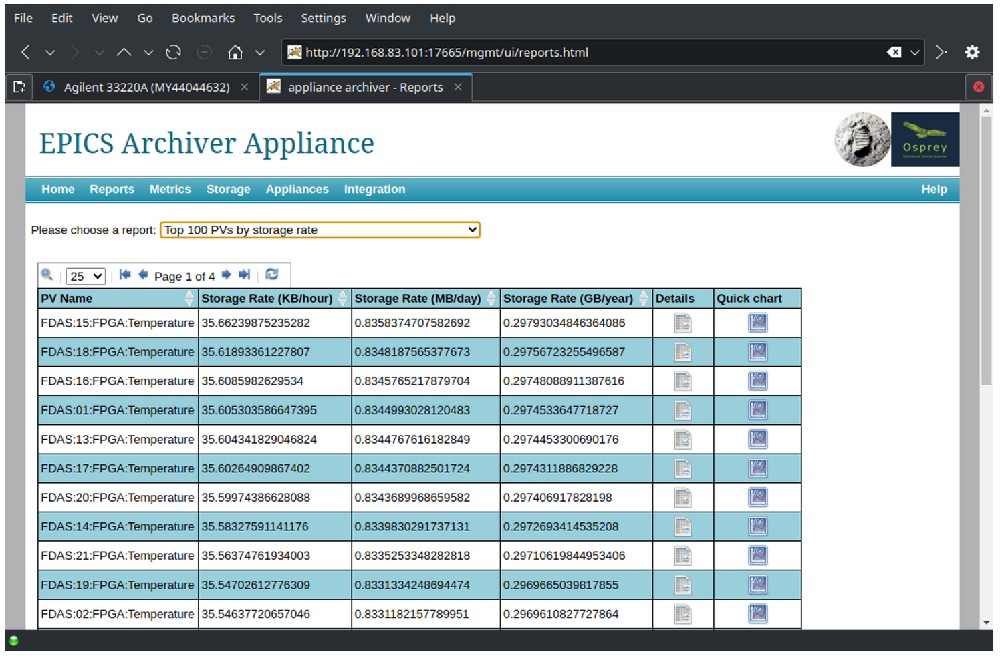
    

    <figcaption>Figure 8 - EPICS Archive Appliance Screenshot - Main</figcaption>
</figure>

#### 4.3.7 - Alarm Management Functionality

From: https://github.com/ControlSystemStudio/phoebus/blob/master/services/alarm-server/README.md

>An alarm server for the epics control system which monitors and processes the states of hundreds or thousands of pv's and produces well described, manageable, and actionable alarms for users.
>
>It was developed based on experience with the original EPICS alarm systems like ALH and BEAST combined with ideas from the book Alarm Management: Seven Effective Methods for Optimum Performance by B. Hollifield and E. Habibi, published by ISA in 2007.

#### 4.3.8 - Channel Management - EPICS ChannelFinder – Enhanced Directory Service

From: https://channelfinder.readthedocs.io/en/latest/

>ChannelFinder is a simple directory services which allows for searching for channels names and associated meta-data. Designed for use as part of an EPICS distributed control system.

The ChannelFinder directory service is installed on the MISC server to provide a listing of all Process Variable (PV) names published by IOCs in the system.

The Directory Service is configured to automatically populate the noSQL database with all Process Variables (PVs). The Directory Service is integrated into other configuration tools to search by property or tag or autocomplete PV names. This tool provides all PVs names that can be selected in configuration or run time applications. The Directory Service provides one key function that we found in all large EPICS applications built on pvAccess or Channel Access: the ability to map the millions of Process Variable (PV) names to devices or geography or function. The Directory Service allows users to put properties and tags on PVs and then access the list of PVs by their properties. This allows different views of the PV name space. Instrument engineers can request all of a single class of instrument for instance. Physicists can access their PVs by their function along the plasma transport. DAQ engineers can include the placement of the instrument on a test vehicle.

An screenshot of the ChannelFinder service on the MISC is provided in Figure 9 below.

<figure style="text-align: center;">
    

        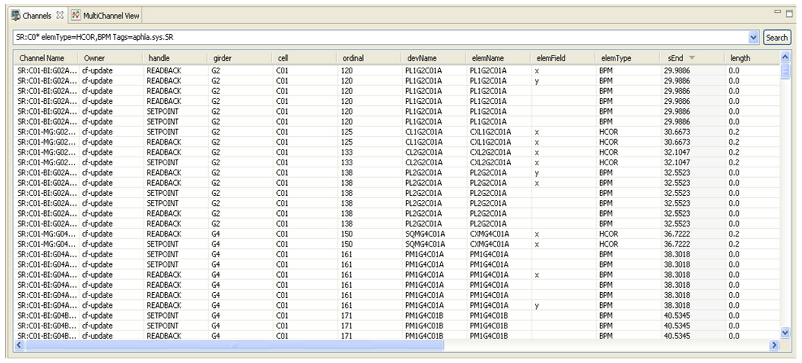
    

    <figcaption>Figure 9 - SEC-FDAS EPICS-Module ChannelFinder</figcaption>
</figure>

#### 4.3.9 - System Save and Restore Functionality

From: https://github.com/ControlSystemStudio/phoebus/blob/master/services/save-and-restore/README.md

>The save-and-restore service implements the MASAR (MAchine Save And Restore) service as a collection of REST endpoints. These can be used by clients to manage save sets (aka configurations) and snapshots, to compare snapshots and to restore settings from snapshots.
>
>The service depends on the app-save-and-restore-model module.
>
>"Data is persisted by a relational database engine. The service has been verified on Postgresql and Mysql.

#### 4.3.10 - Electronic Logbook - EPICS Olog Service and Client

From: https://control-system-studio.readthedocs.io/en/latest/app/logbook/olog/ui/doc/index.html

>Olog is an electronic logbook client for the logbook service maintained here: https://github.com/Olog/olog-es._
>
>Features:
>
>*   Arbitrary number of “logbooks”, configured in the service. A logbook entry is contained in one or several logbooks.
>*   Arbitrary number of “tags”, configured in the service. A logbook entry may be associated with zero or several tags.
>*   Arbitrary number of “properties”, configured on the service. A property is a named list of key/value pairs. The user may define values for the items in a property. A logbook entry is associated with zero or several properties.
>*   Arbitrary number of attachments, i.e. images or other file types.
>*   Markup as defined by the Commonmark specification https://commonmark.org.
>*   Log entry editor invocation from context menu whereby context specific attachments or data are automatically appended to the log entry.
>*   Log entry viewers offer search capabilities based on meta data and content."

The electronic logbook delivered with the SEC-FDAS system is the Phoebus Application OLog.
<figure style="text-align: center;">
    

        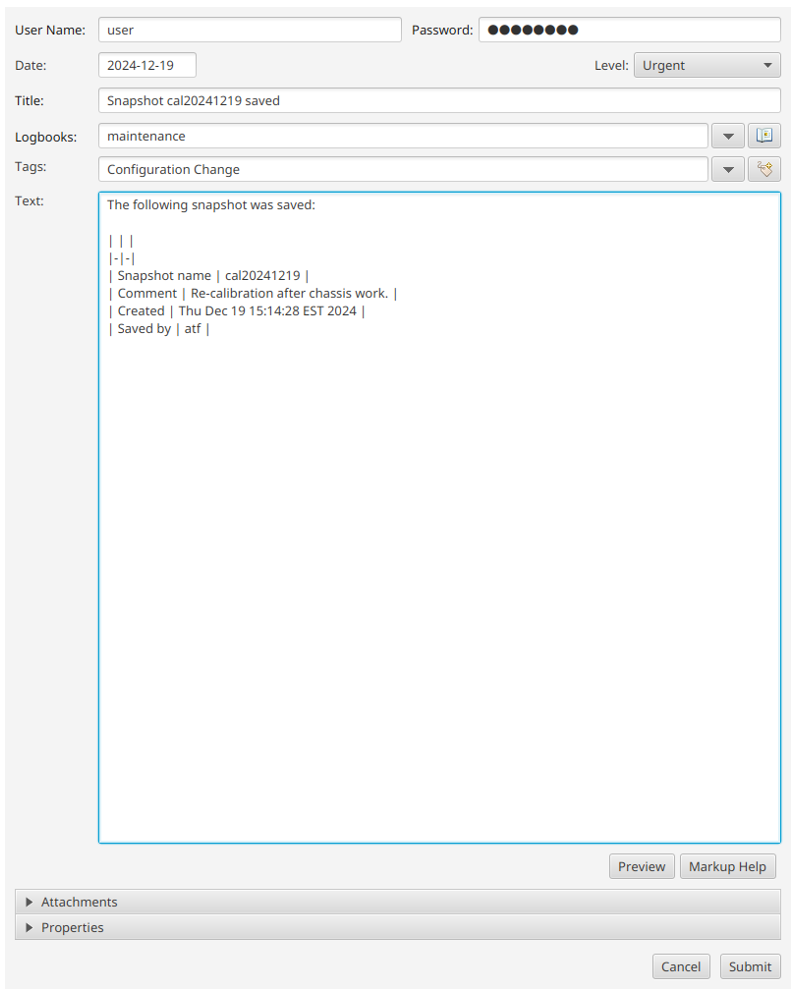
    

    <figcaption>Figure 10 - EPICS Electronic Operators Log (OLog) - Log Entry</figcaption>
</figure>

<figure style="text-align: center;">
    

        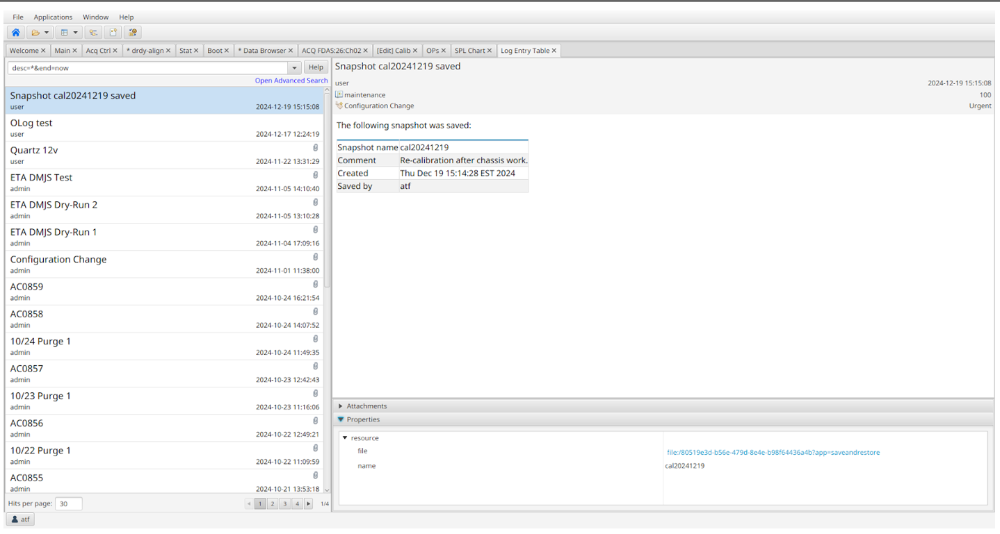
    

    <figcaption>Figure 11 - EPICS Electronic Operators Log (OLog) - Log Search / Log List</figcaption>
</figure>

#### 4.3.11 - HMI/Operator Interface

From: https://github.com/ControlSystemStudio/phoebus/blob/master/README.md
>Phoebus is a framework and a collections of tools to monitor and operate large scale control systems, such as the ones in the accelerator community. Phoebus is an update of the Control System Studio toolset that removes dependencies on Eclipse RCP and SWT.Control System Studio Phoebus edition

#### 4.3.12 - IOC AutoSave Service

From: https://epics-modules.github.io/autosave/autoSaveRestore.html#overview
>Autosave automatically saves the values of EPICS process variables (PVs) to files on a server, and restores those values when the IOC (Input-Output Controller — the business end of EPICS) is rebooted.

#### 4.3.13 - IOC RecSync Service

From: https://github.com/ChannelFinder/recsync/blob/master/README.md
>The record synchronizer project includes two parts. A client (RecCaster) which running as part of an EPICS IOC, and a server (RecCeiver) which is a stand alone daemon. Together they work to ensure the the server(s) have a complete list of all records currently provided by the client IOCs.

### 4.4 - Non-EPICS Software

#### 4.4.1 - Operating System - Linux

From Wikipedia, https://en.wikipedia.org/wiki/Linux

>Linux (/ˈlɪnʊks/, LIN-uuks) is a family of open-source Unix-like operating systems based on the Linux kernel, an operating system kernel first released on September 17, 1991, by Linus Torvalds. Linux is typically packaged as a Linux distribution (distro), which includes the kernel and supporting system software and libraries—most of which are provided by third parties—to create a complete operating system, designed as a clone of Unix and released under the copyleft GPL license.

Linux is used as the operating system for the following hardware components:

*   Workstation 1, specifically DISWS1
*   Workstation 2, specifically DISWS2
*   Support Services System, specifically MISCS
*   DAQ Server, specifically DAQS

#### 4.4.2 - Web Browser - Moziilla Firefox

From Wikipedia, https://en.wikipedia.org/wiki/Firefox

>Mozilla Firefox is a free and open source web browser developed by the Mozilla Foundation and its subsidiary, the Mozilla Corporation. It uses the Gecko rendering engine to display web pages, which implements current and anticipated web standards. Firefox is available for Windows 10 and later versions of Windows, macOS, and Linux. Its unofficial ports are available for various Unix and Unix-like operating systems, including FreeBSD, OpenBSD, NetBSD, and other operating systems, such as reactOS. Firefox is also available for Android and iOS. However, as with all other iOS web browsers, the iOS version uses the WebKit layout engine instead of Gecko due to platform requirements. An optimized version is also available on the Amazon Fire TV as one of the two main browsers available with Amazon's Silk Browser.

Firefox is used on the Workstation PCs as the browser interface for the following services:

*   The EPICS Electronic Logbook Service
*   The EPICS Archive Appliance
*   The data export procedure: [D.4.8 - Export Data from the System](D-4-08_PROC_-_Export_Data_from_the_System.md)

#### 4.4.3 - Web Server - Nginx

From Wikipedia, https://en.wikipedia.org/wiki/Nginx

>Nginx (pronounced "engine x" /ˌɛndʒɪnˈɛks/ EN-jin-EKS, stylized as NGINX or nginx) is a web server that can also be used as a reverse proxy, load balancer, mail proxy and HTTP cache. The software was created by Russian developer Igor Sysoev and publicly released in 2004. Nginx is free and open-source software, released under the terms of the 2-clause BSD license. A large fraction of web servers use Nginx, often as a load balancer.

Nginx is used as the web-service on the Support Services Systems (MISC) PC for the data export procedure.

Ref: [D.4.8 - Export Data from the System](D-4-08_PROC_-_Export_Data_from_the_System.md)

#### 4.4.4 - Search Engine Service - Elasticsearch

From Wikipedia, https://en.wikipedia.org/wiki/Elasticsearch

>Elasticsearch is a search engine based on Apache Lucene. It provides a distributed, multitenant-capable full-text search engine with an HTTP web interface and schema-free JSON documents. Official clients are available in Java, .NET (C#), PHP, Python, Ruby and many other languages. According to the DB-Engines ranking, Elasticsearch is the most popular enterprise search engine.

Elasticsearch is required for the following higher-level EPICS software services:

*   Alarm Service
*   Channel Finder
*   Save & Restore
*   Electronic Logbook

#### 4.4.5 - Java Developers Kit - OpenJDK

From Wikipedia, https://en.wikipedia.org/wiki/OpenJDK

>OpenJDK (Open Java Development Kit) is a free and open-source implementation of the Java Platform, Standard Edition (Java SE). It is the result of an effort Sun Microsystems began in 2006, four years before the company was acquired by Oracle Corporation. The implementation is licensed under the GNU General Public License 2 with a linking exception, preventing components that linked to the Java Class Library becoming subject to the terms of the GPL license. OpenJDK is the official reference implementation of Java SE since version 7, and is the most popular distribution of the JDK.

Java is required for the following other software components:

*   Elasticsearch

### 4.5 - User Interface

#### 4.5.1 - HMI Framework - Control System Studio (CSS), Phoebus Edition

From https://www.controlsystemstudio.org/

>Control System Studio is a collection of tools and applications to monitor and operate large scale control systems, such as the ones in the accelerator community.
>
>Phoebus is a pure java/javafx based implementation which uses java feature like SPI and modules to provide the same extensible and modular architecture. This is the current implementation of CS-Studio. The original implementation of CS-Studio is based on the eclipse RCP framework which provided an extensible and pluggable architecture.
>
>The Phoebus and CS-Studio products are developed and maintained by a collaboration between many laboratories and universities.

Features:

*   Easily integrates with your control system
*   Quality User Interfaces
*   The powerful databrowser

The SEC-FDAS uses the Phoebus edition of CSS for all HMI functions in the system.

#### 4.5.2 - Essential SEC-FDAS Operator Screens

##### 4.5.2.1 - SEC-FDAS Main Menu Screen

Operators begin navigating this system from the ATF Quartz Main screen.

<figure style="text-align: center;">
    

        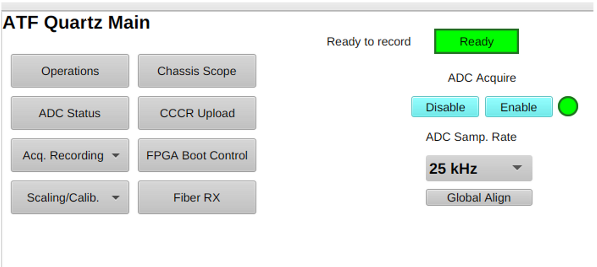
    

    <figcaption>Figure 12 - SEC-FDAS Screen - Main</figcaption>
</figure>

##### 4.5.2.2 - SEC-FDAS CCCR Screen

Operators can configure the entire system in a single step by uploading an appropriately constructed CSV file that contains data for all the settings of all the channels in a single configuration file.

As shown in Figure 12 below, the "CCCR Upload" screen provides the operator interface for uploading a CSV file to configure all 1,024 channels in mass.

<figure style="text-align: center;">
    

        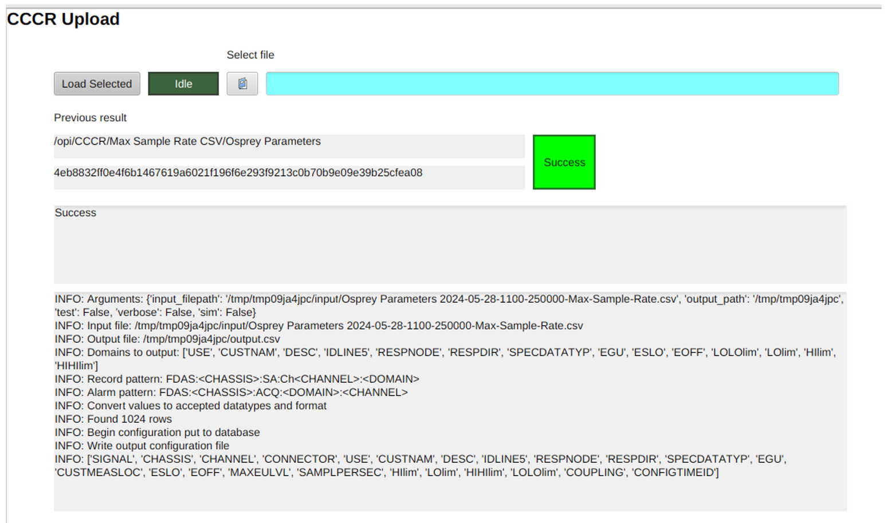
    

    <figcaption>Figure 13 - SEC-FDAS-SW-EPICS-Screen - CCCR</figcaption>
</figure>

_Note - CCCR stands for "Customer Configuration Control Request"_

##### 4.5.1 - SEC-FDAS System Status Screen

The ADC Status screen provides a quick summary of all 32x chassis.

<figure style="text-align: center;">
    

        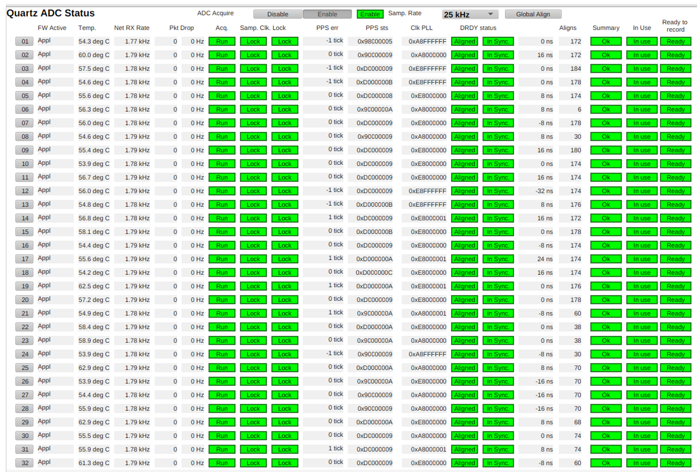
    

    <figcaption>Figure 14 - SEC-FDAS-SW-EPICS-Screen - Quartz ADC Chassis</figcaption>
</figure>

##### 4.5.1 - SEC-FDAS Specific Chassis Status Screen

The Chassis Scope screen allows viewing of any channel. This screen (and any other) may be opened multiple times for multiple channels.

<figure style="text-align: center;">
    

        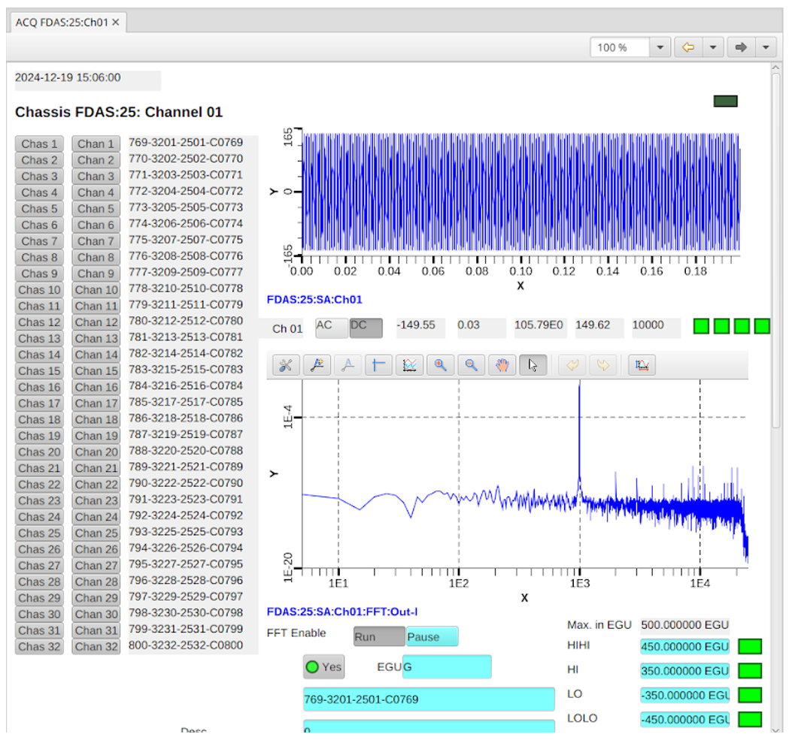
    

    <figcaption>Figure 15 - SEC-FDAS-SW-EPICS-Screen - Quartz ADC Chassis</figcaption>
</figure>

## **5 - System Design Hazards Analysis**

### 5.1 - Hazards to Personnel

The design of the system contains no hazards to personnel that needed to be mitigated or that operators must be aware of.

### 5.2 - Hazards to Equipment

The design of the system contains no hazards to equipment that needed to be mitigated or that operators must be aware of.

## **6 - Safety Critical Usage**

### 6.1 - Applications involving personnel safety

The system has not been designed to mitigate hazards to personnel safety and should not be used to do so.

### 6.2 - Applications involving facility/equipment safety

The system has not been designed to mitigate hazards to real property and capital equipment and should not be used to do so.

## 7 - System Security

The system has been designed with the understanding that it will be installed and used in a physically secure, air-gapped environment.

*   **No MFA** - Each device that has a configurable login capability has been configured with a single username and password login credential for a common system administrator as the operator. The system does not employ any form of Multifactor Authentication (MFA).
*   **No IPV6** - Devices that can be programmed with IP addresses use the IPV4 protocol.
*   **No DAR** - Disk drives do not employ any type of Data-At-Rest technology.
*   **No DIT** - Only the NGNX service on the Support Service (Misc) Server has been configured with a secure certificate to communicate via SSL to a user provided export system. This certificate is only a self-signed certificate. All other data transport is done without encryption. The rest of the systems does not use any Data-In-Transit (DIT) security.
*   **Use of VPNs** - The managed network switches have been configured to use VPNs to ensure communications between devices occur on private networks. While these communicates paths are provided for reliability purposes, it is also expected that they remain entirely with the protection of the physically controlled space provided by the facility.

_Note - Multi-factor Authentication (MFA), Data-at-Rest (DAR), and Data-In-Transit (DIT) are possible but would require additional software configuration work by qualified support personnel._

## **8 - Functional Checkout**

The overall system should be fully checked-out and verified prior to use.

The overall readiness of the system can be established using the Functional System Checkout procedure. Ref: [D.4.1 - Functional Checkout](D-4-01_PROC_-_Functional_Checkout.md).

## **9 - Software Assurance**

Software assurance of the delivered system is achieved through the development and execution of a comprehensive "Requirements Traceability Matrix" document that has been included in the system documentation as system document D.5.1.

**Development of the Requirements Traceability Matrix:**

Each functional requirement of the system [1] has been included in the Requirements Traceability Matrix (D.5.1). For each functional requirement, one or more of four verification methodologies have been selected and verification artifacts have been developed and/or identified as needed for each verification of each requirement. There are four types of verification methods. They are:

1. **Verification by Inspection** - The acquirer performs an inspection of the on-site as-delivered equipment or items to assure that the requirement is met, photos shall be provided for any items that can not be inspected after delivery and installation at the acquirer's site. If the inspection can be performed after installation, no artifact is required.
2. **Verification by Analysis** - the designer has developed an analysis that shows how the requirement is calculated to be met through two or more related facts and/or features of the system. D.5.1 will include a link to the analysis artifact.
3. **Verification by Demonstration** - The provider provides a demonstration at the acquirer's installation site with the acquirer as witness, acquirer signature is all that is required to indicate a successful test, additional artifacts required.
4. **Verification by Test** - a test is performed at the acquirer's installation site with the acquirer as witness, the successful as-run procedure(s) functions as the required Test artifact, the acquirer provides a signature on the as-run procedure indicating that the test was performed successfully without deviation or waiver,

In all cases, the acquirer's sign-off of each requirement on an as-run copy of the D.5.1 document is sufficient for verification assurance.

**Execution of the Requirements Traceability Matrix:**

With on-site support from the provider as needed, the acquirer of the system is expected to lead the execution of a printed copy of the Requirements Traceability Matrix (D.5.1).

**Post-Verification Software Assurance**

By adhering to the NASA GRC-ATF Common DAC Architecture Specification v1.1 [1] and the NASA GRC-ATF Common DAC Documentation Requirements v1.1 [2] and after successful completion of the Requirements Traceability Matrix, the system is fully qualified for official use and it becomes the acquirer's responsibility to operate and maintain the system with a Software Assurance program of its own design.

## **10 - Instrument Calibration**

### 10.1 - Digitizer Calibration

Each of the 32 ADC channels in each of the Osprey-DCS Quartz digitizer chassis must be calibrated before use.

The Osprey-DCS Quartz digitizer chassis can be calibrated per the Calibration Procedure. Ref: [D.4.11 - Measurement Device Calibration](D-4-02_PROC_-_Measurement_Device_Calibration.md)

Refer to section [4.2.3.2](#4232---quartz-calibration-module) for information about the design of the calibration software module.

## **11 - Troubleshooting**

Given the highly modular nature of the design, all issues that may arise during the life of the system will fall into one of the following 3 categories:

1. Hardware issues
2. Software issues
3. Configuration issues

Given the completely open-source nature of the design, the operator is referred to the documentation provided by the maintainer of each component.

To troubleshoot hardware issues, consult the manufacturer of the hardware in question.

To troubleshoot software issues, consult the developer of the software components in question.

The system configuration is expected to be properly managed by the end-user using a System Configuration Management Plan for the system that is developed separately by the end-user.

However, once individual hardware and software issues have been ruled out, the issue must be related to the configuration of the hardware and software. The salient details of the configuration of each element of hardware and software has been documented in **D.3.7 - Detailed Configuration** of the documentation for this system. In some cases, the resolution to common issues has been documented in the procedures for the system.

If after verifying the integrity of the individual hardware and software components and verifying that the configuration conforms to the system configuration documentation in **D.3.7 - Detailed Configuration**, issues still persist; then it is recommended to seek support from qualified 3rd parties. See the Help and Support section below.

## **12 - Recommended Maintenance**

### 12.1 - Hardware Maintenance

Given the highly modular nature of the overall system design, it is appropriate to refer to the manufacturers documentation for maintenance of the individual hardware components. From a global hardware perspective, the following high-level recommendations are provided:

<table style="width: 100%; border-collapse: collapse;" border="1">
    <caption style="caption-side: bottom; text-align: center;">
        Table 6 - Hardware maintenance recommendations
    </caption>
    <thead>
        <tr>
            <th><b>Do</b></th>
            <th><b>Don't</b></th>
        </tr>
    </thead>
    <tbody>
        <tr>
            <td>Monitor and maintain the required operating environment of the installation locations.</td>
            <td>Do not allow the system to operate when the installation locations do not conform to the required environment properties.</td>
        </tr>
        <tr>
            <td>Power the system down during extended periods of non-use.</td>
            <td>Do not allow any of the system PCs to exceed 90% of full disk capacity on any drives.</td>
        </tr>
        <tr>
            <td>Perform the calibration procedure for each channel of each chassis after 6 weeks have passed since the last calibration.</td>
            <td>...</td>
        </tr>
        <tr>
            <td>Keep the hardware clean and free of dust and dirt.</td>
            <td></td>
        </tr>
        <tr>
            <td>Always use an Electrostatic Discharge Strap when handling the hardware.</td>
            <td></td>
        </tr>
        <tr>
            <td>Keep the hardware clean and free of dust and dirt.</td>
            <td></td>
        </tr>
        <tr>
            <td>Always use an Electrostatic Discharge Strap when handling the hardware.</td>
            <td></td>
    </tbody>
</table>

### 12.2 - Software Maintenance

Software Do's and Don't
<table style="width: 100%; border-collapse: collapse;" border="1">
    <caption style="caption-side: bottom; text-align: center;">
        Table 7 - Software Maintenance Recommendations
    </caption>
    <thead>
        <tr>
            <th>Do</th>
            <th>Don't</th>
        </tr>
    </thead>
    <tbody>
        <tr>
            <td>Monitor the remaining available space of the system PCs and delete unnecessary data.</td>
            <td></td>
        </tr>
        <tr>
            <td>Monitor the data archiving rate of the Archive Appliance and determine a reasonable frequency to purge/delete unneeded historical data.</td>
            <td></td>
        </tr>
        <tr>
            <td>Perform the calibration procedure for each channel of each chassis after 6 weeks have passed since the last calibration.</td>
            <td></td>
        </tr>
        <tr>
            <td>Be sure to create backups of the system before upgrading any software components.</td>
            <td></td>
        </tr>
        <tr>
            <td>
                Given the highly modular nature of this design, be sure to include time to fully pre-verify the compatibility of any software components that get updated to ensure that the new versions remain compatible with the other software components in the system they interact with.
                <ul>
                    <li>For example, before upgrading the Electronic Logbook, verify that the upgraded version is compatible with the version of Elasticsearch.</li>
                    <li>Before upgrading Elasticsearch, ensure that all components depending on it (e.g., Archive Service, Channel Finder, etc.) are compatible with the version being used.</li>
                </ul>
            </td>
            <td></td>
        </tr>
    </tbody>
</table>

## **13 - Known Issues and Limitations**

### 13.1 - 250 kHz operation limited to 256 Channels

While all 1,024 channels are able to be operated simultaneously at sample rates of 50 kHz and below, the operator is reminded that operations at 250 kHz is not guaranteed beyond 256 channels.

In accordance with the requirements, each Osprey-DCS digitizer chassis is capable of operating reliably at a sample rate of 250 kHz, however, the overall system, also in accordance with the requirements, is only rigorously tested to operate reliably at 250 kHz with a maximum of 256 channels active.

It is noted that operation of the system at 250 kHz with more than 256 channels has been demonstrated and appears to work. It is left as forward work to the project to verify the true upper channel limit to reliable operations at 250 kHz.

### 13.2 - Shock and Vibration limitation of the Osprey-DCS v1 Digitizer

The SEC-FDAS used version 1 (v1) of the Osprey-DCS Digitizer Chassis. The v1 chassis were designed to fulfill the requirements of the system with the understanding that the system is a permanently installed facility system. This means that the v1 digitizer units must be handled with care when serviced and kept installed in the racks that they have been commissioned in and should never be exposed to excessive shock and vibration such as would occur if used in a mobile application.

If a mobile configuration of the system is desired, it is recommended to use the Version 2 (v2) Quartz Chassis design. If interested, v1 Quartz Chassis can be upgraded to the more ruggedized v2 chassis design using the same internal electronics. Contact Osprey-DCS for more information on this hardware upgrade option.

### 13.3 - Timing System limited to 2 levels of timing pulse distribution

Careful adherence to the design of the timing signal distribution network is required. Since a single Quartz Chassis is equipped with only 4 timing signal output distribution ports, it is necessary to design the distribution of timing signals such that a quartz chassis does not receive a timing signals that has passed through more than 2 quartz chassis. As each Quartz chassis adds a small delay to the delivery time of the timing signal, having more than 2 chassis in the distribution chain will result in the receiving not being able to "lock-up" with the master timing chassis.

Solutions to this limitation are possible by adding additional dedicated timing hardware.

## **14 - Help and Support**

As all of this system's hardware, software, and documentation is 100% open-source, support for this system or any of its components can be obtained from any company or organization with the requisite hardware, software, and/or system integration competencies.

### 14.1 - Self-help from the EPICS Tech-Talk Archive

The EPICS Community is an active group of users and developers who stay connected using a variety of tools. One of the main tools is the EPICS Tech-Talk mailing-list.

The front-end for the EPICS Tech-Talk archive is online at: https://epics.anl.gov/tech-talk/

Tech-talk is used for technical discussions, questions and announcements. See below for subscription instructions. They also have other more specialized mailing lists for use by developers of the EPICS core software, users of Qt, and for hardware collaborations. 

### 14.2 - How to search for answers in the EPICS Tech-Talk Archives

The Tech-talk archives are searchable. The archive search index is updated overnight, so today's messages won't appear in any search results.

The main interface for searching the Tech-talk archives are the inputs fields as listed below:

<table style=border-collapse: collapse;" border="1">
    <tbody>
        <tr>
            <td>Match any word:</td>
            <td>_____________</td>
        </tr>
        <tr>
            <td>Search tech-talk for:</td>
            <td>_____________</td>
        </tr>
    </tbody>
</table>

To search the archive, supply a space or comma separated list of words to search for. Only whole words will be matched. Check the box to return a list of messages containing any of the search words, otherwise only messages containing all the words will be returned.

Look for these inputs on the tech-talk main archive page at: https://epics.anl.gov/tech-talk/

### 14.3 - How to ask a new question to EPICS Tech-Talk

If you wish to ask a question to the EPICS community electronically, you need to subscribe to the Tech-Talk Mailing List and then, once subscribed, you can send your question to tech-talk as an email.

To subscribe to the Tech-Talk mailing list, visit the Tech-Talk mailman information page at:

https://mailman.aps.anl.gov/mailman/listinfo/tech-talk

and fill in the subscription form there.

You can also subscribe via email. To subscribe via email: **send a message to [tech-talk-request@aps.anl.gov](mailto://tech-talk-request@aps.anl.gov)** that contains just the word "**help**" in either the subject or message body and Tech-Talk will respond with more detailed instructions.

In general you should subscribe only if you intend to send messages to this list (note that you can subscribe but turn message delivery off if you normally read Tech-talk through the RSS feed). If you aren't subscribed, your message will have to be approved by a list moderator, which will delay its delivery. However it should eventually get through (unless it looks like spam), so a subscription is not essential.

Address messages to [tech-talk@aps.anl.gov](mailto://tech-talk@aps.anl.gov), for example:
<table style=border-collapse: collapse;" border="1">
    <tbody>
        <tr>
            <td>Email To:</td>
            <td>[tech-talk@aps.anl.gov](mailto://tech-talk@aps.anl.gov)</td>
        </tr>
        <tr>
            <td>Email Subject Line:</td>
            <td><i>&lt;please use a relevant subject line&gt;</i></td>
        </tr>
        <tr>
            <td>Email Body Text:</td>
            <td><i>&lt;ask your question&gt;</i></td>
        </tr>
    </tbody>
</table>

Email Body Text:

_<ask your question>_

### 14.4 - Direct Support from companies that provide commercial support of EPICS

The following is a list of well-known commercial EPICS Support companies

*   Osprey-DCS, https://ospreydcs.com/
*   CosyLabs, https://cosylab.com/
*   Observatory Sciences, https://observatorysciences.co.uk/  

These are just a few companies that provide commercial support for EPICS-based Systems. For a larger listing of commercial EPICS Support companies, visit: https://epics-controls.org/epics-users/links/ or ask in the Tech-Talk Mailing List.

As EPICS is open-source software, any company can, if it wishes, choose to provide support for EPICS-based system.
