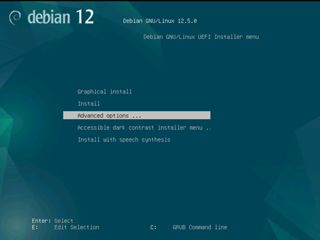
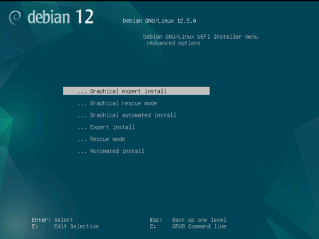
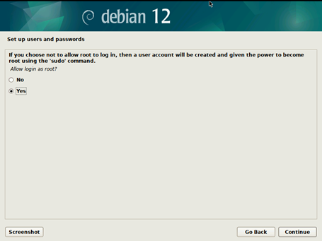
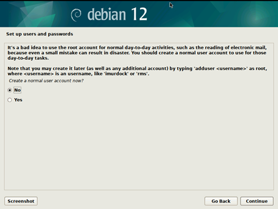
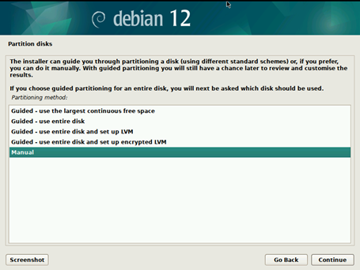
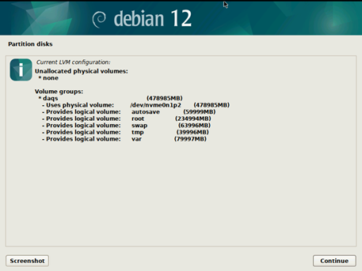
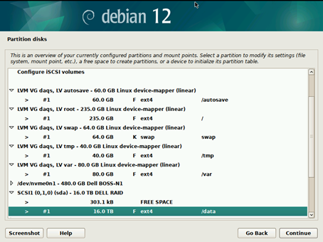
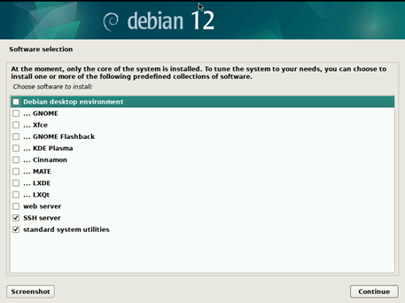
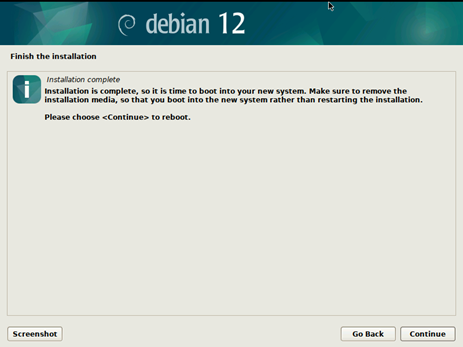

# NASA GRC-ATF FDAS D.3.7 - Detailed System Configuration

## Overview and Conventions

Where possible currently understand Debian Linux and
EPICS collaboration conventions are followed (circa 2024).
System services and IOC instance run as `systemd` units.
Network configuration is managed by `systemd-netword` (DAQS and MISC)
or NetworkManager (DISWS1 and 2).
The [KDE](https://kde.org/) GUI environment is installed.

## Chapter 1 - OS Installation
### Debian

Refer to the Debian [Installation Guide](https://www.debian.org/releases/stable/installmanual)
and other [Debian project documentation](https://www.debian.org/doc/)
for the OS version being installed.

The following assumes Debian 12.

Begin the installation process by either:

1. Connecting a physical monitor, keyboard, and mouse.
  Then attach a USB drive with the Debian installer.
  See [Preparing Files for USB Memory Stick Booting](https://www.debian.org/releases/stable/amd64/ch04s03.en.html)
  in the Debian Installation Guide.
1. Alternatively, connecting to the
  [Baseboard Management Controller](https://en.wikipedia.org/?title=Baseboard_Management_Controller)
  (Dell [iDRAC](https://www.dell.com/en-us/lp/dt/open-manage-idrac))
  for remote access to the integrated KVM.
  Start the virtual console, mount Debian 12 ISO using the virtual media button, and boot from the virtual cd

Access to the BMC is a convenience, not a necessary.
As delivered, the dedicated BMC network interface is not connected.

In either case, then proceed to:

* Select Advanced Options -> Graphical Expert Install





* Select all default options until the Users and Accounts Screen, configure as follows:



* Set a password for the root account and skip the normal account creation for now:



* In the disk partition options, choose manual:



* Configure the disk LVM as follows (MISC server does not have /autosave):



* Add the following mount points (MISC server does not have /autosave):



* Continue with the default options until the software selection screen is presented:



* Continue with the default options until the installation is concluded:



### DISWS, Kubuntu
* Kubuntu LTS 24.04 default LVM atf/atf
* Firefox —safe-mode -> settings-> general -> disable ‘Use recommended performance settings’ and ‘use hardware acceleration’
* Follow DAQS for EPICS
* ``sudo systemctl mask sleep.target suspend.target hibernate.target hybrid-sleep.target``
* Disable lockscreen, and timeouts
* Disable kde wallet subsystem
* System Settings -> Power Management -> Energy Saving and disable all but button events handlings, change it to shutdown 
* ``apt-get install edid-decode and read-edid`` (optional, KVM troubleshooting)
* ``apt-get install pip``
* ``pip install matplotlib p4p pyserial numpy``
* add /home/atf/.local/bin to bashrc/PATH (to get pip stuff)
* ``sudo apt-get install openjdk-17-jdk``
* download phoebus latest tag, move and add link to /usr/local/epics/phoebus
* copy logos and wallpaper (optional)
* copy phoebus desktop shortcut, comment the “-f resource” argument and fix permissions
* modify /usr/local/epics/phoebus/phoebus.sh -> comment OPT=“-server 4918” line add settings.ini and TOP at the beginning
* ``sudo ln -s /usr/local/epics/phoebus/phoebus.sh /usr/local/bin/phoebus``
* copy settings.ini file (for archiver url/etc)
* change desktop and add user admin for service
* ``apt-get install x2go-server``
* ``apt-get install tcpdump``
* Edit /etc/systemd/network/10-DISXeth0.link (adjust MAC address for DISP2):
```
[Match]
MACAddress=7C:C2:55:4C:84:E6
Type=ether

[Link]
Description=DISPLAY 1 EPICS Interface
MACAddressPolicy=persistent
Name=DIS1eth0
NamePolicy=keep
```
* Edit /etc/systemd/network/10-DISXeth0.network (adjust MAC address and IP for DISP2):
```
[Match]
Name=DIS1eth0
Type=ether

[Network]
Description=DISPLAY 1 EPICS Interface
NTP=192.168.83.102

LinkLocalAddressing=no
LLDP=no
EmitLLDP=no
IPv6AcceptRA=no
IPv6SendRA=no

[Address]
Address=192.168.83.103/24
```
* Change /etc/hosts and include all 83.xxx IPs and hosts
* ``sudo systemctl enable systemd-networkd``
* update initramfs
``sudo update-initramfs -u``
* remove pro ads: sudo rm /etc/apt/apt.conf.d/20apt-esm-hook.conf
* change /etc/default/grub: add “GRUB_RECORDFAIL_TIMEOUT=3” and do update-grub
* Reboot the workstation

## Chapter 2 - Initial Setup and Network Config

### CRMSW

Control RooM network SWitch.

Access the switch management console and issue the following commands.
Substitute `PASSWORDOMITTED` for values in `D.3.8`.

```
enable
config t
hostname CRMSW
jitc enable
no web-management http
enable password-min-length 16
enable user password-masking
enable user disable-on-login-failure 3 login-recovery-time in-mins 5
console timeout 10
ip ssh timeout 60
ip ssh idle-time 10
no telnet server
jumbo
!
no spanning-tree
no cdp run
no fdp run
no lldp run
!
logging facility local5
logging buffered 500
!
crypto key generate rsa modulus 2048

clock summer-time
clock timezone US eastern
exit
clock set
!
config t
banner exec ^
****************************        WARNING!      ****************************
* You are accessing a U.S. Government (USG) Information System (IS) that is  *
* provided for USG-authorized use only.                                      *
* By using this IS (which includes any device attached to this IS), you      *
* consent to the following conditions:                                       *
*                                                                            *
* -The USG routinely intercepts and monitors comunications on this IS for    *
* purposes including, but not limited to, penetration testing, COMSEC        *
* monitoring, network operations and defense, personnel misconduct (PM), law *
* enforcement (LE), and counterintelligence (CI) investigations.             *
*                                                                            *
* -At any time, the USG may inspect and seize data stored on this IS.        *
*                                                                            *
* -Communications using, or data stored on, this IS are not private, are     *
* subject to routine monitoring, interception, and search, and may be        *
* disclosed or used for any USG-authorized purpose.                          *
*                                                                            *
* -This IS includes security measures (e.g., authentication and access       *
* controls) to protect USG interests--not for your personal benefit or       *
* privacy.                                                                   *
*                                                                            *
* -Notwithstanding the above, using this IS does not constitute content to   *
* PM, LE or CI investagative searching or monitoring of the content of       *
* privileged communications, or work product, related to personal            *
* representation or services by attorneys, psychotherapists, or clergy, and  *
* their assistants. Such communications and work product are private and     *
* confidential. See User Agreement for Details.                              *
*                                                                            *
******************************************************************************
^
banner incoming ^
****************************        WARNING!      ****************************
* You are accessing a U.S. Government (USG) Information System (IS) that is  *
* provided for USG-authorized use only.                                      *
* By using this IS (which includes any device attached to this IS), you      *
* consent to the following conditions:                                       *
*                                                                            *
* -The USG routinely intercepts and monitors comunications on this IS for    *
* purposes including, but not limited to, penetration testing, COMSEC        *
* monitoring, network operations and defense, personnel misconduct (PM), law *
* enforcement (LE), and counterintelligence (CI) investigations.             *
*                                                                            *
* -At any time, the USG may inspect and seize data stored on this IS.        *
*                                                                            *
* -Communications using, or data stored on, this IS are not private, are     *
* subject to routine monitoring, interception, and search, and may be        *
* disclosed or used for any USG-authorized purpose.                          *
*                                                                            *
* -This IS includes security measures (e.g., authentication and access       *
* controls) to protect USG interests--not for your personal benefit or       *
* privacy.                                                                   *
*                                                                            *
* -Notwithstanding the above, using this IS does not constitute content to   *
* PM, LE or CI investagative searching or monitoring of the content of       *
* privileged communications, or work product, related to personal            *
* representation or services by attorneys, psychotherapists, or clergy, and  *
* their assistants. Such communications and work product are private and     *
* confidential. See User Agreement for Details.                              *
*                                                                            *
******************************************************************************
^
banner motd ^
****************************        WARNING!      ****************************
* You are accessing a U.S. Government (USG) Information System (IS) that is  *
* provided for USG-authorized use only.                                      *
* By using this IS (which includes any device attached to this IS), you      *
* consent to the following conditions:                                       *
*                                                                            *
* -The USG routinely intercepts and monitors comunications on this IS for    *
* purposes including, but not limited to, penetration testing, COMSEC        *
* monitoring, network operations and defense, personnel misconduct (PM), law *
* enforcement (LE), and counterintelligence (CI) investigations.             *
*                                                                            *
* -At any time, the USG may inspect and seize data stored on this IS.        *
*                                                                            *
* -Communications using, or data stored on, this IS are not private, are     *
* subject to routine monitoring, interception, and search, and may be        *
* disclosed or used for any USG-authorized purpose.                          *
*                                                                            *
* -This IS includes security measures (e.g., authentication and access       *
* controls) to protect USG interests--not for your personal benefit or       *
* privacy.                                                                   *
*                                                                            *
* -Notwithstanding the above, using this IS does not constitute content to   *
* PM, LE or CI investagative searching or monitoring of the content of       *
* privileged communications, or work product, related to personal            *
* representation or services by attorneys, psychotherapists, or clergy, and  *
* their assistants. Such communications and work product are private and     *
* confidential. See User Agreement for Details.                              *
*                                                                            *
******************************************************************************
^
!
default-vlan-id 900
!
vlan 79 name Acquisition by port
 tagged ethe 1/3/4
 untagged ethe 1/1/19 to 1/1/21
!
vlan 83 name EPICS by port
 tagged ethe 1/3/4
 untagged ethe 1/1/1 to 1/1/3 ethe 1/1/22 to 1/1/24
 management-vlan
!
vlan 999 name DISABLED_VLAN by port
 untagged ethe 1/1/4 to 1/1/18 ethe 1/2/1 to 1/2/2 ethe 1/3/1 to 1/3/3
!
interface ethe 1/1/1
 port-name LINK_to_MISC_Server_Port_MISCeth0
!
interface ethe 1/1/2
 port-name LINK_to_DIS1_Workstation_Port_DIS1eth0
!
interface ethe 1/1/3
 port-name LINK_to_DIS2_Workstation_Port_DIS2eth0
!
interface ethe 1/1/4 to 1/1/18
 port-name DISABLED-1G-Copper-Port
disable
!
interface ethe 1/1/19 to 1/1/21
 port-name testing_VLAN_79_disable_when_complete
!
interface ethe 1/1/22 to 1/1/24
 port-name testing_VLAN_83_disable_when_complete
!
interface ethe 1/2/1 to 1/2/2
 port-name DISABLED-40G-Stacking-Port
disable
!
interface ethe 1/3/1 to 1/3/3
 port-name DISABLED-10G-SFP-Port
disable
!
interface ethe 1/3/4
 port-name LINK_to_DAQSW_ethernet_1/3/4
!
exit
!
ip address 192.168.83.201 255.255.255.0
!
username na.grcadmin privilege 0 password
PASSWORDOMITTED
!
enable super-user-password
PASSWORDOMITTED
!
enable aaa console
aaa authentication enable default local
aaa authentication login default local
aaa authentication login privilege-mode
aaa authentication web-server default local
aaa authentication snmp-server default local
web-management https
!
ntp
disable serve
server 192.168.83.102
!
exit
crypto-ssl certificate generate

snmp server
!
wr mem
!
reload

show tech-support
```

Capture output of `show tech-support` to file and archive.

### DAQSW

Data AcQusition room network SWitch.

Access the switch management console and issue the following commands.
Substitute `PASSWORDOMITTED` for values in `D.3.8`.

```
enable
config t

hostname DAQSW
jitc enable
no web-management http
enable password-min-length 16
enable user password-masking
enable user disable-on-login-failure 3 login-recovery-time in-mins 5
console timeout 10
ip ssh timeout 60
ip ssh idle-time 10
no telnet server
jumbo
!
no spanning-tree
no cdp run
no fdp run
no lldp run
!
logging facility local5
logging buffered 500
!
crypto key generate rsa modulus 2048

clock summer-time
clock timezone US eastern
exit
clock set
!
config t
banner exec ^
****************************        WARNING!      ****************************
* You are accessing a U.S. Government (USG) Information System (IS) that is  *
* provided for USG-authorized use only.                                      *
* By using this IS (which includes any device attached to this IS), you      *
* consent to the following conditions:                                       *
*                                                                            *
* -The USG routinely intercepts and monitors comunications on this IS for    *
* purposes including, but not limited to, penetration testing, COMSEC        *
* monitoring, network operations and defense, personnel misconduct (PM), law *
* enforcement (LE), and counterintelligence (CI) investigations.             *
*                                                                            *
* -At any time, the USG may inspect and seize data stored on this IS.        *
*                                                                            *
* -Communications using, or data stored on, this IS are not private, are     *
* subject to routine monitoring, interception, and search, and may be        *
* disclosed or used for any USG-authorized purpose.                          *
*                                                                            *
* -This IS includes security measures (e.g., authentication and access       *
* controls) to protect USG interests--not for your personal benefit or       *
* privacy.                                                                   *
*                                                                            *
* -Notwithstanding the above, using this IS does not constitute content to   *
* PM, LE or CI investagative searching or monitoring of the content of       *
* privileged communications, or work product, related to personal            *
* representation or services by attorneys, psychotherapists, or clergy, and  *
* their assistants. Such communications and work product are private and     *
* confidential. See User Agreement for Details.                              *
*                                                                            *
******************************************************************************
^
banner incoming ^
****************************        WARNING!      ****************************
* You are accessing a U.S. Government (USG) Information System (IS) that is  *
* provided for USG-authorized use only.                                      *
* By using this IS (which includes any device attached to this IS), you      *
* consent to the following conditions:                                       *
*                                                                            *
* -The USG routinely intercepts and monitors comunications on this IS for    *
* purposes including, but not limited to, penetration testing, COMSEC        *
* monitoring, network operations and defense, personnel misconduct (PM), law *
* enforcement (LE), and counterintelligence (CI) investigations.             *
*                                                                            *
* -At any time, the USG may inspect and seize data stored on this IS.        *
*                                                                            *
* -Communications using, or data stored on, this IS are not private, are     *
* subject to routine monitoring, interception, and search, and may be        *
* disclosed or used for any USG-authorized purpose.                          *
*                                                                            *
* -This IS includes security measures (e.g., authentication and access       *
* controls) to protect USG interests--not for your personal benefit or       *
* privacy.                                                                   *
*                                                                            *
* -Notwithstanding the above, using this IS does not constitute content to   *
* PM, LE or CI investagative searching or monitoring of the content of       *
* privileged communications, or work product, related to personal            *
* representation or services by attorneys, psychotherapists, or clergy, and  *
* their assistants. Such communications and work product are private and     *
* confidential. See User Agreement for Details.                              *
*                                                                            *
******************************************************************************
^
banner motd ^
****************************        WARNING!      ****************************
* You are accessing a U.S. Government (USG) Information System (IS) that is  *
* provided for USG-authorized use only.                                      *
* By using this IS (which includes any device attached to this IS), you      *
* consent to the following conditions:                                       *
*                                                                            *
* -The USG routinely intercepts and monitors comunications on this IS for    *
* purposes including, but not limited to, penetration testing, COMSEC        *
* monitoring, network operations and defense, personnel misconduct (PM), law *
* enforcement (LE), and counterintelligence (CI) investigations.             *
*                                                                            *
* -At any time, the USG may inspect and seize data stored on this IS.        *
*                                                                            *
* -Communications using, or data stored on, this IS are not private, are     *
* subject to routine monitoring, interception, and search, and may be        *
* disclosed or used for any USG-authorized purpose.                          *
*                                                                            *
* -This IS includes security measures (e.g., authentication and access       *
* controls) to protect USG interests--not for your personal benefit or       *
* privacy.                                                                   *
*                                                                            *
* -Notwithstanding the above, using this IS does not constitute content to   *
* PM, LE or CI investagative searching or monitoring of the content of       *
* privileged communications, or work product, related to personal            *
* representation or services by attorneys, psychotherapists, or clergy, and  *
* their assistants. Such communications and work product are private and     *
* confidential. See User Agreement for Details.                              *
*                                                                            *
******************************************************************************
^
!
default-vlan-id 900
!
vlan 79 name Acquisition by port
 tagged ethe 1/3/1 ethe 1/3/4
 untagged ethe 1/1/1 to 1/1/40 ethe 1/1/43 to 1/1/45
!
vlan 83 name EPICS by port
 tagged ethe 1/3/1 ethe 1/3/4
 untagged ethe 1/1/41 ethe 1/1/46 to 1/1/48
 management-vlan
!
vlan 999 name DISABLED_VLAN by port
 untagged eth 1/1/42 ethe 1/2/1 to 1/2/2 ethe 1/3/2 to 1/3/3
!
interface ethe 1/1/1 to 1/1/32
 port-name LINK_to_DAQ_Chassis
!
interface ethe 1/1/33 to 1/1/40
 port-name RESERVED_for_DAQ_Chassis
disable
!
interface ethe 1/1/41
 port-name LINK_to_NTP_Server_IRIG_Decoder
!
interface ethe 1/1/42
 port-name DISABLED-1G-Copper-Port
disable
!
interface ethe 1/1/43 to 1/1/45
 port-name testing_VLAN_79_disable_when_complete
!
interface ethe 1/1/46 to 1/1/48
 port-name testing_VLAN_83_disable_when_complete
!
interface ethe 1/2/1 to 1/2/2
 port-name DISABLED-40G-Stacking-Port
disable
!
interface ethe 1/3/1
 port-name LINK_to_DAQ_Server_Port_DAQeth0
!
interface ethe 1/3/2 to 1/3/3
 port-name DISABLED-10G-SFP-Port
disable
!
interface ethe 1/3/4
 port-name LINK_to_CRMSW_ethernet_1/3/4
!
exit
!
ip address 192.168.83.200 255.255.255.0
!
username na.grcadmin privilege 0 password
PASSWORDOMITTED
!
enable super-user-password
PASSWORDOMITTED
!
enable aaa console
aaa authentication enable default local
aaa authentication login default local
aaa authentication login privilege-mode
aaa authentication web-server default local
aaa authentication snmp-server default local
web-management https
!
ntp
disable serve
server 192.168.83.102
!
exit
crypto-ssl certificate generate

snmp server
!
wr mem
!
reload

show tech-support
```

Capture output of `show tech-support` to file and archive.


### DAQS
#### Initial Setup
* Login as root
* Change the hostname with the following command:
``hostnamectl set-hostname DAQS``
* Edit the /etc/hosts file and add the following entry:
    * 192.168.83.100 DAQS
* Reboot the server to apply the changes
* Login as root and verify the changes with the following command:
    * hostnamectl
* Edit /etc/apt/sources.list as follows:
```
deb http://deb.debian.org/debian bookworm main non-free-firmware
deb-src http://deb.debian.org/debian bookworm main non-free-firmware

deb http://deb.debian.org/debian-security/ bookworm-security main non-free-firmware
deb-src http://deb.debian.org/debian-security/ bookworm-security main non-free-firmware

deb http://deb.debian.org/debian bookworm-updates main non-free-firmware
deb-src http://deb.debian.org/debian bookworm-updates main non-free-firmware
```

* Connect an ethernet cable to a valid DHCP server with internet access to port eno12409np1 (NIC eth 2) and issue the following commands (alternatively, this can be done from a virtual media mounted with the mirror packages):
    * ```dhclient eno12409np1```
    * ```apt-get update```
    * ```apt-get upgrade```
    * ```apt-get install git vim vlan tcpdump```
    * ```adduser atf```
    * ```usermod -a -G sudo atf```
    * ```apt-get install procserv```
    * ```su atf```

#### Network Configuration

Note that MAC addresses shown below are specific to the delivered computers,
and will differ on any replacement computer.

```sh
sudo apt-get install vlan tcpdump```

cat <<EOF | sudo tee -a /etc/systemd/network/00-Acquisition.netdev
[NetDev]
Name=Acquisition
Kind=vlan

[VLAN]
Id=79
EOF

cat <<EOF | sudo tee -a /etc/systemd/network/00-EPICS.netdev
[NetDev]
Name=EPICS
Kind=vlan

[VLAN]
Id=83
EOF

cat <<EOF | sudo tee -a /etc/systemd/network/10-DAQeth0.link
[Match]
MACAddress=04:32:01:c1:d1:60
Type=ether

[Link]
Description=Trunk interface for DAQ and EPICS vlans
MACAddressPolicy=persistent
Name=DAQeth0
NamePolicy=keep
EOF

cat <<EOF | sudo tee -a /etc/systemd/network/20-DAQeth0.network
[Match]
Name=DAQeth0
Type=ether

[Network]
Description=The untagged interface

VLAN=Acquisition
VLAN=EPICS

LinkLocalAddressing=no
LLDP=no
EmitLLDP=no
IPv6AcceptRA=no
IPv6SendRA=no
EOF

cat <<EOF | sudo tee -a /etc/systemd/network/30-Acquisition.network
[Match]
Name=Acquisition
Type=vlan

[Network]
Description=Acquisition vlan config
LinkLocalAddressing=no
LLDP=no
EmitLLDP=no
IPv6AcceptRA=no
IPv6SendRA=no

[Address]
Address=192.168.79.100/24
EOF

cat <<EOF | sudo tee -a /etc/systemd/network/30-EPICS.network
[Match]
Name=EPICS
Type=vlan

[Network]
Description=EPICS vlan config
NTP=192.168.83.102
LinkLocalAddressing=no
LLDP=no
EmitLLDP=no
IPv6AcceptRA=no
IPv6SendRA=no

[Address]
Address=192.168.83.100/24
EOF

echo 8021q | sudo tee -a /etc/modules

sudo systemctl enable systemd-networkd

sudo update-initramfs -u

sudo reboot
```

### MISCS
#### Initial Setup
* Login as root
* Change the hostname with the following command:
    * hostnamectl set-hostname MISCS
* Edit the /etc/hosts file and add the following entry:
    * 192.168.83.101 MISCS
* Reboot the server to apply the changes
* Login as root and verify the changes with the following command:
    * hostnamectl
* Edit /etc/apt/sources.list as follows:

```
deb http://deb.debian.org/debian bookworm main non-free-firmware
deb-src http://deb.debian.org/debian bookworm main non-free-firmware

deb http://deb.debian.org/debian-security/ bookworm-security main non-free-firmware
deb-src http://deb.debian.org/debian-security/ bookworm-security main non-free-firmware

deb http://deb.debian.org/debian bookworm-updates main non-free-firmware
deb-src http://deb.debian.org/debian bookworm-updates main non-free-firmware
```

* Connect an ethernet cable to a valid DHCP server with internet access to port eno12409np1 (NIC eth 2) and issue the following commands (alternatively, this can be done from a virtual media mounted with the mirror packages) :
* ```dhclient eno12409np1```
* ```apt-get update```
* ```apt-get upgrade```
* ```apt-get install git vim vlan tcpdump```
* ```adduser atf```
* ```usermod -a -G sudo atf```
* ```apt-get install procserv```

#### Network Configuration

Note that MAC addresses shown below are specific to the delivered computers,
and will differ on any replacement computer.

```
sudo apt-get install vlan tcpdump

cat <<EOF | sudo tee -a /etc/systemd/network/10-MISCeth0.link
[Match]
MACAddress=6c:3c:8c:80:c3:3e
Type=ether

[Link]
Description=MISC Server EPICS Interface
MACAddressPolicy=persistent
Name=MISCeth0
NamePolicy=keep
EOF

cat <<EOF | sudo tee -a /etc/systemd/network/20-MISCeth0.network
[Match]
Name=MISCeth0
Type=ether

[Network]
Description=MISC Server EPICS Interface
NTP=192.168.83.102
LinkLocalAddressing=no
LLDP=no
EmitLLDP=no
IPv6AcceptRA=no
IPv6SendRA=no

[Address]
Address=192.168.83.101/24
EOF

echo 8021q | sudo tee -a /etc/modules

sudo systemctl enable systemd-networkd

sudo update-initramfs -u

sudo reboot
```

## Chapter 3 - EPICS base and modules installation
* ```su atf```
* ```cd ~```
* ```git clone https://github.com/osprey-dcs/build-epics.git --branch atf-20240320 --recursive```
* ```cd build-epics```
* ```./prepare.sh```
* ```. eactivate```
* 
    ```
    sudo apt-get install build-essential autoconf automake libreadline-dev libncurses-dev libpcre3-dev libxml2-dev libjpeg-dev libxext-dev re2c libgraphicsmagick++1-dev libaec-dev libhdf5-dev libjpeg-dev libnetcdf-dev libtiff-dev libz3-dev python3-dev python-is-python3 libsnmp-dev python3-numpy python3-nose2 cython3 libfftw3-dev libevent-dev
    ```
* ```chmod -R a+w ../build-epics```
* ```./build-epics.sh -j2```
* ```tar -xvf epics-x86_64-20240304.tar.xz```
* ```sudo mv epics-x86_64-20240304 /usr/local/```
* ```cd /usr/local```
* ```sudo ln -s epics-x86_64-20240304 epics```
* ```cat <<EOF | sudo tee -a /etc/bash.bashrc```
* 
    ```
    export PATH=\$PATH:/usr/local/epics/epics-base/bin/linux-x86_64
    EOF
    ```
## Chapter 4 - EPICS Tools and Services
### MISCS
* Follow the guide available on osprey-dcs github about deploying EPICS services: https://github.com/osprey-dcs/epics-services-deployment

## Chapter 5 - Phoebus Client
* Make sure the host has openjdk-17 installed (sudo apt-get install openjdk-17-jdk)
* Download Phoebus latest tag from https://github.com/ControlSystemStudio/phoebus/tags
* Extract the tar.gz and move the project to /usr/local/epics/
* Create a phoebus symlink to this version
    * ```ln -s /usr/local/epics/phoebus-4.7.3 /usr/local/epics/phoebus```
* Create a settings.ini file in /usr/local/epics/phoebus/ with the following:
```
#Default CA settings
org.phoebus.pv.ca/addr_list=192.168.83.255
org.phoebus.pv.ca/auto_addr_list=false
org.phoebus.pv.ca/dbe_property_supported=true
org.phoebus.pv.ca/variable_length=true

#Archiver
org.csstudio.trends.databrowser3/urls=pbraw\:192.168.83.101:17668/retrieval
org.csstudio.trends.databrowser3/archives=pbraw\:192.168.83.101:17668/retrieval

#Main OPI
org.phoebus.ui/top_resources=/opi/atf-main.bob,Main

#Channel Finder
org.phoebus.channelfinder/serviceURL=http://192.168.83.101:7070/ChannelFinder

#Logbook
org.phoebus.logbook/logbook_factory=olog-es
org.phoebus.olog.es.api/olog_url=http://192.168.83.101:9090/Olog
org.phoebus.logbook.ui/save_credentials=true

#Phoebus Save/Restore
org.phoebus.applications.saveandrestore.client/jmasar.service.url=http://192.168.83.101:6060/save-restore
org.phoebus.ui/save_credentials=true

#Phoebus Alarm
org.phoebus.applications.alarm/server=192.168.83.101:9092
org.phoebus.applications.alarm/config_name=nasa_alarms
org.phoebus.applications.alarm/config_names=nasa_alarms
org.phoebus.applications.alarm.logging.ui/service_uri=http://192.168.83.101:8080
```
* Modify /usr/local/epics/phoebus/phoebus.sh:
    * comment OPT=“-server 4918” line and add OPT="-settings /usr/local/epics/phoebus/settings.ini" below it.

## Chapter 6 - Quartz IOC

See [`atf-acq-ioc` README](https://github.com/osprey-dcs/atf-acq-ioc/blob/main/README.md)
as well as the Quartz [EPICS IOC Setup](https://github.com/osprey-dcs/quartz-daq-250-24/blob/master/documentation/ioc-setup.md)
guide.

Install location on DAQS: `/opt/atf-acq-ioc`

Follow general README, substitute dependencies as built according to Chapter 3.

Install systemd unit file `ioc-adc@.service`, then start and enable instances
`ioc-adc@01` through `ioc-adc@32`.

## Chapter 7 - System Monitoring IOCs

Install location on DAQS and MISC: `/opt/atf-sysmon`

See ATF System Monitor [README](https://github.com/osprey-dcs/atf-sysmon/blob/master/README.md).

Follow general README, substitute dependencies as built according to Chapter 3.

Install systemd unit file `atf-sysmon@.service`, then start and enable instance
`atf-sysmon@daqs.service` and `atf-sysmon@misc.service` on the respective host
(each instance on a seperate host).

## Chapter 8 - Sequencing Engine

Install location on DAQS: `/opt/atf-engine`

See ATF DAQ Sequencing Engine [README](https://github.com/osprey-dcs/atf-engine/blob/master/README.md)

Follow general README, substitute dependencies as built according to Chapter 3.

Install systemd unit file `atf-engine.service`, then start and enable instance.

## Chapter 9 - Elastic Search
See Elastic Search [README](https://github.com/elastic/elasticsearch/blob/main/README.asciidoc)

## Chapter 10 - Quartz Calibration
See [Quartz Calibration Procedure](https://github.com/osprey-dcs/quartz-calib/blob/main/Quartz_Calibration_Procedure.md)

## Chapter 11 - DAQ Data Viewer/Exporter
See ATF Previewer [README](https://github.com/osprey-dcs/atf-previewer/blob/main/README.md)

## Chapter 12 - Quartz User Configuration Loader
See Quartz Config Loader [README](https://github.com/osprey-dcs/quartz-config-loader/blob/main/README.md)

## Chapter 13 - Quartz firmware

Firmware from three locations must be present on each Marble FPGA carrier board
in order to start up and operator the Quartz ADC FMC daughter card.

The MMC (Management Micro-Controller) and bootloader firmware is loaded as part
of the new board
[bring-up](https://github.com/osprey-dcs/quartz-daq-250-24/blob/master/documentation/marble-bring-up-procedure.pdf)
procedure, and will not normally be repeated.
When the physical Marble flash write protection switch (SW1) is engaged,
remote update of these firmwares is not possible.

The application firmware may be updated remotely, through the bootloader firmware,
using the [alluvium](https://github.com/osprey-dcs/alluvium) tool.

Full Application firmware source is [published](https://github.com/osprey-dcs/Quartz-firmware)
as well as pre-built [binaries](https://github.com/osprey-dcs/quartz-daq-250-24/blob/master/firmware).

See also the Quartz [System Setup](https://github.com/osprey-dcs/quartz-daq-250-24/blob/master/documentation/system-setup.md) guide.
