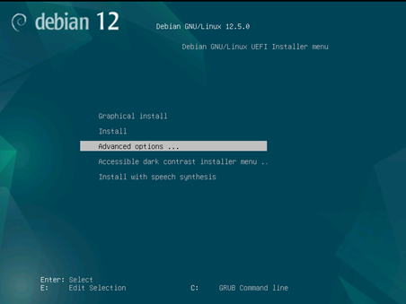
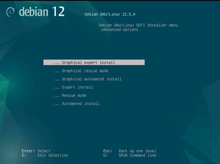
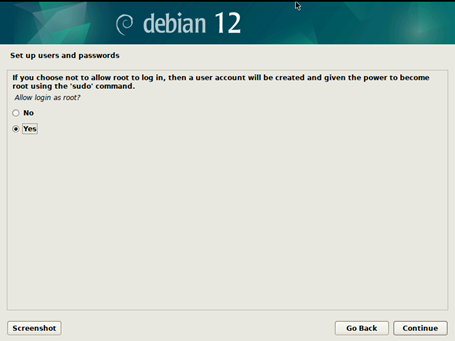
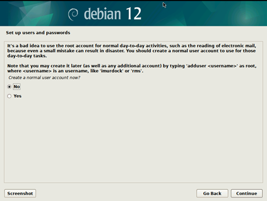
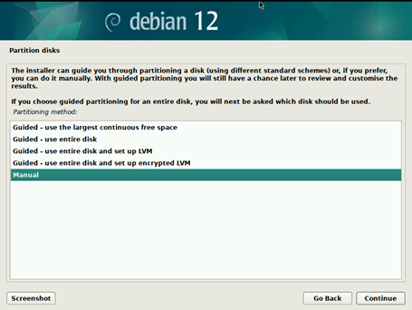
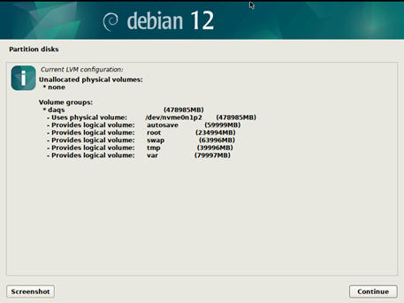
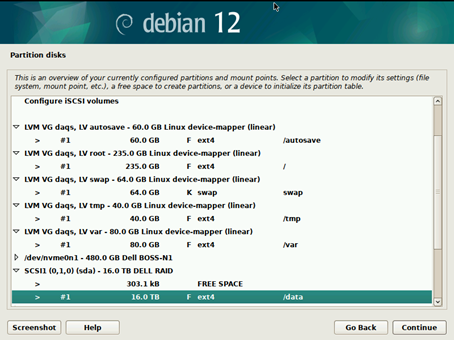
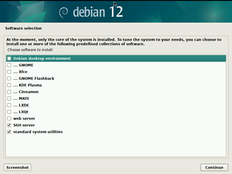
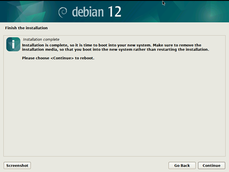

# NASA GRC-ATF FDAS D.3.7 - Detailed System Configuration

## Overview and Conventions

Where possible currently understand Debian Linux and
EPICS collaboration conventions are followed (circa 2025).
System services and IOC instance run as `systemd` units.
Network configuration is managed by `/etc/network/interfaces` for DAQM,
and NetworkManager for DISWS3.
The [KDE](https://kde.org/) GUI environment is installed.

## Chapter 1 - OS Installation
### Debian

Refer to the Debian [Installation Guide](https://www.debian.org/releases/stable/installmanual)
and other [Debian project documentation](https://www.debian.org/doc/)
for the OS version being installed.

The following assumes Debian 12.

Begin the installation process by either:

1. Connecting a physical monitor, keyboard, and mouse.
  Then attach a USB drive with the Debian installer.
  See [Preparing Files for USB Memory Stick Booting](https://www.debian.org/releases/stable/amd64/ch04s03.en.html)
  in the Debian Installation Guide.
1. Alternatively, connecting to the
  [Baseboard Management Controller](https://en.wikipedia.org/?title=Baseboard_Management_Controller)
  (Dell [iDRAC](https://www.dell.com/en-us/lp/dt/open-manage-idrac))
  for remote access to the integrated KVM.
  Start the virtual console, mount Debian 12 ISO using the virtual media button, and boot from the virtual cd

Access to the BMC is a convenience, not a necessary.
As delivered, the dedicated BMC network interface is not connected.

In either case, then proceed to:

* Select Advanced Options -> Graphical Expert Install





* Select all default options until the Users and Accounts Screen, configure as follows:



* Set a password for the root account and skip the normal account creation for now:



* In the disk partition options, choose manual:



* Configure the disk LVM as follows (MISC server does not have /autosave):



* Add the following mount points (MISC server does not have /autosave):



* Continue with the default options until the software selection screen is presented:



* Continue with the default options until the installation is concluded:



## Chapter 2 - Initial Setup and Network Config

### MDASSW

Data AcQusition room network SWitch.

Access the switch management console and issue the following commands.
Substitute `PASSWORDOMITTED` for values in `D.3.8`.

```
enable
config t

hostname MDASSW
jitc enable
no web-management http
enable password-min-length 16
enable user password-masking
enable user disable-on-login-failure 3 login-recovery-time in-mins 5
console timeout 10
ip ssh timeout 60
ip ssh idle-time 10
no telnet server
jumbo
!
no spanning-tree
no cdp run
no fdp run
no lldp run
!
logging facility local5
logging buffered 500
!
crypto key generate rsa modulus 2048

clock summer-time
clock timezone US eastern
exit
clock set
!
config t
banner exec ^
****************************        WARNING!      ****************************
* You are accessing a U.S. Government (USG) Information System (IS) that is  *
* provided for USG-authorized use only.                                      *
* By using this IS (which includes any device attached to this IS), you      *
* consent to the following conditions:                                       *
*                                                                            *
* -The USG routinely intercepts and monitors comunications on this IS for    *
* purposes including, but not limited to, penetration testing, COMSEC        *
* monitoring, network operations and defense, personnel misconduct (PM), law *
* enforcement (LE), and counterintelligence (CI) investigations.             *
*                                                                            *
* -At any time, the USG may inspect and seize data stored on this IS.        *
*                                                                            *
* -Communications using, or data stored on, this IS are not private, are     *
* subject to routine monitoring, interception, and search, and may be        *
* disclosed or used for any USG-authorized purpose.                          *
*                                                                            *
* -This IS includes security measures (e.g., authentication and access       *
* controls) to protect USG interests--not for your personal benefit or       *
* privacy.                                                                   *
*                                                                            *
* -Notwithstanding the above, using this IS does not constitute content to   *
* PM, LE or CI investagative searching or monitoring of the content of       *
* privileged communications, or work product, related to personal            *
* representation or services by attorneys, psychotherapists, or clergy, and  *
* their assistants. Such communications and work product are private and     *
* confidential. See User Agreement for Details.                              *
*                                                                            *
******************************************************************************
^
banner incoming ^
****************************        WARNING!      ****************************
* You are accessing a U.S. Government (USG) Information System (IS) that is  *
* provided for USG-authorized use only.                                      *
* By using this IS (which includes any device attached to this IS), you      *
* consent to the following conditions:                                       *
*                                                                            *
* -The USG routinely intercepts and monitors comunications on this IS for    *
* purposes including, but not limited to, penetration testing, COMSEC        *
* monitoring, network operations and defense, personnel misconduct (PM), law *
* enforcement (LE), and counterintelligence (CI) investigations.             *
*                                                                            *
* -At any time, the USG may inspect and seize data stored on this IS.        *
*                                                                            *
* -Communications using, or data stored on, this IS are not private, are     *
* subject to routine monitoring, interception, and search, and may be        *
* disclosed or used for any USG-authorized purpose.                          *
*                                                                            *
* -This IS includes security measures (e.g., authentication and access       *
* controls) to protect USG interests--not for your personal benefit or       *
* privacy.                                                                   *
*                                                                            *
* -Notwithstanding the above, using this IS does not constitute content to   *
* PM, LE or CI investagative searching or monitoring of the content of       *
* privileged communications, or work product, related to personal            *
* representation or services by attorneys, psychotherapists, or clergy, and  *
* their assistants. Such communications and work product are private and     *
* confidential. See User Agreement for Details.                              *
*                                                                            *
******************************************************************************
^
banner motd ^
****************************        WARNING!      ****************************
* You are accessing a U.S. Government (USG) Information System (IS) that is  *
* provided for USG-authorized use only.                                      *
* By using this IS (which includes any device attached to this IS), you      *
* consent to the following conditions:                                       *
*                                                                            *
* -The USG routinely intercepts and monitors comunications on this IS for    *
* purposes including, but not limited to, penetration testing, COMSEC        *
* monitoring, network operations and defense, personnel misconduct (PM), law *
* enforcement (LE), and counterintelligence (CI) investigations.             *
*                                                                            *
* -At any time, the USG may inspect and seize data stored on this IS.        *
*                                                                            *
* -Communications using, or data stored on, this IS are not private, are     *
* subject to routine monitoring, interception, and search, and may be        *
* disclosed or used for any USG-authorized purpose.                          *
*                                                                            *
* -This IS includes security measures (e.g., authentication and access       *
* controls) to protect USG interests--not for your personal benefit or       *
* privacy.                                                                   *
*                                                                            *
* -Notwithstanding the above, using this IS does not constitute content to   *
* PM, LE or CI investagative searching or monitoring of the content of       *
* privileged communications, or work product, related to personal            *
* representation or services by attorneys, psychotherapists, or clergy, and  *
* their assistants. Such communications and work product are private and     *
* confidential. See User Agreement for Details.                              *
*                                                                            *
******************************************************************************
^
!
default-vlan-id 900
!
vlan 79 name Acquisition by port
 tagged ethe 1/3/1
 untagged ethe 1/1/1 to 1/1/12
!
vlan 83 name EPICS by port
 tagged ethe 1/3/1
 untagged ethe 1/1/13 to 1/1/48
 management-vlan
!
exit
!
ip address 192.168.83.200 255.255.255.0
!
username na.grcadmin privilege 0 password
PASSWORDOMITTED
!
enable super-user-password
PASSWORDOMITTED
!
enable aaa console
aaa authentication enable default local
aaa authentication login default local
aaa authentication login privilege-mode
aaa authentication web-server default local
aaa authentication snmp-server default local
web-management https
!
ntp
disable serve
server 192.168.83.102
!
exit
crypto-ssl certificate generate

snmp server
!
wr mem
!
reload

show tech-support
```

Capture output of `show tech-support` to file and archive.

#### Later access via ssh

```
ssh \
 -o 'KexAlgorithms +diffie-hellman-group14-sha1' \
 -o 'HostKeyAlgorithms +ssh-rsa' \
 na.grcadmin@192.168.83.205
```

### DAQM
#### Initial Setup
* Login as root
* Change the hostname with the following command:
``hostnamectl set-hostname DAQM``
* Edit the /etc/hosts file and add the following entry:
    * 192.168.83.90 DAQM
* Reboot the server to apply the changes
* Login as root and verify the changes with the following command:
    * hostnamectl
* Verify and if necessary edit /etc/apt/sources.list as follows:
```
deb http://deb.debian.org/debian bookworm main non-free-firmware
deb-src http://deb.debian.org/debian bookworm main non-free-firmware

deb http://deb.debian.org/debian-security/ bookworm-security main non-free-firmware
deb-src http://deb.debian.org/debian-security/ bookworm-security main non-free-firmware

deb http://deb.debian.org/debian bookworm-updates main non-free-firmware
deb-src http://deb.debian.org/debian bookworm-updates main non-free-firmware
```

#### Install Additional Debian Packages

Now install the [listed](doc/apt-deb12.txt) Debian packages.

To do so the system must have access to a mirror of the Debian repository of packages.
Either via a temporary internet connection, or from a local mirror.

If a local wired ethernet network with DHCP and internet access is available,
then connect it to the secondary NIC (eno12409np1).
Edit `/etc/network/interfaces` to contain:

```
allow-hotplug eno12409np1
iface eno12409np1 inet dhcp
```

Then run `sudo ifup eno12409np1`.


```sh
cat doc/apt-deb12.txt | xargs sudo apt install
```

#### Network Configuration

Configure the primary NIC (eno12399np0) for two tagged VLANs (79 and 83).
The secondary NIC (eno12409np1) may remain configured as desired so long as no IP address
conflict exists with networks `192.168.79.90/24` or `192.168.83.90/24`.

Edit `/etc/network/interfaces` to contain:

```
auto lo
iface lo inet loopback

# The primary (10G) network interface
allow-hotplug eno12399np0 eno12399np0.79 eno12399np0.83

iface eno12399np0 inet manual
  up ethtool -L eno12399np0 rx 32 tx 2 combined 0 || true
  up ethtool -G eno12399np0 rx 2047 || true

iface eno12399np0.79 inet static
  address 192.168.79.90/24

iface eno12399np0.83 inet static
  address 192.168.83.90/24

# configure eno12409np1 as desired
```

Reboot to apply.

### DISWS3

Installation of the Debian 12 OS should follow the same process as for the DAQM system.

__Also select the `KDE Plasma` Desktop Environment from Software Selection screen__


#### Initial Setup
* Login as root
* Change the hostname with the following command:
    * hostnamectl set-hostname DISWS3
* Edit the /etc/hosts file and add the following entry:
    * 192.168.83.91 DISWS3
* Reboot the server to apply the changes
* Login as root and verify the changes with the following command:
    * hostnamectl
* Verify or edit /etc/apt/sources.list to contain the following:

```
deb http://deb.debian.org/debian bookworm main non-free-firmware
deb-src http://deb.debian.org/debian bookworm main non-free-firmware

deb http://deb.debian.org/debian-security/ bookworm-security main non-free-firmware
deb-src http://deb.debian.org/debian-security/ bookworm-security main non-free-firmware

deb http://deb.debian.org/debian bookworm-updates main non-free-firmware
deb-src http://deb.debian.org/debian bookworm-updates main non-free-firmware
```

#### Install Additional Debian Packages

Now install the [basic](doc/apt-deb12.txt) Debian packages,
as well as the [GUI](doc/apt-deb12-gui.txt) packages.

To do so the system must have access to a mirror of the Debian repository of packages.
Either via a temporary internet connection, or from a local mirror.

If a local wired ethernet network with DHCP and internet access is available,
then connect it to the secondary NIC (eno8403).
Edit `/etc/network/interfaces` to contain:

```
allow-hotplug eno12409np1
iface eno12409np1 inet dhcp
```

Then run `sudo ifup eno12409np1`.


```sh
cat doc/apt-deb12.txt | xargs sudo apt install
cat doc/apt-deb12-gui.txt | xargs sudo apt install
```

Note: to see the effects without executing, replace `sudo` with `echo`.

Also, perform the MongoDB service
[Installation](https://github.com/osprey-dcs/epics-services-deployment/blob/main/README.md#mongodb-70)
process.

#### Network Configuration

Since DISWS3 has a monitor and keyboard attached, network configuration through the
NetworkManager GUI is preferred.

The reported configuration of the primary NIC (eno8303) must be as follows.
The secondary NIC may be configured as desired provided that no IP address
conflict exists with `192.168.83.91/24`.

```
$ nmcli
eno8303: connected to Wired EPICS
        "Broadcom and subsidiaries NetXtreme BCM5720"
        ethernet (tg3), C0:47:0E:EA:78:97, hw, mtu 1500
        inet4 192.168.83.91/24
        route4 192.168.83.0/24 metric 100
        inet6 fe80::fb33:fc58:9e0a:a6d5/64
        route6 fe80::/64 metric 1024
...
```


## Chapter 3 - EPICS base and modules installation

```sh
su atf # discard privilege
cd ~
git clone https://github.com/osprey-dcs/build-epics.git --branch atf-20250716 --recursive
cd build-epics
./build-epics.sh -j10
cd ..
exit # revert to root
mv build-epics /usr/local/epics-20250716
ln -s epics-20250716 /usr/local/epics
```

## Chapter 4 - EPICS Tools and Services

### DISWS3
* Follow the guide available on osprey-dcs github about deploying EPICS services: https://github.com/osprey-dcs/epics-services-deployment

Copy the Phoebus [preferences file](doc/phoebus-settings.ini) as `/usr/local/phoebus/settings.ini`.

```
sudo cp doc/phoebus-settings.ini /usr/local/phoebus/settings.ini
```

## Chapter 6 - Quartz IOC

See [`atf-acq-ioc` README](https://github.com/osprey-dcs/atf-acq-ioc/blob/main/README.md)
as well as the Quartz [EPICS IOC Setup](https://github.com/osprey-dcs/quartz-daq-250-24/blob/master/documentation/ioc-setup.md)
guide.

Install location on DAQM: `/opt/atf-acq-ioc`

Follow general README, substitute dependencies as built according to Chapter 3.
Copy systemd unit file `iocBoot/siocMDAS/ioc-adc@.service` into `/etc/systemd/system/`, then run:

```sh
sudo systemctl daemon-reload
for n in `seq 1 8`; do
    sudo systemctl start ioc-adc@0$n.service ;
    sudo systemctl enable ioc-adc@0$n.service ;
done
```


## Chapter 7 - System Monitoring IOCs

Install location on DAQM and DISWS3: `/opt/atf-sysmon`

See ATF System Monitor [README](https://github.com/osprey-dcs/atf-sysmon/blob/master/README.md).

Follow general README, substitute dependencies as built according to Chapter 3.

Copy systemd unit file `atf-sysmon@.service` into `/etc/systemd/system/`, then run:

```sh
sudo systemctl daemon-reload

# only on DAQM
sudo systemctl start atf-sysmon@iocdaqm.service
sudo systemctl enable atf-sysmon@iocdaqm.service

# only on DISWS3
sudo systemctl start atf-sysmon@iocdisws3.service
sudo systemctl enable atf-sysmon@iocdisws3.service
```

## Chapter 8 - Sequencing Engine

Install location on DAQM: `/opt/atf-engine`

See ATF DAQ Sequencing Engine [README](https://github.com/osprey-dcs/atf-engine/blob/master/README.md)

Follow general README, substitute dependencies as built according to Chapter 3.

Install systemd unit file `atf-engine.service`, then start and enable instance.

## Chapter 9 - Elastic Search
Only on DISWS3
See [Elastic Search](https://github.com/osprey-dcs/epics-services-deployment/blob/main/README.md#elasticsearch-82) in service deployment guide.
Refer to Elastic Search OEM [README](https://github.com/elastic/elasticsearch/blob/main/README.asciidoc)

## Chapter 10 - Quartz Calibration
See [Quartz Calibration Procedure](https://github.com/osprey-dcs/quartz-calib/blob/main/Quartz_Calibration_Procedure.md)

## Chapter 11 - DAQ Data Viewer/Exporter
See ATF Previewer [README](https://github.com/osprey-dcs/atf-previewer/blob/main/README.md)

## Chapter 12 - Quartz User Configuration Loader
See Quartz Config Loader [README](https://github.com/osprey-dcs/quartz-config-loader/blob/main/README.md)

## Chapter 13 - Quartz firmware

Firmware from three locations must be present on each Marble FPGA carrier board
in order to start up and operator the Quartz ADC FMC daughter card.

The MMC (Management Micro-Controller) and bootloader firmware is loaded as part
of the new board
[bring-up](https://github.com/osprey-dcs/quartz-daq-250-24/blob/master/documentation/marble-bring-up-procedure.pdf)
procedure, and will not normally be repeated.
When the physical Marble flash write protection switch (SW1) is engaged,
remote update of these firmwares is not possible.

The application firmware may be updated remotely, through the bootloader firmware,
using the [alluvium](https://github.com/osprey-dcs/alluvium) tool.

Full Application firmware source is [published](https://github.com/osprey-dcs/Quartz-firmware)
as well as pre-built [binaries](https://github.com/osprey-dcs/quartz-daq-250-24/blob/master/firmware).

See also the Quartz [System Setup](https://github.com/osprey-dcs/quartz-daq-250-24/blob/master/documentation/system-setup.md) guide.

## Chapter 14 - Virtual Control Panel files

The contents of the [grc-atf-fdas-opi](https://github.com/osprey-dcs/grc-atf-fdas-opi)
are published as `/opi` on the workstations.
`/opi` is mounted via NFS from the MISCS server.
