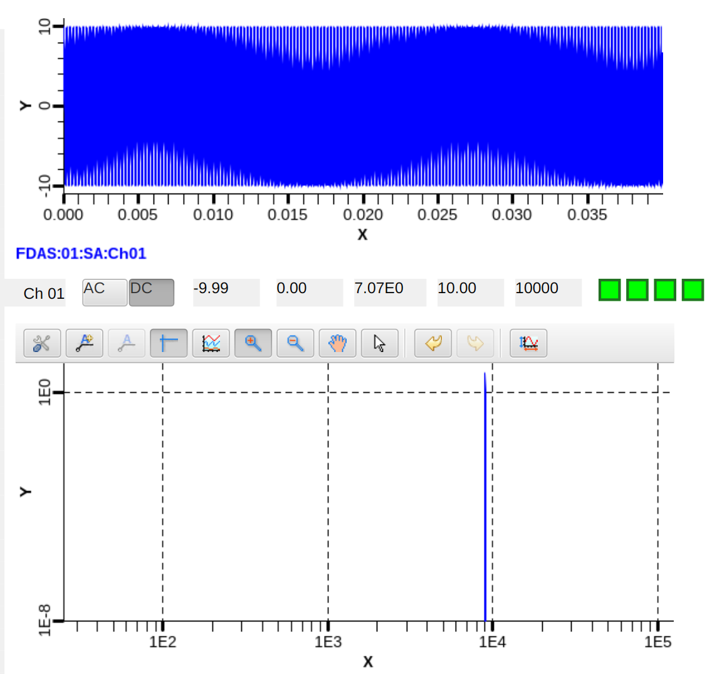
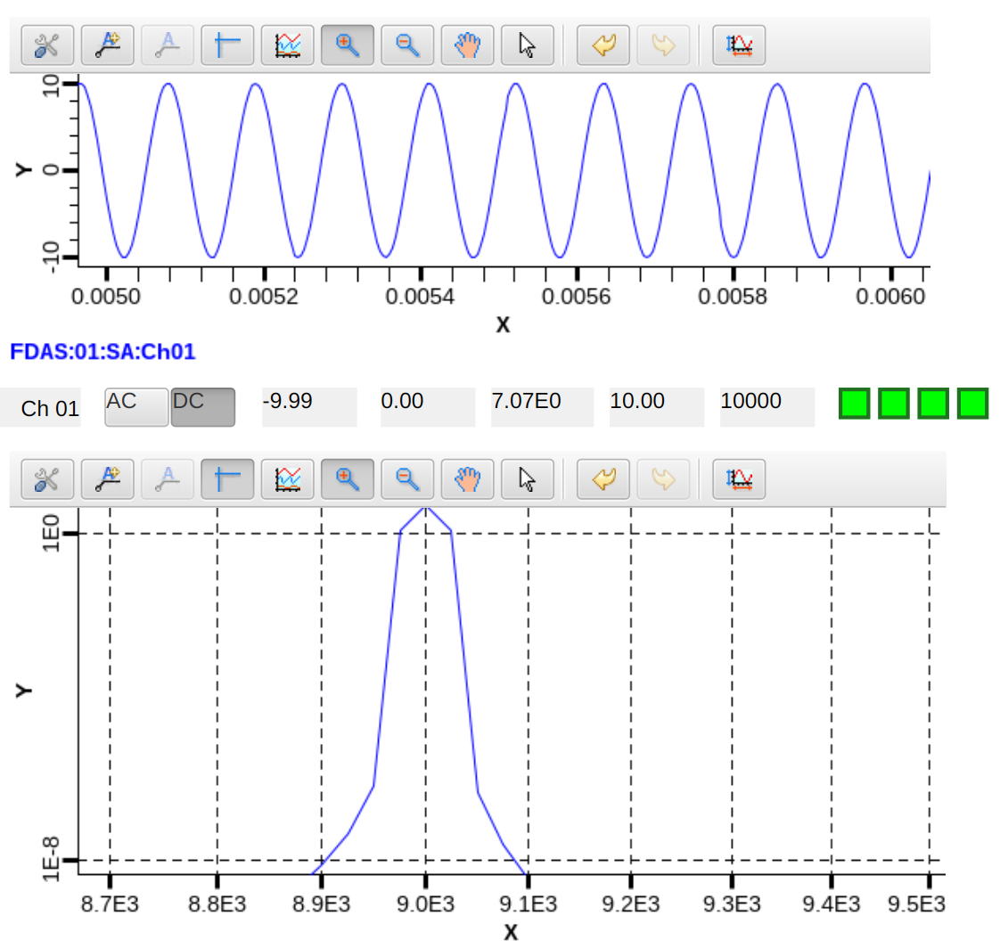
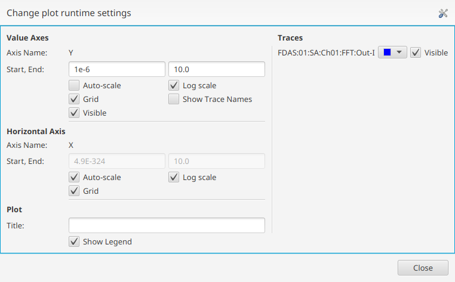

# FDAS System Functional Checkout

The purpose of this procedure is to bring the FDAS system
into a known functional state.

## Prerequisites

- Availability of a CCCR file configuring the channels to be verified to a voltage scale.  (no EGU, ESLO=1.0, ESLO=0.0)
- Locate function generator (eg. Agilent 33220 Waveform generator)
- Locate test cable set as described in [D.4.2](D-4-02_PROC_-_Measurement_Device_Calibration.md).

## Preparation

Configuring function generator for AC response test

1. Function generator
  1. Reset function generator to defaults
    - May exclude settings known not to effect output, eg. network address
    - May use setting save/restore feature
  1. Ensure output is disabled
  1. Select sine wave
  1. Set offset to zero volts
  1. Set amplitude +-10 V (20 Vpp)
  1. Set frequency to 9 KHz
  1. Set output to high impedence (HighZ)

Note: Running [D.4.2](D-4-02_PROC_-_Measurement_Device_Calibration.md)
      will reconfigure the function generator.
      It is recommended to reset and setup, then save settings once,
      and thereafter restore settings following each calibration run.

## Expected Response

Figure 1. Chassis Scope screen showing expected response to 9 KHz sine wave.

Figure 2. Chassis Scope zoomed in in both time and frequency.

Essential frequency (FFT) response characteristics.

- Primary peak at 9 KHz
    - Amplitude of 5 V
    - Sharp peak <= 3 frequency points
- No other peaks above -80 dB relative (0.0005 V)

The important relationship is the relative size of the peak at 9 KHz to all other peaks,
which should be at least -80 dB less ($10^\frac{-80}{20} = \frac{1}{10000} = 0.0001$).

By default, the
[Chassis Scope](D-4-06_PROC_-_Monitoring_a_Data-Channel_in_Real_Time.md)
screen shows FFT on a log/log plot with base 10.

To simplify interpretation, adjust the FFT Plot scale so that
only peaks above the -80 dB threshold will be visible.
Leave the horizontal scale on auto.

- Change vertical scale to 1e-6 -> 10
- Uncheck auto-scale

Right click on the plot area and select `Configure Plot` from the menu which appears.

Figure 3. Phoebus plot configuration dialog

## Process

1. If applicable, run through the "System Power Up" section of [D.4.3](D-4-03_PROC_-_Start-up_and_Shut-down.md).
1. Run [D.4.9](D-4-09_PROC_-_Inspecting_the_Current_State_and_Health.md.) Inspecting the Current State and Health of the system
1. Set sample rate to 250Ksps and enable acquisition.  (see [D.4.6](D-4-06_PROC_-_Monitoring_a_Data-Channel_in_Real_Time.md))
1. Chassis 1.  Connect signal generator.
    - [ ] Successful DC calibration ([D.4.2](D-4-02_PROC_-_Measurement_Device_Calibration.md)).
    - [ ] Channel 1, signal 1.  Verify AC response
    - [ ] Channel 2, signal 2.  Verify AC response
    - [ ] Channel 3, signal 3.  Verify AC response
    - [ ] Channel 4, signal 4.  Verify AC response
    - [ ] Channel 5, signal 5.  Verify AC response
    - [ ] Channel 6, signal 6.  Verify AC response
    - [ ] Channel 7, signal 7.  Verify AC response
    - [ ] Channel 8, signal 8.  Verify AC response
    - [ ] Channel 9, signal 9.  Verify AC response
    - [ ] Channel 10, signal 10.  Verify AC response
    - [ ] Channel 11, signal 11.  Verify AC response
    - [ ] Channel 12, signal 12.  Verify AC response
    - [ ] Channel 13, signal 13.  Verify AC response
    - [ ] Channel 14, signal 14.  Verify AC response
    - [ ] Channel 15, signal 15.  Verify AC response
    - [ ] Channel 16, signal 16.  Verify AC response
    - [ ] Channel 17, signal 17.  Verify AC response
    - [ ] Channel 18, signal 18.  Verify AC response
    - [ ] Channel 19, signal 19.  Verify AC response
    - [ ] Channel 20, signal 20.  Verify AC response
    - [ ] Channel 21, signal 21.  Verify AC response
    - [ ] Channel 22, signal 22.  Verify AC response
    - [ ] Channel 23, signal 23.  Verify AC response
    - [ ] Channel 24, signal 24.  Verify AC response
    - [ ] Channel 25, signal 25.  Verify AC response
    - [ ] Channel 26, signal 26.  Verify AC response
    - [ ] Channel 27, signal 27.  Verify AC response
    - [ ] Channel 28, signal 28.  Verify AC response
    - [ ] Channel 29, signal 29.  Verify AC response
    - [ ] Channel 30, signal 30.  Verify AC response
    - [ ] Channel 31, signal 31.  Verify AC response
    - [ ] Channel 32, signal 32.  Verify AC response
1. Chassis 2.  Connect signal generator.
    - [ ] Successful DC calibration ([D.4.2](D-4-02_PROC_-_Measurement_Device_Calibration.md)).
    - [ ] Channel 1, signal 33.  Verify AC response
    - [ ] Channel 2, signal 34.  Verify AC response
    - [ ] Channel 3, signal 35.  Verify AC response
    - [ ] Channel 4, signal 36.  Verify AC response
    - [ ] Channel 5, signal 37.  Verify AC response
    - [ ] Channel 6, signal 38.  Verify AC response
    - [ ] Channel 7, signal 39.  Verify AC response
    - [ ] Channel 8, signal 40.  Verify AC response
    - [ ] Channel 9, signal 41.  Verify AC response
    - [ ] Channel 10, signal 42.  Verify AC response
    - [ ] Channel 11, signal 43.  Verify AC response
    - [ ] Channel 12, signal 44.  Verify AC response
    - [ ] Channel 13, signal 45.  Verify AC response
    - [ ] Channel 14, signal 46.  Verify AC response
    - [ ] Channel 15, signal 47.  Verify AC response
    - [ ] Channel 16, signal 48.  Verify AC response
    - [ ] Channel 17, signal 49.  Verify AC response
    - [ ] Channel 18, signal 50.  Verify AC response
    - [ ] Channel 19, signal 51.  Verify AC response
    - [ ] Channel 20, signal 52.  Verify AC response
    - [ ] Channel 21, signal 53.  Verify AC response
    - [ ] Channel 22, signal 54.  Verify AC response
    - [ ] Channel 23, signal 55.  Verify AC response
    - [ ] Channel 24, signal 56.  Verify AC response
    - [ ] Channel 25, signal 57.  Verify AC response
    - [ ] Channel 26, signal 58.  Verify AC response
    - [ ] Channel 27, signal 59.  Verify AC response
    - [ ] Channel 28, signal 60.  Verify AC response
    - [ ] Channel 29, signal 61.  Verify AC response
    - [ ] Channel 30, signal 62.  Verify AC response
    - [ ] Channel 31, signal 63.  Verify AC response
    - [ ] Channel 32, signal 64.  Verify AC response
1. Chassis 3.  Connect signal generator.
    - [ ] Successful DC calibration ([D.4.2](D-4-02_PROC_-_Measurement_Device_Calibration.md)).
    - [ ] Channel 1, signal 65.  Verify AC response
    - [ ] Channel 2, signal 66.  Verify AC response
    - [ ] Channel 3, signal 67.  Verify AC response
    - [ ] Channel 4, signal 68.  Verify AC response
    - [ ] Channel 5, signal 69.  Verify AC response
    - [ ] Channel 6, signal 70.  Verify AC response
    - [ ] Channel 7, signal 71.  Verify AC response
    - [ ] Channel 8, signal 72.  Verify AC response
    - [ ] Channel 9, signal 73.  Verify AC response
    - [ ] Channel 10, signal 74.  Verify AC response
    - [ ] Channel 11, signal 75.  Verify AC response
    - [ ] Channel 12, signal 76.  Verify AC response
    - [ ] Channel 13, signal 77.  Verify AC response
    - [ ] Channel 14, signal 78.  Verify AC response
    - [ ] Channel 15, signal 79.  Verify AC response
    - [ ] Channel 16, signal 80.  Verify AC response
    - [ ] Channel 17, signal 81.  Verify AC response
    - [ ] Channel 18, signal 82.  Verify AC response
    - [ ] Channel 19, signal 83.  Verify AC response
    - [ ] Channel 20, signal 84.  Verify AC response
    - [ ] Channel 21, signal 85.  Verify AC response
    - [ ] Channel 22, signal 86.  Verify AC response
    - [ ] Channel 23, signal 87.  Verify AC response
    - [ ] Channel 24, signal 88.  Verify AC response
    - [ ] Channel 25, signal 89.  Verify AC response
    - [ ] Channel 26, signal 90.  Verify AC response
    - [ ] Channel 27, signal 91.  Verify AC response
    - [ ] Channel 28, signal 92.  Verify AC response
    - [ ] Channel 29, signal 93.  Verify AC response
    - [ ] Channel 30, signal 94.  Verify AC response
    - [ ] Channel 31, signal 95.  Verify AC response
    - [ ] Channel 32, signal 96.  Verify AC response
1. Chassis 4.  Connect signal generator.
    - [ ] Successful DC calibration ([D.4.2](D-4-02_PROC_-_Measurement_Device_Calibration.md)).
    - [ ] Channel 1, signal 97.  Verify AC response
    - [ ] Channel 2, signal 98.  Verify AC response
    - [ ] Channel 3, signal 99.  Verify AC response
    - [ ] Channel 4, signal 100.  Verify AC response
    - [ ] Channel 5, signal 101.  Verify AC response
    - [ ] Channel 6, signal 102.  Verify AC response
    - [ ] Channel 7, signal 103.  Verify AC response
    - [ ] Channel 8, signal 104.  Verify AC response
    - [ ] Channel 9, signal 105.  Verify AC response
    - [ ] Channel 10, signal 106.  Verify AC response
    - [ ] Channel 11, signal 107.  Verify AC response
    - [ ] Channel 12, signal 108.  Verify AC response
    - [ ] Channel 13, signal 109.  Verify AC response
    - [ ] Channel 14, signal 110.  Verify AC response
    - [ ] Channel 15, signal 111.  Verify AC response
    - [ ] Channel 16, signal 112.  Verify AC response
    - [ ] Channel 17, signal 113.  Verify AC response
    - [ ] Channel 18, signal 114.  Verify AC response
    - [ ] Channel 19, signal 115.  Verify AC response
    - [ ] Channel 20, signal 116.  Verify AC response
    - [ ] Channel 21, signal 117.  Verify AC response
    - [ ] Channel 22, signal 118.  Verify AC response
    - [ ] Channel 23, signal 119.  Verify AC response
    - [ ] Channel 24, signal 120.  Verify AC response
    - [ ] Channel 25, signal 121.  Verify AC response
    - [ ] Channel 26, signal 122.  Verify AC response
    - [ ] Channel 27, signal 123.  Verify AC response
    - [ ] Channel 28, signal 124.  Verify AC response
    - [ ] Channel 29, signal 125.  Verify AC response
    - [ ] Channel 30, signal 126.  Verify AC response
    - [ ] Channel 31, signal 127.  Verify AC response
    - [ ] Channel 32, signal 128.  Verify AC response
1. Chassis 5.  Connect signal generator.
    - [ ] Successful DC calibration ([D.4.2](D-4-02_PROC_-_Measurement_Device_Calibration.md)).
    - [ ] Channel 1, signal 129.  Verify AC response
    - [ ] Channel 2, signal 130.  Verify AC response
    - [ ] Channel 3, signal 131.  Verify AC response
    - [ ] Channel 4, signal 132.  Verify AC response
    - [ ] Channel 5, signal 133.  Verify AC response
    - [ ] Channel 6, signal 134.  Verify AC response
    - [ ] Channel 7, signal 135.  Verify AC response
    - [ ] Channel 8, signal 136.  Verify AC response
    - [ ] Channel 9, signal 137.  Verify AC response
    - [ ] Channel 10, signal 138.  Verify AC response
    - [ ] Channel 11, signal 139.  Verify AC response
    - [ ] Channel 12, signal 140.  Verify AC response
    - [ ] Channel 13, signal 141.  Verify AC response
    - [ ] Channel 14, signal 142.  Verify AC response
    - [ ] Channel 15, signal 143.  Verify AC response
    - [ ] Channel 16, signal 144.  Verify AC response
    - [ ] Channel 17, signal 145.  Verify AC response
    - [ ] Channel 18, signal 146.  Verify AC response
    - [ ] Channel 19, signal 147.  Verify AC response
    - [ ] Channel 20, signal 148.  Verify AC response
    - [ ] Channel 21, signal 149.  Verify AC response
    - [ ] Channel 22, signal 150.  Verify AC response
    - [ ] Channel 23, signal 151.  Verify AC response
    - [ ] Channel 24, signal 152.  Verify AC response
    - [ ] Channel 25, signal 153.  Verify AC response
    - [ ] Channel 26, signal 154.  Verify AC response
    - [ ] Channel 27, signal 155.  Verify AC response
    - [ ] Channel 28, signal 156.  Verify AC response
    - [ ] Channel 29, signal 157.  Verify AC response
    - [ ] Channel 30, signal 158.  Verify AC response
    - [ ] Channel 31, signal 159.  Verify AC response
    - [ ] Channel 32, signal 160.  Verify AC response
1. Chassis 6.  Connect signal generator.
    - [ ] Successful DC calibration ([D.4.2](D-4-02_PROC_-_Measurement_Device_Calibration.md)).
    - [ ] Channel 1, signal 161.  Verify AC response
    - [ ] Channel 2, signal 162.  Verify AC response
    - [ ] Channel 3, signal 163.  Verify AC response
    - [ ] Channel 4, signal 164.  Verify AC response
    - [ ] Channel 5, signal 165.  Verify AC response
    - [ ] Channel 6, signal 166.  Verify AC response
    - [ ] Channel 7, signal 167.  Verify AC response
    - [ ] Channel 8, signal 168.  Verify AC response
    - [ ] Channel 9, signal 169.  Verify AC response
    - [ ] Channel 10, signal 170.  Verify AC response
    - [ ] Channel 11, signal 171.  Verify AC response
    - [ ] Channel 12, signal 172.  Verify AC response
    - [ ] Channel 13, signal 173.  Verify AC response
    - [ ] Channel 14, signal 174.  Verify AC response
    - [ ] Channel 15, signal 175.  Verify AC response
    - [ ] Channel 16, signal 176.  Verify AC response
    - [ ] Channel 17, signal 177.  Verify AC response
    - [ ] Channel 18, signal 178.  Verify AC response
    - [ ] Channel 19, signal 179.  Verify AC response
    - [ ] Channel 20, signal 180.  Verify AC response
    - [ ] Channel 21, signal 181.  Verify AC response
    - [ ] Channel 22, signal 182.  Verify AC response
    - [ ] Channel 23, signal 183.  Verify AC response
    - [ ] Channel 24, signal 184.  Verify AC response
    - [ ] Channel 25, signal 185.  Verify AC response
    - [ ] Channel 26, signal 186.  Verify AC response
    - [ ] Channel 27, signal 187.  Verify AC response
    - [ ] Channel 28, signal 188.  Verify AC response
    - [ ] Channel 29, signal 189.  Verify AC response
    - [ ] Channel 30, signal 190.  Verify AC response
    - [ ] Channel 31, signal 191.  Verify AC response
    - [ ] Channel 32, signal 192.  Verify AC response
1. Chassis 7.  Connect signal generator.
    - [ ] Successful DC calibration ([D.4.2](D-4-02_PROC_-_Measurement_Device_Calibration.md)).
    - [ ] Channel 1, signal 193.  Verify AC response
    - [ ] Channel 2, signal 194.  Verify AC response
    - [ ] Channel 3, signal 195.  Verify AC response
    - [ ] Channel 4, signal 196.  Verify AC response
    - [ ] Channel 5, signal 197.  Verify AC response
    - [ ] Channel 6, signal 198.  Verify AC response
    - [ ] Channel 7, signal 199.  Verify AC response
    - [ ] Channel 8, signal 200.  Verify AC response
    - [ ] Channel 9, signal 201.  Verify AC response
    - [ ] Channel 10, signal 202.  Verify AC response
    - [ ] Channel 11, signal 203.  Verify AC response
    - [ ] Channel 12, signal 204.  Verify AC response
    - [ ] Channel 13, signal 205.  Verify AC response
    - [ ] Channel 14, signal 206.  Verify AC response
    - [ ] Channel 15, signal 207.  Verify AC response
    - [ ] Channel 16, signal 208.  Verify AC response
    - [ ] Channel 17, signal 209.  Verify AC response
    - [ ] Channel 18, signal 210.  Verify AC response
    - [ ] Channel 19, signal 211.  Verify AC response
    - [ ] Channel 20, signal 212.  Verify AC response
    - [ ] Channel 21, signal 213.  Verify AC response
    - [ ] Channel 22, signal 214.  Verify AC response
    - [ ] Channel 23, signal 215.  Verify AC response
    - [ ] Channel 24, signal 216.  Verify AC response
    - [ ] Channel 25, signal 217.  Verify AC response
    - [ ] Channel 26, signal 218.  Verify AC response
    - [ ] Channel 27, signal 219.  Verify AC response
    - [ ] Channel 28, signal 220.  Verify AC response
    - [ ] Channel 29, signal 221.  Verify AC response
    - [ ] Channel 30, signal 222.  Verify AC response
    - [ ] Channel 31, signal 223.  Verify AC response
    - [ ] Channel 32, signal 224.  Verify AC response
1. Chassis 8.  Connect signal generator.
    - [ ] Successful DC calibration ([D.4.2](D-4-02_PROC_-_Measurement_Device_Calibration.md)).
    - [ ] Channel 1, signal 225.  Verify AC response
    - [ ] Channel 2, signal 226.  Verify AC response
    - [ ] Channel 3, signal 227.  Verify AC response
    - [ ] Channel 4, signal 228.  Verify AC response
    - [ ] Channel 5, signal 229.  Verify AC response
    - [ ] Channel 6, signal 230.  Verify AC response
    - [ ] Channel 7, signal 231.  Verify AC response
    - [ ] Channel 8, signal 232.  Verify AC response
    - [ ] Channel 9, signal 233.  Verify AC response
    - [ ] Channel 10, signal 234.  Verify AC response
    - [ ] Channel 11, signal 235.  Verify AC response
    - [ ] Channel 12, signal 236.  Verify AC response
    - [ ] Channel 13, signal 237.  Verify AC response
    - [ ] Channel 14, signal 238.  Verify AC response
    - [ ] Channel 15, signal 239.  Verify AC response
    - [ ] Channel 16, signal 240.  Verify AC response
    - [ ] Channel 17, signal 241.  Verify AC response
    - [ ] Channel 18, signal 242.  Verify AC response
    - [ ] Channel 19, signal 243.  Verify AC response
    - [ ] Channel 20, signal 244.  Verify AC response
    - [ ] Channel 21, signal 245.  Verify AC response
    - [ ] Channel 22, signal 246.  Verify AC response
    - [ ] Channel 23, signal 247.  Verify AC response
    - [ ] Channel 24, signal 248.  Verify AC response
    - [ ] Channel 25, signal 249.  Verify AC response
    - [ ] Channel 26, signal 250.  Verify AC response
    - [ ] Channel 27, signal 251.  Verify AC response
    - [ ] Channel 28, signal 252.  Verify AC response
    - [ ] Channel 29, signal 253.  Verify AC response
    - [ ] Channel 30, signal 254.  Verify AC response
    - [ ] Channel 31, signal 255.  Verify AC response
    - [ ] Channel 32, signal 256.  Verify AC response
1. Chassis 9.  Connect signal generator.
    - [ ] Successful DC calibration ([D.4.2](D-4-02_PROC_-_Measurement_Device_Calibration.md)).
    - [ ] Channel 1, signal 257.  Verify AC response
    - [ ] Channel 2, signal 258.  Verify AC response
    - [ ] Channel 3, signal 259.  Verify AC response
    - [ ] Channel 4, signal 260.  Verify AC response
    - [ ] Channel 5, signal 261.  Verify AC response
    - [ ] Channel 6, signal 262.  Verify AC response
    - [ ] Channel 7, signal 263.  Verify AC response
    - [ ] Channel 8, signal 264.  Verify AC response
    - [ ] Channel 9, signal 265.  Verify AC response
    - [ ] Channel 10, signal 266.  Verify AC response
    - [ ] Channel 11, signal 267.  Verify AC response
    - [ ] Channel 12, signal 268.  Verify AC response
    - [ ] Channel 13, signal 269.  Verify AC response
    - [ ] Channel 14, signal 270.  Verify AC response
    - [ ] Channel 15, signal 271.  Verify AC response
    - [ ] Channel 16, signal 272.  Verify AC response
    - [ ] Channel 17, signal 273.  Verify AC response
    - [ ] Channel 18, signal 274.  Verify AC response
    - [ ] Channel 19, signal 275.  Verify AC response
    - [ ] Channel 20, signal 276.  Verify AC response
    - [ ] Channel 21, signal 277.  Verify AC response
    - [ ] Channel 22, signal 278.  Verify AC response
    - [ ] Channel 23, signal 279.  Verify AC response
    - [ ] Channel 24, signal 280.  Verify AC response
    - [ ] Channel 25, signal 281.  Verify AC response
    - [ ] Channel 26, signal 282.  Verify AC response
    - [ ] Channel 27, signal 283.  Verify AC response
    - [ ] Channel 28, signal 284.  Verify AC response
    - [ ] Channel 29, signal 285.  Verify AC response
    - [ ] Channel 30, signal 286.  Verify AC response
    - [ ] Channel 31, signal 287.  Verify AC response
    - [ ] Channel 32, signal 288.  Verify AC response
1. Chassis 10.  Connect signal generator.
    - [ ] Successful DC calibration ([D.4.2](D-4-02_PROC_-_Measurement_Device_Calibration.md)).
    - [ ] Channel 1, signal 289.  Verify AC response
    - [ ] Channel 2, signal 290.  Verify AC response
    - [ ] Channel 3, signal 291.  Verify AC response
    - [ ] Channel 4, signal 292.  Verify AC response
    - [ ] Channel 5, signal 293.  Verify AC response
    - [ ] Channel 6, signal 294.  Verify AC response
    - [ ] Channel 7, signal 295.  Verify AC response
    - [ ] Channel 8, signal 296.  Verify AC response
    - [ ] Channel 9, signal 297.  Verify AC response
    - [ ] Channel 10, signal 298.  Verify AC response
    - [ ] Channel 11, signal 299.  Verify AC response
    - [ ] Channel 12, signal 300.  Verify AC response
    - [ ] Channel 13, signal 301.  Verify AC response
    - [ ] Channel 14, signal 302.  Verify AC response
    - [ ] Channel 15, signal 303.  Verify AC response
    - [ ] Channel 16, signal 304.  Verify AC response
    - [ ] Channel 17, signal 305.  Verify AC response
    - [ ] Channel 18, signal 306.  Verify AC response
    - [ ] Channel 19, signal 307.  Verify AC response
    - [ ] Channel 20, signal 308.  Verify AC response
    - [ ] Channel 21, signal 309.  Verify AC response
    - [ ] Channel 22, signal 310.  Verify AC response
    - [ ] Channel 23, signal 311.  Verify AC response
    - [ ] Channel 24, signal 312.  Verify AC response
    - [ ] Channel 25, signal 313.  Verify AC response
    - [ ] Channel 26, signal 314.  Verify AC response
    - [ ] Channel 27, signal 315.  Verify AC response
    - [ ] Channel 28, signal 316.  Verify AC response
    - [ ] Channel 29, signal 317.  Verify AC response
    - [ ] Channel 30, signal 318.  Verify AC response
    - [ ] Channel 31, signal 319.  Verify AC response
    - [ ] Channel 32, signal 320.  Verify AC response
1. Chassis 11.  Connect signal generator.
    - [ ] Successful DC calibration ([D.4.2](D-4-02_PROC_-_Measurement_Device_Calibration.md)).
    - [ ] Channel 1, signal 321.  Verify AC response
    - [ ] Channel 2, signal 322.  Verify AC response
    - [ ] Channel 3, signal 323.  Verify AC response
    - [ ] Channel 4, signal 324.  Verify AC response
    - [ ] Channel 5, signal 325.  Verify AC response
    - [ ] Channel 6, signal 326.  Verify AC response
    - [ ] Channel 7, signal 327.  Verify AC response
    - [ ] Channel 8, signal 328.  Verify AC response
    - [ ] Channel 9, signal 329.  Verify AC response
    - [ ] Channel 10, signal 330.  Verify AC response
    - [ ] Channel 11, signal 331.  Verify AC response
    - [ ] Channel 12, signal 332.  Verify AC response
    - [ ] Channel 13, signal 333.  Verify AC response
    - [ ] Channel 14, signal 334.  Verify AC response
    - [ ] Channel 15, signal 335.  Verify AC response
    - [ ] Channel 16, signal 336.  Verify AC response
    - [ ] Channel 17, signal 337.  Verify AC response
    - [ ] Channel 18, signal 338.  Verify AC response
    - [ ] Channel 19, signal 339.  Verify AC response
    - [ ] Channel 20, signal 340.  Verify AC response
    - [ ] Channel 21, signal 341.  Verify AC response
    - [ ] Channel 22, signal 342.  Verify AC response
    - [ ] Channel 23, signal 343.  Verify AC response
    - [ ] Channel 24, signal 344.  Verify AC response
    - [ ] Channel 25, signal 345.  Verify AC response
    - [ ] Channel 26, signal 346.  Verify AC response
    - [ ] Channel 27, signal 347.  Verify AC response
    - [ ] Channel 28, signal 348.  Verify AC response
    - [ ] Channel 29, signal 349.  Verify AC response
    - [ ] Channel 30, signal 350.  Verify AC response
    - [ ] Channel 31, signal 351.  Verify AC response
    - [ ] Channel 32, signal 352.  Verify AC response
1. Chassis 12.  Connect signal generator.
    - [ ] Successful DC calibration ([D.4.2](D-4-02_PROC_-_Measurement_Device_Calibration.md)).
    - [ ] Channel 1, signal 353.  Verify AC response
    - [ ] Channel 2, signal 354.  Verify AC response
    - [ ] Channel 3, signal 355.  Verify AC response
    - [ ] Channel 4, signal 356.  Verify AC response
    - [ ] Channel 5, signal 357.  Verify AC response
    - [ ] Channel 6, signal 358.  Verify AC response
    - [ ] Channel 7, signal 359.  Verify AC response
    - [ ] Channel 8, signal 360.  Verify AC response
    - [ ] Channel 9, signal 361.  Verify AC response
    - [ ] Channel 10, signal 362.  Verify AC response
    - [ ] Channel 11, signal 363.  Verify AC response
    - [ ] Channel 12, signal 364.  Verify AC response
    - [ ] Channel 13, signal 365.  Verify AC response
    - [ ] Channel 14, signal 366.  Verify AC response
    - [ ] Channel 15, signal 367.  Verify AC response
    - [ ] Channel 16, signal 368.  Verify AC response
    - [ ] Channel 17, signal 369.  Verify AC response
    - [ ] Channel 18, signal 370.  Verify AC response
    - [ ] Channel 19, signal 371.  Verify AC response
    - [ ] Channel 20, signal 372.  Verify AC response
    - [ ] Channel 21, signal 373.  Verify AC response
    - [ ] Channel 22, signal 374.  Verify AC response
    - [ ] Channel 23, signal 375.  Verify AC response
    - [ ] Channel 24, signal 376.  Verify AC response
    - [ ] Channel 25, signal 377.  Verify AC response
    - [ ] Channel 26, signal 378.  Verify AC response
    - [ ] Channel 27, signal 379.  Verify AC response
    - [ ] Channel 28, signal 380.  Verify AC response
    - [ ] Channel 29, signal 381.  Verify AC response
    - [ ] Channel 30, signal 382.  Verify AC response
    - [ ] Channel 31, signal 383.  Verify AC response
    - [ ] Channel 32, signal 384.  Verify AC response
1. Chassis 13.  Connect signal generator.
    - [ ] Successful DC calibration ([D.4.2](D-4-02_PROC_-_Measurement_Device_Calibration.md)).
    - [ ] Channel 1, signal 385.  Verify AC response
    - [ ] Channel 2, signal 386.  Verify AC response
    - [ ] Channel 3, signal 387.  Verify AC response
    - [ ] Channel 4, signal 388.  Verify AC response
    - [ ] Channel 5, signal 389.  Verify AC response
    - [ ] Channel 6, signal 390.  Verify AC response
    - [ ] Channel 7, signal 391.  Verify AC response
    - [ ] Channel 8, signal 392.  Verify AC response
    - [ ] Channel 9, signal 393.  Verify AC response
    - [ ] Channel 10, signal 394.  Verify AC response
    - [ ] Channel 11, signal 395.  Verify AC response
    - [ ] Channel 12, signal 396.  Verify AC response
    - [ ] Channel 13, signal 397.  Verify AC response
    - [ ] Channel 14, signal 398.  Verify AC response
    - [ ] Channel 15, signal 399.  Verify AC response
    - [ ] Channel 16, signal 400.  Verify AC response
    - [ ] Channel 17, signal 401.  Verify AC response
    - [ ] Channel 18, signal 402.  Verify AC response
    - [ ] Channel 19, signal 403.  Verify AC response
    - [ ] Channel 20, signal 404.  Verify AC response
    - [ ] Channel 21, signal 405.  Verify AC response
    - [ ] Channel 22, signal 406.  Verify AC response
    - [ ] Channel 23, signal 407.  Verify AC response
    - [ ] Channel 24, signal 408.  Verify AC response
    - [ ] Channel 25, signal 409.  Verify AC response
    - [ ] Channel 26, signal 410.  Verify AC response
    - [ ] Channel 27, signal 411.  Verify AC response
    - [ ] Channel 28, signal 412.  Verify AC response
    - [ ] Channel 29, signal 413.  Verify AC response
    - [ ] Channel 30, signal 414.  Verify AC response
    - [ ] Channel 31, signal 415.  Verify AC response
    - [ ] Channel 32, signal 416.  Verify AC response
1. Chassis 14.  Connect signal generator.
    - [ ] Successful DC calibration ([D.4.2](D-4-02_PROC_-_Measurement_Device_Calibration.md)).
    - [ ] Channel 1, signal 417.  Verify AC response
    - [ ] Channel 2, signal 418.  Verify AC response
    - [ ] Channel 3, signal 419.  Verify AC response
    - [ ] Channel 4, signal 420.  Verify AC response
    - [ ] Channel 5, signal 421.  Verify AC response
    - [ ] Channel 6, signal 422.  Verify AC response
    - [ ] Channel 7, signal 423.  Verify AC response
    - [ ] Channel 8, signal 424.  Verify AC response
    - [ ] Channel 9, signal 425.  Verify AC response
    - [ ] Channel 10, signal 426.  Verify AC response
    - [ ] Channel 11, signal 427.  Verify AC response
    - [ ] Channel 12, signal 428.  Verify AC response
    - [ ] Channel 13, signal 429.  Verify AC response
    - [ ] Channel 14, signal 430.  Verify AC response
    - [ ] Channel 15, signal 431.  Verify AC response
    - [ ] Channel 16, signal 432.  Verify AC response
    - [ ] Channel 17, signal 433.  Verify AC response
    - [ ] Channel 18, signal 434.  Verify AC response
    - [ ] Channel 19, signal 435.  Verify AC response
    - [ ] Channel 20, signal 436.  Verify AC response
    - [ ] Channel 21, signal 437.  Verify AC response
    - [ ] Channel 22, signal 438.  Verify AC response
    - [ ] Channel 23, signal 439.  Verify AC response
    - [ ] Channel 24, signal 440.  Verify AC response
    - [ ] Channel 25, signal 441.  Verify AC response
    - [ ] Channel 26, signal 442.  Verify AC response
    - [ ] Channel 27, signal 443.  Verify AC response
    - [ ] Channel 28, signal 444.  Verify AC response
    - [ ] Channel 29, signal 445.  Verify AC response
    - [ ] Channel 30, signal 446.  Verify AC response
    - [ ] Channel 31, signal 447.  Verify AC response
    - [ ] Channel 32, signal 448.  Verify AC response
1. Chassis 15.  Connect signal generator.
    - [ ] Successful DC calibration ([D.4.2](D-4-02_PROC_-_Measurement_Device_Calibration.md)).
    - [ ] Channel 1, signal 449.  Verify AC response
    - [ ] Channel 2, signal 450.  Verify AC response
    - [ ] Channel 3, signal 451.  Verify AC response
    - [ ] Channel 4, signal 452.  Verify AC response
    - [ ] Channel 5, signal 453.  Verify AC response
    - [ ] Channel 6, signal 454.  Verify AC response
    - [ ] Channel 7, signal 455.  Verify AC response
    - [ ] Channel 8, signal 456.  Verify AC response
    - [ ] Channel 9, signal 457.  Verify AC response
    - [ ] Channel 10, signal 458.  Verify AC response
    - [ ] Channel 11, signal 459.  Verify AC response
    - [ ] Channel 12, signal 460.  Verify AC response
    - [ ] Channel 13, signal 461.  Verify AC response
    - [ ] Channel 14, signal 462.  Verify AC response
    - [ ] Channel 15, signal 463.  Verify AC response
    - [ ] Channel 16, signal 464.  Verify AC response
    - [ ] Channel 17, signal 465.  Verify AC response
    - [ ] Channel 18, signal 466.  Verify AC response
    - [ ] Channel 19, signal 467.  Verify AC response
    - [ ] Channel 20, signal 468.  Verify AC response
    - [ ] Channel 21, signal 469.  Verify AC response
    - [ ] Channel 22, signal 470.  Verify AC response
    - [ ] Channel 23, signal 471.  Verify AC response
    - [ ] Channel 24, signal 472.  Verify AC response
    - [ ] Channel 25, signal 473.  Verify AC response
    - [ ] Channel 26, signal 474.  Verify AC response
    - [ ] Channel 27, signal 475.  Verify AC response
    - [ ] Channel 28, signal 476.  Verify AC response
    - [ ] Channel 29, signal 477.  Verify AC response
    - [ ] Channel 30, signal 478.  Verify AC response
    - [ ] Channel 31, signal 479.  Verify AC response
    - [ ] Channel 32, signal 480.  Verify AC response
1. Chassis 16.  Connect signal generator.
    - [ ] Successful DC calibration ([D.4.2](D-4-02_PROC_-_Measurement_Device_Calibration.md)).
    - [ ] Channel 1, signal 481.  Verify AC response
    - [ ] Channel 2, signal 482.  Verify AC response
    - [ ] Channel 3, signal 483.  Verify AC response
    - [ ] Channel 4, signal 484.  Verify AC response
    - [ ] Channel 5, signal 485.  Verify AC response
    - [ ] Channel 6, signal 486.  Verify AC response
    - [ ] Channel 7, signal 487.  Verify AC response
    - [ ] Channel 8, signal 488.  Verify AC response
    - [ ] Channel 9, signal 489.  Verify AC response
    - [ ] Channel 10, signal 490.  Verify AC response
    - [ ] Channel 11, signal 491.  Verify AC response
    - [ ] Channel 12, signal 492.  Verify AC response
    - [ ] Channel 13, signal 493.  Verify AC response
    - [ ] Channel 14, signal 494.  Verify AC response
    - [ ] Channel 15, signal 495.  Verify AC response
    - [ ] Channel 16, signal 496.  Verify AC response
    - [ ] Channel 17, signal 497.  Verify AC response
    - [ ] Channel 18, signal 498.  Verify AC response
    - [ ] Channel 19, signal 499.  Verify AC response
    - [ ] Channel 20, signal 500.  Verify AC response
    - [ ] Channel 21, signal 501.  Verify AC response
    - [ ] Channel 22, signal 502.  Verify AC response
    - [ ] Channel 23, signal 503.  Verify AC response
    - [ ] Channel 24, signal 504.  Verify AC response
    - [ ] Channel 25, signal 505.  Verify AC response
    - [ ] Channel 26, signal 506.  Verify AC response
    - [ ] Channel 27, signal 507.  Verify AC response
    - [ ] Channel 28, signal 508.  Verify AC response
    - [ ] Channel 29, signal 509.  Verify AC response
    - [ ] Channel 30, signal 510.  Verify AC response
    - [ ] Channel 31, signal 511.  Verify AC response
    - [ ] Channel 32, signal 512.  Verify AC response
1. Chassis 17.  Connect signal generator.
    - [ ] Successful DC calibration ([D.4.2](D-4-02_PROC_-_Measurement_Device_Calibration.md)).
    - [ ] Channel 1, signal 513.  Verify AC response
    - [ ] Channel 2, signal 514.  Verify AC response
    - [ ] Channel 3, signal 515.  Verify AC response
    - [ ] Channel 4, signal 516.  Verify AC response
    - [ ] Channel 5, signal 517.  Verify AC response
    - [ ] Channel 6, signal 518.  Verify AC response
    - [ ] Channel 7, signal 519.  Verify AC response
    - [ ] Channel 8, signal 520.  Verify AC response
    - [ ] Channel 9, signal 521.  Verify AC response
    - [ ] Channel 10, signal 522.  Verify AC response
    - [ ] Channel 11, signal 523.  Verify AC response
    - [ ] Channel 12, signal 524.  Verify AC response
    - [ ] Channel 13, signal 525.  Verify AC response
    - [ ] Channel 14, signal 526.  Verify AC response
    - [ ] Channel 15, signal 527.  Verify AC response
    - [ ] Channel 16, signal 528.  Verify AC response
    - [ ] Channel 17, signal 529.  Verify AC response
    - [ ] Channel 18, signal 530.  Verify AC response
    - [ ] Channel 19, signal 531.  Verify AC response
    - [ ] Channel 20, signal 532.  Verify AC response
    - [ ] Channel 21, signal 533.  Verify AC response
    - [ ] Channel 22, signal 534.  Verify AC response
    - [ ] Channel 23, signal 535.  Verify AC response
    - [ ] Channel 24, signal 536.  Verify AC response
    - [ ] Channel 25, signal 537.  Verify AC response
    - [ ] Channel 26, signal 538.  Verify AC response
    - [ ] Channel 27, signal 539.  Verify AC response
    - [ ] Channel 28, signal 540.  Verify AC response
    - [ ] Channel 29, signal 541.  Verify AC response
    - [ ] Channel 30, signal 542.  Verify AC response
    - [ ] Channel 31, signal 543.  Verify AC response
    - [ ] Channel 32, signal 544.  Verify AC response
1. Chassis 18.  Connect signal generator.
    - [ ] Successful DC calibration ([D.4.2](D-4-02_PROC_-_Measurement_Device_Calibration.md)).
    - [ ] Channel 1, signal 545.  Verify AC response
    - [ ] Channel 2, signal 546.  Verify AC response
    - [ ] Channel 3, signal 547.  Verify AC response
    - [ ] Channel 4, signal 548.  Verify AC response
    - [ ] Channel 5, signal 549.  Verify AC response
    - [ ] Channel 6, signal 550.  Verify AC response
    - [ ] Channel 7, signal 551.  Verify AC response
    - [ ] Channel 8, signal 552.  Verify AC response
    - [ ] Channel 9, signal 553.  Verify AC response
    - [ ] Channel 10, signal 554.  Verify AC response
    - [ ] Channel 11, signal 555.  Verify AC response
    - [ ] Channel 12, signal 556.  Verify AC response
    - [ ] Channel 13, signal 557.  Verify AC response
    - [ ] Channel 14, signal 558.  Verify AC response
    - [ ] Channel 15, signal 559.  Verify AC response
    - [ ] Channel 16, signal 560.  Verify AC response
    - [ ] Channel 17, signal 561.  Verify AC response
    - [ ] Channel 18, signal 562.  Verify AC response
    - [ ] Channel 19, signal 563.  Verify AC response
    - [ ] Channel 20, signal 564.  Verify AC response
    - [ ] Channel 21, signal 565.  Verify AC response
    - [ ] Channel 22, signal 566.  Verify AC response
    - [ ] Channel 23, signal 567.  Verify AC response
    - [ ] Channel 24, signal 568.  Verify AC response
    - [ ] Channel 25, signal 569.  Verify AC response
    - [ ] Channel 26, signal 570.  Verify AC response
    - [ ] Channel 27, signal 571.  Verify AC response
    - [ ] Channel 28, signal 572.  Verify AC response
    - [ ] Channel 29, signal 573.  Verify AC response
    - [ ] Channel 30, signal 574.  Verify AC response
    - [ ] Channel 31, signal 575.  Verify AC response
    - [ ] Channel 32, signal 576.  Verify AC response
1. Chassis 19.  Connect signal generator.
    - [ ] Successful DC calibration ([D.4.2](D-4-02_PROC_-_Measurement_Device_Calibration.md)).
    - [ ] Channel 1, signal 577.  Verify AC response
    - [ ] Channel 2, signal 578.  Verify AC response
    - [ ] Channel 3, signal 579.  Verify AC response
    - [ ] Channel 4, signal 580.  Verify AC response
    - [ ] Channel 5, signal 581.  Verify AC response
    - [ ] Channel 6, signal 582.  Verify AC response
    - [ ] Channel 7, signal 583.  Verify AC response
    - [ ] Channel 8, signal 584.  Verify AC response
    - [ ] Channel 9, signal 585.  Verify AC response
    - [ ] Channel 10, signal 586.  Verify AC response
    - [ ] Channel 11, signal 587.  Verify AC response
    - [ ] Channel 12, signal 588.  Verify AC response
    - [ ] Channel 13, signal 589.  Verify AC response
    - [ ] Channel 14, signal 590.  Verify AC response
    - [ ] Channel 15, signal 591.  Verify AC response
    - [ ] Channel 16, signal 592.  Verify AC response
    - [ ] Channel 17, signal 593.  Verify AC response
    - [ ] Channel 18, signal 594.  Verify AC response
    - [ ] Channel 19, signal 595.  Verify AC response
    - [ ] Channel 20, signal 596.  Verify AC response
    - [ ] Channel 21, signal 597.  Verify AC response
    - [ ] Channel 22, signal 598.  Verify AC response
    - [ ] Channel 23, signal 599.  Verify AC response
    - [ ] Channel 24, signal 600.  Verify AC response
    - [ ] Channel 25, signal 601.  Verify AC response
    - [ ] Channel 26, signal 602.  Verify AC response
    - [ ] Channel 27, signal 603.  Verify AC response
    - [ ] Channel 28, signal 604.  Verify AC response
    - [ ] Channel 29, signal 605.  Verify AC response
    - [ ] Channel 30, signal 606.  Verify AC response
    - [ ] Channel 31, signal 607.  Verify AC response
    - [ ] Channel 32, signal 608.  Verify AC response
1. Chassis 20.  Connect signal generator.
    - [ ] Successful DC calibration ([D.4.2](D-4-02_PROC_-_Measurement_Device_Calibration.md)).
    - [ ] Channel 1, signal 609.  Verify AC response
    - [ ] Channel 2, signal 610.  Verify AC response
    - [ ] Channel 3, signal 611.  Verify AC response
    - [ ] Channel 4, signal 612.  Verify AC response
    - [ ] Channel 5, signal 613.  Verify AC response
    - [ ] Channel 6, signal 614.  Verify AC response
    - [ ] Channel 7, signal 615.  Verify AC response
    - [ ] Channel 8, signal 616.  Verify AC response
    - [ ] Channel 9, signal 617.  Verify AC response
    - [ ] Channel 10, signal 618.  Verify AC response
    - [ ] Channel 11, signal 619.  Verify AC response
    - [ ] Channel 12, signal 620.  Verify AC response
    - [ ] Channel 13, signal 621.  Verify AC response
    - [ ] Channel 14, signal 622.  Verify AC response
    - [ ] Channel 15, signal 623.  Verify AC response
    - [ ] Channel 16, signal 624.  Verify AC response
    - [ ] Channel 17, signal 625.  Verify AC response
    - [ ] Channel 18, signal 626.  Verify AC response
    - [ ] Channel 19, signal 627.  Verify AC response
    - [ ] Channel 20, signal 628.  Verify AC response
    - [ ] Channel 21, signal 629.  Verify AC response
    - [ ] Channel 22, signal 630.  Verify AC response
    - [ ] Channel 23, signal 631.  Verify AC response
    - [ ] Channel 24, signal 632.  Verify AC response
    - [ ] Channel 25, signal 633.  Verify AC response
    - [ ] Channel 26, signal 634.  Verify AC response
    - [ ] Channel 27, signal 635.  Verify AC response
    - [ ] Channel 28, signal 636.  Verify AC response
    - [ ] Channel 29, signal 637.  Verify AC response
    - [ ] Channel 30, signal 638.  Verify AC response
    - [ ] Channel 31, signal 639.  Verify AC response
    - [ ] Channel 32, signal 640.  Verify AC response
1. Chassis 21.  Connect signal generator.
    - [ ] Successful DC calibration ([D.4.2](D-4-02_PROC_-_Measurement_Device_Calibration.md)).
    - [ ] Channel 1, signal 641.  Verify AC response
    - [ ] Channel 2, signal 642.  Verify AC response
    - [ ] Channel 3, signal 643.  Verify AC response
    - [ ] Channel 4, signal 644.  Verify AC response
    - [ ] Channel 5, signal 645.  Verify AC response
    - [ ] Channel 6, signal 646.  Verify AC response
    - [ ] Channel 7, signal 647.  Verify AC response
    - [ ] Channel 8, signal 648.  Verify AC response
    - [ ] Channel 9, signal 649.  Verify AC response
    - [ ] Channel 10, signal 650.  Verify AC response
    - [ ] Channel 11, signal 651.  Verify AC response
    - [ ] Channel 12, signal 652.  Verify AC response
    - [ ] Channel 13, signal 653.  Verify AC response
    - [ ] Channel 14, signal 654.  Verify AC response
    - [ ] Channel 15, signal 655.  Verify AC response
    - [ ] Channel 16, signal 656.  Verify AC response
    - [ ] Channel 17, signal 657.  Verify AC response
    - [ ] Channel 18, signal 658.  Verify AC response
    - [ ] Channel 19, signal 659.  Verify AC response
    - [ ] Channel 20, signal 660.  Verify AC response
    - [ ] Channel 21, signal 661.  Verify AC response
    - [ ] Channel 22, signal 662.  Verify AC response
    - [ ] Channel 23, signal 663.  Verify AC response
    - [ ] Channel 24, signal 664.  Verify AC response
    - [ ] Channel 25, signal 665.  Verify AC response
    - [ ] Channel 26, signal 666.  Verify AC response
    - [ ] Channel 27, signal 667.  Verify AC response
    - [ ] Channel 28, signal 668.  Verify AC response
    - [ ] Channel 29, signal 669.  Verify AC response
    - [ ] Channel 30, signal 670.  Verify AC response
    - [ ] Channel 31, signal 671.  Verify AC response
    - [ ] Channel 32, signal 672.  Verify AC response
1. Chassis 22.  Connect signal generator.
    - [ ] Successful DC calibration ([D.4.2](D-4-02_PROC_-_Measurement_Device_Calibration.md)).
    - [ ] Channel 1, signal 673.  Verify AC response
    - [ ] Channel 2, signal 674.  Verify AC response
    - [ ] Channel 3, signal 675.  Verify AC response
    - [ ] Channel 4, signal 676.  Verify AC response
    - [ ] Channel 5, signal 677.  Verify AC response
    - [ ] Channel 6, signal 678.  Verify AC response
    - [ ] Channel 7, signal 679.  Verify AC response
    - [ ] Channel 8, signal 680.  Verify AC response
    - [ ] Channel 9, signal 681.  Verify AC response
    - [ ] Channel 10, signal 682.  Verify AC response
    - [ ] Channel 11, signal 683.  Verify AC response
    - [ ] Channel 12, signal 684.  Verify AC response
    - [ ] Channel 13, signal 685.  Verify AC response
    - [ ] Channel 14, signal 686.  Verify AC response
    - [ ] Channel 15, signal 687.  Verify AC response
    - [ ] Channel 16, signal 688.  Verify AC response
    - [ ] Channel 17, signal 689.  Verify AC response
    - [ ] Channel 18, signal 690.  Verify AC response
    - [ ] Channel 19, signal 691.  Verify AC response
    - [ ] Channel 20, signal 692.  Verify AC response
    - [ ] Channel 21, signal 693.  Verify AC response
    - [ ] Channel 22, signal 694.  Verify AC response
    - [ ] Channel 23, signal 695.  Verify AC response
    - [ ] Channel 24, signal 696.  Verify AC response
    - [ ] Channel 25, signal 697.  Verify AC response
    - [ ] Channel 26, signal 698.  Verify AC response
    - [ ] Channel 27, signal 699.  Verify AC response
    - [ ] Channel 28, signal 700.  Verify AC response
    - [ ] Channel 29, signal 701.  Verify AC response
    - [ ] Channel 30, signal 702.  Verify AC response
    - [ ] Channel 31, signal 703.  Verify AC response
    - [ ] Channel 32, signal 704.  Verify AC response
1. Chassis 23.  Connect signal generator.
    - [ ] Successful DC calibration ([D.4.2](D-4-02_PROC_-_Measurement_Device_Calibration.md)).
    - [ ] Channel 1, signal 705.  Verify AC response
    - [ ] Channel 2, signal 706.  Verify AC response
    - [ ] Channel 3, signal 707.  Verify AC response
    - [ ] Channel 4, signal 708.  Verify AC response
    - [ ] Channel 5, signal 709.  Verify AC response
    - [ ] Channel 6, signal 710.  Verify AC response
    - [ ] Channel 7, signal 711.  Verify AC response
    - [ ] Channel 8, signal 712.  Verify AC response
    - [ ] Channel 9, signal 713.  Verify AC response
    - [ ] Channel 10, signal 714.  Verify AC response
    - [ ] Channel 11, signal 715.  Verify AC response
    - [ ] Channel 12, signal 716.  Verify AC response
    - [ ] Channel 13, signal 717.  Verify AC response
    - [ ] Channel 14, signal 718.  Verify AC response
    - [ ] Channel 15, signal 719.  Verify AC response
    - [ ] Channel 16, signal 720.  Verify AC response
    - [ ] Channel 17, signal 721.  Verify AC response
    - [ ] Channel 18, signal 722.  Verify AC response
    - [ ] Channel 19, signal 723.  Verify AC response
    - [ ] Channel 20, signal 724.  Verify AC response
    - [ ] Channel 21, signal 725.  Verify AC response
    - [ ] Channel 22, signal 726.  Verify AC response
    - [ ] Channel 23, signal 727.  Verify AC response
    - [ ] Channel 24, signal 728.  Verify AC response
    - [ ] Channel 25, signal 729.  Verify AC response
    - [ ] Channel 26, signal 730.  Verify AC response
    - [ ] Channel 27, signal 731.  Verify AC response
    - [ ] Channel 28, signal 732.  Verify AC response
    - [ ] Channel 29, signal 733.  Verify AC response
    - [ ] Channel 30, signal 734.  Verify AC response
    - [ ] Channel 31, signal 735.  Verify AC response
    - [ ] Channel 32, signal 736.  Verify AC response
1. Chassis 24.  Connect signal generator.
    - [ ] Successful DC calibration ([D.4.2](D-4-02_PROC_-_Measurement_Device_Calibration.md)).
    - [ ] Channel 1, signal 737.  Verify AC response
    - [ ] Channel 2, signal 738.  Verify AC response
    - [ ] Channel 3, signal 739.  Verify AC response
    - [ ] Channel 4, signal 740.  Verify AC response
    - [ ] Channel 5, signal 741.  Verify AC response
    - [ ] Channel 6, signal 742.  Verify AC response
    - [ ] Channel 7, signal 743.  Verify AC response
    - [ ] Channel 8, signal 744.  Verify AC response
    - [ ] Channel 9, signal 745.  Verify AC response
    - [ ] Channel 10, signal 746.  Verify AC response
    - [ ] Channel 11, signal 747.  Verify AC response
    - [ ] Channel 12, signal 748.  Verify AC response
    - [ ] Channel 13, signal 749.  Verify AC response
    - [ ] Channel 14, signal 750.  Verify AC response
    - [ ] Channel 15, signal 751.  Verify AC response
    - [ ] Channel 16, signal 752.  Verify AC response
    - [ ] Channel 17, signal 753.  Verify AC response
    - [ ] Channel 18, signal 754.  Verify AC response
    - [ ] Channel 19, signal 755.  Verify AC response
    - [ ] Channel 20, signal 756.  Verify AC response
    - [ ] Channel 21, signal 757.  Verify AC response
    - [ ] Channel 22, signal 758.  Verify AC response
    - [ ] Channel 23, signal 759.  Verify AC response
    - [ ] Channel 24, signal 760.  Verify AC response
    - [ ] Channel 25, signal 761.  Verify AC response
    - [ ] Channel 26, signal 762.  Verify AC response
    - [ ] Channel 27, signal 763.  Verify AC response
    - [ ] Channel 28, signal 764.  Verify AC response
    - [ ] Channel 29, signal 765.  Verify AC response
    - [ ] Channel 30, signal 766.  Verify AC response
    - [ ] Channel 31, signal 767.  Verify AC response
    - [ ] Channel 32, signal 768.  Verify AC response
1. Chassis 25.  Connect signal generator.
    - [ ] Successful DC calibration ([D.4.2](D-4-02_PROC_-_Measurement_Device_Calibration.md)).
    - [ ] Channel 1, signal 769.  Verify AC response
    - [ ] Channel 2, signal 770.  Verify AC response
    - [ ] Channel 3, signal 771.  Verify AC response
    - [ ] Channel 4, signal 772.  Verify AC response
    - [ ] Channel 5, signal 773.  Verify AC response
    - [ ] Channel 6, signal 774.  Verify AC response
    - [ ] Channel 7, signal 775.  Verify AC response
    - [ ] Channel 8, signal 776.  Verify AC response
    - [ ] Channel 9, signal 777.  Verify AC response
    - [ ] Channel 10, signal 778.  Verify AC response
    - [ ] Channel 11, signal 779.  Verify AC response
    - [ ] Channel 12, signal 780.  Verify AC response
    - [ ] Channel 13, signal 781.  Verify AC response
    - [ ] Channel 14, signal 782.  Verify AC response
    - [ ] Channel 15, signal 783.  Verify AC response
    - [ ] Channel 16, signal 784.  Verify AC response
    - [ ] Channel 17, signal 785.  Verify AC response
    - [ ] Channel 18, signal 786.  Verify AC response
    - [ ] Channel 19, signal 787.  Verify AC response
    - [ ] Channel 20, signal 788.  Verify AC response
    - [ ] Channel 21, signal 789.  Verify AC response
    - [ ] Channel 22, signal 790.  Verify AC response
    - [ ] Channel 23, signal 791.  Verify AC response
    - [ ] Channel 24, signal 792.  Verify AC response
    - [ ] Channel 25, signal 793.  Verify AC response
    - [ ] Channel 26, signal 794.  Verify AC response
    - [ ] Channel 27, signal 795.  Verify AC response
    - [ ] Channel 28, signal 796.  Verify AC response
    - [ ] Channel 29, signal 797.  Verify AC response
    - [ ] Channel 30, signal 798.  Verify AC response
    - [ ] Channel 31, signal 799.  Verify AC response
    - [ ] Channel 32, signal 800.  Verify AC response
1. Chassis 26.  Connect signal generator.
    - [ ] Successful DC calibration ([D.4.2](D-4-02_PROC_-_Measurement_Device_Calibration.md)).
    - [ ] Channel 1, signal 801.  Verify AC response
    - [ ] Channel 2, signal 802.  Verify AC response
    - [ ] Channel 3, signal 803.  Verify AC response
    - [ ] Channel 4, signal 804.  Verify AC response
    - [ ] Channel 5, signal 805.  Verify AC response
    - [ ] Channel 6, signal 806.  Verify AC response
    - [ ] Channel 7, signal 807.  Verify AC response
    - [ ] Channel 8, signal 808.  Verify AC response
    - [ ] Channel 9, signal 809.  Verify AC response
    - [ ] Channel 10, signal 810.  Verify AC response
    - [ ] Channel 11, signal 811.  Verify AC response
    - [ ] Channel 12, signal 812.  Verify AC response
    - [ ] Channel 13, signal 813.  Verify AC response
    - [ ] Channel 14, signal 814.  Verify AC response
    - [ ] Channel 15, signal 815.  Verify AC response
    - [ ] Channel 16, signal 816.  Verify AC response
    - [ ] Channel 17, signal 817.  Verify AC response
    - [ ] Channel 18, signal 818.  Verify AC response
    - [ ] Channel 19, signal 819.  Verify AC response
    - [ ] Channel 20, signal 820.  Verify AC response
    - [ ] Channel 21, signal 821.  Verify AC response
    - [ ] Channel 22, signal 822.  Verify AC response
    - [ ] Channel 23, signal 823.  Verify AC response
    - [ ] Channel 24, signal 824.  Verify AC response
    - [ ] Channel 25, signal 825.  Verify AC response
    - [ ] Channel 26, signal 826.  Verify AC response
    - [ ] Channel 27, signal 827.  Verify AC response
    - [ ] Channel 28, signal 828.  Verify AC response
    - [ ] Channel 29, signal 829.  Verify AC response
    - [ ] Channel 30, signal 830.  Verify AC response
    - [ ] Channel 31, signal 831.  Verify AC response
    - [ ] Channel 32, signal 832.  Verify AC response
1. Chassis 27.  Connect signal generator.
    - [ ] Successful DC calibration ([D.4.2](D-4-02_PROC_-_Measurement_Device_Calibration.md)).
    - [ ] Channel 1, signal 833.  Verify AC response
    - [ ] Channel 2, signal 834.  Verify AC response
    - [ ] Channel 3, signal 835.  Verify AC response
    - [ ] Channel 4, signal 836.  Verify AC response
    - [ ] Channel 5, signal 837.  Verify AC response
    - [ ] Channel 6, signal 838.  Verify AC response
    - [ ] Channel 7, signal 839.  Verify AC response
    - [ ] Channel 8, signal 840.  Verify AC response
    - [ ] Channel 9, signal 841.  Verify AC response
    - [ ] Channel 10, signal 842.  Verify AC response
    - [ ] Channel 11, signal 843.  Verify AC response
    - [ ] Channel 12, signal 844.  Verify AC response
    - [ ] Channel 13, signal 845.  Verify AC response
    - [ ] Channel 14, signal 846.  Verify AC response
    - [ ] Channel 15, signal 847.  Verify AC response
    - [ ] Channel 16, signal 848.  Verify AC response
    - [ ] Channel 17, signal 849.  Verify AC response
    - [ ] Channel 18, signal 850.  Verify AC response
    - [ ] Channel 19, signal 851.  Verify AC response
    - [ ] Channel 20, signal 852.  Verify AC response
    - [ ] Channel 21, signal 853.  Verify AC response
    - [ ] Channel 22, signal 854.  Verify AC response
    - [ ] Channel 23, signal 855.  Verify AC response
    - [ ] Channel 24, signal 856.  Verify AC response
    - [ ] Channel 25, signal 857.  Verify AC response
    - [ ] Channel 26, signal 858.  Verify AC response
    - [ ] Channel 27, signal 859.  Verify AC response
    - [ ] Channel 28, signal 860.  Verify AC response
    - [ ] Channel 29, signal 861.  Verify AC response
    - [ ] Channel 30, signal 862.  Verify AC response
    - [ ] Channel 31, signal 863.  Verify AC response
    - [ ] Channel 32, signal 864.  Verify AC response
1. Chassis 28.  Connect signal generator.
    - [ ] Successful DC calibration ([D.4.2](D-4-02_PROC_-_Measurement_Device_Calibration.md)).
    - [ ] Channel 1, signal 865.  Verify AC response
    - [ ] Channel 2, signal 866.  Verify AC response
    - [ ] Channel 3, signal 867.  Verify AC response
    - [ ] Channel 4, signal 868.  Verify AC response
    - [ ] Channel 5, signal 869.  Verify AC response
    - [ ] Channel 6, signal 870.  Verify AC response
    - [ ] Channel 7, signal 871.  Verify AC response
    - [ ] Channel 8, signal 872.  Verify AC response
    - [ ] Channel 9, signal 873.  Verify AC response
    - [ ] Channel 10, signal 874.  Verify AC response
    - [ ] Channel 11, signal 875.  Verify AC response
    - [ ] Channel 12, signal 876.  Verify AC response
    - [ ] Channel 13, signal 877.  Verify AC response
    - [ ] Channel 14, signal 878.  Verify AC response
    - [ ] Channel 15, signal 879.  Verify AC response
    - [ ] Channel 16, signal 880.  Verify AC response
    - [ ] Channel 17, signal 881.  Verify AC response
    - [ ] Channel 18, signal 882.  Verify AC response
    - [ ] Channel 19, signal 883.  Verify AC response
    - [ ] Channel 20, signal 884.  Verify AC response
    - [ ] Channel 21, signal 885.  Verify AC response
    - [ ] Channel 22, signal 886.  Verify AC response
    - [ ] Channel 23, signal 887.  Verify AC response
    - [ ] Channel 24, signal 888.  Verify AC response
    - [ ] Channel 25, signal 889.  Verify AC response
    - [ ] Channel 26, signal 890.  Verify AC response
    - [ ] Channel 27, signal 891.  Verify AC response
    - [ ] Channel 28, signal 892.  Verify AC response
    - [ ] Channel 29, signal 893.  Verify AC response
    - [ ] Channel 30, signal 894.  Verify AC response
    - [ ] Channel 31, signal 895.  Verify AC response
    - [ ] Channel 32, signal 896.  Verify AC response
1. Chassis 29.  Connect signal generator.
    - [ ] Successful DC calibration ([D.4.2](D-4-02_PROC_-_Measurement_Device_Calibration.md)).
    - [ ] Channel 1, signal 897.  Verify AC response
    - [ ] Channel 2, signal 898.  Verify AC response
    - [ ] Channel 3, signal 899.  Verify AC response
    - [ ] Channel 4, signal 900.  Verify AC response
    - [ ] Channel 5, signal 901.  Verify AC response
    - [ ] Channel 6, signal 902.  Verify AC response
    - [ ] Channel 7, signal 903.  Verify AC response
    - [ ] Channel 8, signal 904.  Verify AC response
    - [ ] Channel 9, signal 905.  Verify AC response
    - [ ] Channel 10, signal 906.  Verify AC response
    - [ ] Channel 11, signal 907.  Verify AC response
    - [ ] Channel 12, signal 908.  Verify AC response
    - [ ] Channel 13, signal 909.  Verify AC response
    - [ ] Channel 14, signal 910.  Verify AC response
    - [ ] Channel 15, signal 911.  Verify AC response
    - [ ] Channel 16, signal 912.  Verify AC response
    - [ ] Channel 17, signal 913.  Verify AC response
    - [ ] Channel 18, signal 914.  Verify AC response
    - [ ] Channel 19, signal 915.  Verify AC response
    - [ ] Channel 20, signal 916.  Verify AC response
    - [ ] Channel 21, signal 917.  Verify AC response
    - [ ] Channel 22, signal 918.  Verify AC response
    - [ ] Channel 23, signal 919.  Verify AC response
    - [ ] Channel 24, signal 920.  Verify AC response
    - [ ] Channel 25, signal 921.  Verify AC response
    - [ ] Channel 26, signal 922.  Verify AC response
    - [ ] Channel 27, signal 923.  Verify AC response
    - [ ] Channel 28, signal 924.  Verify AC response
    - [ ] Channel 29, signal 925.  Verify AC response
    - [ ] Channel 30, signal 926.  Verify AC response
    - [ ] Channel 31, signal 927.  Verify AC response
    - [ ] Channel 32, signal 928.  Verify AC response
1. Chassis 30.  Connect signal generator.
    - [ ] Successful DC calibration ([D.4.2](D-4-02_PROC_-_Measurement_Device_Calibration.md)).
    - [ ] Channel 1, signal 929.  Verify AC response
    - [ ] Channel 2, signal 930.  Verify AC response
    - [ ] Channel 3, signal 931.  Verify AC response
    - [ ] Channel 4, signal 932.  Verify AC response
    - [ ] Channel 5, signal 933.  Verify AC response
    - [ ] Channel 6, signal 934.  Verify AC response
    - [ ] Channel 7, signal 935.  Verify AC response
    - [ ] Channel 8, signal 936.  Verify AC response
    - [ ] Channel 9, signal 937.  Verify AC response
    - [ ] Channel 10, signal 938.  Verify AC response
    - [ ] Channel 11, signal 939.  Verify AC response
    - [ ] Channel 12, signal 940.  Verify AC response
    - [ ] Channel 13, signal 941.  Verify AC response
    - [ ] Channel 14, signal 942.  Verify AC response
    - [ ] Channel 15, signal 943.  Verify AC response
    - [ ] Channel 16, signal 944.  Verify AC response
    - [ ] Channel 17, signal 945.  Verify AC response
    - [ ] Channel 18, signal 946.  Verify AC response
    - [ ] Channel 19, signal 947.  Verify AC response
    - [ ] Channel 20, signal 948.  Verify AC response
    - [ ] Channel 21, signal 949.  Verify AC response
    - [ ] Channel 22, signal 950.  Verify AC response
    - [ ] Channel 23, signal 951.  Verify AC response
    - [ ] Channel 24, signal 952.  Verify AC response
    - [ ] Channel 25, signal 953.  Verify AC response
    - [ ] Channel 26, signal 954.  Verify AC response
    - [ ] Channel 27, signal 955.  Verify AC response
    - [ ] Channel 28, signal 956.  Verify AC response
    - [ ] Channel 29, signal 957.  Verify AC response
    - [ ] Channel 30, signal 958.  Verify AC response
    - [ ] Channel 31, signal 959.  Verify AC response
    - [ ] Channel 32, signal 960.  Verify AC response
1. Chassis 31.  Connect signal generator.
    - [ ] Successful DC calibration ([D.4.2](D-4-02_PROC_-_Measurement_Device_Calibration.md)).
    - [ ] Channel 1, signal 961.  Verify AC response
    - [ ] Channel 2, signal 962.  Verify AC response
    - [ ] Channel 3, signal 963.  Verify AC response
    - [ ] Channel 4, signal 964.  Verify AC response
    - [ ] Channel 5, signal 965.  Verify AC response
    - [ ] Channel 6, signal 966.  Verify AC response
    - [ ] Channel 7, signal 967.  Verify AC response
    - [ ] Channel 8, signal 968.  Verify AC response
    - [ ] Channel 9, signal 969.  Verify AC response
    - [ ] Channel 10, signal 970.  Verify AC response
    - [ ] Channel 11, signal 971.  Verify AC response
    - [ ] Channel 12, signal 972.  Verify AC response
    - [ ] Channel 13, signal 973.  Verify AC response
    - [ ] Channel 14, signal 974.  Verify AC response
    - [ ] Channel 15, signal 975.  Verify AC response
    - [ ] Channel 16, signal 976.  Verify AC response
    - [ ] Channel 17, signal 977.  Verify AC response
    - [ ] Channel 18, signal 978.  Verify AC response
    - [ ] Channel 19, signal 979.  Verify AC response
    - [ ] Channel 20, signal 980.  Verify AC response
    - [ ] Channel 21, signal 981.  Verify AC response
    - [ ] Channel 22, signal 982.  Verify AC response
    - [ ] Channel 23, signal 983.  Verify AC response
    - [ ] Channel 24, signal 984.  Verify AC response
    - [ ] Channel 25, signal 985.  Verify AC response
    - [ ] Channel 26, signal 986.  Verify AC response
    - [ ] Channel 27, signal 987.  Verify AC response
    - [ ] Channel 28, signal 988.  Verify AC response
    - [ ] Channel 29, signal 989.  Verify AC response
    - [ ] Channel 30, signal 990.  Verify AC response
    - [ ] Channel 31, signal 991.  Verify AC response
    - [ ] Channel 32, signal 992.  Verify AC response
1. Chassis 32.  Connect signal generator.
    - [ ] Successful DC calibration ([D.4.2](D-4-02_PROC_-_Measurement_Device_Calibration.md)).
    - [ ] Channel 1, signal 993.  Verify AC response
    - [ ] Channel 2, signal 994.  Verify AC response
    - [ ] Channel 3, signal 995.  Verify AC response
    - [ ] Channel 4, signal 996.  Verify AC response
    - [ ] Channel 5, signal 997.  Verify AC response
    - [ ] Channel 6, signal 998.  Verify AC response
    - [ ] Channel 7, signal 999.  Verify AC response
    - [ ] Channel 8, signal 1000.  Verify AC response
    - [ ] Channel 9, signal 1001.  Verify AC response
    - [ ] Channel 10, signal 1002.  Verify AC response
    - [ ] Channel 11, signal 1003.  Verify AC response
    - [ ] Channel 12, signal 1004.  Verify AC response
    - [ ] Channel 13, signal 1005.  Verify AC response
    - [ ] Channel 14, signal 1006.  Verify AC response
    - [ ] Channel 15, signal 1007.  Verify AC response
    - [ ] Channel 16, signal 1008.  Verify AC response
    - [ ] Channel 17, signal 1009.  Verify AC response
    - [ ] Channel 18, signal 1010.  Verify AC response
    - [ ] Channel 19, signal 1011.  Verify AC response
    - [ ] Channel 20, signal 1012.  Verify AC response
    - [ ] Channel 21, signal 1013.  Verify AC response
    - [ ] Channel 22, signal 1014.  Verify AC response
    - [ ] Channel 23, signal 1015.  Verify AC response
    - [ ] Channel 24, signal 1016.  Verify AC response
    - [ ] Channel 25, signal 1017.  Verify AC response
    - [ ] Channel 26, signal 1018.  Verify AC response
    - [ ] Channel 27, signal 1019.  Verify AC response
    - [ ] Channel 28, signal 1020.  Verify AC response
    - [ ] Channel 29, signal 1021.  Verify AC response
    - [ ] Channel 30, signal 1022.  Verify AC response
    - [ ] Channel 31, signal 1023.  Verify AC response
    - [ ] Channel 32, signal 1024.  Verify AC response
1. Make a test recording, at least 10 seconds, according to [D.4.5](D-4-05_PROC_-_Making_a_Recording_Procedure.md).
    - Observe channels according to [D.4.6](D-4-06_PROC_-_Monitoring_a_Data-Channel_in_Real_Time.md).
1. View this recording according to [D.4.7](D-4-07_PROC_-_Review_Previously_Recorded_Data.md).
1. Export this recording according to [D.4.8](D-4-08_PROC_-_Export_Data_from_the_System.md).

## References

- Quartz [functional test](https://github.com/osprey-dcs/quartz-daq-250-24/blob/master/documentation/functional-testing.md#alias-rejection-testing)
report.
