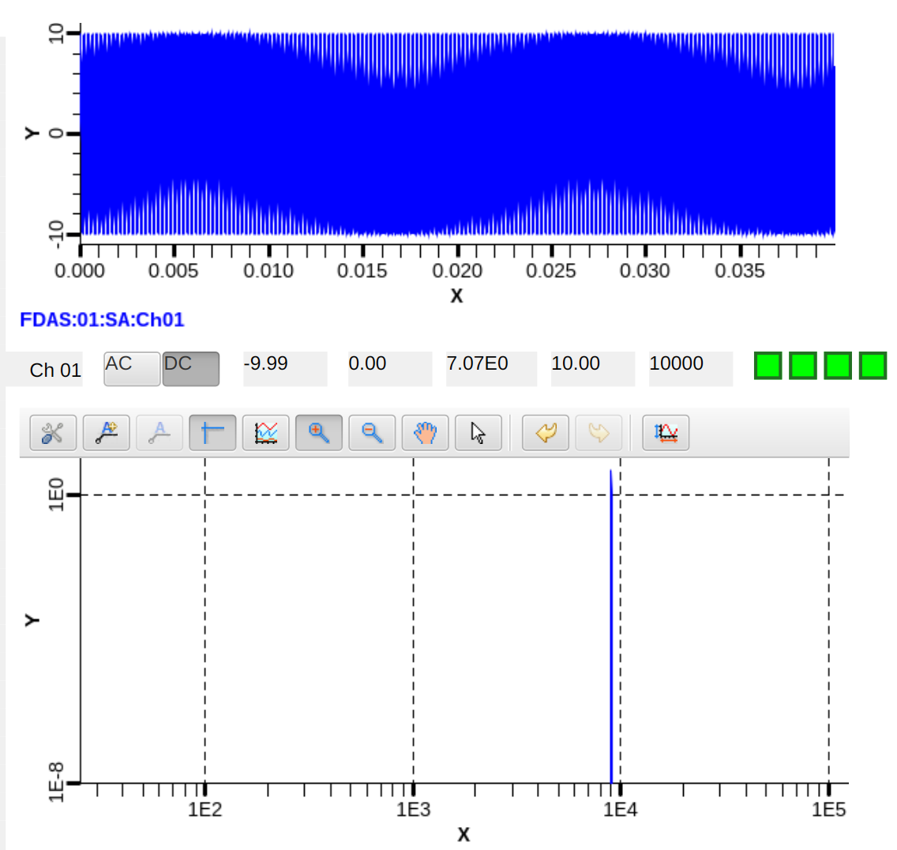
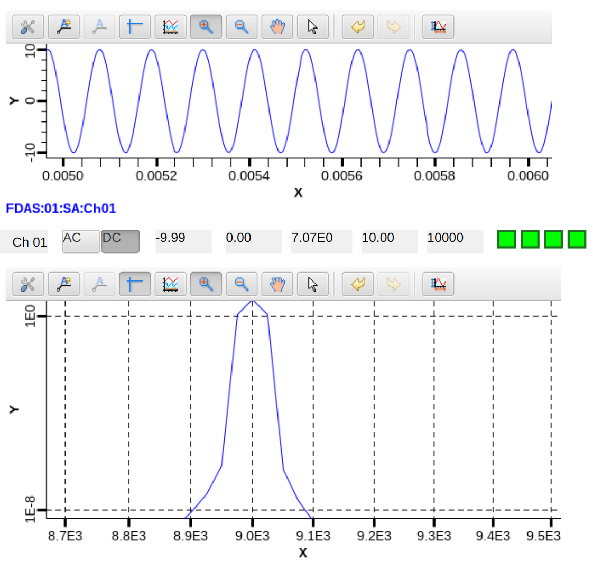
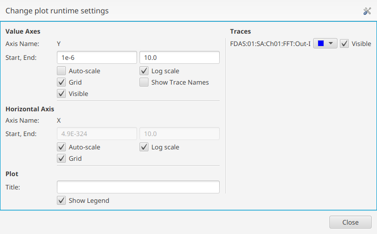

# FDAS System Functional Checkout

The purpose of this procedure is to bring the FDAS system
into a known functional state.

## 1. Prerequisites

- Availability of a CCCR file configuring the channels to be verified to a voltage scale.  (no EGU, ESLO=1.0, ESLO=0.0)
- Locate function generator (eg. Agilent 33220 Waveform generator)
- Locate test cable set as described in [D.4.2](D-4-02_PROC_-_Measurement_Device_Calibration.md).

## 2. Preparation

Configuring function generator for AC response test

1. Function generator
  1. Reset function generator to defaults
    - May exclude settings known not to effect output, eg. network address
    - May use setting save/restore feature
  1. Ensure output is disabled
  1. Set output to high impedance (HighZ)
  1. Select sine wave
  1. Set offset to one volts (1 V)
  1. Set amplitude +-5 V (10 Vpp)
  1. Set frequency to 9 KHz

Note: Running [D.4.2](D-4-02_PROC_-_Measurement_Device_Calibration.md)
      will reconfigure the function generator.
      It is recommended to reset and setup, then save settings once,
      and thereafter restore settings following each calibration run.

## 3. Expected Response

Figure 1. Chassis Scope screen showing expected response to 9 KHz sine wave.

Figure 2. Chassis Scope zoomed in in both time and frequency.

Essential frequency (FFT) response characteristics.

- Primary peak at 9 KHz
    - Amplitude of 5 V
    - Sharp peak <= 3 frequency points
- No other peaks above -80 dB relative (0.0005 V)

The important relationship is the relative size of the peak at 9 KHz to all other peaks,
which should be at least -80 dB less ($10^\frac{-80}{20} = \frac{1}{10000} = 0.0001$).

By default, the
[Chassis Scope](D-4-06_PROC_-_Monitoring_a_Data-Channel_in_Real_Time.md)
screen shows FFT on a log/log plot with base 10.

To simplify interpretation, adjust the FFT Plot scale so that
only peaks above the -80 dB threshold will be visible.
Leave the horizontal scale on auto.

- Change vertical scale to 1e-6 -> 10
- Uncheck auto-scale

Right click on the plot area and select `Configure Plot` from the menu which appears.

Figure 3. Phoebus plot configuration dialog

When verifying function of the AC/DC switching relay by introducing a DC offset,
the offset will be present on the relay is in the DC position,
and absent (zero) when in the AC position.

## 4. Process

1. Run through the "System Power Down" section of [D.4.3](D-4-03_PROC_-_Start-up_and_Shut-down.md).
1. Run through the "System Power Up" section of [D.4.3](D-4-03_PROC_-_Start-up_and_Shut-down.md).
1. Run [D.4.9](D-4-09_PROC_-_Inspecting_the_Current_State_and_Health.md.) Inspecting the Current State and Health of the system
1. Set sample rate to 50Ksps and enable acquisition.  (see [D.4.6](D-4-06_PROC_-_Monitoring_a_Data-Channel_in_Real_Time.md))
1. Chassis 1.  Connect signal generator.
    1. [_] Ensure successful DC calibration ([D.4.2](D-4-02_PROC_-_Measurement_Device_Calibration.md)) of all 32 channels.
    1. Load CCCR [`D-4-01-chassis-01.csv`](cccr/D-4-01-chassis-01.csv) (see [D.4.4](D-4-04_PROC_-_Per_Test_User_Configuration_Procedure.md))
    1. Configure/restore function generator for 9KHz Sine (see the above section 2. Preparation)
        - [ ] 1 V DC offset (channel statistics max. is 6 V, min. is -4 V)
    1. Toggle channel to AC coupling
        - [ ] 0 V DC offset (channel statistics max. is 5 V, min. is -5 V)
    1. Toggle channel to DC coupling
        - [ ] 1 V DC offset (channel statistics max. is 6 V, min. is -4 V)
    1. Collect recording for 10 - 20 seconds (see [D.4.5](D-4-05_PROC_-_Making_a_Recording_Procedure.md))
    1. Open recording in Viewer (see [D.4.7](D-4-07_PROC_-_Review_Previously_Recorded_Data.md))
        - [ ] Channel 1, signal 1.  Verify that the AC response conform to the Expected Response as listed above.
        - [ ] Channel 2, signal 2.  Verify that the AC response conform to the Expected Response as listed above.
        - [ ] Channel 3, signal 3.  Verify that the AC response conform to the Expected Response as listed above.
        - [ ] Channel 4, signal 4.  Verify that the AC response conform to the Expected Response as listed above.
        - [ ] Channel 5, signal 5.  Verify that the AC response conform to the Expected Response as listed above.
        - [ ] Channel 6, signal 6.  Verify that the AC response conform to the Expected Response as listed above.
        - [ ] Channel 7, signal 7.  Verify that the AC response conform to the Expected Response as listed above.
        - [ ] Channel 8, signal 8.  Verify that the AC response conform to the Expected Response as listed above.
        - [ ] Channel 9, signal 9.  Verify that the AC response conform to the Expected Response as listed above.
        - [ ] Channel 10, signal 10.  Verify that the AC response conform to the Expected Response as listed above.
        - [ ] Channel 11, signal 11.  Verify that the AC response conform to the Expected Response as listed above.
        - [ ] Channel 12, signal 12.  Verify that the AC response conform to the Expected Response as listed above.
        - [ ] Channel 13, signal 13.  Verify that the AC response conform to the Expected Response as listed above.
        - [ ] Channel 14, signal 14.  Verify that the AC response conform to the Expected Response as listed above.
        - [ ] Channel 15, signal 15.  Verify that the AC response conform to the Expected Response as listed above.
        - [ ] Channel 16, signal 16.  Verify that the AC response conform to the Expected Response as listed above.
        - [ ] Channel 17, signal 17.  Verify that the AC response conform to the Expected Response as listed above.
        - [ ] Channel 18, signal 18.  Verify that the AC response conform to the Expected Response as listed above.
        - [ ] Channel 19, signal 19.  Verify that the AC response conform to the Expected Response as listed above.
        - [ ] Channel 20, signal 20.  Verify that the AC response conform to the Expected Response as listed above.
        - [ ] Channel 21, signal 21.  Verify that the AC response conform to the Expected Response as listed above.
        - [ ] Channel 22, signal 22.  Verify that the AC response conform to the Expected Response as listed above.
        - [ ] Channel 23, signal 23.  Verify that the AC response conform to the Expected Response as listed above.
        - [ ] Channel 24, signal 24.  Verify that the AC response conform to the Expected Response as listed above.
        - [ ] Channel 25, signal 25.  Verify that the AC response conform to the Expected Response as listed above.
        - [ ] Channel 26, signal 26.  Verify that the AC response conform to the Expected Response as listed above.
        - [ ] Channel 27, signal 27.  Verify that the AC response conform to the Expected Response as listed above.
        - [ ] Channel 28, signal 28.  Verify that the AC response conform to the Expected Response as listed above.
        - [ ] Channel 29, signal 29.  Verify that the AC response conform to the Expected Response as listed above.
        - [ ] Channel 30, signal 30.  Verify that the AC response conform to the Expected Response as listed above.
        - [ ] Channel 31, signal 31.  Verify that the AC response conform to the Expected Response as listed above.
        - [ ] Channel 32, signal 32.  Verify that the AC response conform to the Expected Response as listed above.
1. Chassis 2.  Connect signal generator.
    1. [_] Ensure successful DC calibration ([D.4.2](D-4-02_PROC_-_Measurement_Device_Calibration.md)) of all 32 channels.
    1. Load CCCR [`D-4-01-chassis-02.csv`](cccr/D-4-01-chassis-02.csv) (see [D.4.4](D-4-04_PROC_-_Per_Test_User_Configuration_Procedure.md))
    1. Configure/restore function generator for 9KHz Sine (see the above section 2. Preparation)
        - [ ] 1 V DC offset (channel statistics max. is 6 V, min. is -4 V)
    1. Toggle channel to AC coupling
        - [ ] 0 V DC offset (channel statistics max. is 5 V, min. is -5 V)
    1. Toggle channel to DC coupling
        - [ ] 1 V DC offset (channel statistics max. is 6 V, min. is -4 V)
    1. Collect recording for 10 - 20 seconds (see [D.4.5](D-4-05_PROC_-_Making_a_Recording_Procedure.md))
    1. Open recording in Viewer (see [D.4.7](D-4-07_PROC_-_Review_Previously_Recorded_Data.md))
        - [ ] Channel 1, signal 33.  Verify that the AC response conform to the Expected Response as listed above.
        - [ ] Channel 2, signal 34.  Verify that the AC response conform to the Expected Response as listed above.
        - [ ] Channel 3, signal 35.  Verify that the AC response conform to the Expected Response as listed above.
        - [ ] Channel 4, signal 36.  Verify that the AC response conform to the Expected Response as listed above.
        - [ ] Channel 5, signal 37.  Verify that the AC response conform to the Expected Response as listed above.
        - [ ] Channel 6, signal 38.  Verify that the AC response conform to the Expected Response as listed above.
        - [ ] Channel 7, signal 39.  Verify that the AC response conform to the Expected Response as listed above.
        - [ ] Channel 8, signal 40.  Verify that the AC response conform to the Expected Response as listed above.
        - [ ] Channel 9, signal 41.  Verify that the AC response conform to the Expected Response as listed above.
        - [ ] Channel 10, signal 42.  Verify that the AC response conform to the Expected Response as listed above.
        - [ ] Channel 11, signal 43.  Verify that the AC response conform to the Expected Response as listed above.
        - [ ] Channel 12, signal 44.  Verify that the AC response conform to the Expected Response as listed above.
        - [ ] Channel 13, signal 45.  Verify that the AC response conform to the Expected Response as listed above.
        - [ ] Channel 14, signal 46.  Verify that the AC response conform to the Expected Response as listed above.
        - [ ] Channel 15, signal 47.  Verify that the AC response conform to the Expected Response as listed above.
        - [ ] Channel 16, signal 48.  Verify that the AC response conform to the Expected Response as listed above.
        - [ ] Channel 17, signal 49.  Verify that the AC response conform to the Expected Response as listed above.
        - [ ] Channel 18, signal 50.  Verify that the AC response conform to the Expected Response as listed above.
        - [ ] Channel 19, signal 51.  Verify that the AC response conform to the Expected Response as listed above.
        - [ ] Channel 20, signal 52.  Verify that the AC response conform to the Expected Response as listed above.
        - [ ] Channel 21, signal 53.  Verify that the AC response conform to the Expected Response as listed above.
        - [ ] Channel 22, signal 54.  Verify that the AC response conform to the Expected Response as listed above.
        - [ ] Channel 23, signal 55.  Verify that the AC response conform to the Expected Response as listed above.
        - [ ] Channel 24, signal 56.  Verify that the AC response conform to the Expected Response as listed above.
        - [ ] Channel 25, signal 57.  Verify that the AC response conform to the Expected Response as listed above.
        - [ ] Channel 26, signal 58.  Verify that the AC response conform to the Expected Response as listed above.
        - [ ] Channel 27, signal 59.  Verify that the AC response conform to the Expected Response as listed above.
        - [ ] Channel 28, signal 60.  Verify that the AC response conform to the Expected Response as listed above.
        - [ ] Channel 29, signal 61.  Verify that the AC response conform to the Expected Response as listed above.
        - [ ] Channel 30, signal 62.  Verify that the AC response conform to the Expected Response as listed above.
        - [ ] Channel 31, signal 63.  Verify that the AC response conform to the Expected Response as listed above.
        - [ ] Channel 32, signal 64.  Verify that the AC response conform to the Expected Response as listed above.
1. Chassis 3.  Connect signal generator.
    1. [_] Ensure successful DC calibration ([D.4.2](D-4-02_PROC_-_Measurement_Device_Calibration.md)) of all 32 channels.
    1. Load CCCR [`D-4-01-chassis-03.csv`](cccr/D-4-01-chassis-03.csv) (see [D.4.4](D-4-04_PROC_-_Per_Test_User_Configuration_Procedure.md))
    1. Configure/restore function generator for 9KHz Sine (see the above section 2. Preparation)
        - [ ] 1 V DC offset (channel statistics max. is 6 V, min. is -4 V)
    1. Toggle channel to AC coupling
        - [ ] 0 V DC offset (channel statistics max. is 5 V, min. is -5 V)
    1. Toggle channel to DC coupling
        - [ ] 1 V DC offset (channel statistics max. is 6 V, min. is -4 V)
    1. Collect recording for 10 - 20 seconds (see [D.4.5](D-4-05_PROC_-_Making_a_Recording_Procedure.md))
    1. Open recording in Viewer (see [D.4.7](D-4-07_PROC_-_Review_Previously_Recorded_Data.md))
        - [ ] Channel 1, signal 65.  Verify that the AC response conform to the Expected Response as listed above.
        - [ ] Channel 2, signal 66.  Verify that the AC response conform to the Expected Response as listed above.
        - [ ] Channel 3, signal 67.  Verify that the AC response conform to the Expected Response as listed above.
        - [ ] Channel 4, signal 68.  Verify that the AC response conform to the Expected Response as listed above.
        - [ ] Channel 5, signal 69.  Verify that the AC response conform to the Expected Response as listed above.
        - [ ] Channel 6, signal 70.  Verify that the AC response conform to the Expected Response as listed above.
        - [ ] Channel 7, signal 71.  Verify that the AC response conform to the Expected Response as listed above.
        - [ ] Channel 8, signal 72.  Verify that the AC response conform to the Expected Response as listed above.
        - [ ] Channel 9, signal 73.  Verify that the AC response conform to the Expected Response as listed above.
        - [ ] Channel 10, signal 74.  Verify that the AC response conform to the Expected Response as listed above.
        - [ ] Channel 11, signal 75.  Verify that the AC response conform to the Expected Response as listed above.
        - [ ] Channel 12, signal 76.  Verify that the AC response conform to the Expected Response as listed above.
        - [ ] Channel 13, signal 77.  Verify that the AC response conform to the Expected Response as listed above.
        - [ ] Channel 14, signal 78.  Verify that the AC response conform to the Expected Response as listed above.
        - [ ] Channel 15, signal 79.  Verify that the AC response conform to the Expected Response as listed above.
        - [ ] Channel 16, signal 80.  Verify that the AC response conform to the Expected Response as listed above.
        - [ ] Channel 17, signal 81.  Verify that the AC response conform to the Expected Response as listed above.
        - [ ] Channel 18, signal 82.  Verify that the AC response conform to the Expected Response as listed above.
        - [ ] Channel 19, signal 83.  Verify that the AC response conform to the Expected Response as listed above.
        - [ ] Channel 20, signal 84.  Verify that the AC response conform to the Expected Response as listed above.
        - [ ] Channel 21, signal 85.  Verify that the AC response conform to the Expected Response as listed above.
        - [ ] Channel 22, signal 86.  Verify that the AC response conform to the Expected Response as listed above.
        - [ ] Channel 23, signal 87.  Verify that the AC response conform to the Expected Response as listed above.
        - [ ] Channel 24, signal 88.  Verify that the AC response conform to the Expected Response as listed above.
        - [ ] Channel 25, signal 89.  Verify that the AC response conform to the Expected Response as listed above.
        - [ ] Channel 26, signal 90.  Verify that the AC response conform to the Expected Response as listed above.
        - [ ] Channel 27, signal 91.  Verify that the AC response conform to the Expected Response as listed above.
        - [ ] Channel 28, signal 92.  Verify that the AC response conform to the Expected Response as listed above.
        - [ ] Channel 29, signal 93.  Verify that the AC response conform to the Expected Response as listed above.
        - [ ] Channel 30, signal 94.  Verify that the AC response conform to the Expected Response as listed above.
        - [ ] Channel 31, signal 95.  Verify that the AC response conform to the Expected Response as listed above.
        - [ ] Channel 32, signal 96.  Verify that the AC response conform to the Expected Response as listed above.
1. Chassis 4.  Connect signal generator.
    1. [_] Ensure successful DC calibration ([D.4.2](D-4-02_PROC_-_Measurement_Device_Calibration.md)) of all 32 channels.
    1. Load CCCR [`D-4-01-chassis-04.csv`](cccr/D-4-01-chassis-04.csv) (see [D.4.4](D-4-04_PROC_-_Per_Test_User_Configuration_Procedure.md))
    1. Configure/restore function generator for 9KHz Sine (see the above section 2. Preparation)
        - [ ] 1 V DC offset (channel statistics max. is 6 V, min. is -4 V)
    1. Toggle channel to AC coupling
        - [ ] 0 V DC offset (channel statistics max. is 5 V, min. is -5 V)
    1. Toggle channel to DC coupling
        - [ ] 1 V DC offset (channel statistics max. is 6 V, min. is -4 V)
    1. Collect recording for 10 - 20 seconds (see [D.4.5](D-4-05_PROC_-_Making_a_Recording_Procedure.md))
    1. Open recording in Viewer (see [D.4.7](D-4-07_PROC_-_Review_Previously_Recorded_Data.md))
        - [ ] Channel 1, signal 97.  Verify that the AC response conform to the Expected Response as listed above.
        - [ ] Channel 2, signal 98.  Verify that the AC response conform to the Expected Response as listed above.
        - [ ] Channel 3, signal 99.  Verify that the AC response conform to the Expected Response as listed above.
        - [ ] Channel 4, signal 100.  Verify that the AC response conform to the Expected Response as listed above.
        - [ ] Channel 5, signal 101.  Verify that the AC response conform to the Expected Response as listed above.
        - [ ] Channel 6, signal 102.  Verify that the AC response conform to the Expected Response as listed above.
        - [ ] Channel 7, signal 103.  Verify that the AC response conform to the Expected Response as listed above.
        - [ ] Channel 8, signal 104.  Verify that the AC response conform to the Expected Response as listed above.
        - [ ] Channel 9, signal 105.  Verify that the AC response conform to the Expected Response as listed above.
        - [ ] Channel 10, signal 106.  Verify that the AC response conform to the Expected Response as listed above.
        - [ ] Channel 11, signal 107.  Verify that the AC response conform to the Expected Response as listed above.
        - [ ] Channel 12, signal 108.  Verify that the AC response conform to the Expected Response as listed above.
        - [ ] Channel 13, signal 109.  Verify that the AC response conform to the Expected Response as listed above.
        - [ ] Channel 14, signal 110.  Verify that the AC response conform to the Expected Response as listed above.
        - [ ] Channel 15, signal 111.  Verify that the AC response conform to the Expected Response as listed above.
        - [ ] Channel 16, signal 112.  Verify that the AC response conform to the Expected Response as listed above.
        - [ ] Channel 17, signal 113.  Verify that the AC response conform to the Expected Response as listed above.
        - [ ] Channel 18, signal 114.  Verify that the AC response conform to the Expected Response as listed above.
        - [ ] Channel 19, signal 115.  Verify that the AC response conform to the Expected Response as listed above.
        - [ ] Channel 20, signal 116.  Verify that the AC response conform to the Expected Response as listed above.
        - [ ] Channel 21, signal 117.  Verify that the AC response conform to the Expected Response as listed above.
        - [ ] Channel 22, signal 118.  Verify that the AC response conform to the Expected Response as listed above.
        - [ ] Channel 23, signal 119.  Verify that the AC response conform to the Expected Response as listed above.
        - [ ] Channel 24, signal 120.  Verify that the AC response conform to the Expected Response as listed above.
        - [ ] Channel 25, signal 121.  Verify that the AC response conform to the Expected Response as listed above.
        - [ ] Channel 26, signal 122.  Verify that the AC response conform to the Expected Response as listed above.
        - [ ] Channel 27, signal 123.  Verify that the AC response conform to the Expected Response as listed above.
        - [ ] Channel 28, signal 124.  Verify that the AC response conform to the Expected Response as listed above.
        - [ ] Channel 29, signal 125.  Verify that the AC response conform to the Expected Response as listed above.
        - [ ] Channel 30, signal 126.  Verify that the AC response conform to the Expected Response as listed above.
        - [ ] Channel 31, signal 127.  Verify that the AC response conform to the Expected Response as listed above.
        - [ ] Channel 32, signal 128.  Verify that the AC response conform to the Expected Response as listed above.
1. Chassis 5.  Connect signal generator.
    1. [_] Ensure successful DC calibration ([D.4.2](D-4-02_PROC_-_Measurement_Device_Calibration.md)) of all 32 channels.
    1. Load CCCR [`D-4-01-chassis-05.csv`](cccr/D-4-01-chassis-05.csv) (see [D.4.4](D-4-04_PROC_-_Per_Test_User_Configuration_Procedure.md))
    1. Configure/restore function generator for 9KHz Sine (see the above section 2. Preparation)
        - [ ] 1 V DC offset (channel statistics max. is 6 V, min. is -4 V)
    1. Toggle channel to AC coupling
        - [ ] 0 V DC offset (channel statistics max. is 5 V, min. is -5 V)
    1. Toggle channel to DC coupling
        - [ ] 1 V DC offset (channel statistics max. is 6 V, min. is -4 V)
    1. Collect recording for 10 - 20 seconds (see [D.4.5](D-4-05_PROC_-_Making_a_Recording_Procedure.md))
    1. Open recording in Viewer (see [D.4.7](D-4-07_PROC_-_Review_Previously_Recorded_Data.md))
        - [ ] Channel 1, signal 129.  Verify that the AC response conform to the Expected Response as listed above.
        - [ ] Channel 2, signal 130.  Verify that the AC response conform to the Expected Response as listed above.
        - [ ] Channel 3, signal 131.  Verify that the AC response conform to the Expected Response as listed above.
        - [ ] Channel 4, signal 132.  Verify that the AC response conform to the Expected Response as listed above.
        - [ ] Channel 5, signal 133.  Verify that the AC response conform to the Expected Response as listed above.
        - [ ] Channel 6, signal 134.  Verify that the AC response conform to the Expected Response as listed above.
        - [ ] Channel 7, signal 135.  Verify that the AC response conform to the Expected Response as listed above.
        - [ ] Channel 8, signal 136.  Verify that the AC response conform to the Expected Response as listed above.
        - [ ] Channel 9, signal 137.  Verify that the AC response conform to the Expected Response as listed above.
        - [ ] Channel 10, signal 138.  Verify that the AC response conform to the Expected Response as listed above.
        - [ ] Channel 11, signal 139.  Verify that the AC response conform to the Expected Response as listed above.
        - [ ] Channel 12, signal 140.  Verify that the AC response conform to the Expected Response as listed above.
        - [ ] Channel 13, signal 141.  Verify that the AC response conform to the Expected Response as listed above.
        - [ ] Channel 14, signal 142.  Verify that the AC response conform to the Expected Response as listed above.
        - [ ] Channel 15, signal 143.  Verify that the AC response conform to the Expected Response as listed above.
        - [ ] Channel 16, signal 144.  Verify that the AC response conform to the Expected Response as listed above.
        - [ ] Channel 17, signal 145.  Verify that the AC response conform to the Expected Response as listed above.
        - [ ] Channel 18, signal 146.  Verify that the AC response conform to the Expected Response as listed above.
        - [ ] Channel 19, signal 147.  Verify that the AC response conform to the Expected Response as listed above.
        - [ ] Channel 20, signal 148.  Verify that the AC response conform to the Expected Response as listed above.
        - [ ] Channel 21, signal 149.  Verify that the AC response conform to the Expected Response as listed above.
        - [ ] Channel 22, signal 150.  Verify that the AC response conform to the Expected Response as listed above.
        - [ ] Channel 23, signal 151.  Verify that the AC response conform to the Expected Response as listed above.
        - [ ] Channel 24, signal 152.  Verify that the AC response conform to the Expected Response as listed above.
        - [ ] Channel 25, signal 153.  Verify that the AC response conform to the Expected Response as listed above.
        - [ ] Channel 26, signal 154.  Verify that the AC response conform to the Expected Response as listed above.
        - [ ] Channel 27, signal 155.  Verify that the AC response conform to the Expected Response as listed above.
        - [ ] Channel 28, signal 156.  Verify that the AC response conform to the Expected Response as listed above.
        - [ ] Channel 29, signal 157.  Verify that the AC response conform to the Expected Response as listed above.
        - [ ] Channel 30, signal 158.  Verify that the AC response conform to the Expected Response as listed above.
        - [ ] Channel 31, signal 159.  Verify that the AC response conform to the Expected Response as listed above.
        - [ ] Channel 32, signal 160.  Verify that the AC response conform to the Expected Response as listed above.
1. Chassis 6.  Connect signal generator.
    1. [_] Ensure successful DC calibration ([D.4.2](D-4-02_PROC_-_Measurement_Device_Calibration.md)) of all 32 channels.
    1. Load CCCR [`D-4-01-chassis-06.csv`](cccr/D-4-01-chassis-06.csv) (see [D.4.4](D-4-04_PROC_-_Per_Test_User_Configuration_Procedure.md))
    1. Configure/restore function generator for 9KHz Sine (see the above section 2. Preparation)
        - [ ] 1 V DC offset (channel statistics max. is 6 V, min. is -4 V)
    1. Toggle channel to AC coupling
        - [ ] 0 V DC offset (channel statistics max. is 5 V, min. is -5 V)
    1. Toggle channel to DC coupling
        - [ ] 1 V DC offset (channel statistics max. is 6 V, min. is -4 V)
    1. Collect recording for 10 - 20 seconds (see [D.4.5](D-4-05_PROC_-_Making_a_Recording_Procedure.md))
    1. Open recording in Viewer (see [D.4.7](D-4-07_PROC_-_Review_Previously_Recorded_Data.md))
        - [ ] Channel 1, signal 161.  Verify that the AC response conform to the Expected Response as listed above.
        - [ ] Channel 2, signal 162.  Verify that the AC response conform to the Expected Response as listed above.
        - [ ] Channel 3, signal 163.  Verify that the AC response conform to the Expected Response as listed above.
        - [ ] Channel 4, signal 164.  Verify that the AC response conform to the Expected Response as listed above.
        - [ ] Channel 5, signal 165.  Verify that the AC response conform to the Expected Response as listed above.
        - [ ] Channel 6, signal 166.  Verify that the AC response conform to the Expected Response as listed above.
        - [ ] Channel 7, signal 167.  Verify that the AC response conform to the Expected Response as listed above.
        - [ ] Channel 8, signal 168.  Verify that the AC response conform to the Expected Response as listed above.
        - [ ] Channel 9, signal 169.  Verify that the AC response conform to the Expected Response as listed above.
        - [ ] Channel 10, signal 170.  Verify that the AC response conform to the Expected Response as listed above.
        - [ ] Channel 11, signal 171.  Verify that the AC response conform to the Expected Response as listed above.
        - [ ] Channel 12, signal 172.  Verify that the AC response conform to the Expected Response as listed above.
        - [ ] Channel 13, signal 173.  Verify that the AC response conform to the Expected Response as listed above.
        - [ ] Channel 14, signal 174.  Verify that the AC response conform to the Expected Response as listed above.
        - [ ] Channel 15, signal 175.  Verify that the AC response conform to the Expected Response as listed above.
        - [ ] Channel 16, signal 176.  Verify that the AC response conform to the Expected Response as listed above.
        - [ ] Channel 17, signal 177.  Verify that the AC response conform to the Expected Response as listed above.
        - [ ] Channel 18, signal 178.  Verify that the AC response conform to the Expected Response as listed above.
        - [ ] Channel 19, signal 179.  Verify that the AC response conform to the Expected Response as listed above.
        - [ ] Channel 20, signal 180.  Verify that the AC response conform to the Expected Response as listed above.
        - [ ] Channel 21, signal 181.  Verify that the AC response conform to the Expected Response as listed above.
        - [ ] Channel 22, signal 182.  Verify that the AC response conform to the Expected Response as listed above.
        - [ ] Channel 23, signal 183.  Verify that the AC response conform to the Expected Response as listed above.
        - [ ] Channel 24, signal 184.  Verify that the AC response conform to the Expected Response as listed above.
        - [ ] Channel 25, signal 185.  Verify that the AC response conform to the Expected Response as listed above.
        - [ ] Channel 26, signal 186.  Verify that the AC response conform to the Expected Response as listed above.
        - [ ] Channel 27, signal 187.  Verify that the AC response conform to the Expected Response as listed above.
        - [ ] Channel 28, signal 188.  Verify that the AC response conform to the Expected Response as listed above.
        - [ ] Channel 29, signal 189.  Verify that the AC response conform to the Expected Response as listed above.
        - [ ] Channel 30, signal 190.  Verify that the AC response conform to the Expected Response as listed above.
        - [ ] Channel 31, signal 191.  Verify that the AC response conform to the Expected Response as listed above.
        - [ ] Channel 32, signal 192.  Verify that the AC response conform to the Expected Response as listed above.
1. Chassis 7.  Connect signal generator.
    1. [_] Ensure successful DC calibration ([D.4.2](D-4-02_PROC_-_Measurement_Device_Calibration.md)) of all 32 channels.
    1. Load CCCR [`D-4-01-chassis-07.csv`](cccr/D-4-01-chassis-07.csv) (see [D.4.4](D-4-04_PROC_-_Per_Test_User_Configuration_Procedure.md))
    1. Configure/restore function generator for 9KHz Sine (see the above section 2. Preparation)
        - [ ] 1 V DC offset (channel statistics max. is 6 V, min. is -4 V)
    1. Toggle channel to AC coupling
        - [ ] 0 V DC offset (channel statistics max. is 5 V, min. is -5 V)
    1. Toggle channel to DC coupling
        - [ ] 1 V DC offset (channel statistics max. is 6 V, min. is -4 V)
    1. Collect recording for 10 - 20 seconds (see [D.4.5](D-4-05_PROC_-_Making_a_Recording_Procedure.md))
    1. Open recording in Viewer (see [D.4.7](D-4-07_PROC_-_Review_Previously_Recorded_Data.md))
        - [ ] Channel 1, signal 193.  Verify that the AC response conform to the Expected Response as listed above.
        - [ ] Channel 2, signal 194.  Verify that the AC response conform to the Expected Response as listed above.
        - [ ] Channel 3, signal 195.  Verify that the AC response conform to the Expected Response as listed above.
        - [ ] Channel 4, signal 196.  Verify that the AC response conform to the Expected Response as listed above.
        - [ ] Channel 5, signal 197.  Verify that the AC response conform to the Expected Response as listed above.
        - [ ] Channel 6, signal 198.  Verify that the AC response conform to the Expected Response as listed above.
        - [ ] Channel 7, signal 199.  Verify that the AC response conform to the Expected Response as listed above.
        - [ ] Channel 8, signal 200.  Verify that the AC response conform to the Expected Response as listed above.
        - [ ] Channel 9, signal 201.  Verify that the AC response conform to the Expected Response as listed above.
        - [ ] Channel 10, signal 202.  Verify that the AC response conform to the Expected Response as listed above.
        - [ ] Channel 11, signal 203.  Verify that the AC response conform to the Expected Response as listed above.
        - [ ] Channel 12, signal 204.  Verify that the AC response conform to the Expected Response as listed above.
        - [ ] Channel 13, signal 205.  Verify that the AC response conform to the Expected Response as listed above.
        - [ ] Channel 14, signal 206.  Verify that the AC response conform to the Expected Response as listed above.
        - [ ] Channel 15, signal 207.  Verify that the AC response conform to the Expected Response as listed above.
        - [ ] Channel 16, signal 208.  Verify that the AC response conform to the Expected Response as listed above.
        - [ ] Channel 17, signal 209.  Verify that the AC response conform to the Expected Response as listed above.
        - [ ] Channel 18, signal 210.  Verify that the AC response conform to the Expected Response as listed above.
        - [ ] Channel 19, signal 211.  Verify that the AC response conform to the Expected Response as listed above.
        - [ ] Channel 20, signal 212.  Verify that the AC response conform to the Expected Response as listed above.
        - [ ] Channel 21, signal 213.  Verify that the AC response conform to the Expected Response as listed above.
        - [ ] Channel 22, signal 214.  Verify that the AC response conform to the Expected Response as listed above.
        - [ ] Channel 23, signal 215.  Verify that the AC response conform to the Expected Response as listed above.
        - [ ] Channel 24, signal 216.  Verify that the AC response conform to the Expected Response as listed above.
        - [ ] Channel 25, signal 217.  Verify that the AC response conform to the Expected Response as listed above.
        - [ ] Channel 26, signal 218.  Verify that the AC response conform to the Expected Response as listed above.
        - [ ] Channel 27, signal 219.  Verify that the AC response conform to the Expected Response as listed above.
        - [ ] Channel 28, signal 220.  Verify that the AC response conform to the Expected Response as listed above.
        - [ ] Channel 29, signal 221.  Verify that the AC response conform to the Expected Response as listed above.
        - [ ] Channel 30, signal 222.  Verify that the AC response conform to the Expected Response as listed above.
        - [ ] Channel 31, signal 223.  Verify that the AC response conform to the Expected Response as listed above.
        - [ ] Channel 32, signal 224.  Verify that the AC response conform to the Expected Response as listed above.
1. Chassis 8.  Connect signal generator.
    1. [_] Ensure successful DC calibration ([D.4.2](D-4-02_PROC_-_Measurement_Device_Calibration.md)) of all 32 channels.
    1. Load CCCR [`D-4-01-chassis-08.csv`](cccr/D-4-01-chassis-08.csv) (see [D.4.4](D-4-04_PROC_-_Per_Test_User_Configuration_Procedure.md))
    1. Configure/restore function generator for 9KHz Sine (see the above section 2. Preparation)
        - [ ] 1 V DC offset (channel statistics max. is 6 V, min. is -4 V)
    1. Toggle channel to AC coupling
        - [ ] 0 V DC offset (channel statistics max. is 5 V, min. is -5 V)
    1. Toggle channel to DC coupling
        - [ ] 1 V DC offset (channel statistics max. is 6 V, min. is -4 V)
    1. Collect recording for 10 - 20 seconds (see [D.4.5](D-4-05_PROC_-_Making_a_Recording_Procedure.md))
    1. Open recording in Viewer (see [D.4.7](D-4-07_PROC_-_Review_Previously_Recorded_Data.md))
        - [ ] Channel 1, signal 225.  Verify that the AC response conform to the Expected Response as listed above.
        - [ ] Channel 2, signal 226.  Verify that the AC response conform to the Expected Response as listed above.
        - [ ] Channel 3, signal 227.  Verify that the AC response conform to the Expected Response as listed above.
        - [ ] Channel 4, signal 228.  Verify that the AC response conform to the Expected Response as listed above.
        - [ ] Channel 5, signal 229.  Verify that the AC response conform to the Expected Response as listed above.
        - [ ] Channel 6, signal 230.  Verify that the AC response conform to the Expected Response as listed above.
        - [ ] Channel 7, signal 231.  Verify that the AC response conform to the Expected Response as listed above.
        - [ ] Channel 8, signal 232.  Verify that the AC response conform to the Expected Response as listed above.
        - [ ] Channel 9, signal 233.  Verify that the AC response conform to the Expected Response as listed above.
        - [ ] Channel 10, signal 234.  Verify that the AC response conform to the Expected Response as listed above.
        - [ ] Channel 11, signal 235.  Verify that the AC response conform to the Expected Response as listed above.
        - [ ] Channel 12, signal 236.  Verify that the AC response conform to the Expected Response as listed above.
        - [ ] Channel 13, signal 237.  Verify that the AC response conform to the Expected Response as listed above.
        - [ ] Channel 14, signal 238.  Verify that the AC response conform to the Expected Response as listed above.
        - [ ] Channel 15, signal 239.  Verify that the AC response conform to the Expected Response as listed above.
        - [ ] Channel 16, signal 240.  Verify that the AC response conform to the Expected Response as listed above.
        - [ ] Channel 17, signal 241.  Verify that the AC response conform to the Expected Response as listed above.
        - [ ] Channel 18, signal 242.  Verify that the AC response conform to the Expected Response as listed above.
        - [ ] Channel 19, signal 243.  Verify that the AC response conform to the Expected Response as listed above.
        - [ ] Channel 20, signal 244.  Verify that the AC response conform to the Expected Response as listed above.
        - [ ] Channel 21, signal 245.  Verify that the AC response conform to the Expected Response as listed above.
        - [ ] Channel 22, signal 246.  Verify that the AC response conform to the Expected Response as listed above.
        - [ ] Channel 23, signal 247.  Verify that the AC response conform to the Expected Response as listed above.
        - [ ] Channel 24, signal 248.  Verify that the AC response conform to the Expected Response as listed above.
        - [ ] Channel 25, signal 249.  Verify that the AC response conform to the Expected Response as listed above.
        - [ ] Channel 26, signal 250.  Verify that the AC response conform to the Expected Response as listed above.
        - [ ] Channel 27, signal 251.  Verify that the AC response conform to the Expected Response as listed above.
        - [ ] Channel 28, signal 252.  Verify that the AC response conform to the Expected Response as listed above.
        - [ ] Channel 29, signal 253.  Verify that the AC response conform to the Expected Response as listed above.
        - [ ] Channel 30, signal 254.  Verify that the AC response conform to the Expected Response as listed above.
        - [ ] Channel 31, signal 255.  Verify that the AC response conform to the Expected Response as listed above.
        - [ ] Channel 32, signal 256.  Verify that the AC response conform to the Expected Response as listed above.
1. Load CCCR [`D-4-01-all-channels.csv`](cccr/D-4-01-all-channels.csv)  (see [D.4.4](D-4-04_PROC_-_Per_Test_User_Configuration_Procedure.md))
1. __Collect and verify recording for 15 to 16 minutes at 1Ksps__
    1. Set sample rate to 1Ksps and enable acquisition.  (see [D.4.6](D-4-06_PROC_-_Monitoring_a_Data-Channel_in_Real_Time.md))
    1. Record for 15 to 16 minutes  (see [D.4.5](D-4-05_PROC_-_Making_a_Recording_Procedure.md))
    1. Inspect this recording according to [D.4.7](D-4-07_PROC_-_Review_Previously_Recorded_Data.md).
    1. [_] Ensure data is complete for the entire 15 to 16 range
1. __Collect and verify recording for 15 to 16 minutes at 5Ksps__
    1. Set sample rate to 5Ksps and enable acquisition.  (see [D.4.6](D-4-06_PROC_-_Monitoring_a_Data-Channel_in_Real_Time.md))
    1. Record for 15 to 16 minutes  (see [D.4.5](D-4-05_PROC_-_Making_a_Recording_Procedure.md))
    1. Inspect this recording according to [D.4.7](D-4-07_PROC_-_Review_Previously_Recorded_Data.md).
    1. [_] Ensure data is complete for the entire 15 to 16 range
1. __Collect and verify recording for 15 to 16 minutes at 25Ksps__
    1. Set sample rate to 25Ksps and enable acquisition.  (see [D.4.6](D-4-06_PROC_-_Monitoring_a_Data-Channel_in_Real_Time.md))
    1. Record for 15 to 16 minutes  (see [D.4.5](D-4-05_PROC_-_Making_a_Recording_Procedure.md))
    1. Inspect this recording according to [D.4.7](D-4-07_PROC_-_Review_Previously_Recorded_Data.md).
    1. [_] Ensure data is complete for the entire 15 to 16 range
1. __Collect and verify recording for 15 to 16 minutes at 50Ksps__
    1. Set sample rate to 50Ksps and enable acquisition.  (see [D.4.6](D-4-06_PROC_-_Monitoring_a_Data-Channel_in_Real_Time.md))
    1. Record for 15 to 16 minutes  (see [D.4.5](D-4-05_PROC_-_Making_a_Recording_Procedure.md))
    1. Inspect this recording according to [D.4.7](D-4-07_PROC_-_Review_Previously_Recorded_Data.md).
    1. [_] Ensure data is complete for the entire 15 to 16 range
1. Power off chassis 9 through 32
1. Set sample rate to 250Ksps and enable acquisition.  (see [D.4.6](D-4-06_PROC_-_Monitoring_a_Data-Channel_in_Real_Time.md))
1. Chassis 1.  Connect signal generator.
    1. [_] Ensure successful DC calibration ([D.4.2](D-4-02_PROC_-_Measurement_Device_Calibration.md)) of all 32 channels.
    1. Load CCCR [`D-4-01-chassis-01.csv`](cccr/D-4-01-chassis-01.csv) (see [D.4.4](D-4-04_PROC_-_Per_Test_User_Configuration_Procedure.md))
    1. Configure/restore function generator for 9KHz Sine (see Preparation above)
    1. Collect recording for 10 - 20 seconds (see [D.4.5](D-4-05_PROC_-_Making_a_Recording_Procedure.md))
    1. Open recording in Viewer (see [D.4.7](D-4-07_PROC_-_Review_Previously_Recorded_Data.md))
        - [ ] Channel 1, signal 1.  Verify that the AC response conform to the Expected Response as listed above.
        - [ ] Channel 2, signal 2.  Verify that the AC response conform to the Expected Response as listed above.
        - [ ] Channel 3, signal 3.  Verify that the AC response conform to the Expected Response as listed above.
        - [ ] Channel 4, signal 4.  Verify that the AC response conform to the Expected Response as listed above.
        - [ ] Channel 5, signal 5.  Verify that the AC response conform to the Expected Response as listed above.
        - [ ] Channel 6, signal 6.  Verify that the AC response conform to the Expected Response as listed above.
        - [ ] Channel 7, signal 7.  Verify that the AC response conform to the Expected Response as listed above.
        - [ ] Channel 8, signal 8.  Verify that the AC response conform to the Expected Response as listed above.
        - [ ] Channel 9, signal 9.  Verify that the AC response conform to the Expected Response as listed above.
        - [ ] Channel 10, signal 10.  Verify that the AC response conform to the Expected Response as listed above.
        - [ ] Channel 11, signal 11.  Verify that the AC response conform to the Expected Response as listed above.
        - [ ] Channel 12, signal 12.  Verify that the AC response conform to the Expected Response as listed above.
        - [ ] Channel 13, signal 13.  Verify that the AC response conform to the Expected Response as listed above.
        - [ ] Channel 14, signal 14.  Verify that the AC response conform to the Expected Response as listed above.
        - [ ] Channel 15, signal 15.  Verify that the AC response conform to the Expected Response as listed above.
        - [ ] Channel 16, signal 16.  Verify that the AC response conform to the Expected Response as listed above.
        - [ ] Channel 17, signal 17.  Verify that the AC response conform to the Expected Response as listed above.
        - [ ] Channel 18, signal 18.  Verify that the AC response conform to the Expected Response as listed above.
        - [ ] Channel 19, signal 19.  Verify that the AC response conform to the Expected Response as listed above.
        - [ ] Channel 20, signal 20.  Verify that the AC response conform to the Expected Response as listed above.
        - [ ] Channel 21, signal 21.  Verify that the AC response conform to the Expected Response as listed above.
        - [ ] Channel 22, signal 22.  Verify that the AC response conform to the Expected Response as listed above.
        - [ ] Channel 23, signal 23.  Verify that the AC response conform to the Expected Response as listed above.
        - [ ] Channel 24, signal 24.  Verify that the AC response conform to the Expected Response as listed above.
        - [ ] Channel 25, signal 25.  Verify that the AC response conform to the Expected Response as listed above.
        - [ ] Channel 26, signal 26.  Verify that the AC response conform to the Expected Response as listed above.
        - [ ] Channel 27, signal 27.  Verify that the AC response conform to the Expected Response as listed above.
        - [ ] Channel 28, signal 28.  Verify that the AC response conform to the Expected Response as listed above.
        - [ ] Channel 29, signal 29.  Verify that the AC response conform to the Expected Response as listed above.
        - [ ] Channel 30, signal 30.  Verify that the AC response conform to the Expected Response as listed above.
        - [ ] Channel 31, signal 31.  Verify that the AC response conform to the Expected Response as listed above.
        - [ ] Channel 32, signal 32.  Verify that the AC response conform to the Expected Response as listed above.
1. Chassis 2.  Connect signal generator.
    1. [_] Ensure successful DC calibration ([D.4.2](D-4-02_PROC_-_Measurement_Device_Calibration.md)) of all 32 channels.
    1. Load CCCR [`D-4-01-chassis-02.csv`](cccr/D-4-01-chassis-02.csv) (see [D.4.4](D-4-04_PROC_-_Per_Test_User_Configuration_Procedure.md))
    1. Configure/restore function generator for 9KHz Sine (see Preparation above)
    1. Collect recording for 10 - 20 seconds (see [D.4.5](D-4-05_PROC_-_Making_a_Recording_Procedure.md))
    1. Open recording in Viewer (see [D.4.7](D-4-07_PROC_-_Review_Previously_Recorded_Data.md))
        - [ ] Channel 1, signal 33.  Verify that the AC response conform to the Expected Response as listed above.
        - [ ] Channel 2, signal 34.  Verify that the AC response conform to the Expected Response as listed above.
        - [ ] Channel 3, signal 35.  Verify that the AC response conform to the Expected Response as listed above.
        - [ ] Channel 4, signal 36.  Verify that the AC response conform to the Expected Response as listed above.
        - [ ] Channel 5, signal 37.  Verify that the AC response conform to the Expected Response as listed above.
        - [ ] Channel 6, signal 38.  Verify that the AC response conform to the Expected Response as listed above.
        - [ ] Channel 7, signal 39.  Verify that the AC response conform to the Expected Response as listed above.
        - [ ] Channel 8, signal 40.  Verify that the AC response conform to the Expected Response as listed above.
        - [ ] Channel 9, signal 41.  Verify that the AC response conform to the Expected Response as listed above.
        - [ ] Channel 10, signal 42.  Verify that the AC response conform to the Expected Response as listed above.
        - [ ] Channel 11, signal 43.  Verify that the AC response conform to the Expected Response as listed above.
        - [ ] Channel 12, signal 44.  Verify that the AC response conform to the Expected Response as listed above.
        - [ ] Channel 13, signal 45.  Verify that the AC response conform to the Expected Response as listed above.
        - [ ] Channel 14, signal 46.  Verify that the AC response conform to the Expected Response as listed above.
        - [ ] Channel 15, signal 47.  Verify that the AC response conform to the Expected Response as listed above.
        - [ ] Channel 16, signal 48.  Verify that the AC response conform to the Expected Response as listed above.
        - [ ] Channel 17, signal 49.  Verify that the AC response conform to the Expected Response as listed above.
        - [ ] Channel 18, signal 50.  Verify that the AC response conform to the Expected Response as listed above.
        - [ ] Channel 19, signal 51.  Verify that the AC response conform to the Expected Response as listed above.
        - [ ] Channel 20, signal 52.  Verify that the AC response conform to the Expected Response as listed above.
        - [ ] Channel 21, signal 53.  Verify that the AC response conform to the Expected Response as listed above.
        - [ ] Channel 22, signal 54.  Verify that the AC response conform to the Expected Response as listed above.
        - [ ] Channel 23, signal 55.  Verify that the AC response conform to the Expected Response as listed above.
        - [ ] Channel 24, signal 56.  Verify that the AC response conform to the Expected Response as listed above.
        - [ ] Channel 25, signal 57.  Verify that the AC response conform to the Expected Response as listed above.
        - [ ] Channel 26, signal 58.  Verify that the AC response conform to the Expected Response as listed above.
        - [ ] Channel 27, signal 59.  Verify that the AC response conform to the Expected Response as listed above.
        - [ ] Channel 28, signal 60.  Verify that the AC response conform to the Expected Response as listed above.
        - [ ] Channel 29, signal 61.  Verify that the AC response conform to the Expected Response as listed above.
        - [ ] Channel 30, signal 62.  Verify that the AC response conform to the Expected Response as listed above.
        - [ ] Channel 31, signal 63.  Verify that the AC response conform to the Expected Response as listed above.
        - [ ] Channel 32, signal 64.  Verify that the AC response conform to the Expected Response as listed above.
1. Chassis 3.  Connect signal generator.
    1. [_] Ensure successful DC calibration ([D.4.2](D-4-02_PROC_-_Measurement_Device_Calibration.md)) of all 32 channels.
    1. Load CCCR [`D-4-01-chassis-03.csv`](cccr/D-4-01-chassis-03.csv) (see [D.4.4](D-4-04_PROC_-_Per_Test_User_Configuration_Procedure.md))
    1. Configure/restore function generator for 9KHz Sine (see Preparation above)
    1. Collect recording for 10 - 20 seconds (see [D.4.5](D-4-05_PROC_-_Making_a_Recording_Procedure.md))
    1. Open recording in Viewer (see [D.4.7](D-4-07_PROC_-_Review_Previously_Recorded_Data.md))
        - [ ] Channel 1, signal 65.  Verify that the AC response conform to the Expected Response as listed above.
        - [ ] Channel 2, signal 66.  Verify that the AC response conform to the Expected Response as listed above.
        - [ ] Channel 3, signal 67.  Verify that the AC response conform to the Expected Response as listed above.
        - [ ] Channel 4, signal 68.  Verify that the AC response conform to the Expected Response as listed above.
        - [ ] Channel 5, signal 69.  Verify that the AC response conform to the Expected Response as listed above.
        - [ ] Channel 6, signal 70.  Verify that the AC response conform to the Expected Response as listed above.
        - [ ] Channel 7, signal 71.  Verify that the AC response conform to the Expected Response as listed above.
        - [ ] Channel 8, signal 72.  Verify that the AC response conform to the Expected Response as listed above.
        - [ ] Channel 9, signal 73.  Verify that the AC response conform to the Expected Response as listed above.
        - [ ] Channel 10, signal 74.  Verify that the AC response conform to the Expected Response as listed above.
        - [ ] Channel 11, signal 75.  Verify that the AC response conform to the Expected Response as listed above.
        - [ ] Channel 12, signal 76.  Verify that the AC response conform to the Expected Response as listed above.
        - [ ] Channel 13, signal 77.  Verify that the AC response conform to the Expected Response as listed above.
        - [ ] Channel 14, signal 78.  Verify that the AC response conform to the Expected Response as listed above.
        - [ ] Channel 15, signal 79.  Verify that the AC response conform to the Expected Response as listed above.
        - [ ] Channel 16, signal 80.  Verify that the AC response conform to the Expected Response as listed above.
        - [ ] Channel 17, signal 81.  Verify that the AC response conform to the Expected Response as listed above.
        - [ ] Channel 18, signal 82.  Verify that the AC response conform to the Expected Response as listed above.
        - [ ] Channel 19, signal 83.  Verify that the AC response conform to the Expected Response as listed above.
        - [ ] Channel 20, signal 84.  Verify that the AC response conform to the Expected Response as listed above.
        - [ ] Channel 21, signal 85.  Verify that the AC response conform to the Expected Response as listed above.
        - [ ] Channel 22, signal 86.  Verify that the AC response conform to the Expected Response as listed above.
        - [ ] Channel 23, signal 87.  Verify that the AC response conform to the Expected Response as listed above.
        - [ ] Channel 24, signal 88.  Verify that the AC response conform to the Expected Response as listed above.
        - [ ] Channel 25, signal 89.  Verify that the AC response conform to the Expected Response as listed above.
        - [ ] Channel 26, signal 90.  Verify that the AC response conform to the Expected Response as listed above.
        - [ ] Channel 27, signal 91.  Verify that the AC response conform to the Expected Response as listed above.
        - [ ] Channel 28, signal 92.  Verify that the AC response conform to the Expected Response as listed above.
        - [ ] Channel 29, signal 93.  Verify that the AC response conform to the Expected Response as listed above.
        - [ ] Channel 30, signal 94.  Verify that the AC response conform to the Expected Response as listed above.
        - [ ] Channel 31, signal 95.  Verify that the AC response conform to the Expected Response as listed above.
        - [ ] Channel 32, signal 96.  Verify that the AC response conform to the Expected Response as listed above.
1. Chassis 4.  Connect signal generator.
    1. [_] Ensure successful DC calibration ([D.4.2](D-4-02_PROC_-_Measurement_Device_Calibration.md)) of all 32 channels.
    1. Load CCCR [`D-4-01-chassis-04.csv`](cccr/D-4-01-chassis-04.csv) (see [D.4.4](D-4-04_PROC_-_Per_Test_User_Configuration_Procedure.md))
    1. Configure/restore function generator for 9KHz Sine (see Preparation above)
    1. Collect recording for 10 - 20 seconds (see [D.4.5](D-4-05_PROC_-_Making_a_Recording_Procedure.md))
    1. Open recording in Viewer (see [D.4.7](D-4-07_PROC_-_Review_Previously_Recorded_Data.md))
        - [ ] Channel 1, signal 97.  Verify that the AC response conform to the Expected Response as listed above.
        - [ ] Channel 2, signal 98.  Verify that the AC response conform to the Expected Response as listed above.
        - [ ] Channel 3, signal 99.  Verify that the AC response conform to the Expected Response as listed above.
        - [ ] Channel 4, signal 100.  Verify that the AC response conform to the Expected Response as listed above.
        - [ ] Channel 5, signal 101.  Verify that the AC response conform to the Expected Response as listed above.
        - [ ] Channel 6, signal 102.  Verify that the AC response conform to the Expected Response as listed above.
        - [ ] Channel 7, signal 103.  Verify that the AC response conform to the Expected Response as listed above.
        - [ ] Channel 8, signal 104.  Verify that the AC response conform to the Expected Response as listed above.
        - [ ] Channel 9, signal 105.  Verify that the AC response conform to the Expected Response as listed above.
        - [ ] Channel 10, signal 106.  Verify that the AC response conform to the Expected Response as listed above.
        - [ ] Channel 11, signal 107.  Verify that the AC response conform to the Expected Response as listed above.
        - [ ] Channel 12, signal 108.  Verify that the AC response conform to the Expected Response as listed above.
        - [ ] Channel 13, signal 109.  Verify that the AC response conform to the Expected Response as listed above.
        - [ ] Channel 14, signal 110.  Verify that the AC response conform to the Expected Response as listed above.
        - [ ] Channel 15, signal 111.  Verify that the AC response conform to the Expected Response as listed above.
        - [ ] Channel 16, signal 112.  Verify that the AC response conform to the Expected Response as listed above.
        - [ ] Channel 17, signal 113.  Verify that the AC response conform to the Expected Response as listed above.
        - [ ] Channel 18, signal 114.  Verify that the AC response conform to the Expected Response as listed above.
        - [ ] Channel 19, signal 115.  Verify that the AC response conform to the Expected Response as listed above.
        - [ ] Channel 20, signal 116.  Verify that the AC response conform to the Expected Response as listed above.
        - [ ] Channel 21, signal 117.  Verify that the AC response conform to the Expected Response as listed above.
        - [ ] Channel 22, signal 118.  Verify that the AC response conform to the Expected Response as listed above.
        - [ ] Channel 23, signal 119.  Verify that the AC response conform to the Expected Response as listed above.
        - [ ] Channel 24, signal 120.  Verify that the AC response conform to the Expected Response as listed above.
        - [ ] Channel 25, signal 121.  Verify that the AC response conform to the Expected Response as listed above.
        - [ ] Channel 26, signal 122.  Verify that the AC response conform to the Expected Response as listed above.
        - [ ] Channel 27, signal 123.  Verify that the AC response conform to the Expected Response as listed above.
        - [ ] Channel 28, signal 124.  Verify that the AC response conform to the Expected Response as listed above.
        - [ ] Channel 29, signal 125.  Verify that the AC response conform to the Expected Response as listed above.
        - [ ] Channel 30, signal 126.  Verify that the AC response conform to the Expected Response as listed above.
        - [ ] Channel 31, signal 127.  Verify that the AC response conform to the Expected Response as listed above.
        - [ ] Channel 32, signal 128.  Verify that the AC response conform to the Expected Response as listed above.
1. Chassis 5.  Connect signal generator.
    1. [_] Ensure successful DC calibration ([D.4.2](D-4-02_PROC_-_Measurement_Device_Calibration.md)) of all 32 channels.
    1. Load CCCR [`D-4-01-chassis-05.csv`](cccr/D-4-01-chassis-05.csv) (see [D.4.4](D-4-04_PROC_-_Per_Test_User_Configuration_Procedure.md))
    1. Configure/restore function generator for 9KHz Sine (see Preparation above)
    1. Collect recording for 10 - 20 seconds (see [D.4.5](D-4-05_PROC_-_Making_a_Recording_Procedure.md))
    1. Open recording in Viewer (see [D.4.7](D-4-07_PROC_-_Review_Previously_Recorded_Data.md))
        - [ ] Channel 1, signal 129.  Verify that the AC response conform to the Expected Response as listed above.
        - [ ] Channel 2, signal 130.  Verify that the AC response conform to the Expected Response as listed above.
        - [ ] Channel 3, signal 131.  Verify that the AC response conform to the Expected Response as listed above.
        - [ ] Channel 4, signal 132.  Verify that the AC response conform to the Expected Response as listed above.
        - [ ] Channel 5, signal 133.  Verify that the AC response conform to the Expected Response as listed above.
        - [ ] Channel 6, signal 134.  Verify that the AC response conform to the Expected Response as listed above.
        - [ ] Channel 7, signal 135.  Verify that the AC response conform to the Expected Response as listed above.
        - [ ] Channel 8, signal 136.  Verify that the AC response conform to the Expected Response as listed above.
        - [ ] Channel 9, signal 137.  Verify that the AC response conform to the Expected Response as listed above.
        - [ ] Channel 10, signal 138.  Verify that the AC response conform to the Expected Response as listed above.
        - [ ] Channel 11, signal 139.  Verify that the AC response conform to the Expected Response as listed above.
        - [ ] Channel 12, signal 140.  Verify that the AC response conform to the Expected Response as listed above.
        - [ ] Channel 13, signal 141.  Verify that the AC response conform to the Expected Response as listed above.
        - [ ] Channel 14, signal 142.  Verify that the AC response conform to the Expected Response as listed above.
        - [ ] Channel 15, signal 143.  Verify that the AC response conform to the Expected Response as listed above.
        - [ ] Channel 16, signal 144.  Verify that the AC response conform to the Expected Response as listed above.
        - [ ] Channel 17, signal 145.  Verify that the AC response conform to the Expected Response as listed above.
        - [ ] Channel 18, signal 146.  Verify that the AC response conform to the Expected Response as listed above.
        - [ ] Channel 19, signal 147.  Verify that the AC response conform to the Expected Response as listed above.
        - [ ] Channel 20, signal 148.  Verify that the AC response conform to the Expected Response as listed above.
        - [ ] Channel 21, signal 149.  Verify that the AC response conform to the Expected Response as listed above.
        - [ ] Channel 22, signal 150.  Verify that the AC response conform to the Expected Response as listed above.
        - [ ] Channel 23, signal 151.  Verify that the AC response conform to the Expected Response as listed above.
        - [ ] Channel 24, signal 152.  Verify that the AC response conform to the Expected Response as listed above.
        - [ ] Channel 25, signal 153.  Verify that the AC response conform to the Expected Response as listed above.
        - [ ] Channel 26, signal 154.  Verify that the AC response conform to the Expected Response as listed above.
        - [ ] Channel 27, signal 155.  Verify that the AC response conform to the Expected Response as listed above.
        - [ ] Channel 28, signal 156.  Verify that the AC response conform to the Expected Response as listed above.
        - [ ] Channel 29, signal 157.  Verify that the AC response conform to the Expected Response as listed above.
        - [ ] Channel 30, signal 158.  Verify that the AC response conform to the Expected Response as listed above.
        - [ ] Channel 31, signal 159.  Verify that the AC response conform to the Expected Response as listed above.
        - [ ] Channel 32, signal 160.  Verify that the AC response conform to the Expected Response as listed above.
1. Chassis 6.  Connect signal generator.
    1. [_] Ensure successful DC calibration ([D.4.2](D-4-02_PROC_-_Measurement_Device_Calibration.md)) of all 32 channels.
    1. Load CCCR [`D-4-01-chassis-06.csv`](cccr/D-4-01-chassis-06.csv) (see [D.4.4](D-4-04_PROC_-_Per_Test_User_Configuration_Procedure.md))
    1. Configure/restore function generator for 9KHz Sine (see Preparation above)
    1. Collect recording for 10 - 20 seconds (see [D.4.5](D-4-05_PROC_-_Making_a_Recording_Procedure.md))
    1. Open recording in Viewer (see [D.4.7](D-4-07_PROC_-_Review_Previously_Recorded_Data.md))
        - [ ] Channel 1, signal 161.  Verify that the AC response conform to the Expected Response as listed above.
        - [ ] Channel 2, signal 162.  Verify that the AC response conform to the Expected Response as listed above.
        - [ ] Channel 3, signal 163.  Verify that the AC response conform to the Expected Response as listed above.
        - [ ] Channel 4, signal 164.  Verify that the AC response conform to the Expected Response as listed above.
        - [ ] Channel 5, signal 165.  Verify that the AC response conform to the Expected Response as listed above.
        - [ ] Channel 6, signal 166.  Verify that the AC response conform to the Expected Response as listed above.
        - [ ] Channel 7, signal 167.  Verify that the AC response conform to the Expected Response as listed above.
        - [ ] Channel 8, signal 168.  Verify that the AC response conform to the Expected Response as listed above.
        - [ ] Channel 9, signal 169.  Verify that the AC response conform to the Expected Response as listed above.
        - [ ] Channel 10, signal 170.  Verify that the AC response conform to the Expected Response as listed above.
        - [ ] Channel 11, signal 171.  Verify that the AC response conform to the Expected Response as listed above.
        - [ ] Channel 12, signal 172.  Verify that the AC response conform to the Expected Response as listed above.
        - [ ] Channel 13, signal 173.  Verify that the AC response conform to the Expected Response as listed above.
        - [ ] Channel 14, signal 174.  Verify that the AC response conform to the Expected Response as listed above.
        - [ ] Channel 15, signal 175.  Verify that the AC response conform to the Expected Response as listed above.
        - [ ] Channel 16, signal 176.  Verify that the AC response conform to the Expected Response as listed above.
        - [ ] Channel 17, signal 177.  Verify that the AC response conform to the Expected Response as listed above.
        - [ ] Channel 18, signal 178.  Verify that the AC response conform to the Expected Response as listed above.
        - [ ] Channel 19, signal 179.  Verify that the AC response conform to the Expected Response as listed above.
        - [ ] Channel 20, signal 180.  Verify that the AC response conform to the Expected Response as listed above.
        - [ ] Channel 21, signal 181.  Verify that the AC response conform to the Expected Response as listed above.
        - [ ] Channel 22, signal 182.  Verify that the AC response conform to the Expected Response as listed above.
        - [ ] Channel 23, signal 183.  Verify that the AC response conform to the Expected Response as listed above.
        - [ ] Channel 24, signal 184.  Verify that the AC response conform to the Expected Response as listed above.
        - [ ] Channel 25, signal 185.  Verify that the AC response conform to the Expected Response as listed above.
        - [ ] Channel 26, signal 186.  Verify that the AC response conform to the Expected Response as listed above.
        - [ ] Channel 27, signal 187.  Verify that the AC response conform to the Expected Response as listed above.
        - [ ] Channel 28, signal 188.  Verify that the AC response conform to the Expected Response as listed above.
        - [ ] Channel 29, signal 189.  Verify that the AC response conform to the Expected Response as listed above.
        - [ ] Channel 30, signal 190.  Verify that the AC response conform to the Expected Response as listed above.
        - [ ] Channel 31, signal 191.  Verify that the AC response conform to the Expected Response as listed above.
        - [ ] Channel 32, signal 192.  Verify that the AC response conform to the Expected Response as listed above.
1. Chassis 7.  Connect signal generator.
    1. [_] Ensure successful DC calibration ([D.4.2](D-4-02_PROC_-_Measurement_Device_Calibration.md)) of all 32 channels.
    1. Load CCCR [`D-4-01-chassis-07.csv`](cccr/D-4-01-chassis-07.csv) (see [D.4.4](D-4-04_PROC_-_Per_Test_User_Configuration_Procedure.md))
    1. Configure/restore function generator for 9KHz Sine (see Preparation above)
    1. Collect recording for 10 - 20 seconds (see [D.4.5](D-4-05_PROC_-_Making_a_Recording_Procedure.md))
    1. Open recording in Viewer (see [D.4.7](D-4-07_PROC_-_Review_Previously_Recorded_Data.md))
        - [ ] Channel 1, signal 193.  Verify that the AC response conform to the Expected Response as listed above.
        - [ ] Channel 2, signal 194.  Verify that the AC response conform to the Expected Response as listed above.
        - [ ] Channel 3, signal 195.  Verify that the AC response conform to the Expected Response as listed above.
        - [ ] Channel 4, signal 196.  Verify that the AC response conform to the Expected Response as listed above.
        - [ ] Channel 5, signal 197.  Verify that the AC response conform to the Expected Response as listed above.
        - [ ] Channel 6, signal 198.  Verify that the AC response conform to the Expected Response as listed above.
        - [ ] Channel 7, signal 199.  Verify that the AC response conform to the Expected Response as listed above.
        - [ ] Channel 8, signal 200.  Verify that the AC response conform to the Expected Response as listed above.
        - [ ] Channel 9, signal 201.  Verify that the AC response conform to the Expected Response as listed above.
        - [ ] Channel 10, signal 202.  Verify that the AC response conform to the Expected Response as listed above.
        - [ ] Channel 11, signal 203.  Verify that the AC response conform to the Expected Response as listed above.
        - [ ] Channel 12, signal 204.  Verify that the AC response conform to the Expected Response as listed above.
        - [ ] Channel 13, signal 205.  Verify that the AC response conform to the Expected Response as listed above.
        - [ ] Channel 14, signal 206.  Verify that the AC response conform to the Expected Response as listed above.
        - [ ] Channel 15, signal 207.  Verify that the AC response conform to the Expected Response as listed above.
        - [ ] Channel 16, signal 208.  Verify that the AC response conform to the Expected Response as listed above.
        - [ ] Channel 17, signal 209.  Verify that the AC response conform to the Expected Response as listed above.
        - [ ] Channel 18, signal 210.  Verify that the AC response conform to the Expected Response as listed above.
        - [ ] Channel 19, signal 211.  Verify that the AC response conform to the Expected Response as listed above.
        - [ ] Channel 20, signal 212.  Verify that the AC response conform to the Expected Response as listed above.
        - [ ] Channel 21, signal 213.  Verify that the AC response conform to the Expected Response as listed above.
        - [ ] Channel 22, signal 214.  Verify that the AC response conform to the Expected Response as listed above.
        - [ ] Channel 23, signal 215.  Verify that the AC response conform to the Expected Response as listed above.
        - [ ] Channel 24, signal 216.  Verify that the AC response conform to the Expected Response as listed above.
        - [ ] Channel 25, signal 217.  Verify that the AC response conform to the Expected Response as listed above.
        - [ ] Channel 26, signal 218.  Verify that the AC response conform to the Expected Response as listed above.
        - [ ] Channel 27, signal 219.  Verify that the AC response conform to the Expected Response as listed above.
        - [ ] Channel 28, signal 220.  Verify that the AC response conform to the Expected Response as listed above.
        - [ ] Channel 29, signal 221.  Verify that the AC response conform to the Expected Response as listed above.
        - [ ] Channel 30, signal 222.  Verify that the AC response conform to the Expected Response as listed above.
        - [ ] Channel 31, signal 223.  Verify that the AC response conform to the Expected Response as listed above.
        - [ ] Channel 32, signal 224.  Verify that the AC response conform to the Expected Response as listed above.
1. Chassis 8.  Connect signal generator.
    1. [_] Ensure successful DC calibration ([D.4.2](D-4-02_PROC_-_Measurement_Device_Calibration.md)) of all 32 channels.
    1. Load CCCR [`D-4-01-chassis-08.csv`](cccr/D-4-01-chassis-08.csv) (see [D.4.4](D-4-04_PROC_-_Per_Test_User_Configuration_Procedure.md))
    1. Configure/restore function generator for 9KHz Sine (see Preparation above)
    1. Collect recording for 10 - 20 seconds (see [D.4.5](D-4-05_PROC_-_Making_a_Recording_Procedure.md))
    1. Open recording in Viewer (see [D.4.7](D-4-07_PROC_-_Review_Previously_Recorded_Data.md))
        - [ ] Channel 1, signal 225.  Verify that the AC response conform to the Expected Response as listed above.
        - [ ] Channel 2, signal 226.  Verify that the AC response conform to the Expected Response as listed above.
        - [ ] Channel 3, signal 227.  Verify that the AC response conform to the Expected Response as listed above.
        - [ ] Channel 4, signal 228.  Verify that the AC response conform to the Expected Response as listed above.
        - [ ] Channel 5, signal 229.  Verify that the AC response conform to the Expected Response as listed above.
        - [ ] Channel 6, signal 230.  Verify that the AC response conform to the Expected Response as listed above.
        - [ ] Channel 7, signal 231.  Verify that the AC response conform to the Expected Response as listed above.
        - [ ] Channel 8, signal 232.  Verify that the AC response conform to the Expected Response as listed above.
        - [ ] Channel 9, signal 233.  Verify that the AC response conform to the Expected Response as listed above.
        - [ ] Channel 10, signal 234.  Verify that the AC response conform to the Expected Response as listed above.
        - [ ] Channel 11, signal 235.  Verify that the AC response conform to the Expected Response as listed above.
        - [ ] Channel 12, signal 236.  Verify that the AC response conform to the Expected Response as listed above.
        - [ ] Channel 13, signal 237.  Verify that the AC response conform to the Expected Response as listed above.
        - [ ] Channel 14, signal 238.  Verify that the AC response conform to the Expected Response as listed above.
        - [ ] Channel 15, signal 239.  Verify that the AC response conform to the Expected Response as listed above.
        - [ ] Channel 16, signal 240.  Verify that the AC response conform to the Expected Response as listed above.
        - [ ] Channel 17, signal 241.  Verify that the AC response conform to the Expected Response as listed above.
        - [ ] Channel 18, signal 242.  Verify that the AC response conform to the Expected Response as listed above.
        - [ ] Channel 19, signal 243.  Verify that the AC response conform to the Expected Response as listed above.
        - [ ] Channel 20, signal 244.  Verify that the AC response conform to the Expected Response as listed above.
        - [ ] Channel 21, signal 245.  Verify that the AC response conform to the Expected Response as listed above.
        - [ ] Channel 22, signal 246.  Verify that the AC response conform to the Expected Response as listed above.
        - [ ] Channel 23, signal 247.  Verify that the AC response conform to the Expected Response as listed above.
        - [ ] Channel 24, signal 248.  Verify that the AC response conform to the Expected Response as listed above.
        - [ ] Channel 25, signal 249.  Verify that the AC response conform to the Expected Response as listed above.
        - [ ] Channel 26, signal 250.  Verify that the AC response conform to the Expected Response as listed above.
        - [ ] Channel 27, signal 251.  Verify that the AC response conform to the Expected Response as listed above.
        - [ ] Channel 28, signal 252.  Verify that the AC response conform to the Expected Response as listed above.
        - [ ] Channel 29, signal 253.  Verify that the AC response conform to the Expected Response as listed above.
        - [ ] Channel 30, signal 254.  Verify that the AC response conform to the Expected Response as listed above.
        - [ ] Channel 31, signal 255.  Verify that the AC response conform to the Expected Response as listed above.
        - [ ] Channel 32, signal 256.  Verify that the AC response conform to the Expected Response as listed above.
1. Load CCCR [`D-4-01-256-channels.csv`](cccr/D-4-01-256-channels.csv)  (see [D.4.4](D-4-04_PROC_-_Per_Test_User_Configuration_Procedure.md))
1. Collect recording for 15 minutes at 250Ksps
    1. Set sample rate to 250Ksps and enable acquisition.  (see [D.4.6](D-4-06_PROC_-_Monitoring_a_Data-Channel_in_Real_Time.md))
    1. Record for 15 to 16 minutes  (see [D.4.5](D-4-05_PROC_-_Making_a_Recording_Procedure.md))
    1. Inspect this recording according to [D.4.7](D-4-07_PROC_-_Review_Previously_Recorded_Data.md).
    1. [_] Data is complete for entire time range
1. Export this recording according to [D.4.8](D-4-08_PROC_-_Export_Data_from_the_System.md).
    1. [_] Export as UFF58b
    1. [_] Verify exported UFF58b file
    1. [_] Export as CSV
    1. [_] Verify exported CSV file
1. Execute Cleanup section of [D.4.2](D-4-02_PROC_-_Measurement_Device_Calibration.md).
1. If applicable, run through the "System Power Down" section of [D.4.3](D-4-03_PROC_-_Start-up_and_Shut-down.md).

## 5. References

- Quartz [functional test](https://github.com/osprey-dcs/quartz-daq-250-24/blob/master/documentation/functional-testing.md#alias-rejection-testing)
report.

## 6. Start/Completion Validation

 

Performed By: ______________________

 

Date Initiated: ______________________

 

Date Completed: ______________________

 

- [ ] Check to indicate that this procedure was performed with no deviations or waivers

 

QA Verification by: ______________________

 

QA Verification Date: ______________________
