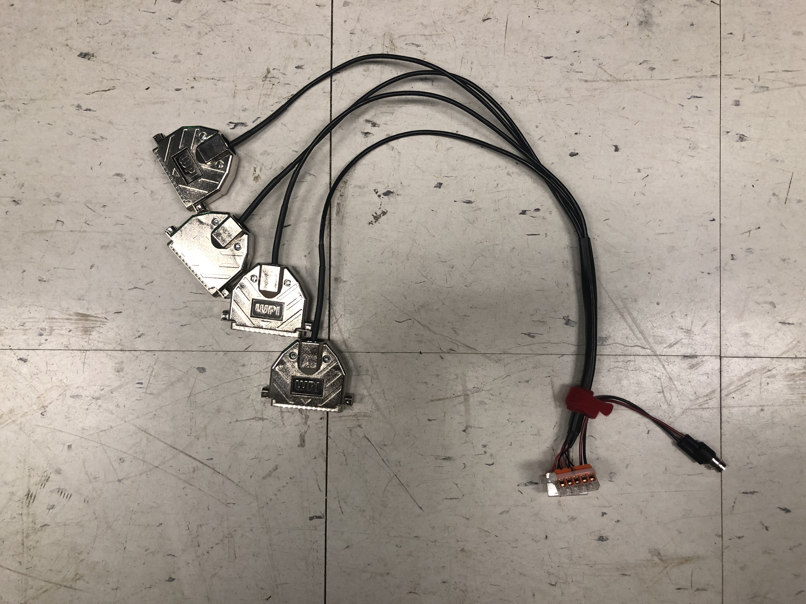
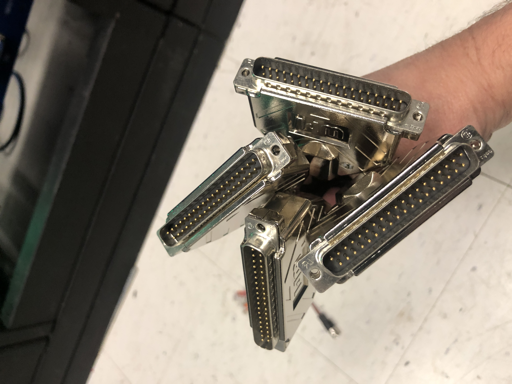
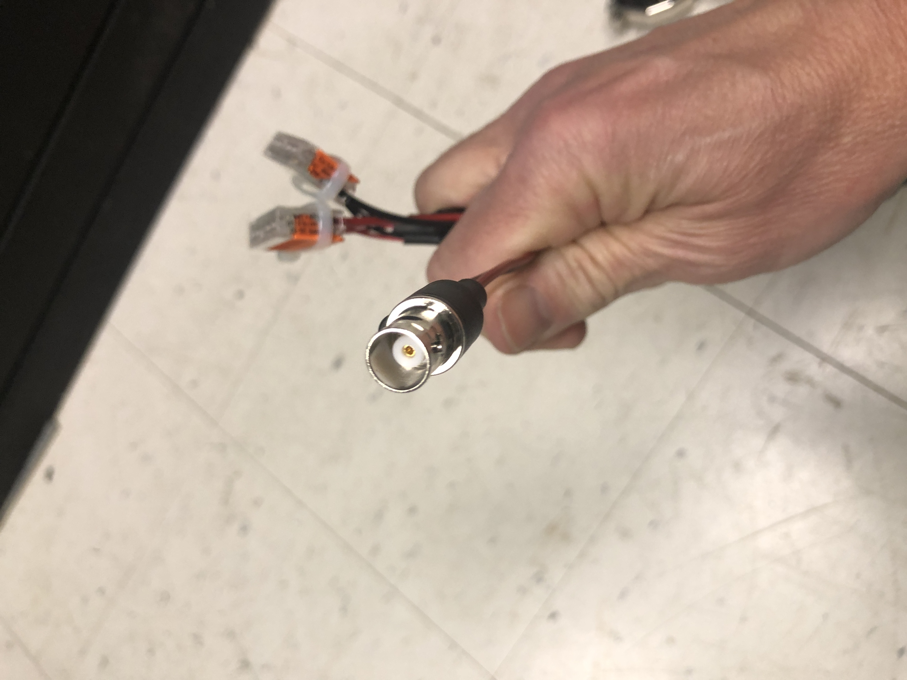
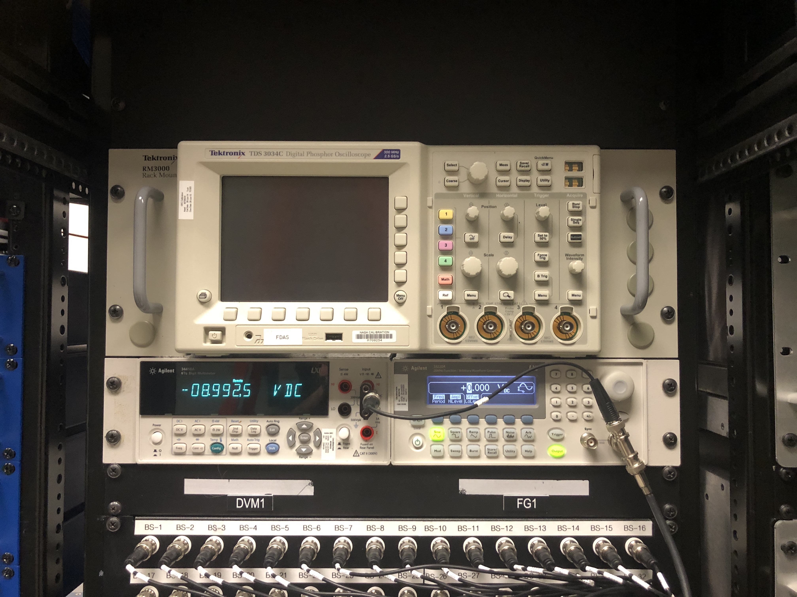
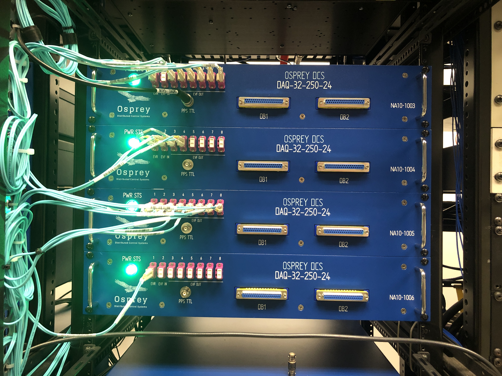
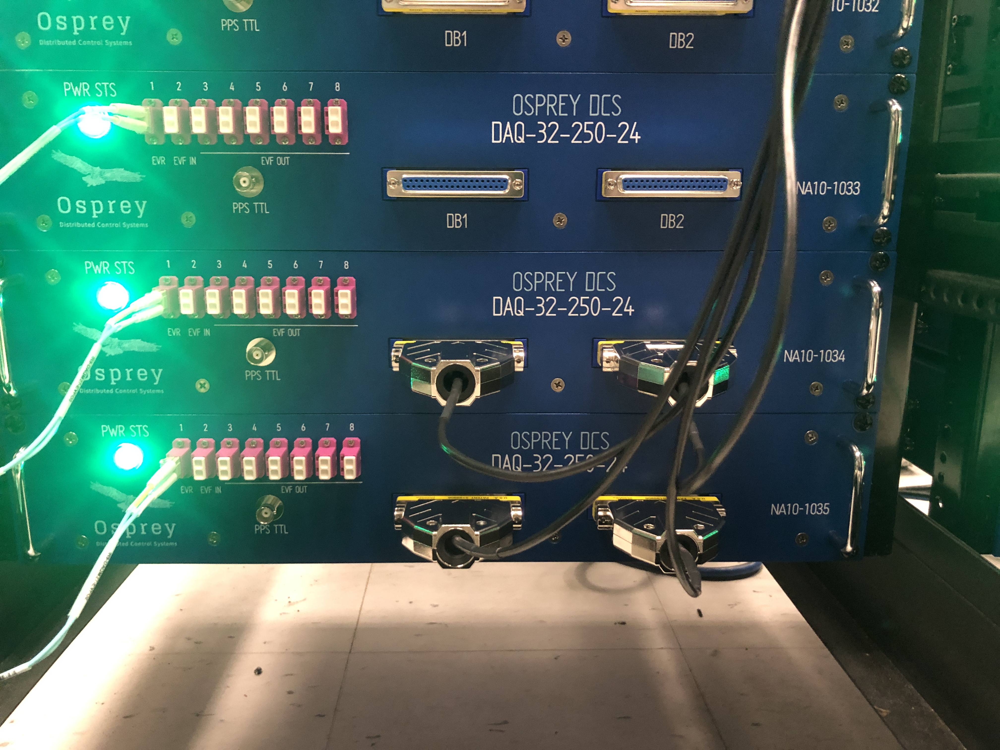
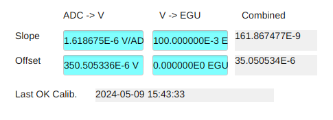
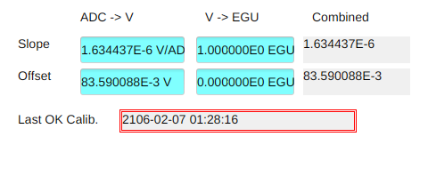
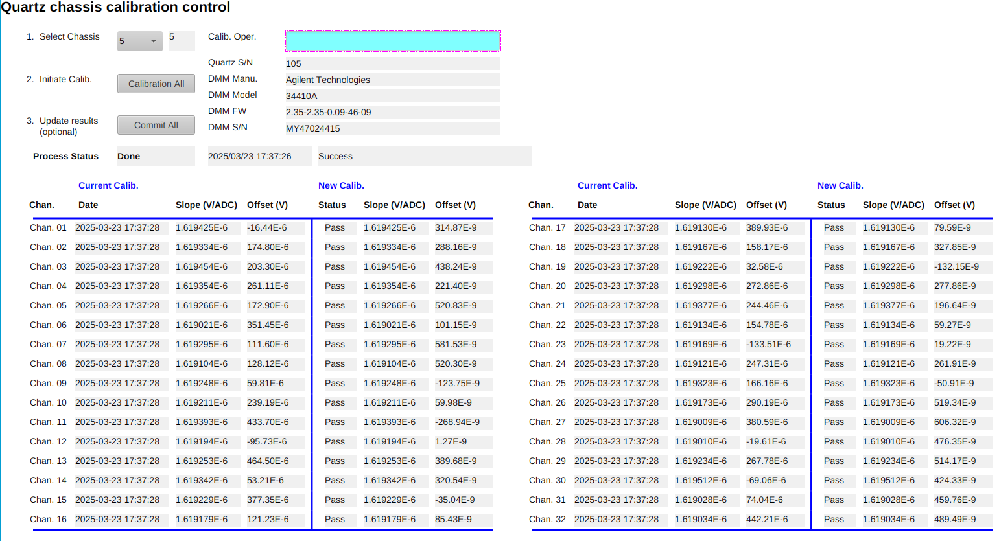

# NASA GRC-ATF FDAS D.4.2 - Measurement Device Calibration Procedure

## Prerequisites

Previous completion of [Inspecting the Current State and Health](D-4-09_PROC_-_Inspecting_the_Current_State_and_Health.md).

## 1 - Introduction
This procedure is to be followed when it is deemed necessary to establish a new set of calibration data for the Quartz ADC boards. 

## 2 - Summary

In this procedure, one person (the operator) will be responsible for all tasks described.
The operator will connect the calibration source (function generator and precision DVM) to the Quartz ADC chassis (up to two at a time).
This will be repeated for each ADC chassis as required.

## 3 - Preparing for Calibration: Hardware

To prepare for a session to calibration one or more chassis:

- [3.1] Locate the calibration cable set [D.1.5 P1](D-1-05_BOM_-_List_of_Supporting_Equipment.csv) (see Figures 1a-c). This assembly distributes the calibration voltage to (up to) two Quartz ADC chassis. On one side there are qty 4 DB-37(M) connectors for attaching to the ADC chassis, and on the other side there is a single BNC connector for attaching the excitation voltage source.  

<figure style="text-align: center;">
    

        
    

    <figcaption>Figure 1a - Calibration Cable Set</figcaption>
</figure>

<figure style="text-align: center;">
    

        
    

    <figcaption>Figure 1b - DB-37 Connectors</figcaption>
</figure>

<figure style="text-align: center;">
    

        
    

    <figcaption>Figure 1c - BNC Connector</figcaption>
</figure>

- [3.2] In the DAQ room, attach the BNC end of the calibration cable set to the BNC cable coming off the tee on the Agilent 33220 Waveform generator. Verify the other end of this tee is attached to the adjacent Agilent 34410A DVM with short BNC cable.  

<figure style="text-align: center;">
    

        
    

    <figcaption>Figure 2 - DVM and Waveform Generator</figcaption>
</figure>

- [3.3] Route the calibration cable set to the Quartz ADC chassis to be calibrated. *If necessary* an intermediary BNC cable can be added between the BNC tee and the calibration cable set.  

<figure style="text-align: center;">
    

        
    

    <figcaption>Figure 3 - Calibration Cable Connection and Routing</figcaption>
</figure>

- [3.4] With moderate force, connect the DB-37 ends of the calibration cable set to the Quartz ADC chassis to be calibrated. **Take care** to push straight into the chassis without undue force either up or down.
- [3.5] If not already powered on, switch on the Agilent 33220 Waveform generator and the 34410A DVM.

<figure style="text-align: center;">
    

        
    

    <figcaption>Figure 4a - Unterminated Quartz Chassis</figcaption>
</figure>

<figure style="text-align: center;">
    

        
    

    <figcaption>Figure 4b - Terminated Quartz Chassis</figcaption>
</figure>

### Network configuration

- DVM IP address: `192.168.83.47`
- Waveform generator IP address: `192.168.83.48`

Connect to ports 47 and 48 of the network switch.

## 4 - Preparing for Calibration: Software

- Open the `Quartz chassis calibration control` OPI (`Main` -> `ADC Calibration`).  See [below](#CalibControl)

## 5 - Perform Calibration(s)

The following procedure will be executed multiple times.
Once for each chassis to be calibrated in one session.

**NOTE:** Even though the setup procedures above connects (up to) two Quartz ADC chassis at a time, the calibration procedure only performs one at a time.

1. Verify the calibration cable set is connected properly to the chassis to be calibrated.
    - If not, move a pair of DB-37 connectors to the chassis to be calibrated.
1. From `Quartz chassis calibration control` select the chassis number to be calibrated.
1. Enter operator's name into the `Calib. Oper.` field.
1. Click `Calibration All` to begin the calibration process
    - The `Process Status` will change to `Run` until the process has completed.
    - If the process completes with an `Error` status, refer to troubleshooting checklist and repeat.
        - If unable to resolve then contacting support.
    - `Done` status indicates successful completion of the process.
    - The newly measured calibration values are present only in the `New Calib.` columns as a candidate.
    - A "raw" calibration run file is produced under `/data/calib/`.
1. Inspect the `New Calib.` columns in the results table.
1. __If the results are acceptable (including any known bad channels) then click `Commit All`.__
    - This will write the candidate values in the `New Calib` columns to the live system.
    - A calibration report file is produced under `/data/calib/`.

**NOTE** A final calibration report file has the form `/data/calib/cal-YYYYMMDD/YYYY-MM-DD_HH-MM-SS_cal_{chassis_id}_bipolar_calc.csv`

## 6 - Inspecting Calibration

The following procedure may be executed for each channel to be verified.

The current live calibration for a channel may be inspected through the `Chassis Scope` OPI (`Main` -> `Chassis Scope`)
by selecting a chassis and channel, then scrolling to the bottom of that page.

For a valid calibration the date is shown with no border.

A red border indicates an invalid calibration.

<figure style="text-align: center;">
    

        
    

    <figcaption>Figure 6a - Valid Calibration</figcaption>
</figure>

<figure style="text-align: center;">
    

        
    

    <figcaption>Figure 6b -Invalid Calibration</figcaption>
</figure>

## 7 - Cleanup

Upon the conclusion of the calibration session.

1. Disable the output, or turn off, the function generator.
1. Disconnect and store the calibration cable set.
1. Connect signal cables as desired

## Troubleshooting

If the calibration `Process Status` shows `Fail`, then:

1. Check that the test signal cable set is connect to the selected chassis
1. Ensure that `ADC Acquire` shows `Enabled` (refer to [D.4.9](D-4-09_PROC_-_Inspecting_the_Current_State_and_Health.md))
1. Check that the DMM is:
    1. Powered on
    1. Connected to network switch
    1. Has the IP address shown in the `Network configuration` section above
1. Check the AFG
    1. Powered on
    1. Connected to network switch
    1. Has the IP address shown in the `Network configuration` section above

## References

Quartz chassis calibration control

## Start/Completion Validation

 

Performed By: ______________________

 

Date Initiated: ______________________

 

Date Completed: ______________________

 

- [ ] Check to indicate that this procedure was performed with no deviations or waivers

 

QA Verification by: ______________________

 

QA Verification Date: ______________________
