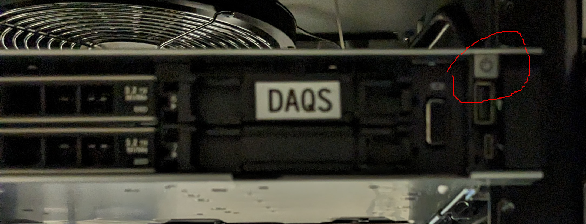
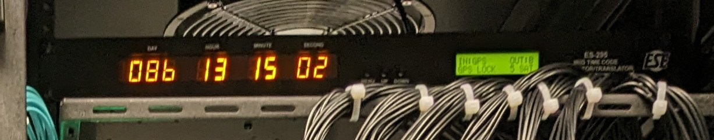
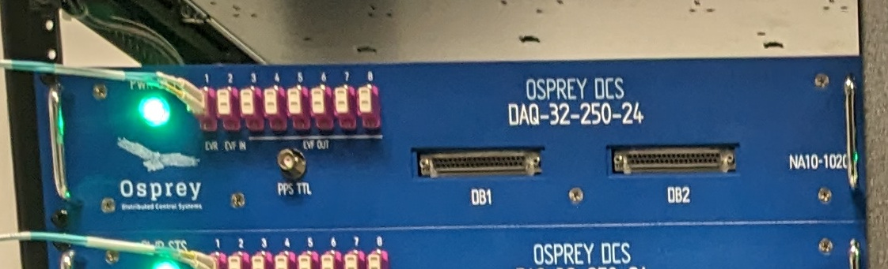
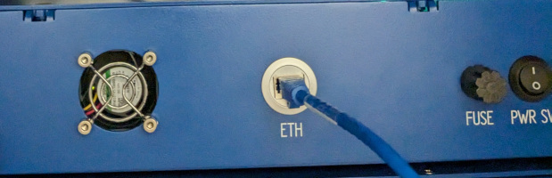

# NASA GRC-ATF FDAS D.4.3 - System Power Up/Down Procedures

Covers global system power down and up, as well as system recovery after individual chassis power cycle.

FDAS equipment is located in racks within the Instrument room and Control room.

## Note on Computer Shutdown

Each computer may be requested to shutdown gracefully by one of the following methods

- Press and quickly release power button.  See Reference photos section below for button locations.
- Issue a `sudo poweroff`
- For Workstations only.  Select `Shutdown` from the system menu (lower left corner)

## System Power Down

Preparation for partial/total power outage.

If possible, save open documents on Workstations.

1. Disable Acquisition if possible (from `Main` or `ADC Status` pages)
1. Switch off power to all 8x Quartz Chassis.
1. Initiate a graceful shutdown of each computer by one of the means listed above.
    1. DAQM server
    1. DISWS3 server
1. Wait for computers to complete normal shutdown.
    - Indicated by power LEDs turning off
    - If this takes more than 5 minutes, endeavor to contact support
    - If support is unavailable in the available time,
      press and hold power button until LEDs turn off.
      (__Caution__, may result in data loss)

### Dell Server Power Indicators Discussion

For data integrety, it is important to wait for the green LED in the power
button to go out before removing power.

It is desirable, but not necessary to wait for the blue indicator bar to turn off
before removing power.

During a controlled shutdown, the green LED under the power button goes out
when the OS has shutdown.
The blue indicator (left end of chassis) remains illuminated while the
system firmware shuts down.

## System Power Up

Recovery from partial/total power outage.

1. Verify AC power is available to:
   - Control room switch (visible from front)
   - Instrument room switch (visible from rear)
   - Instrument room Time Server
1. Wait for Time Server lock
   - Alert indicator stops blinking (Orange exclamation mark)
1. Press and quickly release power buttons on computers
    - DAQS server
    - DISWS3 server
1. Switch on power to all Quartz Chassis
1. Verify Workstation boot (repeat for each)
    1. Connect KVM console to Workstation 1 or 2
    1. Should see Desktop (autologin to default user)
    1. Use the icon on Desktop to launch the `Phoebus` application.
    1. Select the `Main` tab.
1. Check that the Archiver is running
    1. Click on the "EPICS Archiver Application" desktop icon
    1. (Alternate) Open a web browser and navigate to `http://192.168.83.101:17665/mgmt/ui/reports.html`
    1. Click on `Reports` and select `Currently disconnected PVs`
    1. Notify support if result table has entries other than: "no data found"
1. Verify that the `/data` network shared drive is accessible on DISWS3.
1. Proceed to [Inspecting the Current State and Health](healthcheck.md) of the system.

## Troubleshooting

If the Time Server Alert does not clear, then check the antenna connection, and status.
The Time Server will report antenna "Open" if not connected, or "Ok" if connected.

## References

Location of DAQM and DISWS3 server power button location.

Time Server front panel.

Quartz chassis Front and Rear panels.

## Start/Completion Validation

 

Performed By: ______________________

 

Date Initiated: ______________________

 

Date Completed: ______________________

 

- [ ] Check to indicate that this procedure was performed with no deviations or waivers

 

QA Verification by: ______________________

 

QA Verification Date: ______________________
