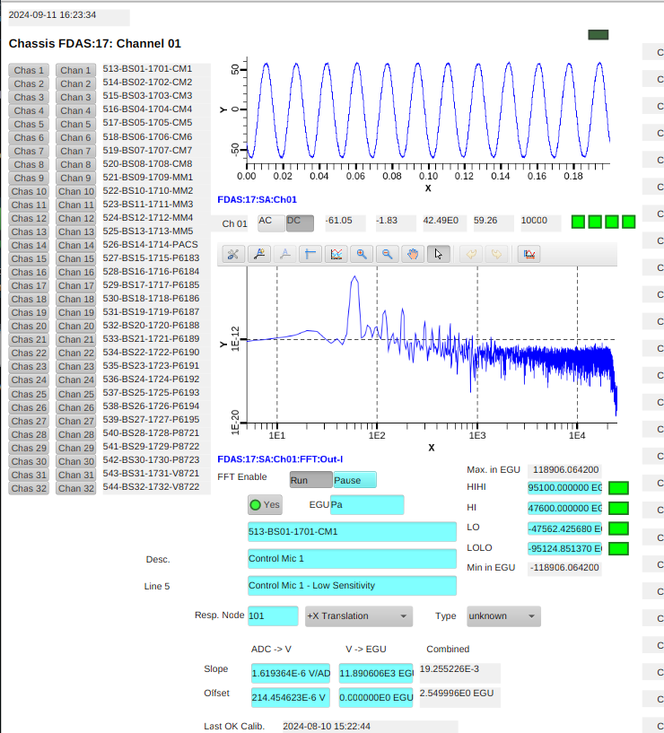

# NASA GRC-ATF FDAS D.4.6 - Monitor a Data Channel in Real Time

## Prerequisites

Previous completion of [Inspecting the Current State and Health](D-4-09_PROC_-_Inspecting_the_Current_State_and_Health.md).

## Selecting a channel to monitor

1. From the `Main` OPI, click on `Chassis Scope`
1. From the two columns of buttons on the left hand side of the pane,
   select the desired Chassis (`Chas`) and Channel (`Chan`)
1. If upper, time domain plot is not updating.
    1. Enable `ADC Acquire` from the `Main` OPI (or other screens on which this control appears)
1. If the lower, frequency domain plot is not updating
    1. Click on `Enable` by the `FFT Enable` control below this plot

## Start/Completion Validation

 

Performed By: ______________________

 

Date Initiated: ______________________

 

Date Completed: ______________________

 

- [ ] Check to indicate that this procedure was performed with no deviations or waivers

 

QA Verification by: ______________________

 

QA Verification Date: ______________________
