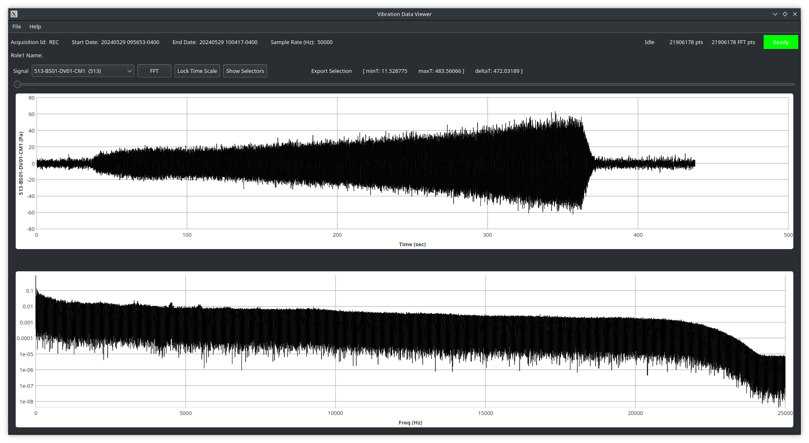

# NASA GRC-ATF FDAS D.4.7 - Review Previously Recorded Data

## Environment

The acquistion Previewer application may be run
on either, or both, of the two Workstations computers.

Completed acquistions are found under `/data`.
The full path of the most recently completed
acquistion may be found on either the `Acq Monitor`
or `Acq Expert` OPI screens.
A full path for a `.hdr` file will have the form:

```
/data/YYYY/MM/YYYYMMDD-hhmmss-DESC/DESC-YYYYMMDD-hhmmss.hdr
```

Where the actual date and start time of the acquistion,
as well as the the run DESC string, are substituted.

Exported data files may be placed under `/export`.

## View acquistion

1. Launch the `viewer` application by one of the following means.
    1. Double-click on the `Previewer` icon on the Desktop
    1. Run `viewer` from a terminal
1. From the `File` menu, select `Open`.  An `Open File` dialog will appear.
1. Navigate through `/data` and select a `.hdr` file to `Open`.
1. Select a channel from the `Signal` dropdown.
1. (Optional) click the FFT button to recompute the frequency
  vs amplitude plot for the visible time range.

Under the `Help` menu, see `Button/Wheel Shortcuts` for details
on zooming.



## Start/Completion Validation

<br/>

Performed By: ______________________

<br/>

Date Initiated: ______________________

<br/>

Date Completed: ______________________

<br/>

- [ ] Check to indicate that this procedure was performed with no deviations or waivers

<br/>

QA Verification by: ______________________

<br/>

QA Verification Date: ______________________
