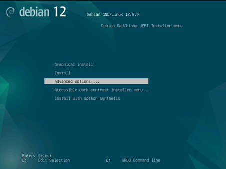
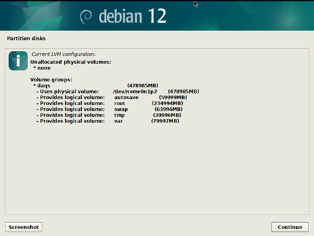
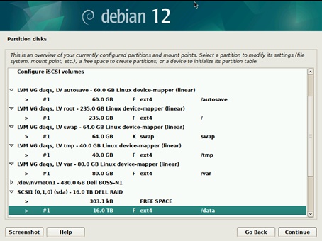
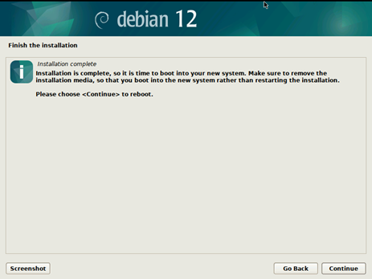

# Chapter 1 - OS Installation
## Debian
* Connect the IDRAC network interface, start the virtual console, mount Debian 12 ISO using the virtual media button, and boot from the virtual cd
* Select Advanced Options -> Graphical Expert Install




* Select all default options until the Users and Accounts Screen, configure as follows:


* Set a password for the root account and skip the normal account creation for now:


* In the disk partition options, choose manual:


* Configure the disk LVM as follows (MISC server does not have /autosave):



* Add the following mount points (MISC server does not have /autosave):



* Continue with the default options until the software selection screen is presented:


* Continue with the default options until the installation is concluded:



## DISWS, Kubuntu
* Kubuntu LTS 24.04 default LVM atf/atf
* Firefox —safe-mode -> settings-> general -> disable ‘Use recommended performance settings’ and ‘use hardware acceleration’
* Follow DAQS for EPICS
* ``sudo systemctl mask sleep.target suspend.target hibernate.target hybrid-sleep.target``
* Disable lockscreen, and timeouts
* Disable kde wallet subsystem
* System Settings -> Power Management -> Energy Saving and disable all but button events handlings, change it to shutdown 
* edid-decode and read-edid
* ``apt-install pip``
* ``pip install matplotlib p4p pyserial numpy``
* add /home/atf/.local/bin to bashrc/PATH (to get pip stuff)
* ``sudo apt install openjdk-17-jdk``
* download phoebus latest tag, move and add link to /usr/local/epics/phoebus
* copy logos and wallpaper
* copy phoebus desktop shortcut, comment the “-f resource” argument and fix permissions
* modify /usr/local/epics/phoebus/phoebus.sh -> comment OPT=“-server 4918” line add settings.ini and TOP at the beggining
* ``sudo ln -s /usr/local/epics/phoebus/phoebus.sh /usr/local/bin/phoebus``
* copy settings.ini file (for archiver url/etc)
* change desktop and add user admin for service
* ``apt install x2go-server``
* Apply network config from John
* Change /etc/hosts and include all 83.xxx IPs and hosts
* ``sudo systemctl enable systemd-networkd``
* update initramfs
* remove pro ads: sudo rm /etc/apt/apt.conf.d/20apt-esm-hook.conf
* change /etc/default/grub: add “GRUB_RECORDFAIL_TIMEOUT=3” and do update-grub

# Chapter 2 - Initial Setup and Network Config
## DAQs
### Initial Setup
* Login as root
* Change the hostname with the following command:
``hostnamectl set-hostname DAQS``
* Edit the /etc/hosts file and add the following entry:
    * 192.168.83.100 DAQS
* Reboot the server to apply the changes
* Login as root and verify the changes with the following command:
    * hostnamectl
* Edit /etc/apt/sources.list as follows:
```
deb http://deb.debian.org/debian bookworm main non-free-firmware
deb-src http://deb.debian.org/debian bookworm main non-free-firmware

deb http://deb.debian.org/debian-security/ bookworm-security main non-free-firmware
deb-src http://deb.debian.org/debian-security/ bookworm-security main non-free-firmware

deb http://deb.debian.org/debian bookworm-updates main non-free-firmware
deb-src http://deb.debian.org/debian bookworm-updates main non-free-firmware
```

* Connect an ethernet cable to a valid DHCP server with internet access to port eno12409np1 (NIC eth 2) and issue the following commands (alternatively, this can be done from a virtual media mounted with the mirror packages):
    * ```dhclient eno12409np1```
    * ```apt update```
    * ```apt upgrade```
    * ```apt install git vim vlan tcpdump```
    * ```adduser atf```
    * ```adduser atf sudo```
    * ```su atf```

### Network Configuration
* ```sudo apt install vlan tcpdump```
*   
    ```
        cat <<EOF | sudo tee -a /etc/systemd/network/00-Acquisition.netdev
        [NetDev]
        Name=Acquisition
        Kind=vlan

        [VLAN]
        Id=79
        EOF
    ```
*
    ```
        cat <<EOF | sudo tee -a /etc/systemd/network/00-EPICS.netdev
        [NetDev]
        Name=EPICS
        Kind=vlan

        [VLAN]
        Id=83
        EOF
    ```
*
    ```
    cat <<EOF | sudo tee -a /etc/systemd/network/10-DAQeth0.link
    [Match]
    MACAddress=04:32:01:c1:d1:60
    Type=ether

    [Link]
    Description=Trunk interface for DAQ and EPICS vlans
    MACAddressPolicy=persistent
    Name=DAQeth0
    NamePolicy=keep
    EOF
    ```
*
    ```
    cat <<EOF | sudo tee -a /etc/systemd/network/20-DAQeth0.network
    [Match]
    Name=DAQeth0
    Type=ether

    [Network]
    Description=The untagged interface

    VLAN=Acquisition
    VLAN=EPICS

    LinkLocalAddressing=no
    LLDP=no
    EmitLLDP=no
    IPv6AcceptRA=no
    IPv6SendRA=no
    EOF
    ```
*
    ```
    cat <<EOF | sudo tee -a /etc/systemd/network/30-Acquisition.network
    [Match]
    Name=Acquisition
    Type=vlan

    [Network]
    Description=Acquisition vlan config
    LinkLocalAddressing=no
    LLDP=no
    EmitLLDP=no
    IPv6AcceptRA=no
    IPv6SendRA=no

    [Address]
    Address=192.168.79.100/24
    EOF
    ```
*
    ```
    cat <<EOF | sudo tee -a /etc/systemd/network/30-EPICS.network
    [Match]
    Name=EPICS
    Type=vlan

    [Network]
    Description=EPICS vlan config
    NTP=192.168.83.102
    LinkLocalAddressing=no
    LLDP=no
    EmitLLDP=no
    IPv6AcceptRA=no
    IPv6SendRA=no

    [Address]
    Address=192.168.83.100/24
    EOF
    ```

* ```echo 8021q | sudo tee -a /etc/modules```
* ```sudo systemctl enable systemd-networkd```
* ```sudo update-initramfs -u```
* ```sudo reboot```

## MISCS
### Initial Setup
* Login as root
* Change the hostname with the following command:
    * hostnamectl set-hostname MISCS
* Edit the /etc/hosts file and add the following entry:
    * 192.168.83.101 MISCS
* Reboot the server to apply the changes
* Login as root and verify the changes with the following command:
    * hostnamectl
* Edit /etc/apt/sources.list as follows:
```
deb http://deb.debian.org/debian bookworm main non-free-firmware
deb-src http://deb.debian.org/debian bookworm main non-free-firmware

deb http://deb.debian.org/debian-security/ bookworm-security main non-free-firmware
deb-src http://deb.debian.org/debian-security/ bookworm-security main non-free-firmware

deb http://deb.debian.org/debian bookworm-updates main non-free-firmware
deb-src http://deb.debian.org/debian bookworm-updates main non-free-firmware
```

* Connect an ethernet cable to a valid DHCP server with internet access to port eno12409np1 (NIC eth 2) and issue the following commands (alternatively, this can be done from a virtual media mounted with the mirror packages) :
* ```dhclient eno12409np1```
* ```apt update```
* ```apt upgrade```
* ```apt install git vim vlan tcpdump```
* ```adduser atf```
* ```adduser atf sudo```

### Network Configuration
* ```sudo apt install vlan tcpdump```
*
    ```
    cat <<EOF | sudo tee -a /etc/systemd/network/10-MISCeth0.link
    [Match]
    MACAddress=6c:3c:8c:80:c3:3e
    Type=ether

    [Link]
    Description=MISC Server EPICS Interface
    MACAddressPolicy=persistent
    Name=MISCeth0
    NamePolicy=keep
    EOF
    ```
*
    ```
    cat <<EOF | sudo tee -a /etc/systemd/network/20-MISCeth0.network
    [Match]
    Name=MISCeth0
    Type=ether

    [Network]
    Description=MISC Server EPICS Interface
    NTP=192.168.83.102
    LinkLocalAddressing=no
    LLDP=no
    EmitLLDP=no
    IPv6AcceptRA=no
    IPv6SendRA=no

    [Address]
    Address=192.168.83.101/24
    EOF
    ```

* ```echo 8021q | sudo tee -a /etc/modules```
* ```sudo systemctl enable systemd-networkd```
* ```sudo update-initramfs -u```
* ```sudo reboot```

# Chapter 3 - EPICS base and modules installation
* ```su atf```
* ```cd ~```
* ```git clone https://github.com/domitto/build-epics.git --recursive```
* ```cd build-epics```
* ```./prepare.sh```
* ```. eactivate```
* 
    ```
    sudo apt install build-essential autoconf automake libreadline-dev libncurses-dev libpcre3-dev libxml2-dev libjpeg-dev libxext-dev re2c libgraphicsmagick++1-dev libaec-dev libhdf5-dev libjpeg-dev libnetcdf-dev libtiff-dev libz3-dev python3-dev python-is-python3 libsnmp-dev python3-numpy python3-nose2 cython3 libfftw3-dev libevent-dev
    ```
* ```chmod -R a+w ../build-epics```
* ```./build-epics.sh -j2```
* ```tar -xvf epics-x86_64-20240304.tar.xz```
* ```sudo mv epics-x86_64-20240304 /usr/local/```
* ```cd /usr/local```
* ```sudo ln -s epics-x86_64-20240304 epics```
* ```cat <<EOF | sudo tee -a /etc/bash.bashrc```
* 
    ```
    export PATH=\$PATH:/usr/local/epics/epics-base/bin/linux-x86_64
    EOF
    ```
# Chapter 4 - EPICS Tools and Services
## MISCS
* Follow the guide available on osprey-dcs github about deploying EPICS services: https://github.com/osprey-dcs/epics-services-deployment

# Chapter 5 - Phoebus Client
* Make sure the host has openjdk-17 installed (sudo apt install openjdk-17-jdk)
* Download Phoebus latest tag from https://github.com/ControlSystemStudio/phoebus/tags
* Extract the tar.gz and move the project to /usr/local/epics/
* Create a phoebus symlink to this version
    * ```ln -s /usr/local/epics/phoebus-4.7.3 /usr/local/epics/phoebus```
* Create a settings.ini file in /usr/local/epics/phoebus/ with the following:
```
#Default CA settings
org.phoebus.pv.ca/addr_list=192.168.83.255
org.phoebus.pv.ca/auto_addr_list=false
org.phoebus.pv.ca/dbe_property_supported=true
org.phoebus.pv.ca/variable_length=true

#Archiver
org.csstudio.trends.databrowser3/urls=pbraw\:192.168.83.101:17668/retrieval
org.csstudio.trends.databrowser3/archives=pbraw\:192.168.83.101:17668/retrieval

#Main OPI
org.phoebus.ui/top_resources=/opi/atf-main.bob,Main

#Channel Finder
org.phoebus.channelfinder/serviceURL=http://192.168.83.101:7070/ChannelFinder

#Logbook
org.phoebus.logbook/logbook_factory=olog-es
org.phoebus.olog.es.api/olog_url=http://192.168.83.101:9090/Olog
org.phoebus.logbook.ui/save_credentials=true

#Phoebus Save/Restore
org.phoebus.applications.saveandrestore.client/jmasar.service.url=http://192.168.83.101:6060/save-restore
org.phoebus.ui/save_credentials=true

#Phoebus Alarm
org.phoebus.applications.alarm/server=192.168.83.101:9092
org.phoebus.applications.alarm/config_name=nasa_alarms
org.phoebus.applications.alarm/config_names=nasa_alarms
org.phoebus.applications.alarm.logging.ui/service_uri=http://192.168.83.101:8080
```
* Modify /usr/local/epics/phoebus/phoebus.sh:
    * comment OPT=“-server 4918” line and add OPT="-settings /usr/local/epics/phoebus/settings.ini" below it.

# Chapter 6 - Quartz IOC
```
apt-get update
apt-get install -y build-essential git libevent-dev libz-dev libfftw3-dev libreadline-dev python3 python-is-python3

# need to have libevent and libfftw3 installed
git clone --branch 7.0 https://github.com/epics-base/epics-base
git clone --branch master https://github.com/epics-base/pvxs
git clone --branch master https://github.com/epics-modules/autosave
git clone --branch atf-dev https://github.com/osprey-dcs/feed-core
git clone --branch atf-dev https://github.com/osprey-dcs/pscdrv
git clone --branch main https://github.com/osprey-dcs/atf-acq-ioc
git clone https://github.com/mdavidsaver/alluvium

cat <<EOF > pvxs/configure/RELEASE.local
EPICS_BASE=\$(TOP)/../epics-base
EOF

cat <<EOF > autosave/configure/RELEASE.local
EPICS_BASE=\$(TOP)/../epics-base
EOF

cat <<EOF > feed-core/configure/RELEASE.local
EPICS_BASE=\$(TOP)/../epics-base
EOF
```

# Chapter 7 - System Monitoring IOCs
See ATF System Monitor [README](https://github.com/osprey-dcs/atf-sysmon/blob/master/README.md).

# Chapter 8 - Sequencing Engine
See ATF DAQ Sequencing Engine [README](https://github.com/osprey-dcs/atf-engine/blob/master/README.md)

# Chapter 9 - Elastic Search
See Elastic Search [README](https://github.com/elastic/elasticsearch/blob/main/README.asciidoc)

# Chapter 10 - Quartz Calibration
See [Quartz Calibration Procedure](https://github.com/osprey-dcs/quartz-calib/blob/main/Quartz_Calibration_Procedure.md)

# Chapter 11 - DAQ Data Viewer/Exporter
See ATF Previewer [README](https://github.com/osprey-dcs/atf-previewer/blob/main/README.md)

# Chapter 12 - Quartz User Configuration Loader
See Quartz Config Loader [README](https://github.com/osprey-dcs/quartz-config-loader/blob/main/README.md)